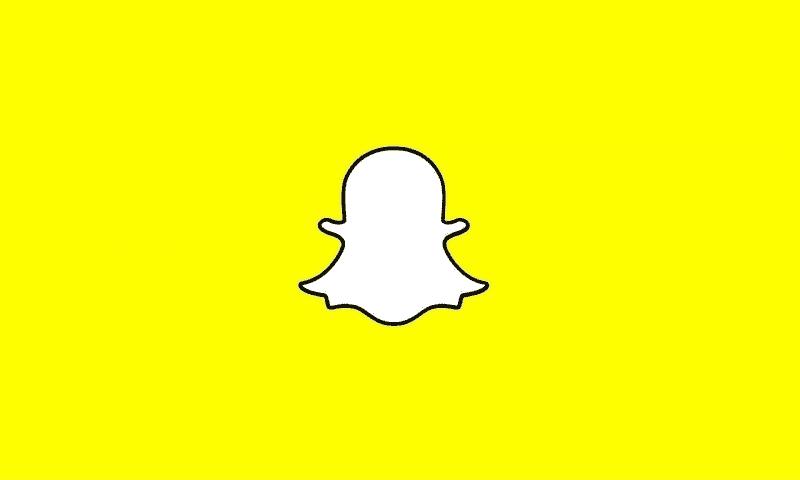
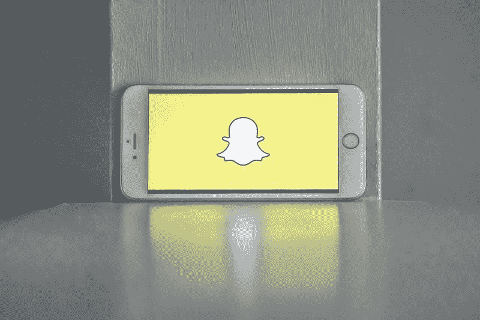
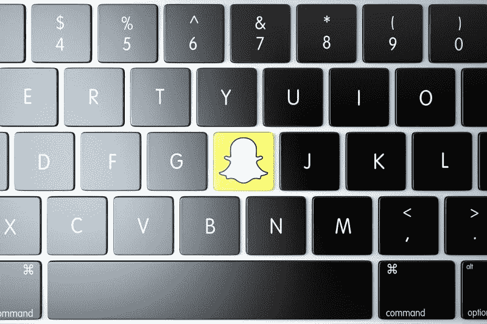

# 冠状病毒会杀死 Snap (SNAP)吗？—市场疯人院

> 原文：<https://medium.datadriveninvestor.com/will-coronavirus-kill-snap-snap-market-mad-house-981110528061?source=collection_archive---------24----------------------->

**Snap(Snap)**Snapchat 的拥有者表明，社交媒体不可能永远赚钱。此外，由于冠状病毒，Snap 的收入正在下降。

例如， **Snap Inc .(纽约证券交易所代码:SNAP)** 在 2020 年 6 月 30 日报告了 3.1061 亿美元的季度运营亏损。该季度运营亏损从 2020 年 3 月 31 日的-2.8636 亿美元和 2019 年 12 月 31 日的-2.5360 亿美元增长。

此外，Snap 的季度收入从 2019 年 12 月 31 日的 5.6089 亿美元降至 2020 年 3 月 31 日的 4.6248 亿美元和 2020 年 6 月 30 日的 4.5416 亿美元。因此，Snap 的赚钱能力正在下降。

# Snap 赔钱

**Snap Inc. (SNAP)** 其季度共同净亏损从 2019 年 12 月 31 日的-2.4070 亿美元增长到 2020 年 3 月 31 日的-3.0594 亿美元和 2020 年 6 月 30 日的-3.2595 亿美元。

Snap 从 2020 年开始，截至 2019 年 12 月 31 日，季度运营现金流为-6684 万美元。季度经营现金流在 2020 年 3 月 31 日上升至 628 万美元，在 2020 年 6 月 30 日下降至-6655 万美元。

然而，Snap 在 2020 年 6 月 30 日报告了 3.5038 亿美元的季度末现金流。季度期末现金流从 2020 年 3 月 31 日的 9.0225 亿美元下降到 2019 年 12 月 31 日的-2.0955 亿美元。

此外，Snap 还借入了巨额资金。Snap 报告 2020 年 6 月 30 日的季度融资现金流为 9.0906 亿美元。这意味着 Snap 在该季度借入了 9.0906 亿美元。然而，Snap 在 2020 年 3 月 31 日报告了 313 万美元的季度融资现金流。

有趣的是，Snap 在 2020 年 6 月 30 日有 28.30 亿美元的现金和短期投资。因此，Snap 可以保留一些现金。值得注意的是，Snap 的现金和短期投资从 2020 年 3 月 31 日的 20.82 亿美元。

# Snap 有什么价值？

截至 2020 年 6 月 30 日，Snap 的资产为 47.04 亿美元。Snap 的季度资产从 2020 年 3 月 31 日的 38.99 亿美元。

因此，我认为 Snap 对于 Statista 所称的第七大社交媒体平台的所有者来说没有什么价值。为了解释这一点，Statista 估计 Snapchat 在 2020 年 7 月拥有 3 . 97 亿活跃用户。

相比之下，据 Statista 估计，最大的社交媒体平台脸书在 2020 年 7 月拥有 26.03 亿活跃用户。此外，Snapchat 最大的直接竞争对手脸书的 Instagram 在 2020 年 7 月拥有 10.82 亿用户。值得注意的是，备受争议的 Snapchat 竞争对手抖音在 2020 年 7 月拥有 8 亿用户。

Statista 估计 Snapchat 在 2020 年第二季度拥有 2 . 38 亿日活跃用户。这一数字比 2019 年第二季度的 2.03 亿有所增长。

我认为 Snapchat 表明，一个社交媒体网络需要 7 亿或 8 亿用户来赚钱。不幸的是，我认为 Snapchat 不可能发展到那个规模。

 [## 金钱:冠状病毒疫情期间的投资|数据驱动的投资者

### 在我将近 20 年的金融服务生涯中，我曾经负责监督整个…

www.datadriveninvestor.com](https://www.datadriveninvestor.com/2020/07/29/money-investing-during-the-coronavirus-pandemic/) 

# Snapchat 能和抖音竞争吗？

而且，我认为 **Snap (SNAP)** 和 Snapchat 无法与抖音竞争。值得注意的是，抖音从 2016 年(它推出的那年)的无用户增长到 2020 年[的 8 亿活跃用户](https://www.oberlo.com/blog/tiktok-statistics)，Oberlo 声称。

相比之下，Snapchat 于 2011 年 9 月推出，但在 2020 年 7 月已经拥有 3.97 亿用户。因此，Snapchat 用了近 9 年时间获得了 3.97 亿用户，抖音用了 4 年时间吸引了 8 亿用户。

观察家认为抖音发展如此之快是因为人工智能(AI)在运作它。具体来说，人们认为抖音的人工智能可以分析用户的观看习惯，并识别一个人将观看的视频。例如，如果你总是看猫视频，抖音的人工智能就会用猫视频轰炸你。

# 抖音会杀死 Snapchat 吗？

抖音可能成为 Snapchat 的直接竞争对手，因为其所有者字节跳动有限公司计划成立一家名为抖音全球的美国公司。抖音环球将以沃尔玛(WMT)和甲骨文(甲骨文)的形式拥有强大的所有者。

根据该协议，字节跳动组织了阻止唐纳德·川普总统(佛罗里达州共和党)关闭抖音在美国的业务。沃尔玛将拥有抖音全球 7.5%的股份，甲骨文将拥有抖音全球 12.5%的股份。

抖音以惊人的速度发展。2016 年至 2020 年 4 月，Sensor Tower 声称人们从 Google Play 和 App Store 下载了 20 亿份抖音应用程序[20 亿次](https://sensortower.com/blog/tiktok-downloads-2-billion)。

# Snap(快照)无法与抖音环球竞争

我不认为 Snap (SNAP) 能和抖音环球竞争。因此，我认为 Snap 的明智之举是将自己出售给抖音国际。

具体来说，如果 Snap 成为抖音全球的一部分，它可以获得字节跳动的人工智能和机器算法。Snap 可以将抖音的算法加入 Snapchat。

此外，Snap 还可以从甲骨文(Oracle)获得云资源和资金，从 T2 的沃尔玛(WMT)获得零售技术和资金。甲骨文可以使用 Snapchat 来分发其商业企业解决方案，沃尔玛可以将 Snapchat 用于零售广告和营销活动。

总之，我认为**Snap**在今天的社交媒体市场没有价值。我认为市场先生在 2020 年 10 月 16 日高估了 27.83 美元。

我认为投资者需要避免草率行事，关注赚钱的社交媒体公司，比如脸书。另外，我认为投资者需要在抖音国际的股票上市时对其进行调查。我认为抖音国际总有一天会赚钱，但 Snap 永远不会。

*原载于 2020 年 10 月 16 日 https://marketmadhouse.com**的* [*。*](https://marketmadhouse.com/will-coronavirus-kill-snap-snap/)

## 访问专家视图— [订阅 DDI 英特尔](https://datadriveninvestor.com/ddi-intel)