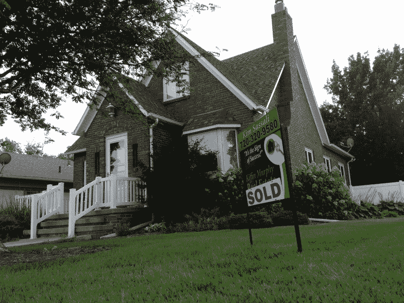
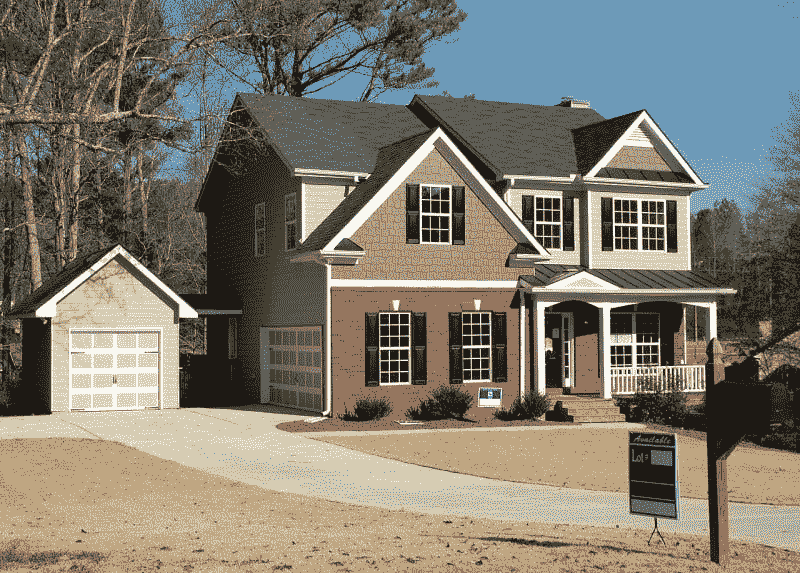
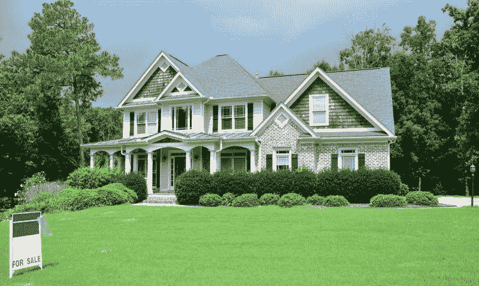

# 冠状病毒会杀死 Zillow 吗？—市场疯人院

> 原文：<https://medium.datadriveninvestor.com/will-coronavirus-kill-zillow-market-mad-house-28b85a02fada?source=collection_archive---------20----------------------->

冠状病毒对房地产公司来说可能是致命的，比如 Zillow Group(纳斯达克代码:ZG) 。

Zillow 靠卖房产数据赚钱。然而，Zillow [估计](https://www.zillow.com/research/prices-sales-forecast-coronavirus-26975/)由于新冠肺炎，美国房屋销售可能下降 60%。

奇怪的是，Zillow 预测房价只会下降 2%到 3%。我个人认为 Zillow 的估计不合理。如果 60%的说法是真的，我看不出房价怎么可能不会下跌超过 2%或 3%。

具体来说，Zillow 声称，2020 年前两个季度，美国待售房屋销量下降了 50%。然而，Zillow 声称，到 2021 年底，待售房屋销售可能会恢复到 2019 年第四季度水平的 97%。

# 冠状病毒会变得更糟

我认为 Zillow 的预测是有缺陷的，因为他们假设冠状病毒不会变得更糟。不幸的是，一些流行病学家不同意齐洛的乐观看法。

据*《今日美国报* [报道](https://www.usatoday.com/story/news/health/2020/05/01/coronavirus-wont-end-2-years-worse-second-wave-study-warns/3064708001/)，明尼苏达大学的一项研究预测，2020 年秋冬会出现更严重的第二波冠状病毒。传染病研究和政策中心(CIDRAP)的科学家们基于对 1918 年大流感(美国最后一次疫情)的研究得出了这一结论。

CIDRAP 的科学家认为，疫情将持续到 60%至 70%的人口对新冠肺炎免疫。CIDRAP 专家认为发展这样的免疫力需要 18 到 24 个月。*

我认为第二波冠状病毒将导致房屋销售再下降 60%。此外，我相信第二波冠状病毒将导致房屋和房地产价格下跌 30%至 60%。

因此，冠状病毒可能会摧毁房地产业务和 Zillow 的收入来源。因此，房地产市场和 Zillow 都可能崩溃。

# Maket 先生高估了 Zillow

我认为市场先生严重高估了 2020 年 6 月 9 日 Zillow Group Inc .(纳斯达克股票代码:ZG)60.99 美元的股价。

奇怪的是，市场先生在 2020 年对 Zillow 很好。Zillow 在 2020 年 1 月 2 日以 45 美元开始，在 2020 年 2 月 21 日上涨到 65.49 美元，在 2020 年 3 月 18 日下跌到 23.51 美元。然而，Zillow 在 2020 年 6 月 7 日恢复到 59.52 美元，在 2020 年 6 月 9 日恢复到 60.99 美元。

我认为美国对房地产保值能力的愚蠢信念推动了 Zillow 的股价。然而，Zillow 自己的数据显示，这种信念是天真和愚蠢的。如果房屋销售能下降 60%，那么房价也能下降 60%。

# Zillow 赚钱了吗？

奇怪的是，Zillow 的收入在 2020 年第一季度出现了增长。Zillow 报告称，2019 年 12 月 31 日的季度收入为 9.4395 亿美元，2020 年 3 月 31 日的季度收入为 11.26 亿美元。

此外，Zillow 报告称，2019 年 12 月 31 日的季度毛利为 3.3433 亿美元，三个月后为 3.6415 亿美元。相比之下，Zillow 的运营亏损从 2019 年 12 月 31 日的-7377 万美元增长至 2020 年 3 月 31 日的-14450 万美元。

此外，Zillow 的共同净亏损从 2019 年 12 月 31 日的-1.0120 亿美元增长到 2020 年 3 月 31 日的-1.6327 亿美元。相反，Zillow 的季度现金流从 2019 年 12 月 31 日的 5811 万美元增长到 2020 年 3 月 31 日的 3.0199 亿美元。

# Zillow 是一家现金充裕的公司

奇怪的是，Zillow 是一家现金充裕的公司。Zillow 的期末现金从 2019 年 12 月 31 日的-6.3501 亿美元增长至 2020 年 3 月 31 日的 16.24 亿美元。此外，Zillow 的现金和短期投资从 2019 年 12 月 31 日的 25.12 亿美元增长到 2020 年 3 月 31 日的 26.17 亿美元。

Zillow 的现金流正在增长，但如果房地产市场崩溃，我看不出现金流将如何保持增长。然而，如果我错了，Zillow 将处于一个非常有利的位置来兑现。

因此，购买 Zillow 股票是在赌冠状病毒疫情将很快结束。然而，如果疫情继续下去，Zillow 将会崩溃。我怀疑疫情至少还会持续几年。

# Zillow 能活下来吗？

然而，Zillow 有可能通过消耗现金或出售债务在疫情幸存下来。

值得注意的是，美国美联储正在通过交易所交易基金(ETF)购买公司债务，《纽约时报》 [报道](#:~:text=The Federal Reserve is buying,alone had soothed the market.&text=The Federal Reserve rolled out,buying longer-dated company debt.)。因此，Zillow 可以发行足够的债务来生存，并希望美联储将购买这些债务。

除了债务，Zillow 可以把自己卖给另一家公司；如**字母表(NASDAQ: GOOG)** 。记住，Zillow 有一些有价值的数据收集能力。然而，目前还不清楚这些能力在房地产崩盘时会值多少钱？

我认为 **Zillow(纳斯达克代码:ZG)** 是一种风险投机投资，每个人都需要避免。只有那些认为冠状病毒会快速终结、房地产市场会复苏的乐观主义者，才需要购买 Zillow。我建议其他人尽快卖掉 Zillow，因为当房地产崩溃时，ZG 也会迅速崩溃。

* https://www . cid rap . umn . edu/sites/default/files/public/downloads/cid rap-covid 19-point-part 1 _ 0 . pdf

*原载于 2020 年 6 月 9 日 https://marketmadhouse.com**的* [*。*](https://marketmadhouse.com/will-coronavirus-kill-zillow/)