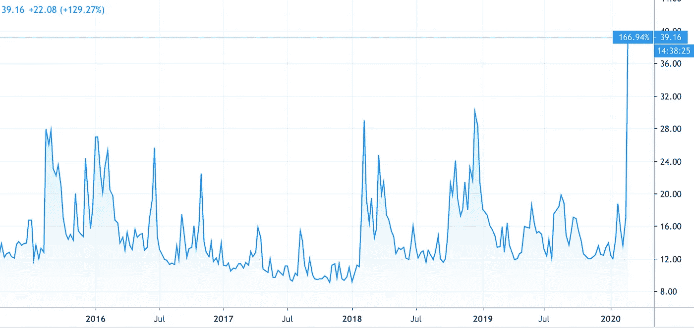
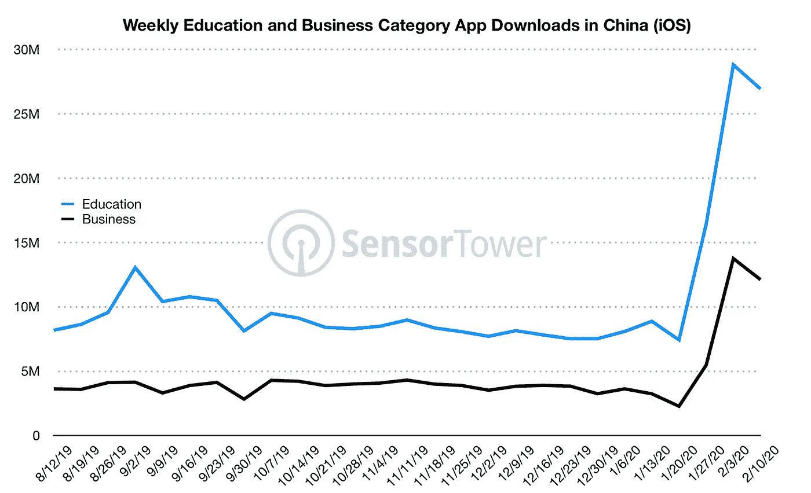

# 冠状病毒在央行使用数字货币会更快吗？

> 原文：<https://medium.datadriveninvestor.com/will-coronavirus-user-in-central-bank-digital-currencies-faster-d143b22c7c68?source=collection_archive---------6----------------------->

VIX 指数，有时被称为恐惧指数(因为它显示了市场对股票市场 30 天波动的预期)，是 5 年来最高的。华尔街正遭受有史以来最大的点数损失 [*，由于冠状病毒的恐惧，华尔街下跌了 1191*](https://mondovisione.com/media-and-resources/news/wall-street-tumbles-with-dow-jones-industrial-average-registering-biggest-fall-e/)；全球投资者开始意识到，随着供应链受到冲击，产品无法生产。真正令人担忧的是，如果公司利润暴跌，他们将如何偿还债务？如果 250 多万亿美元的全球债券市场开始违约，投资者会要求更高的赔偿吗？即利率会被迫上升吗？

**VIX 指数——也被称为恐惧指数**

来源:[TradingView.com](https://uk.tradingview.com/symbols/CBOE-VIX/)

迄今为止，中国政府已经向中国经济注入了 1730 亿美元，以在冠状病毒的影响蔓延之际保持其金融市场的流动性和信心。实际上，由于许多中国公民被困在家中，以商业和教育为目的下载应用程序的人数有所增加。据 [Sensortower 报道，](https://sensortower.com/blog/china-coronavirus-apps-impact)中国科技巨头腾讯的[腾讯会议](https://technode.com/2019/12/26/tencent-releases-zoom-like-video-conferencing-app/)应用(相当于电话会议的缩放)于 2019 年 12 月才推出，但已经有 500 万次下载。与此同时，仅在 2020 年 2 月的前三周，学生部门的下载量就比有史以来最高的月度数据高出 50%。另一家知名的中国科技公司阿里巴巴发现，其远程工作应用程序 [DingTalk](https://www.dingtalk.com/static/en/download) 在 2020 年 1 月的前 18 天被下载了 67 万次，此后又被下载了 1100 万次！

 [## 5 行业转型区块链应用|数据驱动投资者

### 除非你一直生活在岩石下，否则我相信你现在已经听说过区块链了。而区块链…

www.datadriveninvestor.com](https://www.datadriveninvestor.com/2019/02/13/5-real-world-blockchain-applications/) 

这些统计数据表明，即使面对如此糟糕的逆境，中国人也已经乐于适应和拥抱科技。人们不得不担心冠状病毒对中国经济的影响。西方公司很可能会质疑在任何一个国家进行过多生产的商业逻辑。如果企业高管看到《华盛顿邮报》等报纸的头条报道，“是时候让全球企业承认这一点了:中国不是一个好的投资”，公司董事会将会问，是否值得冒*风险*过度依赖任何一个司法管辖区。事实上，甚至在冠状病毒爆发之前，企业就已经在寻求分散风险。

来源:SensorTower.com

CNCB 在 2019 年 12 月报道称， [50 家公司](https://www.cnbc.com/2019/07/18/more-than-50-companies-reportedly-pull-production-out-of-china-due-to-trade-war.html)正在关闭在中国的工厂，并转移到越南。在惠州(现在变成了一座鬼城)生产了 30 年手机的三星已经将生产转移到了越南和印度。当代观察研究所(Institute of Contemporary Observation)负责人刘恺名(音)表示，“广东至少有 100 家工厂将关闭。没有三星的惠州工厂，他们都做不到，更不用说周边的那些小商店和餐馆了。”

特朗普与中国的贸易战导致关税增加，中国污染记录增加，现在又出现了冠状病毒，这些都是中国经济需要应对的强大逆风。如果其公民因冠状病毒而无法上班，或因工厂搬迁而失业，人们将如何支付抵押贷款或租金？中国政府可能被迫继续向经济注入数十亿元人民币，字面意思是“人民的货币”，这种货币供应的大幅增加可能导致通胀抬头。反过来，如果通胀开始上升(迫使利率上升)，这可能会对债券价格产生毁灭性影响——更不用说中国企业和个人违约的幽灵了。

与此同时，中国政府也一直在使用区块链驱动的平台向 87 个不同的组织发放 2 亿美元的贷款。腾讯支持的网银微众银行([)首席信息官亨利马(Henry Ma)最近表示](https://www.cnbc.com/2020/02/15/coronavirus-china-taps-blockchain-tech-to-help-firns-hit-by-virus.html))，“由于病毒的影响，*以前的痛点，如对业务缺乏信任、验证效率低下、缺乏信息共享和难以及时监管等负面影响被进一步放大*他接着说，“跨境金融区块链服务平台可以发挥更大的作用，帮助中小企业提高获得出口贸易融资和其他金融信贷支持的效率和便利性。

如果中国继续前进，推出数字货币，那么它可能会有更多的货币工具来控制其经济。例如，如果中国经济需要刺激，那么央行可以向每个银行账户中存款不足 900 元的公民存入 8200 元人民币(909 英镑)。这背后的想法是，与选择储蓄的富人相比，没有多少钱的人更有可能花掉他们得到的钱。之所以建议 8200 元人民币，是因为这相当于中国平均年薪的 10%。如果通胀开始上升，中国人拥有了数字货币，他们可以“抑制”货币流通速度(这通常被视为通胀的主要原因，即过多的货币追逐过少的商品)，并对所有数字交易收取费用。或许现在人们可以开始明白为什么央行开始关注并研究在私人机构(如拥有 24 亿用户的脸书)之前引入数字货币的概念了。)

有趣的是，[《纽约时报》](https://www.thetimes.co.uk/article/the-greatest-challenge-facing-britain-relates-to-the-future-of-money-itself-fq00qhcxx)最近在报道数字货币和各国央行兴趣增加时提醒我们，“*正如 17 世纪从白银到黄金的转变，以及 19 世纪从黄金到纸币的转变，世界正站在使用货币方式的又一次历史性变革的边缘。然而，尚不清楚新的游戏规则将会是什么，或者由谁来制定。”另一个未知数是世界欠中国多少钱，如果中国人遇到经济问题，他们会开始讨回自己的钱吗？《哈佛商业评论》进行了一项广泛的分析，欠中国的金额估计占全球 GDP 的 5%,其中大部分来自中国的国有实体！*