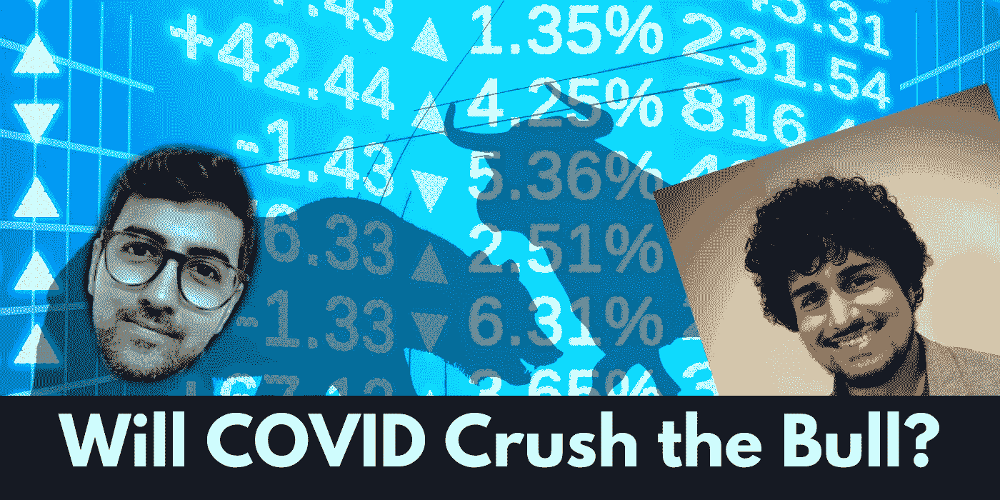
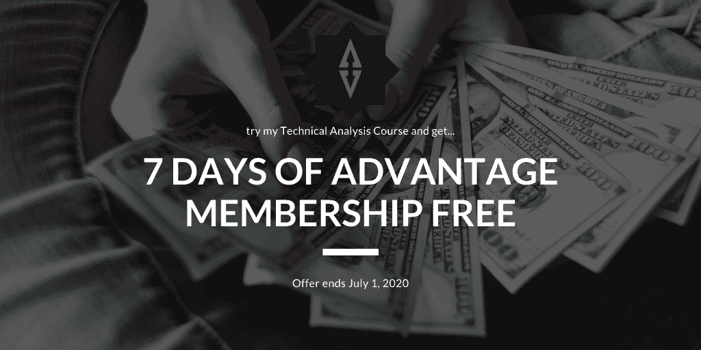

# COVID 会碾压公牛吗？| Alpha Trades 每周股票和市场分析

> 原文：<https://medium.datadriveninvestor.com/will-covid-crush-the-bull-alpha-trades-weekly-equities-market-analysis-d4d3439196c2?source=collection_archive---------11----------------------->

## 我们对这些数字的解读正确吗？电晕案件在上升，但市场信号是一个新的故事弧的开始。

一天两个故事——哇！如果你看到了本周末的新闻(嵌入在文章底部)，你已经知道了，但是我们中的一些人仍然喜欢阅读。正如承诺的那样，接下来是本周日有关股票和整体市场状况讨论的文字记录。

# Faisal 和客座分析师 Austin Ashraf 的股票

*这是我们三个人(阿莫尔、费萨尔和奥斯丁)之间更即兴的对话，你可以在本文末尾找到视频格式的原始版本。*

**Austin:** 我们在股票中看到的大部分交易量是由于“[四重巫术](https://www.marketwatch.com/story/will-quadruple-witching-mark-the-start-of-a-rocky-stretch-for-us-stocks-it-may-already-have-2020-06-18#:~:text=Quadruple%20witching%2C%20occurs%20on%20the,index%20options%20and%20stock%2Dfutures.)”，这意味着所有的期货、股票等期权都在周五到期。从历史上看，在 6 月到期后，接下来的一周会有所调整。做市商在那时重新建立新的头寸，所以我预计本周会出现疲软。

 [## 使用谷歌搜索趋势预测首次申请失业救济人数|数据驱动的投资者

### 几年来，我的重点一直是使用多种替代数据来预测宏观经济统计数据…

www.datadriveninvestor.com](https://www.datadriveninvestor.com/2020/03/25/using-google-search-trends-to-predict-initial-jobless-claims/) 

费萨尔:我仍然不确定市场将如何消化所有关于新增病例的新 COVID 信息。耐用品数据将说明普通人的储蓄和当前的消费习惯。COVID Advantage 股票，无论是游戏还是生物技术，从本周开始到结束都表现出色。我们终于看到了沃尔玛、塔吉特和其他大型零售商的势头。许多受救助的股票，如航空公司、邮轮公司和赌场公司的股价有所下跌。根据后者上周五的收盘点位，它们非常接近突破再跌 10%至 15%的支撑。就这个领域的领导者而言，我正在考虑皇家加勒比，联合航空，拉斯维加斯金沙。我认为我们将看到这些精选行业的又一周上涨，主要优势在 COVID Advantage 公司。

如果你想在当前市场投资，我不会买这些指数。正如我们上周所看到的，道琼斯指数下跌了 200 点，但强劲的软件公司和救市股票(特别是波音)表现良好，继续给指数带来巨大的权重。势头的逆转可能会导致股指下跌。

本周我仍然是个人选股者，但这将是一段不稳定的旅程。

# COVID 病例在增加，但悲观情绪伴随着警告

**Amol:** 周五是单日全球 COVID 病例数最高的一天。具体来说，巴西和美国出现了有记录以来的最大单日涨幅。我们必须承认，在可预见的未来，这个疫情可能是一个滚动的问题。除非我们很快研制出疫苗，否则这种无孔不入、广泛传播的病毒将继续对社会造成损害。据报道，中国是世界上封锁程序最严格的国家之一，即使是中国，北京和上海也继续出现病例。中国继续推出封锁，以面对第二波。

**奥斯丁:**COVID 死亡率是上升的主要原因，所以只要这个数字继续下降，这就是好消息。在我看来，我们的医疗系统已经找到了让人们活下去的方法。尽管病例数在上升，但死亡率在持续下降，这对我更重要。这意味着，作为一个社会，我们正在管理这种情况，这可能会保持系统完整，直到我们能够开发出疫苗。

苹果是三月份第一批开始关闭零售店的公司之一。苹果了解客流量数据，他们可能会根据他们的发现采取行动，因为[他们已经开始再次关闭他们的商店](https://www.npr.org/sections/coronavirus-live-updates/2020/06/19/880930206/apple-closing-11-stores-again-in-states-seeing-a-spike-in-coronavirus-cases)。

奥斯汀:我们重新开业时会有很多小问题，这是意料之中的。这个周末休斯顿的酒吧挤满了人，我去了家得宝，那里也挤满了人。人们将回到他们习惯的生活。

死亡人数是一个滞后指标，因此随着病例的增加，死亡人数也可能随之增加。[亚利桑那州的 ICU 床位利用率为 85%](https://www.newsweek.com/arizona-hits-record-high-hospital-capacity-coronavirus-cases-climb-1511578) 。合适的疗法仍处于早期开发阶段，美国食品和药物管理局最近声明我们不应该推荐羟氯喹。我父亲在 COVID 住院期间服用了那种药，并报告了奇怪的胸部问题。

**奥斯汀:**我不是医疗保健专业人士，但通过阅读一些报告，医疗保健系统似乎已经简化了管理这种病毒的方式。这就是死亡率持平的原因。此外，主要问题在于老年人；年轻人口似乎管理得更好。

**阿莫尔:**16 岁至 22 岁的人群中的感染率似乎在上升。

**费萨尔:**总的来说，我很看好。即使病例继续上升，只要经济不像以前那样关闭，我相信现在许多人已经恢复了正常的生活，就很难命令这些人留在家里。从一个美国人的角度来说，特别是关于我在德克萨斯州的生活，人们对 COVID 没有那么多恐惧。Moderna 最近表示，他们希望在感恩节前发布疫苗功效数据。到那时，我们可以在 2021 年初看到疫苗。除此之外，疫苗的时间表对我来说不像以前那么重要了，尤其是在我如何解读市场情绪方面。

首先，即使我们真的得到了疫苗，我认为我们是否能信任这种疫苗还有很多疑问。人们会意识到这是仓促的，他们会意识到这些大型制药公司正在冲刺成为第一个上市的公司，因为这些公司有太多的收益。我认为人们会对接种疫苗犹豫不决，即使是那些继续在原地避难的人。这种情况给信任带来了很大的问题。

在过去的三周里，我去了 10 次杂货店，我仍然找不到 Clorox 漂白剂。因此，虽然社会距离可能是一个笑话，但人们的态度已经改变，他们正在学习与病毒共存。这可能会导致更多的网上购物，一旦这一切结束，人们可能会继续戴口罩，但总体上的恐惧开始消散。

**Amol:**[诺华公司的首席执行官一个月前声明](https://www.bloomberg.com/news/articles/2020-05-14/novartis-ceo-says-covid-19-vaccine-may-take-until-end-of-2021)他们预计一年半内不会有疫苗。这是一种高度复杂的病毒，他们唯一能够远程弄清楚的是病毒的外壳。他们还没能描绘出它的内部流程。

费萨尔:就症状而言，第二波浪潮带来了更多的测试和意识。我认为与以前相比，测试是一项被低估的资产。测试以前是如此可怕，想象一下你认为自己有症状，但你甚至不能进行测试，你不得不呆在家里，想出一种昂贵，缓慢的方法来获得你需要的治疗。我去做测试了。感谢上帝，我变成了阴性。但这是一个非常简单的过程，我认为这对社会和市场情绪来说是一件被低估的好事。如果我们能更早地发现这些威胁，我认为很明显死亡率会持平，或者最终下降。

让我们回到市场分析上来。到目前为止，COVID 的消息还没有对市场产生负面影响。然而，由于本周有太多期权到期——将近 1.6 万亿美元。

**费萨尔:**周五，当市场关闭时，期货遭到大量抛售。然而，市场领导者的实力表明风险偏好仍然存在，在我看来，这是市场的一个健康迹象。

大多数养老金计划远远落后于他们的估计，而且资金不足。CaIPERS 是一家大型养老金信托公司，它计划更积极地达到 7%的目标。这意味着他们将把大量资金投入科技领域。我认为大多数养老金信托将无法满足他们的数量，所以这可能会成为一种趋势。

我读了一份来自 ZeroHedge 的报告，报告指出这实际上意味着信托公司将持有更多杠杆头寸。这对你在市场上的光学产品有什么影响，费萨尔？

费萨尔:市场上涨或下跌取决于两件事:利率和收益。利率处于历史低位，接近于零，市场上有大量流动性。在过去的 10 年里，大部分的收益增长来自于科技行业。标普 500 指数下跌的技术正在走平。对我来说。软件股和一些与 COVID 相关的科技股一直在火上浇油，我不认为这种情况会很快改变。

# 英特尔可能失宠于 AMD

**Amol:** 我想讨论一下英特尔。当你深入挖掘这位 CEO 的职业生涯，他在英特尔、AMD 甚至特斯拉都有着深远的影响，因为他协助开发了特斯拉的自动驾驶软件。他还帮助 AMD 开发了他们的 Zen 芯片系列，并参与了英特尔的 x86 架构芯片系列。在我看来，他从英特尔辞职是大多数人可能会忽视的重大新闻。这可能是 AMD 的一大胜利。

**Faisal:** 在我们与技术专家共舞的过程中，我们有时会忘记有真实的人在推动市场增长。我认为，当英特尔失去像吉姆·凯勒这样的人时，它会受到一些损害，不仅是对股价，而是对公司的基础。他们将失去与其他公司竞争的优势。AMD 拥有一些世界上最好的工程师，他们在处理领域的最大竞争对手正在失去一位关键的领导者。我认为这对 AMD 来说是个好兆头，他们有能力在处理能力和速度方面继续击败英特尔。

**Austin:** 科技公司都是关于创新和新产品的，在过去的几年里，我没有看到英特尔有太多的创新。相比之下，AMD 在推出新产品和新架构方面表现抢眼。我同意易说，失去吉姆凯勒是一个巨大的负面英特尔和积极的 AMD 公司。

**阿莫尔:**英特尔也有一些严重的管理问题。关于吉姆·凯勒因为这些原因离开的谣言四处流传，主要是因为他没有了他在 AMD 工作时的那种自主权。我将 AMD 的成功很大程度上归功于其首席执行官丽莎·苏(Lisa Sue)，但真正将 AMD 拉出困境的是吉姆·凯勒(Jim Keller)和他的架构设计。根据基准测试标准，今年秋天推出的 Zen 3 芯片将会摧毁任何英特尔芯片。我挺看好 AMD 的，也确实有 AMD 股票的小仓位。*不是财务建议。*

# 关于石油的思考

奥斯汀:我是一个常年看跌能源的人。我认为能源的长期前景令人沮丧。在接下来的几年里，他们会继续被电动汽车抢走市场份额，你会看到电动汽车行业令人难以置信的增长。我们还会看到自动驾驶卡车。记住，美国的大部分石油都被运输业消耗掉了。

我认为石油的自然价格大约在 16 到 18 美元之间。我这么说的原因是，作为最大的产油国之一，沙特人花费 6 到 8 美元从地下开采石油。对俄罗斯来说也相当便宜。

随着开采成本的下降，更多的供应将进入市场，同时需求减少，最终这将使价格下降。

摩根大通预计油价将接近 100 美元，以今天的标准来看，这听起来很荒谬。

费萨尔:相反，我认为油价将在接下来的几周内保持乐观。实际上，未来一两年的前景看起来也很乐观。我认为可再生能源和电动汽车的长期影响将会改变这个行业。然而，我认为，鉴于美国和中国的基础设施支出，石油需求将会激增。随着我们永久失去大量零售岗位，它们将被基础设施行业的增长所取代。

**奥斯丁的投资策略倾向于保守，而费萨尔则更激进一些。费萨尔解释了他评估公司的标准，重点是 Nikola 公司。**

**费萨尔:**我是一名超级成长型投资者。我喜欢成长股。我认为，根据我们在技术周期方面的情况，当涉及到像 Nikola 这样的股票时，这都是炒作。看看特斯拉，一家估值极致，产品优秀的公司。因此，只要特斯拉继续创新并有效地营销他们的产品，他们就会继续增长。对 Nicola 来说也是一样，我不会看空这家公司，但我还没有对这家公司做足够的研究来做出任何现实的评估。高风险资产可能会在未来五到六年内获得回报，因为增长可能会在一年内爆发。关键是你想看到可持续的增长，你想看到一致性。每年，他们的顶线和底线都在改善，他们能够每年增加毛利润。由于资本支出很少甚至下降，您应该能够看到大量的运营现金流。

*要观看或收听这些每周会议的后半部分，您必须成为 Advantage 会员。*

# 我们正在寻找客座专家和分析师。

*如果你想顺便来聊聊市场和经济，我们邀请你参加* [*加入争论*](https://bit.ly/AlphaTradesDiscord) *并给任何一位管理员发送消息。如果我们有一个爆炸在一起，我们也会在我们的分销渠道的特点你。*

# 优势会员获得更多

[订阅 Discord 服务器](https://bit.ly/2KJ1oor)学习技术分析以及如何投资获利。寻找第一个月高级会员的 50%折扣？向管理员发送消息。

# 放弃

Alpha Trades，LLC 提供的信息不用于制定任何财务决策，也不是购买、持有和/或销售特定产品、数字资产或 ICO 的请求或建议。

访问我们的完整服务条款:[https://bit.ly/3faVeeV](https://bit.ly/3faVeeV)

**进入专家视角—** [**订阅 DDI 英特尔**](https://datadriveninvestor.com/ddi-intel)