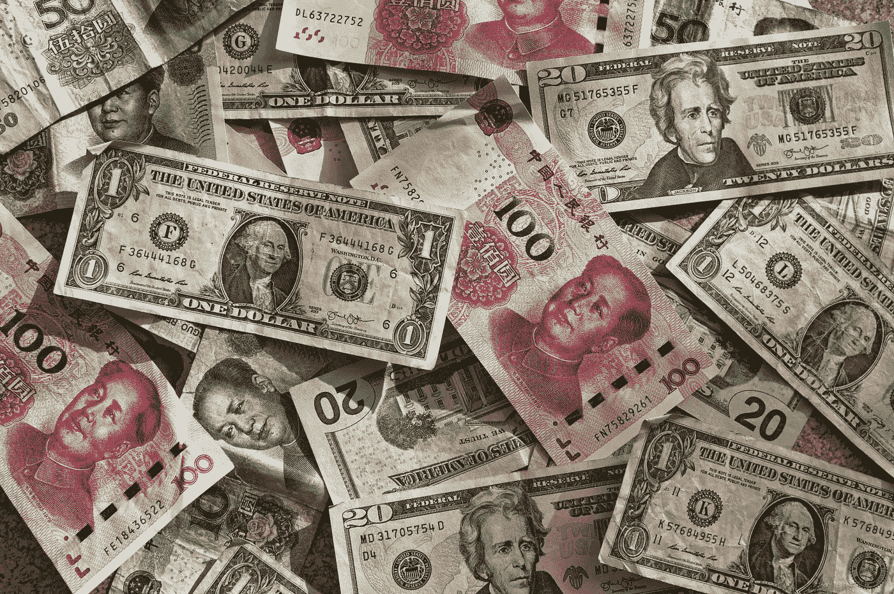
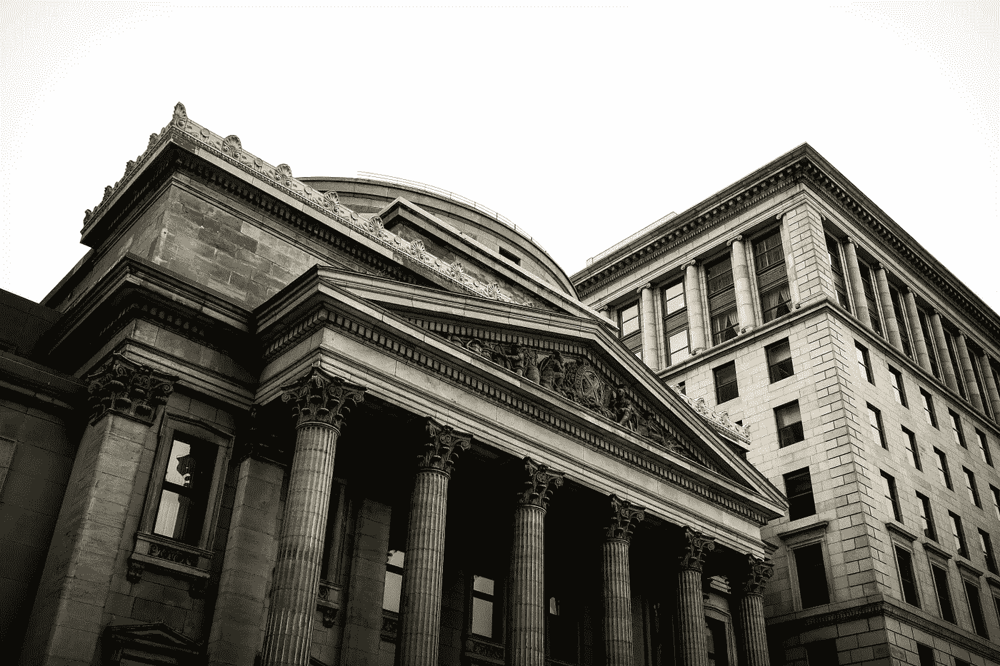

# 加密货币会成为新的世界货币吗？

> 原文：<https://medium.datadriveninvestor.com/will-cryptocurrencies-become-the-new-world-currency-4d94428b5cf2?source=collection_archive---------4----------------------->

## 货币、信贷和当前经济

持续的疫情影响了商业和经济，并在全球范围内引发了前所未有的财政刺激。加密倡导者很快就围绕对一种新的去中心化货币形式——加密货币——的需求建立了一个案例。

其中最大的争论是——美国和欧盟是如何大量印钞的(Cue: [Unlimited](https://www.theguardian.com/business/live/2020/mar/23/markets-slump-us-senate-covid-19-ftse-dax-shares-recession-stimulus-business-live) )，这破坏了法定货币的整个概念以及人们对这些管理机构的信任。

Photo by [Eric Prouzet](https://unsplash.com/@eprouzet?utm_source=unsplash&utm_medium=referral&utm_content=creditCopyText), Unsplash.

事实上，现在是为一种新的世界货币而欢呼的最佳时机——一种去中心化的、公平的、由准则而不是由议程驱动的机构来决定的货币。但是加密货币真的能取代法定货币吗？

# 理解信贷和债务的作用

了解法定货币的起源将是有益的，我们可以确定两个时间点——1933 年美国放弃金本位制，政府将黄金价格保持在每盎司 35 美元，以及 1971 年尼克松总统完全废除它(来源:【History.com】T2)。

在他最近的[采访](https://www.linkedin.com/in/raydalio/detail/recent-activity/)中，雷伊·达里奥广泛谈论了这个系统是多么的破碎。具体而言，这是关于金融系统不断扩大的漏洞，只有通过印更多的钱才能填补，以保持经济和系统的运行。然而，这一次与以往的危机不同，因为利率已经接近于零(因此他们几乎无法刺激更多的借贷)，失业率处于创纪录高位，以及其他令人担忧的迹象。

 [## 加密货币行业是死是活？数据驱动的投资者

### 九月初，我们在 X-Order 内部就代币市场的未来进行了一场辩论。有趣的是，我们的观点是…

www.datadriveninvestor.com](https://www.datadriveninvestor.com/2019/12/12/will-the-cryptocurrency-industry-be-dead-or-alive/) 

想象一下。你拥有一家公司，也许你需要借一些贷款来生存或扩张。你获得了一笔低息贷款，并有效地利用了这笔钱。随着你逐渐建立起正的现金流，现在业务有了销售和增长。现在，你的下一步是什么？

在正常情况下，你应该偿还债务，但这可能真的没有意义。假设你以 5%的年利率借了 100 万美元，你每年要花 5 万美元来维持这笔贷款。只要你能用这 100 万美元产生 5 万美元以上的利润，留着这笔贷款就是有意义的。

例如，可以通过 R&D，推出新的产品线，营销以推动销售，甚至进行股票回购([，2019 年上半年 3700 亿美元](https://hbr.org/2020/01/why-stock-buybacks-are-dangerous-for-the-economy))。事实上，如果你能如此成功地使用这 100 万美元，你或许应该借更多的债，而银行也会欣然接受。

现在，你什么时候偿还债务？还是只付利息，让贷款继续运转？

# 更多信用。更多的钱。它一直运行，直到…

上面的例子过于简单了。事实上，银行不会无缘无故地借钱给你——他们必须评估你的信用记录、资产和负债等因素。只要你不陷入[负资产](https://www.money.co.uk/mortgages/what-does-negative-equity-mean-for-me.htm)的局面，你就可以承担更多债务。

对于大多数人来说，这听起来并不奇怪。我们在信用的基础上运行着一个世界，这是一个美丽的世界…直到我们无法履行财政义务。

Photo by [Etienne Martin](https://unsplash.com/@etiennemartin?utm_source=unsplash&utm_medium=referral&utm_content=creditCopyText), Unsplash.

当许多人同时从一家银行取钱(不管出于什么原因)而银行现金告罄时，这就叫做银行挤兑。当许多人开始拖欠抵押贷款(尤其是次级抵押贷款)时，这个体系崩溃了，并导致了全球金融危机。

解决办法是让某个强大的人介入并说，“嘿，我们会保护你的。”这是次贷危机中的救市，也许会是 2020 年的无限量化宽松。

这个系统将一直运行下去，直到有一天，人们开始意识到这些并没有增加。当失业和收入不确定时，人们如何保持消费？当消费下降，企业无法偿还无息贷款时，它们如何维持下去？

加上社会政治问题、不断扩大的贫富差距、健康差距，在冠状病毒继续释放其愤怒的同时，这可能会导致长期螺旋式下降的开始。

# Crypto 在哪里合适？

加密货币成为新的世界货币的前提是破碎的法定货币体系的崩溃。如果它失败了，人们就会对这些机构失去信心，转而使用一种新的货币形式。

这并不是说我们某天早上醒来会意识到“密码是好的，美元是坏的”。相反，这可能是消费者行为的逐渐转变，数字交易和支付将成为主流。与此同时，区块链技术必须不断改进，变得更加可用和可扩展，同时普通人也越来越习惯使用数字钱包。

这些是随着时间的推移而发生的，而不是一瞬间。

与法定货币相比，是的，加密更有远见，是一种更长期的玩法，但它也受到许多问题的困扰。虽然解决这些问题可能只是时间问题，但目前加密货币存在更多不确定性。

概括地说，你会相信你的国有法定货币还是一群你完全不知道他们是谁以及他们明天是否会继续为加密货币服务的矿工？当然，加密货币的概念和设计比这更健壮，但大多数人会认为是加密货币。

# 加密可能更适合作为一种资产

现在，我并不是说密码不能在我们的日常生活中使用。我们已经走了很长的路，crypto 肯定比以前更有用。我只是觉得收养需要时间。

相反，鉴于目前的开发和采用状况，加密货币在某种程度上已经是一种既定的资产(至少在我看来是这样)。我这么说是什么意思？

传统上，有几种类型的资产——现金、债券、股票、大宗商品、房地产、黄金，或许还有艺术品。罗伯特清崎(Robert Kiyosaki)有一种更简单的方式来看待资产，这是一种让你获得正资金流入的东西。因此，产生正收入的企业是一种资产，他出版的书籍也是如此。

当你以这种方式看待资产时，实际上就是看钱是流入还是流出。如果一种投资工具给你带来了 2%的收益，但你在通货膨胀和其他成本上付出了更多，这就是负债，钱从口袋里流出来了。股票有股息率，但如果你将其与资本增值或贬值进行权衡，它可能是资产，也可能是负债。

同样，加密可以是一项资产，也可以是一项负债，这取决于你如何使用它(顺便说一句，这绝对是一个投机泡沫)。也许最好的赌注在于分散多种资产的传统智慧。

# 2021 年的经济会是什么样子？

经济看起来已经很黯淡了。失业率创历史新高。企业关门，看不到尽头。全球旅行突然停止，而且不太可能很快恢复。

世界已经变了。

也许是关于[调整你的业务](https://medium.com/better-marketing/adapting-your-newsletter-strategy-for-customers-on-lockdown-a1bedeac58a9)以瞄准更多的本地消费者。或者，它可能会走向数字化，并专注于电子商务，以获得全球影响力。

 [## 现在是 2020 年 12 月

### 让我们看看过去繁华都市的生活会是什么样子。

medium.com](https://medium.com/@h.ansel/its-december-2020-a60a485284ab) 

如果你对悲观的前景不以为然，并期待经济会很快复苏，我劝你三思。

在我所在的地方，我们受到了第二波新冠肺炎的袭击，第二波比之前的更严重。作为参考，你看到的国家有足够的检测和接触者追踪能力，尽管人口密度很高。

仍然认为你在世界的某些地方会过得更好，或者你会对冠状病毒免疫？希望不会有第二波就像希望一开始就没有冠状病毒一样。

不管你在哪个国家，过早的重新开放将会带来灾难性的影响，世界其他地方也会因此遭受损失。不，这不仅仅是关于病毒的传播，而是对旅行、旅游和经济的长期影响。

继续印那些美元。它会填满还是造成一个更大的洞？只有时间能证明一切。

现在，我们只需要一点火花，一场新的革命可能就要开始了。

*尽管《疫情》给我们带来了压力，但它也给我们带来了最好的一面，无论是激发社区精神还是引起人们对之前隐藏的社会政治问题的关注。有一点是显而易见的:我们适应、生存和发展的意愿。*