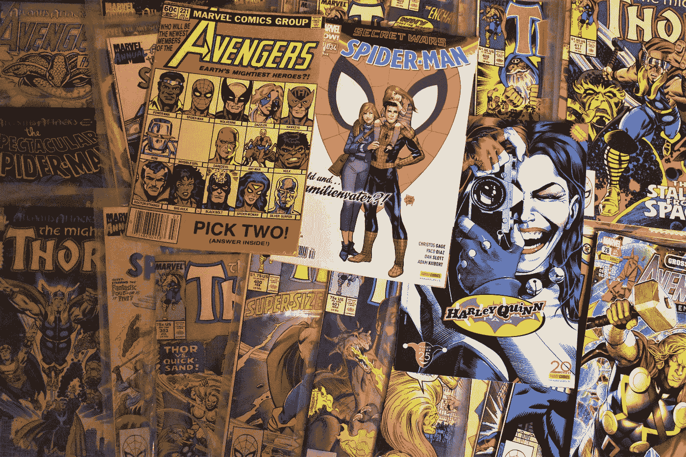

# 到 2020 年代，DC 的销量会超过漫威吗？

> 原文：<https://medium.datadriveninvestor.com/will-dc-outsell-marvel-in-the-2020s-a2d03cde9533?source=collection_archive---------17----------------------->

Photo by [Waldemar Brandt](https://unsplash.com/@waldemarbrandt67w?utm_source=medium&utm_medium=referral) on [Unsplash](https://unsplash.com?utm_source=medium&utm_medium=referral)

8 月 22 日星期六，DC 粉丝俱乐部的体验是一个很长的在线免费直播。这是 DC 的一个明智之举，他们的声明不会被其他娱乐公司的资产所掩盖，这些娱乐公司通常同意在年度动漫展上展示他们所有的未来计划。

有很多关于未来 DC 电影的有趣细节被披露，多年来第一次在我眼里没有感到令人心痛的失望。《神奇女侠:1984》看起来将会是一部激动人心的剧集，而且肯定会取得和第一部一样的成绩，如果不是更多的话。詹姆斯·古恩的《T2》和《X 特遣队 T3》是对 70 年代战争电影的致敬，也是对漫画白银时代的一次华丽致敬，融合了各种古怪的角色。*闪光灯*小组展示了概念艺术，一个穿着西装的巴里·艾伦摆出准备与迈克尔·基顿的托马斯·韦恩/蝙蝠侠并肩战斗的姿势，以改编闪点行动传奇，这个故事我还不认为是死马，但肯定是一匹靠生命维持的马。岩石的*黑亚当*，他已经戏弄了似乎整个地质时期，有一个令人印象深刻的视觉概念预告片，并将介绍美国正义协会成员，如霍克曼和命运博士。最重要的是，我们第一次看到了马特·里夫的 *The Batman* ，它毫不犹豫地在预告片中使用了一首著名歌曲的管弦乐混音，因为最近的每一部预告片都来自汉斯·季默公告牌百强。《蝙蝠侠》将专注于披着斗篷的十字军的侦探方面，很可能是系列电影中最黑暗的一部。令人印象深刻的是，这样一个好的预告片是在电影只有 25%被拍摄的情况下设计的，然后不得不停止制作另一种蝙蝠场景。

其他亮点包括视频游戏*哥谭骑士*和*X 特遣队:杀死正义联盟*。除了完美的《蜘蛛侠》PS4 游戏之外，DC 似乎在电子游戏中打败了漫威。也可以说，DC 通过华纳兄弟娱乐公司经营了更多成功的真人表演和动画节目。我这么说是因为我是这两个派别的狂热粉丝，但在我看来，在无限传奇的开始阶段之前，DC 领先于漫威，他们可能会再次占据那个位置。

2010 年是关于漫威的。没人能看够，包括我自己。我在影院看了每部电影，并将继续这样做，因为这是我有过的最好的影院体验。也就是说，漫威公式会限制负责制作电影的电影制作人的视野。DC 不在乎这是一堆不同的电影。他们会同时有两个小丑和三个蝙蝠人，你只需要处理它。

DC 匆忙创建了一个互联的宇宙，而漫威则花时间去开发一个更加充实和关怀的宇宙。漫威在发布《复仇者联盟》之前给了四个角色他们自己的电影，而在《T2》中，《蝙蝠侠大战超人:正义黎明》中的正义联盟是通过电子邮件介绍的。蝙蝠侠有介绍达克赛德、邪恶超人和闪点的白日梦。并引入末日来“杀死”超人。你有什么胆量拍一部从*黑暗骑士归来*、*超人:末日*、*正义联盟新 52* 、*闪点悖论*、*非正义:神在我们中间*中抽取弧线，并指望普通观众就能看懂的漫画电影？作为一个像我一样充满知识的人，甚至我也不知道那里到底在试图完成什么。

随着漫威和复仇者联盟 4：终局之战一起到达巅峰，这对他们的未来意味着什么？除非他们真的决定改编《秘密战争》，或者我敢说《复仇者联盟 vs X 战警》，否则很难想象这部电影会有更多的后续部分。这可能是这样的情况，我们到达漫威疲劳和 DC 轮到他们，因为他们得到了一个合适的立足点首先。未来几年，DC 能否超越漫威，超级英雄疲劳症是否会持续到 21 世纪 30 年代，这仍然是一个没有答案的问题。但我知道一件事:我永远不会停止支持他们中的任何一个，因为我内心的孩子会因此恨我。