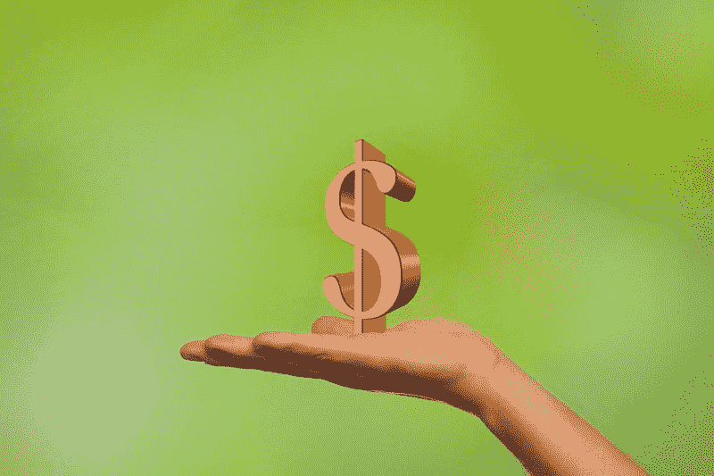
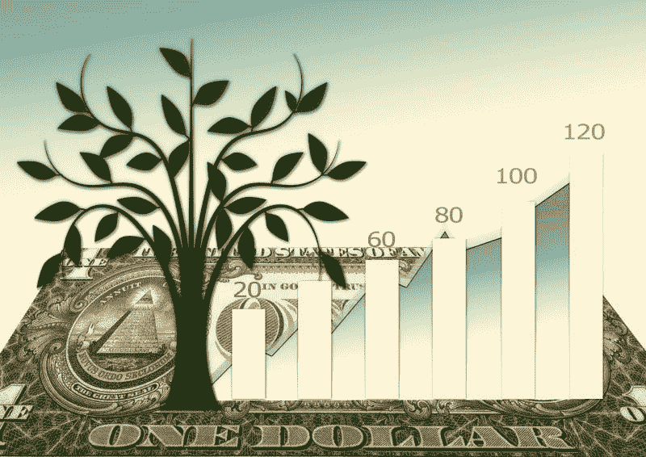
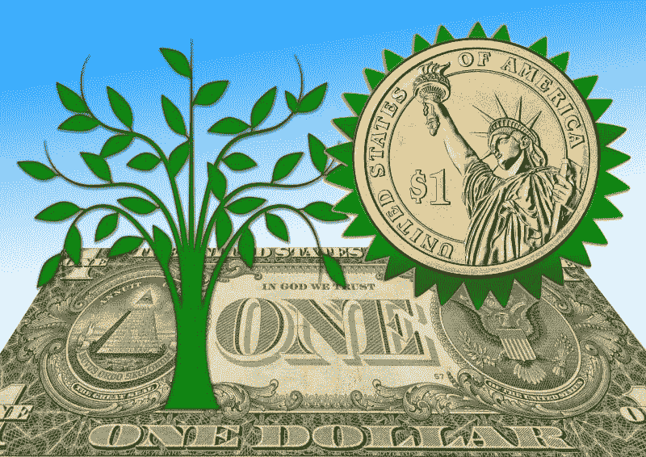

# 美元树(DLTR)会死吗，零售业会崩溃吗？—市场疯人院

> 原文：<https://medium.datadriveninvestor.com/will-dollar-tree-dltr-die-and-will-retail-collapse-market-mad-house-8af559759ee7?source=collection_archive---------19----------------------->

我认为小盒子折扣店**美元树(DLTR)** 将会在冠状病毒萧条期间崩溃并可能死亡。

我很久以前就看过“一元店；如**美元树(纳斯达克:DLTR)** 、**美元通用(DG)** ，美元树的子公司家族美元作为泡沫中的危险股票。奇怪的是，美国的收入不平等、工资下降和贫困加剧催生了这一泡沫。然而，它仍然是一个泡沫。

我认为一元店存在泡沫，因为市场先生高估了他们的股票。例如，2020 年 12 月 9 日，美元树(DLTR) 的交易价格为 110.87 美元。

另外，我相信北美一元店太多了。例如，美元树声称[在美国和加拿大经营着超过 15000 家店铺](https://marketmadhouse.com/will-dollar-tree-dltr-die-and-will-retail-collapse/#:~:text=Dollar%20Tree,%20Inc.%20is%20a,and%20more%20than%20193,000%20associates.)。而且，**美元通用(NYSE: DG)** [号称在美国经营 16720 家店铺](https://marketmadhouse.com/is-dollar-general-dg-the-most-dangerous-stock-in-america/)。

因此，我计算出两家公司在美国和加拿大经营着超过 31，720 美元的商店。我认为两个国家都无法支撑那么多一元店。

# 零售额暴跌

我预测零售业的末日将在今年冬天杀死数千家商店和数十家连锁店，因为 2020 年黑色星期五已经破产。

全国零售联合会估计，从 2019 年黑色星期五到 2020 年黑色星期五，平均零售额下降了 14%。《华盛顿邮报》报道称，2019 年，美国黑色星期五购物者平均花费 362 美元，2020 年为 312 美元。

全国零售联合会估计，从 2019 年黑色星期五到 2020 年黑色星期五，平均零售额下降了 14%。《华盛顿邮报》报道称，2019 年美国黑色星期五购物者平均花费 362 美元，2020 年为 312 美元。

很明显，2020 年感恩节的店内购物比 2019 年感恩节低 55%。此外，美国零售联合会估计，2019 年黑色星期五至 2020 年黑色星期五期间，店内购物下降了 37%。

因此，店内购物下降了 37%,网上销售是美国零售商保持业务的唯一途径。我看不出境况不佳的零售商，如 JWN 的诺德斯特龙、T2 的梅西百货和内曼马库斯如何在这样的崩溃中生存下来。

# 零售股票是我们的末日吗？

此外，我看不出投资者如何能证明像**美元树(DLTR)** 这样的发行的高股价是合理的。

我预测零售股今年冬天会崩盘。我认为引发零售股票末日的所有因素就是一个零售偶像的破产，比如梅西百货(Macy ' s)或者一个据称成功的零售商的倒闭，比如美元树(Dollar Tree)。

我认为美元树可能会崩溃，因为它的许多客户可能会因为冠状病毒抑郁症而没钱。例如，Statista 估计 2020 年 11 月有 1074 万美国人失业。这一数字从 2019 年 11 月的 581 万上升到 2020 年 4 月的 2308 万。

皮尤社会趋势估计 46%的低收入美国人。美元树的潜在客户承认，自疫情开始以来，他们很难支付账单。此外，32%的低收入成年人承认他们很难支付租金或抵押贷款。

# 没有刺激，美元树可能会倒塌

此外，25%的美国成年人告诉皮尤，他们或他们家中的人因为冠状病毒而失业。此外，15%的美国人说他们因为冠状病毒而失业。值得注意的是，42%的美国人说他们家中有人因为冠状病毒而失业或工作时间减少。

因此，美元树的顾客钱少了，政客们也没有计划帮助他们。特别是，美国国会最新的 9080 亿美元刺激方案不包括向普通民众支付现金。

相反，刺激方案可以每周额外支付 300 美元的失业救济金。我不认为 300 美元会有帮助，因为大多数失业者不能获得失业保险。

值得称赞的是，即将离任的总统唐纳德·j·川普(佛罗里达州共和党人)想要 600 到 2000 美元的刺激付款，*华盛顿邮报*声称。然而，特朗普没有为刺激计划做任何游说。

我认为**美元树(DLTR)** 的生存可能依赖于更高的刺激付款。由于国会拒绝批准更多的刺激计划，我认为这注定了美元树的命运。

 [## 新冠肺炎期间股票交易的 9 个教训|数据驱动的投资者

### 在你浏览之前，让我告诉你一些关于我自己的情况。我是…

www.datadriveninvestor.com](https://www.datadriveninvestor.com/2020/12/09/9-lessons-learned-about-stock-trading-during-covid-19/) 

# 美元树赚钱了吗？

相反，**美元树商店公司(纳斯达克代码:DLTR)** 赚了一些钱。2020 年 10 月 31 日，美元树报告季度净收入为 3.3 亿美元。

美元树的季度净收入从 2020 年 1 月 31 日的 1.23 亿美元和 2020 年 7 月 31 日的 2.615 亿美元上升。因此，美元树在 2020 年赚了更多的钱。

相反，美元树的季度收入从 2020 年 1 月 31 日的 63.15 亿美元下降到 2020 年 10 月 31 日的 61.77 亿美元。此外，美元树的季度毛利从 2020 年 1 月 31 日的 19.6 亿美元降至 2020 年 10 月 31 日的 19.24 亿美元。

我认为收入显示美元树的销售正在下降，因为冠状病毒。此外，我认为收入显示美元树的业务正在萎缩。

# 美元树的业务萎缩

我认为美元树的业务正在萎缩，因为越来越多的美国人在网上购物。例如，Oberlo 估计，美国电子商务销售额在 2020 年第三季度增长了 37%。事实上，Oberlo 声称，美国人在零售商处花费的每 5 美元中就有 1 美元流向了电子零售商。

我不认为在网上购买大部分家庭必需品的人会愿意花 15 或 20 分钟的时间在美元树购物。此外，我不认为这些人想通过去美元树使自己暴露于冠状病毒。

最后，我预测许多购物者在意识到他们可以通过亚马逊(Amazon)或沃尔玛(WMT)以便宜的价格订购同样的东西后，将永远不会回到美元树。

# 美元树产生的现金较少

美元树(DLTR) 产生的现金越来越少。例如，美元树的季度经营现金流从 2020 年 1 月 31 日的 8.553 亿美元下降到 2020 年 10 月 31 日的 2.967 亿美元。

引人注目的是，美元树的季度期末现金流从 2020 年 1 月 31 日的 1.057 亿美元降至 2020 年 10 月 31 日的-6.32 亿美元。因此，美元树在最后一个季度烧钱。然而，2020 年 4 月 30 日，美元树报告了 18.02 亿美元的季度末现金流。

相反，美元树的现金和短期投资从 2020 年 1 月 31 日的 5.392 亿美元增加到 2020 年 10 月 31 日的 11.18 亿美元。最后，美元树在 2020 年 10 月 31 日的总资产为 206.52 亿美元。2010 年，美元树的总资产从 2020 年 1 月 31 日的 195.75 亿美元增长到 2020 年 7 月 31 日的 206.71 亿美元。

我认为美元树是一只糟糕的股票，因为市场先生高估了它的股价，它不支付股息，也不产生现金。我认为投资者需要避开美元树，因为我预测这家公司会倒闭。

*最初发表于 2020 年 12 月 9 日 https://marketmadhouse.com*[。](https://marketmadhouse.com/will-dollar-tree-dltr-die-and-will-retail-collapse/)**

## *访问专家视图— [订阅 DDI 英特尔](https://datadriveninvestor.com/ddi-intel)*