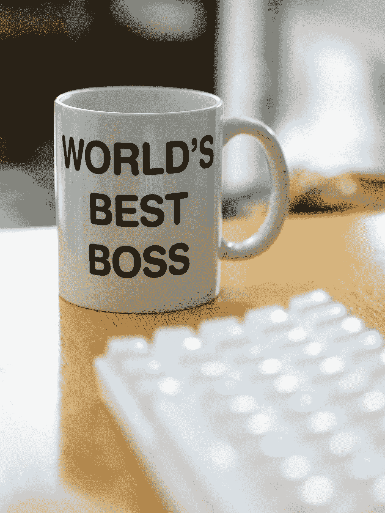

# 雇主会永远接受在家工作吗？

> 原文：<https://medium.datadriveninvestor.com/will-employers-permanently-embrace-work-from-home-8c1cca8a916e?source=collection_archive---------22----------------------->

## 为什么经济应该向前发展，拥抱变化，但很可能不会

Photo by [Pablo Varela](https://unsplash.com/@pablopunk?utm_source=medium&utm_medium=referral) on [Unsplash](https://unsplash.com?utm_source=medium&utm_medium=referral)

重大情况的影响通常需要很长时间才能显现出来。个人和公司必须更新过时的商业计划。

新的经济环境通常要求企业进行重大变革以保持竞争力。不幸的是，现在正在发生的变化之一是自动化导致的裁员。

数百万美国人在疫情冠状病毒中失去了工作，许多人无法重返工作岗位。

这种病毒已经迫使许多不同的经济实验，并迫使我们进入未来几年。

例如，在疫情之前，雇主不愿意让他们的员工在家工作。许多人不相信他们的员工会在没有他们直接监督的情况下工作。

 [## 后疫情经济中的基本 GTM 变革策略|数据驱动的投资者

### 新冠肺炎以一种新的不可想象的方式开展业务。这个疫情甚至强迫…

www.datadriveninvestor.com](https://www.datadriveninvestor.com/2020/08/11/an-essential-gtm-change-strategies-in-the-post-pandemic-economy/) 

现在，他们没有其他选择——要么完全停止工作，要么接受这个新的实验。

> 根据美国劳工统计局的数据，只有 29%的美国人可以在家工作，其中包括 20 分之一的服务工作者和超过一半的信息工作者。

因此，虽然在家工作的美国人数量有限，但这些人在劳动力中的比例很可能会增加。行政管理、文书工作、零售、食品服务、卡车驾驶和制造业约占美国工作岗位的 50%。这些工作很多只需要高中文凭。到 2030 年，时薪低于 20 美元的工作有 83%的可能被取代。

因此，大多数不涉及在家工作的工作将被取代，人们可以在家工作的工作将在经济中更加丰富。

如何处理这些将被自动化的工作是我在另一篇[文章](https://medium.com/datadriveninvestor/is-universal-basic-income-the-answer-to-automation-43d1f7e75d5c)中涉及的一件事。但是在家工作是另一个问题。随着经济的持续发展，有机会让美国人的工作和生活变得更令人向往。

有证据表明，由于我们的高压力和长时间工作，美国人普遍对工作不满意。在家工作是解决这个问题的一种方式，让人们可以更好地控制自己的时间。

在疫情之前，在家工作开始变得越来越普遍，但速度要慢得多。疫情实际上把我们推向了未来。

大多数公司缩小了办公空间，并报告说这样可以省钱。

但是在家工作仍然有效率吗？

一些研究发现，远程工作使生产率提高了 [13%](https://www.bbc.com/worklife/article/20200710-the-remote-work-experiment-that-made-staff-more-productive) 。 [94%的雇主称生产率保持不变。人们似乎普遍认为，生产率要么保持不变，要么发生了微不足道的变化。](https://www.cnn.com/2020/08/27/success/work-from-home-employer-plans-for-more-flexible-policies/index.html)

员工还看到了其他好处，比如减少了通勤时间。普通通勤者单程花费大约 27 分钟(T4 时间)在通勤上。这意味着普通人仅仅上班就要花大约一个小时。通常，这个时间是无偿的。有了在家工作，人们可以把本属于自己的时间拿回来，按照自己选择的方式使用。

尽管有些人表示担心。有些人说他们在家工作很孤独或无聊。公司将此作为退货的理由。但是这没有意义，因为所有其他的好处都超过了这些小的负面影响。

如果大部分办公空间被出售，肯定大多数雇主能够满足那些想去办公室的员工，并且仍然有很多人在家工作。

如果人们感到孤独，那么他们应该有工作之外的社交生活。他们应该和家人建立关系。就我个人而言，我喜欢所有和我一起工作的人，但是如果我可以选择的话，我不会花时间和他们在一起。我更喜欢我的家人和朋友，而不是被迫在一起。虽然愤世嫉俗，但我认为这对大多数人来说都是正确的。

还有，无聊是因为工作者的错。如果有人在工作之外找不到事情做，那是他们的问题，他们不能让其他在工作之外有激情的人进入办公室。

此外，如果在家工作的人和想去办公室工作的人一样有效率，或者更有效率，那么这个人是否在办公室工作又有什么关系呢？

他们花一个小时去办公室上班，看上去在老板面前工作，但实际上并不是，这并不能证明他们的承诺。在家工作允许人们绕过这一点，做他们所有的工作，并在休息时间做他们想做的任何事情。在实际浏览网页时不再表现出高效。

大多数人都认识到了这一点，因此旧的商业模式正在被取代。

> 我们最乐观的估计是，到 2021 年底，25-30%的劳动力将每周在家工作多天(全球工作场所分析公司总裁 Kate Lister)。

这是一个走向未来的运动，希望公司能接受它。

尽管如此，我还是怀疑在家工作会是永久性的。公司，老板，经理还是人。他们做事出于情感，并不总是基于逻辑。不幸的是，强大的动力是权力。雇主仍然希望能够管理和支配他人的时间，即使这会极大地损害员工的福祉。

这类似于地球上人们如何挨饿和没有足够的水的争论。理论上，我们可以养活所有人，这是理智的做法。不幸的是，人们的贪婪和低效率阻碍了发展，人们深受其害。

同样，如果人们对自己的生活有更多的控制权，他们会更幸福，但雇主必须保持他们的权力之旅。

由于技术的发展，劳动力将会大量减少，那些仍然有工作的人应该拥有充分利用自动化的工作。

当我们可以用一半的时间完成工作时，为什么要让自己受制于错误的生产力感和随意的工作时间呢？我不想把时间花在和同事聊天、通勤或浏览网页上。

生命短暂，我想把这段时间分配给我的家人、朋友和我自己。这样说被认为是激进的——但是也许如果更多的人说出他们的真实感受，我们可以进步，拥有一个为人类服务的世界。

**进入专家视角—** [**订阅 DDI 英特尔**](https://datadriveninvestor.com/ddi-intel)