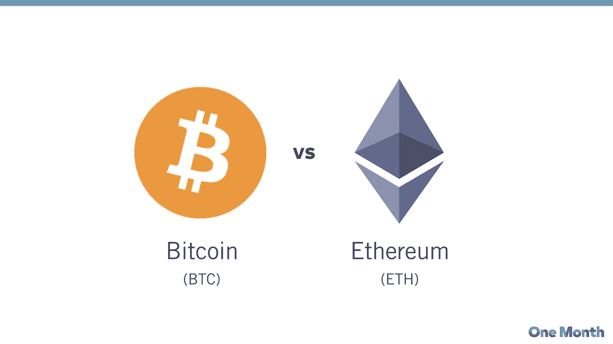
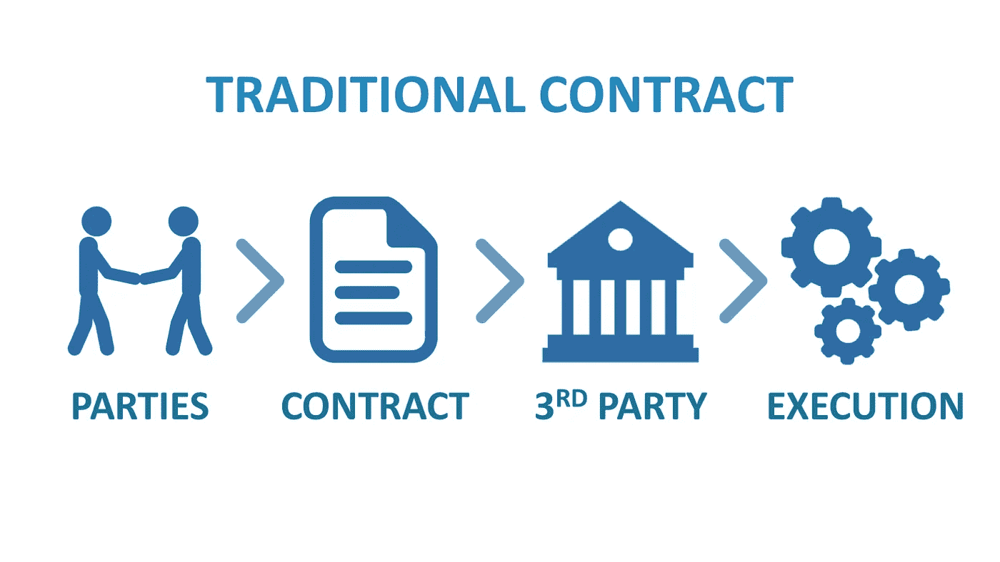

# 以太坊会打败比特币吗？(带音频)

> 原文：<https://medium.datadriveninvestor.com/will-ethereum-defeat-bitcoin-7ea4597ea622?source=collection_archive---------11----------------------->

区块链技术虽然被广泛认为是比特币，但它还有许多远远超出数字货币的其他用途。事实上，比特币只是今天使用区块链技术的数百种应用中的一种。

**以太坊简介:**

*   它是硬币市值排名第二的加密货币。
*   也被称为区块链 2.0 版和 Web 3.0 版技术的原因。
*   我们可以编写在以太坊区块链上运行的代码，并构建在世界任何地方都可用的应用程序。
*   Etherium 通过为开发者提供创建分散应用的资源，使区块链技术的所有商业用途变得可行。

**比特币与以太坊的主要区别:**

*   比特币提供了区块链技术的一个特殊应用，这是一个允许比特币在线支付的点对点电子现金系统。虽然比特币是用来监控数字货币(比特币)所有权的。
*   以太坊专注于为任何分散的应用程序运行编程代码。
*   在以太坊，矿工们不是为了比特币而采矿，而是为了赚取天然气。
*   除了加密货币交易，以太还经常被应用开发者用来支付以太坊网络上的交易费用和水电费。

***用来支付矿工费用的代币，包括他们区块内的交易，被称为天然气，任何精明的合同执行都涉及一定数量的天然气。***

**智能合约:**

*   它只是一个术语，用来描述可以使资本、内容、财产、股份或有价值的东西更容易交易的编程代码。
*   当在区块链上运行时，智能合约就像一个自我操作的计算机程序，在满足特定条件时自动运行。
*   由于智能合约在区块链运行，它们完全按照计划运行，没有任何审查、停机、欺诈或第三方干预的可能性。

**EVM(以太坊虚拟机):**

*   这是区块链技术中最具颠覆性的变化之一
*   在以太坊应用程序创建之前，设计了一组非常有限的操作。开发人员面临一个问题。要么扩大比特币和其他应用的范围，这非常复杂和耗时，要么创建一个新的区块链应用和一个新的平台。
*   Vitalik Buterin 认识到了这一挑战，并提供了一个现代化的解决方案。以太坊的核心发明，以太坊虚拟机(EVM)，是运行在以太坊网络上的图灵的扩展程序。
*   它帮助任何人运行任何程序，而不管时间和内存指定的编程语言。
*   虚拟网络以太坊使得构建区块链应用程序比以往任何时候都更快、更强大。
*   以太坊现在能够在一个平台上开发潜在的成千上万个不同的应用程序，而不必为每个新应用程序构建一个完全原始的区块链。

与比特币竞争的唯一加密货币是以太坊，因为它的使用案例将继续增长，许多跨国公司将利用它来使他们的系统更加安全和分散。

希望你喜欢。

希望得到积极的回应。

请关注我的@Medium 简介 [Yash Kamal Chaturvedi](https://yashkamalchaturvedi.medium.com/)