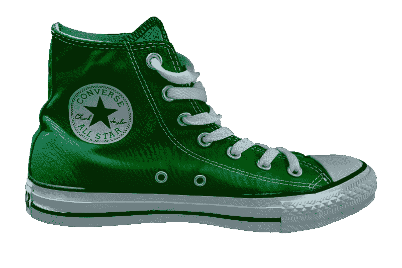

# Footlocker (FL)会死于冠状病毒吗？—市场疯人院

> 原文：<https://medium.datadriveninvestor.com/will-footlocker-fl-die-from-coronavirus-market-mad-house-85ea7b415d2a?source=collection_archive---------21----------------------->

最奇怪的疫情股票可能是 **Footlocker (FL)** 。标志性的运动鞋商场的股价从 2020 年 1 月 2 日的 38.09 美元上涨到 2020 年 12 月 10 日的 42.47 美元。

奇怪的是，Footlocker 的收入正在增长。Stockrow 估计 Footlocker 的[收入在截至 2020 年 10 月 31 日的季度增长了 9.01%](https://stockrow.com/FL/financials/income/quarterly) 。这一数字比截至 2020 年 7 月 31 日的季度的 17.08%有所下降。

相比之下，在截至 2020 年 4 月 30 日的季度中，Footlocker 的收入增长下降了-43.41%。这些收入在截至 2020 年 1 月 31 日的季度下降了 2.24%。

# Footlocker 的营收增长说明了什么？

我认为 Footlocker 的营收增长数字可以说明两件事。首先，一些零售商。包括 **Footlocker (NYSE: FL)** ，在正常时期都是稳健的投资。

因此，Footlocker 是一家优秀的公司，也是一种价值投资，如果经济反弹，它可以快速复苏。然而，我认为 Footlocker 只有在经济快速复苏的情况下才会复苏。

第二，冠状病毒对经济和零售的损害程度未知。我认为 Footlocker 的收入增长表明一些分析师对冠状病毒的估计过高。因此，Footlocker 等稳健的零售商可能会迅速复苏。

不幸的是，如果冠状病毒恶化或者对经济损失的普遍评估过低，Footlocker 可能会很快崩溃。从历史上看，人们高估了经济危机在衰退开始时造成的损害。

# Footlocker 是一项危险的投机性投资

例如，在股市崩盘后，人们会惊慌失措，大喊沮丧。事实上，大多数股市崩盘；比如 1987 年的黑色星期一崩盘，并没有引发经济衰退。

相反，随着危机的持续，人们往往会低估经济损失。例如，许多观察家宣称，在 1929 年股市大崩盘后，经济会迅速复苏。相反，在接下来的几年里，经济慢慢变得越来越糟糕。

因此，我们不知道经济将走向何方。因此，我认为像**Footlocker**这样的实体零售商在当今市场上是一种危险的投机性投资。

详细地说，Footlocker 是一种投机性投资，因为没有人知道传统的实体零售经济是否会复苏。可怕的是，经济指标指向两个方向。

# 美国人仍然在店内购物

令人震惊的是，2020 年感恩节的店内购物比 2019 年感恩节下降了 55%， *《华盛顿邮报》*报道。此外，美国零售联合会估计，2019 年黑色星期五至 2020 年黑色星期五期间，店内购物下降了 37%。

相反，店内购物者数量的下降比大多数人想象的要小。美国零售联合会估计，2019 年感恩节周末有 1.9 亿美国人在店内购物。这一数字在 2020 年降至 1.86 亿。

我认为店内购物人数显示大多数美国人仍然在店内购物，这对 Footlocker 等品牌来说是个好消息。然而，美国人仍然在网上花费更多，Adobe Analytics 声称，网络星期一的销售额在 2019 年至 2020 年间增长了 15%。值得注意的是，Adobe Analytics 对网络星期一销售额的估计符合其 15%至 35%的增长预测。

因此，美国人仍然在店内购物。我认为这表明砖和更多的商店仍然是一个可行的业务。特别是，一些人仍然想在商店里试穿有利于 Footlocker 的鞋子和服装。

 [## 金钱:冠状病毒疫情期间的投资|数据驱动的投资者

### 在我将近 20 年的金融服务生涯中，我曾经负责监督整个…

www.datadriveninvestor.com](https://www.datadriveninvestor.com/2020/07/29/money-investing-during-the-coronavirus-pandemic/) 

# Footlocker 赚钱了吗？

**Footlocker(纽约证券交易所代码:FL)** 仍然赚钱。截至 2020 年 10 月 31 日，Footlocker 报告季度毛利为 6.5 亿美元，季度营业收入为 1.78 亿美元。

这些数字比 2020 年 7 月 31 日的 5.38 亿美元和 6 900 万美元有所增加。重要的是，Footlocker 的季度收入从 2020 年 4 月 30 日的 11.176 亿美元上升到 2020 年 7 月 31 日的 20.77 亿美元，再到 2020 年 10 月 31 日的 21.06 亿美元。

然而在 2020 年，Footlocker 的季度收入从 2020 年 1 月 31 日的 22.21 亿美元下降到 2020 年 10 月 31 日的 21.06 亿美元。不幸的是，Stockrow 没有报告截止到 2020 年 10 月 31 日的季度现金流数字

Footlocker 报告，截至 2020 年 7 月 31 日，季度运营现金流为 7.22 亿美元，季度期末现金流为 3.63 亿美元。Footlocker 报告 2020 年 4 月 30 日的季度运营现金流为负-1.16 亿美元。

重要的是，Footlocker 报告了截至 2020 年 7 月 31 日的季度融资现金流为-3.32 亿美元。这意味着 Footlocker 支付了 3.32 亿美元的债务。因此，与一些零售商不同，Footlocker 能够偿还债务。

# Footlocker 有什么价值？

2020 年 10 月 31 日，Footlocker (FL) 的现金和短期投资价值为 13.93 亿美元。Footlocker 在 2020 年万圣节当天公布的总资产为 70.18 亿美元。总资产从 2020 年 7 月 31 日的 69.12 亿美元和 2020 年 1 月 31 日的 65.89 亿美元。

我认为 Footlocker 是一家有价值的成长型公司。因此，我认为市场先生在 2020 年 12 月 9 日将 Footlocker 合理定价为 42.84 美元。

我认为 Footlocker 是一项零售价值投资，因为它将在 2020 年 1 月 29 日支付 15₵季度股息。该股息于 2020 年 5 月 1 日从 40₵开始发放。

我认为削减股息表明 Footlocker 是一家优秀的公司，管理层负责任，在经济不景气时支出较少。如果你正在寻找一个有前途的零售安全价值投资，Footlocker 是一个有趣的选择。

不过，要小心 Footlocker，因为没有人能保证这家公司的价值能够在冠状病毒衰退中存活下来。总之，Footlocker 是一只存在严重风险的廉价价值股。

*原载于 2020 年 12 月 10 日*[*【https://marketmadhouse.com】*](https://marketmadhouse.com/will-footlocker-fl-die-from-coronavirus/)*。*

## 访问专家视图— [订阅 DDI 英特尔](https://datadriveninvestor.com/ddi-intel)