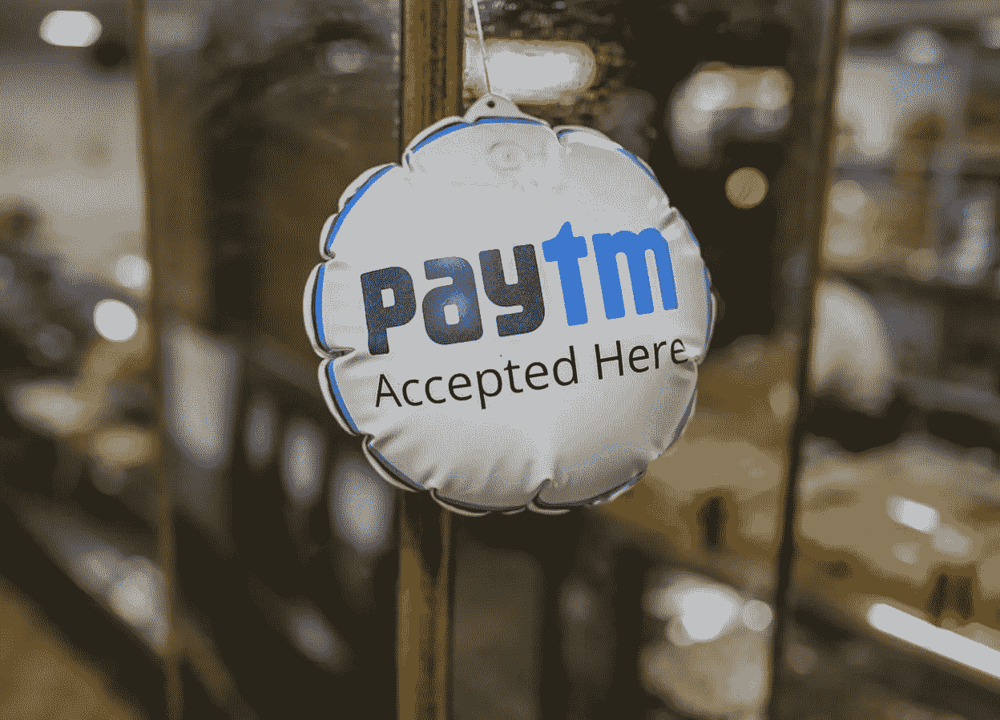
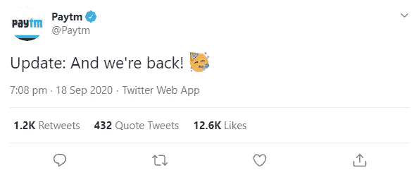

# 谷歌会和 Paytm 说再见吗？

> 原文：<https://medium.datadriveninvestor.com/will-google-say-goodbye-to-paytm-790b4693011d?source=collection_archive---------19----------------------->

## 知道谷歌和 Paytm 之间发生了什么吗

Source: [bloombergquint.com](https://www.bloombergquint.com/)

One97 通信有限公司旗下的支付应用 Paytm 于 2020 年 9 月 18 日被奇怪地从谷歌 Play 商店移除。谷歌提到删除的原因是“*涉嫌违反公司关于在线赌博的规定*”

该政策反对所有将消费者引向外部网站的应用程序，这些网站允许消费者参加付费锦标赛，以赢得真金白银或现金奖励。

谷歌*、*产品、安卓安全和隐私总裁苏珊娜·弗雷维斯(Suzanne FreyVice)在[博客](https://economictimes.indiatimes.com/topic/blogpost)上表示，谷歌不允许在线赌场，也不支持任何促进体育博彩的不受监管的赌博应用。她进一步补充说，谷歌的开发团队已经就这个问题警告了 Paytm 的团队几次，但没有得到纠正。因此作为回应，谷歌不得不删除违反其政策的 Paytm。

 [## 擅长谷歌是一种技能|数据驱动的投资者

### 擅长‘谷歌’是一种技能。是的，你听到了。知道什么和如何谷歌或搜索的东西是一个…

www.datadriveninvestor.com](https://www.datadriveninvestor.com/2020/08/11/being-good-at-google-is-a-skill/) 

然而，Paytm 仍然可供 iOS 用户下载。

Paytm 一被移除，Paytm 团队就发了一条[推文](https://twitter.com/Paytm/status/1306885530697830400)通知所有用户，称“ *Paytm Android 应用暂时无法在谷歌 Play 商店进行新的下载或更新。它很快就会回来。你所有的钱都是完全安全的，你可以像往常一样继续享受你的 Paytm 应用。”*

Source: [Twitter](https://twitter.com/Paytm/status/1306885530697830400)

别忘了，Paytm 应用从未在博文中被明确提及，相反，Paytm 是因违反政策而被删除的众多应用之一。Paytm 是其中之一，因为在印度超级联赛开始之前，它最近推出了“ **Paytm 板球联赛**”，这是一个返现组件，据谷歌称，这违反了他们的赌博政策。

> 毫无疑问，对于已经在设备上安装了 Paytm 的现有用户来说，pay TM 仍然可以使用。但是，说实话，我心里对我的钱的安全性有点担心。

# 接下来发生了什么？

那天晚上晚些时候，Paytm 回到了 Play Store。
Paytm 表示“*我们继续与* [*谷歌*](https://www.livemint.com/technology/tech-news/as-ipl-returns-google-says-it-ll-remove-any-apps-facilitating-sports-betting-11600418766414.html) *合作恢复 app。我们向所有用户保证，他们的余额和关联账户是 100%安全的。我们的服务在所有现有应用程序上都完全可用，您可以像以前一样继续享受 Paytm。*”

Source: [Twitter](https://twitter.com/Paytm/status/1306950821217816576)

Paytm 宣布，它已经删除了返现组件(Paytm 板球联赛)，以遵守谷歌的政策。Paytm 首次游戏在谷歌 Play 商店不可用。

该应用的移除和恢复发生得如此之快，令人惊讶，以至于没有人能够理解 Paytm 和谷歌之间发生了什么。有人说这可能是谷歌和 Paytm 之间的竞争，因为 Paytm 是谷歌支付应用程序 GPay 的竞争对手。而其他人则坚持谷歌关于违反其政策的声明。

由于谷歌在其 Play Store 中占据垄断地位，这是他们对 Paytm 采取的非常随意的行动，这可能会导致关于谷歌权力监管的讨论，特别是在谷歌本身是许多应用程序竞争对手的领域。

请在评论区告诉我你对谷歌的决定有什么看法。

**访问专家视图—** [**订阅 DDI 英特尔**](https://datadriveninvestor.com/ddi-intel)