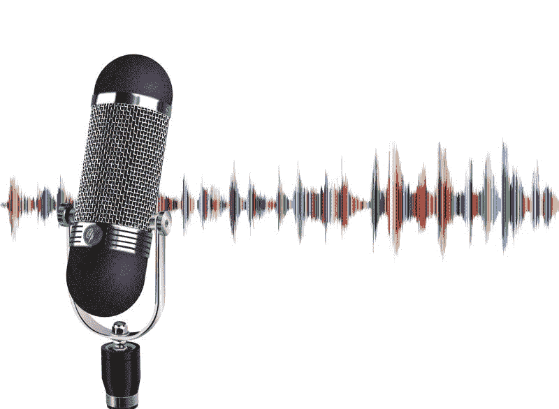
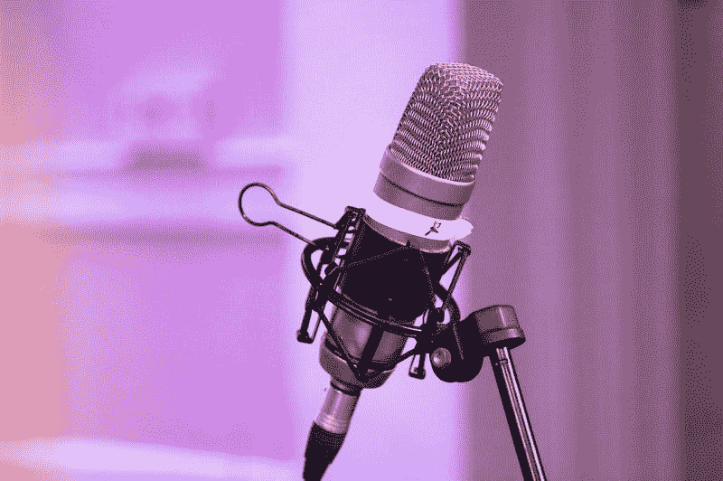
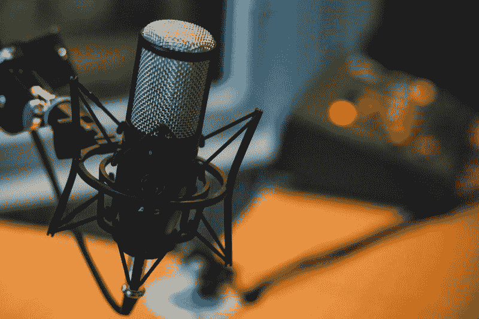
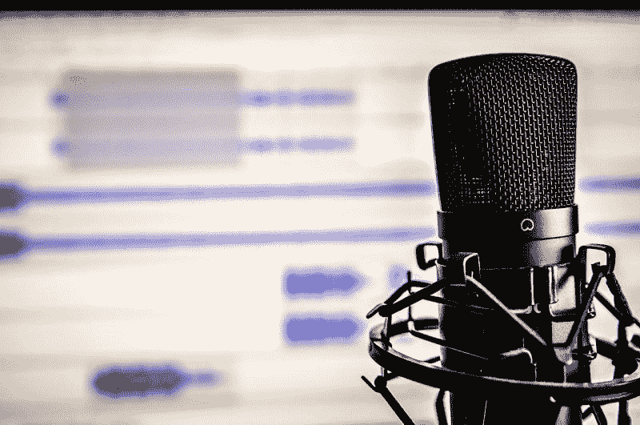
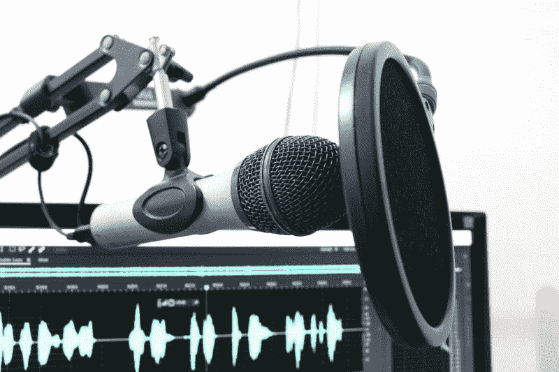
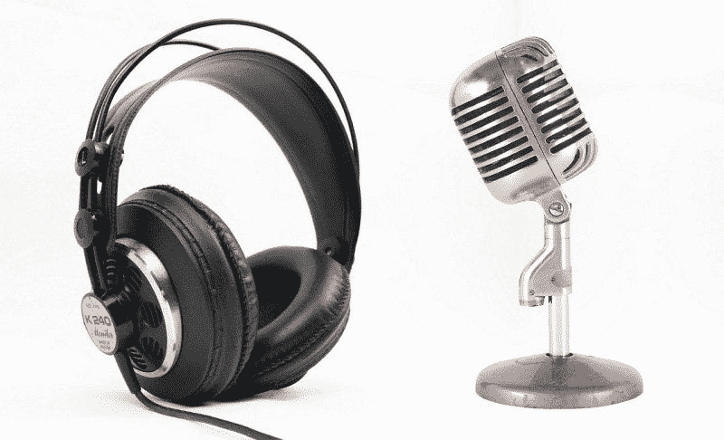

# 乔罗根会给 Spotify 增加价值吗？—市场疯人院

> 原文：<https://medium.datadriveninvestor.com/will-joe-rogan-add-value-to-spotify-nyse-spot-market-mad-house-7cb0e0679872?source=collection_archive---------17----------------------->

Spotify(纽约证券交易所代码:SPOT) 通过与 Joe Rogan 签署独家协议，颠覆了播客和音频世界。

根据协议，Spotify 将成为 T2 乔罗根体验 T3 的独家经销商。这笔交易的价值还不清楚，但是*《卫报》*它可能使罗根成为世界上收入最高的广播公司。然而雅虎体育！这笔交易可能价值超过 1 亿美元。

很容易理解 Spotify 为什么想要罗根。2019 年 9 月，听众每月下载*乔·罗根体验*播客超过 2 亿次，安德鲁·威尔金森在媒体上。

# 为什么 Spotify 想要乔·罗根

此外，罗根的 YouTube 频道有 600 多万用户。令人印象深刻的是，威尔金森估计罗根在 2020 年拥有 1100 万听众。

此外，威尔金森声称罗根每年可以从广告中获得 6400 万至 2.4 亿美元的收入。然而，罗根可以用一些广告换取一些公司的股份。

因此，威尔金森认为罗根可能成为第一个播客亿万富翁。可以预见的是，Spotify 想要分一杯羹。罗根可能拥有音频行业最赚钱的品牌。

# Spotify 是好股票吗？

乔·罗根看好**Spotify Technology SA(NYSE:SPOT)**股票。在他们于 2020 年 5 月 19 日宣布罗根交易之前，市场先生于 2020 年 5 月 15 日支付了 158.83 美元。

相比之下，市场先生在 2020 年 5 月 27 日为 Spotify 支付了 185.95 美元，在 2020 年 6 月 1 日支付了 182.71 美元。因此，市场先生和投资者都是乔·罗根的粉丝。

此外，Spofity 在市场上表现出色。Spotify 在 2020 年 1 月 2 日以 151.62 美元开始，但在 2020 年 5 月 21 日涨到 192.74 美元，并在 2020 年 5 月 27 日跌至 185.95 美元。相反，Spotify 在 2020 年 3 月 23 日跌至 118.18 美元的低点。

 [## 利用股市相关性的最佳方式|数据驱动的投资者

### 当阿尔弗雷德·温斯洛·琼斯开创了世界上第一个“对冲”基金(后来“d”被去掉了)时，他让其他投资者大吃一惊…

www.datadriveninvestor.com](https://www.datadriveninvestor.com/2020/02/02/the-best-way-to-use-stock-market-correlations/) 

所以 Spotify 是一只保值的股票。然而，Spotify 是一家严重依赖明星影响力的娱乐公司。因此，像罗根这样的超级巨星可以通过高额发薪日的形式，从 Spotify 的利润和收入中抽取相当大的一部分。因此，罗根和他的经纪人得到了 Spotify 赚的所有钱。

# Spotify 赚钱了吗？

Spotify 可能即将盈利。特别是，Spotify 报告了截至 2020 年 3 月 31 日的季度运营亏损-18.75 美元。

相反，Spotify 报告称，同一季度的收入为 20，387.1 亿美元，毛利润为 5.2071 亿美元。有趣的是，Spotify 的收入和毛利在 2020 年的前三个月出现了下降。截至 2019 年 12 月 31 日，Spotify 报告季度收入为 20.61 亿美元，季度毛利为 5.2678 亿美元。

理论上，你可以声称 Spotify 赚了一点钱，因为它在 2000 年 3 月 31 日报告了 110 万美元的季度普通收入。这一数字从 2019 年 12 月 31 日的-2.296 亿美元增加到 2020 年 3 月 31 日的-1.6128 亿美元。

# Spotify 产生了多少现金？

Spotify 的平台可以产生现金。事实上，Spotify 报告称，截至 2020 年 3 月 31 日的季度末现金流为 10.49 亿美元。

Spotify 的季度现金流从 2019 年 12 月 31 日的 2.1758 亿美元增长。此外，Spotify 的季度现金流从 2019 年 3 月 31 日的 10.9718 亿美元下降。

然而，Spotify 报告称，2020 年 3 月 31 日的运营现金流为负 993 万美元。这一数字低于 2019 年 12 月 31 日的 2.3032 亿美元和 2019 年 3 月 31 日的 2.3738 亿美元。

我认为斯波菲蒂的运营现金流数字解释了乔·罗根的交易。Spotify 需要久经考验的赚钱机器；比如罗根，因为它的平台赔钱。因此，雇佣罗根对 Spotify 来说是一个明智和负责任的举动。

此外，Spotify 报告截至 2020 年 3 月 31 日的季度融资现金流为 8495 万美元。融资现金流从 2020 年 3 月 31 日的 1.1958 亿美元。我认为融资现金流表明 Spotify 正在借钱支付运营费用。

最后，截至 2020 年 3 月 31 日，Spotify 拥有 18.58 亿美元的现金和短期投资。因此，Spotify 产生了一些现金，但我认为没有证据表明 Spotify 的现金流是可持续的。

# Spotify 有什么价值？

我认为 Spotify(纽约证券交易所代码:SPOT) 可能有很大的价值，因为它的平台令人印象深刻。

截至 2019 年 9 月 30 日，该平台拥有 2.48 亿活跃用户和 1.41 亿广告支持的活跃用户。澄清一下，1.41 亿广告支持的用户并没有为 Spotify Premium 付费。因此，我估计 Spotify Premium 在 2019 年 9 月 30 日有 1.07 亿用户。

Spotify 声称其图书馆包含超过 30 亿个播放列表、5000 万首歌曲和 50 万个播客标题。因此，Spotify 拥有大量可以赚钱的音频内容。

# Spotify 如何赚钱

然而，我怀疑这些内容大部分都没有什么价值。另一方面，如果这 5000 万首歌中的每一首每天都能产生 1₵。我估计 Spotify 每天能赚 50 万美元，每周能赚 350 万美元。这可能导致每月 1400 万美元。

最终，我估计如果每首歌都能产生 1₵.，Spotify 的平台每年可以产生 1.825 亿美元的收入

显然，这些歌曲中的许多一天可以在 1₵上空传播很远。因此，我认为 Spotify 每年仅从歌曲上就能赚几十亿美元。

# Spotify 接下来会雇佣谁？

歌曲和播客的潜在收入解释了为什么 Spotify 正在聘请乔·罗根(Joe Rogan)等明星。

详细来说，罗根是一个公认的音频内容赚钱的人。正如我上面提到的，罗根每月可能有 1100 万听众。

因此，Spotify 合乎逻辑的下一步是雇佣更多有赚钱能力的音频内容创作者。两个最大的音频内容创作者是拉什·林堡和霍华德·斯特恩。

*拉什林堡秀*在 2018 年每月吸引超过 2500 万电台听众，*福布斯*。斯特恩与天狼星 XM(纳斯达克股票代码:SIRI) 卫星广播公司的合同将于 2020 年 12 月到期。

福布斯声称斯特恩正在考虑退休。然而，我认为斯特恩可以推迟退休，如果 Spotify 给他一大笔钱的话。

# Spotify 会聘请哪些明星？

除了林堡，还有广播员、喜剧演员、学者、演员和音乐家。

Spotify 的明显雇员可能是有线电视专家，如塔克·卡尔森、安德森·库珀、雷切尔·玛多和肖恩·哈尼蒂。有线电视是一个垂死的媒体，而播客是一个新兴的媒体。

卡尔森、麦道和汉尼蒂是拥有大量观众的畅销明星。例如，*塔克·卡尔森今夜*2020 年 4 月一夜吸引了 456 万观众，*纽约时报*。同时，*汉尼提*同期吸引了 439 万观众。

卡尔森或库珀可能会跳到 Spotify，以获得更多的钱和更多的自由。例如，安德鲁·威尔金森 CNN 每年付给安德森 1100 万美元，大约是乔·罗根预计收入的五分之一到十分之一。

# 为什么塔克·卡尔森可以追随乔·罗根进入 Spotify

此外，罗根获得了完全的创作控制权，这是卡尔森、库珀和林堡所缺乏的。例如，罗根可以说 F 字，如果他想，采访默默无闻的大学教授，并选择了广告商。

相比之下，林堡、库珀和卡尔森都有可以审查他们的公司老板。此外，库珀和卡尔森的老板可以决定他们采访谁，并控制广告。

最后，罗根有选择广告商的自由。事实上，威尔金森声称罗根可以接受在他的节目中做广告的公司的股份。此外，罗根可以在广告上推广他喜欢的品牌或他支持的慈善机构。福克斯新闻频道或有线电视新闻网可以解雇卡尔森，麦道，或库珀采取了这一步骤。

# Spotify 可以雇佣的喜剧演员

除了有线电视明星，Spotify 还可以聘请许多其他名人。我认为向主要喜剧演员支付播客版权是一个合乎逻辑的举动。

值得注意的是，乔罗根是一个活跃的喜剧演员。此外，喜剧演员是创造吸引观众的有效音频内容的专家。

因此，任何大牌喜剧演员都可以转投 Spotify。此外，现在是 Spotify 与喜剧演员签约的大好时机，因为冠状病毒正在关闭所有现场喜剧场地。

我认为 Spotify 可以招募的大牌喜剧演员包括:大卫·查普尔、杰·雷诺、杰瑞·宋飞、柯南·奥布莱恩和乔恩·斯图尔特等等。我认为喜剧演员可以搬到 Spotify，因为它可以给他们每月录制几个节目的自由，不用旅行就能赚钱。

# 还有谁会跳到 Spotify？

此外，Spotify 可以帮助喜剧演员无需旅行、出席公司活动或主持游戏节目就能赚钱。因此，我预测一些令人惊讶的喜剧演员可能会转移到 Spotify 或其他数字平台。

除了喜剧演员，歌手和音乐家也想要类似的自由。例如，一个明星可以不开演唱会而赚钱并推销她的专辑。值得注意的是，碧昂斯等巨星可以通过为 Spotify 创作独家歌曲来赚钱。

我认为任何音乐行为都可以转移到 Spotify，包括乐队、歌手，可能还有管弦乐队。然而，布兰妮·斯皮尔斯(Britney Spears)等老牌明星将在 Spotify 上占据优势。斯皮尔斯可能会转到 Spotify 的原因之一是推广她的音乐，而无需长途旅行或 DJ 的摸索。

我认为任何音乐行为都可以转移到 Spotify，包括乐队、歌手，可能还有管弦乐队。然而，布兰妮·斯皮尔斯(Britney Spears)等老牌明星将在 Spotify 上占据优势。斯皮尔斯或泰勒·斯威夫特(Taylor Swift)可能转移到 Spotify 的原因之一是推广她的音乐，而不需要到处旅行或 DJ 的摸索。

# Spotify 会收购哪些播客？

最后，我预测 Spotify 及其竞争对手将会疯狂购买播客。

显而易见的播客收购目标包括政治脱口秀，如*播客拯救美国*和*有用的白痴*。一个可能跟随罗根进入 Spotify 的播客明星是电视新闻女记者，转而成为左翼学者[郑秀晶·鲍尔](https://thehill.com/hilltv/rising)。鲍尔以其左翼运动祸害的名声吸引了大批观众。

左翼偶像和电影制作人迈克尔·摩尔是一个播客新手，他可能会得到一大笔钱。摩尔声称听众已经下载了他的*与迈克尔·摩尔*播客超过 1000 万次。

因此，我们可以看到像脸书(NASDAQ: FB)和 Spotify 这样的公司为任何成功的播客开出大额支票。因此，我预测许多明星将推出播客来寻找一个大的发薪日。然而，这些播客中只有少数会繁荣。

# Spotify 是普通人的好股票吗？

归根结底，我认为 **Spotify (NYSE: SPOT)** 是一只有趣的投机股票。然而，我认为没有证据表明 Spotify 的平台是可持续的，或者能够长期盈利。

我认为，缺乏这样的证据和股息使得 Spotify 成为一只糟糕的股票。我认为普通投资者需要避开 Spotify，因为它现在没有收入。

因此，我认为市场先生在 2020 年 6 月 1 日将 Spotify 定价过高，为 182.71 美元。因此，我认为 Spotify 是一种投机性投资，只有承担得起亏损的人才应该购买。

*原载于 2020 年 6 月 1 日*[*【https://marketmadhouse.com】*](https://marketmadhouse.com/will-joe-rogan-add-value-to-spotify-nyse-spot/)*。*