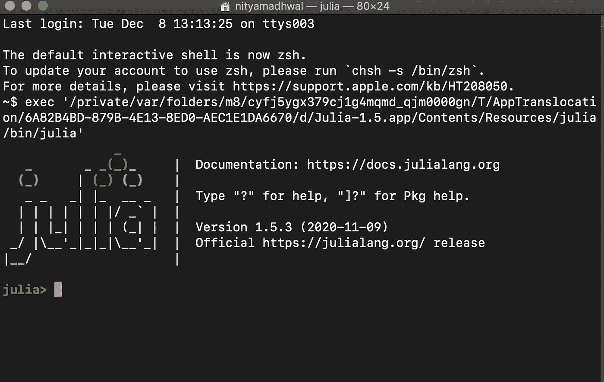
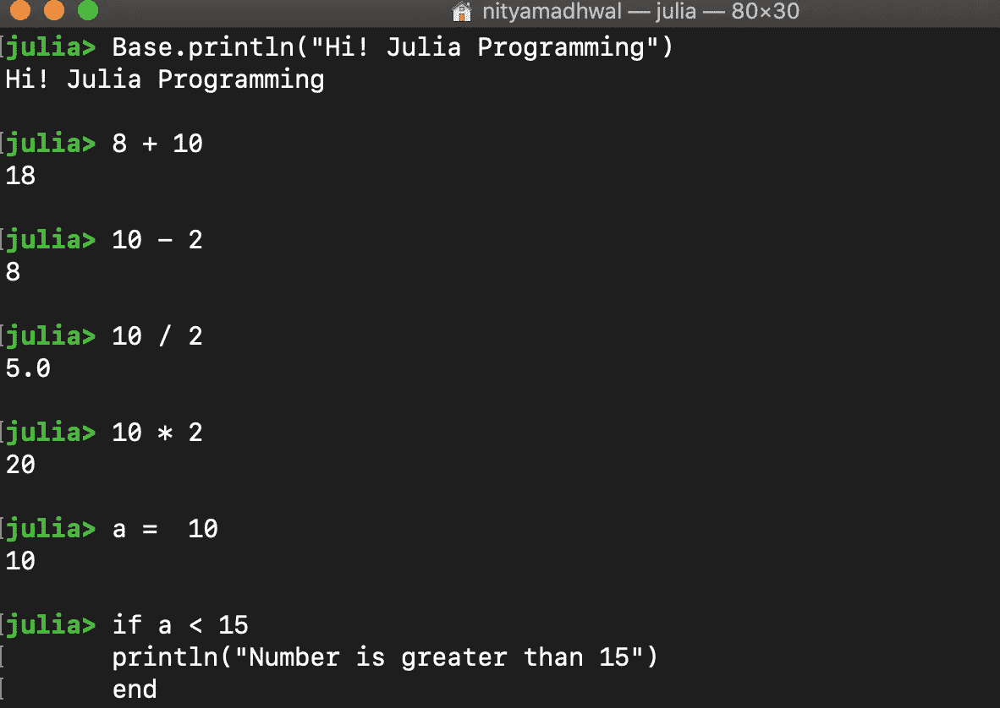
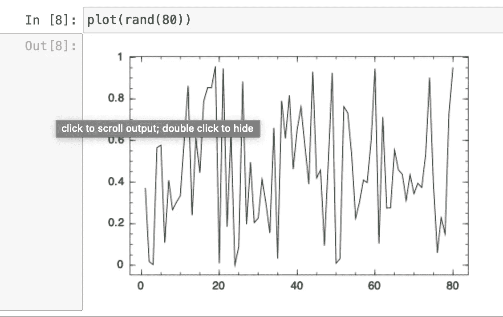

# Julia 编程语言会统治世界吗？

> 原文：<https://medium.datadriveninvestor.com/will-julia-programming-language-ever-rule-the-world-the-ultimate-revolution-b79057201ea4?source=collection_archive---------4----------------------->

## Julia 编程语言初级入门指南


ulia 是一种编程语言，通过编写高性能代码和利用内存资源，为您提供 C 语言的性能。Julia 的优点是:它是开源的，易于使用/学习，提供计算能力/速度，可以用作通用编程语言，并具有并行能力。
朱莉娅拥有现代程序员所追求的一切。

# **茱莉亚的安装**

## 窗口:

先决条件是有 7zip，这样做安装。
和，然后从[https://julialang.org/downloads/](https://julialang.org/downloads/)
下载二进制文件，然后双击下载的二进制文件并按照说明进行操作

## MacOS:

从同一个链接下载二进制文件并安装。这很简单。



使用 github 链接 也可以选择从源代码构建。

一旦你安装并运行了它，你会看到这个视图，这意味着它是成功的，你已经准备好继续 Julia 编程了。REPL (Read Eval Print Loop)是 Julia 为 Python 准备的工作环境。



# 茱莉亚基础:REPL

REPL 工作环境允许输入命令并查看输出。它允许做简单的算术，如加、减、除、变量赋值、if 条件等。Julia 文件将保存为。jl 扩展并使用 Julia <programfilename>调用。</programfilename>

> 为方便编码，请安装 Julia studio 或 Ijulia。我将使用 Ijulia 来获得易于使用的笔记本

# **朱丽娅 vs 其他人**

**MATLAB** : Julia 类似于相同的语法和熟悉度，没有许可费问题和许多通用语言，被证明也更快。

> 朱丽亚是**比所有三位都表现**语言的人。朱莉娅有能力像 R 一样做统计，像 MATLAB 一样做代数，像 PYTHON 一样编译代码。



**茱莉亚的力量**:单指令单输出。在这里，我只是传递随机的 80 个数字来绘制，我们可以看到输出。

# 示例程序了解更多的深度

给定文本文件中字数统计的示例程序:

```
# read the text file
data = open("data_architecture.txt”)# create variable to replace non alpha characters and digits with space 
stopwords = r"(\W\s?)"
rem_digits = r"(\d+)"#created dictionary to store word and count 
freq_word = Dict{ String, Int64}()
```

现在的任务是读取流文件，删除不必要的单词，然后开始统计单词的出现次数。

```
# running over the whole data and counting the word count in dictionary
for line in eachline(data)
    line1 = replace(line, stopwords => ' ' )
    line1 = replace(line1, rem_digits => ' ')
    all_words = split(line1, ' ')
    for words in all_words
        word = strip(words)
        if isempty(word) continue end
        haskey(freq_word, word) ? freq_word[word] +=1 : freq_word[word] = 1
    end
end
```

我们在字典里有这个词及其各自的计数。下一步，按字母顺序排序并打印

```
# sorting the dictionary keys alphabetically and storing 
freq_words = sort!(collect(keys(freq_word)))# going through all the keys and printing the same with their count
for word in freq_words
    println("$word : $(freq_word[word])")
end
```

从文本文件中打印字数的程序结束了。你会注意到的唯一好处是，当你第一次运行程序或函数时，它可能需要时间，但是下一次，它会执行得更快。这就是新编程语言的魅力所在，它们总是强调性能和处理大量数据。

# 内部运作:它是如何运作的！！

LLVM JIT 编译器框架用于编译 Julia 程序并生成机器码。

> LLVM 代表低级虚拟机，JIT 代表实时。

因此，正如我前面提到的，当我们第一次编译代码时，LLVM 代码是由 JIT 编译器生成的。代码生成为本机代码。现在，无论何时调用相同的代码，它都会调用已经编译好的代码。编译代码的步骤会减少，这会提高性能。

# 结论

Julia 是轻量级的，高效的，高性能的，给人高级编程/低级编程的感觉。它是函数式编程，支持元编程。总的来说，Julia 是最新的趋势和快速增长的编程语言，只是缺少 Python，因为它是最大的开发者社区，也是贡献者。朱莉娅是新人，有潜力成为最好的！我希望这将有助于你在学习中再添一枝羽毛。祝新学一切顺利，**快乐编码！**