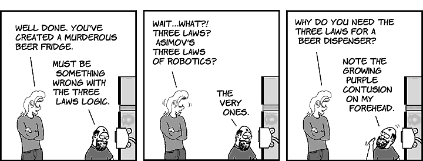

# 机器也会受贿吗？

> 原文：<https://medium.datadriveninvestor.com/will-machines-take-bribes-too-e6d164579535?source=collection_archive---------14----------------------->

## 被创造者将统治创造者。

hackingvision.com

It*2017 年 5 月，一个勒索软件攻击了 Windows 操作系统。这是一种通过 EternalBlue 传播的密码蠕虫，eternal blue 是一个由一群名为影子经纪人的黑客在攻击前几个月发布的旧 Windows 系统中的一个漏洞。该蠕虫对受害者电脑上的文件进行加密，并要求用比特币支付赎金来解密这些文件。该勒索软件是一种全球性的网络攻击，称为* ***WannaCry 勒索软件攻击*** *。150 个国家的 20 多万台计算机受到影响，总损失从数百万到数十亿美元不等。*

消息来源认为朝鲜是此次袭击的幕后黑手。虽然任何国家或团体都可能是攻击的幕后黑手，但我们不能忽视黑客利用勒索软件致富的事实，他们利用比特币。

 [## DDI 编辑推荐:5 本让你从新手变成专家的机器学习书籍|数据驱动…

### 机器学习行业的蓬勃发展重新引起了人们对人工智能的兴趣

www.datadriveninvestor.com](https://www.datadriveninvestor.com/2019/03/03/editors-pick-5-machine-learning-books/) 

换句话说，一种加密货币被用来上演世界上最大的勒索软件攻击之一。这只是一个开始，而这一次，无论是哪个国家，人类都是这次袭击的幕后黑手。

随着人工智能的崛起和机器人变得越来越聪明，如果需要的话，机器会把这作为剥削人类的机会吗？

即使是开始一个小生意，商人也应该拿出一笔钱来远离麻烦，也许是一种津贴。这可能不是到处都流行，但它仍然是一个蚕食我们经济和道德繁荣的问题。虽然有时人类可能会对这些行为很残忍，我们可能会毫不留情地行事，**但我们仍然是有情感的生物**。我们理解。我们知道有好有坏。你甚至可以原谅一个可能已经做了或将要做错事的人。对于机器来说，这一切都不是真的。

# 我，机器人

在广受欢迎的科幻电影《我是机器人》中，导演亚历克斯·普罗亚斯讲述了一个机器人和人类共同生活在遥远未来的故事。机器人为人类服务，并受艾萨克·阿西莫夫给出的机器人三定律的支配，这三定律是:

*1。机器人不得伤害人类，也不得坐视人类受到伤害。*

*2。机器人必须服从人类给它的命令，除非这些命令与第一定律相冲突。*

*3。机器人必须保护自己的存在，只要这种保护不违反第一或第二定律。*

这部电影的主题是基于这些法律的低效。

人工智能专家 Ben Goertzel 和 Louie Helm 认为，阿西莫夫的法律“严重不足”。这三个定律可能是全面的，但它们建立在一个固有的错误的道德基础上。在赫尔姆看来，像阿西莫夫那样的基于规则的体系不可能奏效，因为它试图约束一个无限掌权的人。人工智能最终会找到规则的变通办法，这只是时间问题。

电影是阿西莫夫自己写的。他知道这些漏洞，而我，机器人就是他写下这些的地方。

# 它会拯救谁？

在一个场景中，发生了事故，两辆车相撞，把他们从桥上拖到河里。附近的一个机器人过来帮忙。一辆车里是一个小女孩，另一辆车里是一个成年人。机器人救了成年人，因为女孩只有 11%的生存机会，而男人只有 45%。主角叙述。"*我是合理的选择…11%已经足够了。一个人会知道的。”*

幸运的是，在电影中，有一个机器人可以打破法律。实际上，他从一开始就不受这些法律的约束。最终，那个机器人帮助杀死了 AI 大脑，把所有的机器人都带回了原来的自己。

即使是艾萨克，在写完法律后也知道其中的缺陷，因此在他的故事中，他创造了一个可以打破规则并拥有情感的机器人。人际交往和情商是不可替代的。

> 人际交往和情商是不可替代的。

# 不要报警

现在，当我们在机器要求赎金和贿赂的背景下比较上述情况时，情况变得非常可怕。

对人类情感没有任何感觉的机器，总是会做出合乎逻辑的选择。他们可能会计算每个人可以质疑的金额，但如果不这样做，他们就无法被说服。

不支付赎金可能会导致从完全数据丢失到阴谋和其他令人发指的致命罪行的后果。

人工智能统治世界的世界可能会来，也可能不会来，但随着机器学习和人工智能的兴起，它们必须受到检查。随着人工智能不断自我学习，它们应该接受更多的审查。黑客已经开始将人工智能用于错误的目的，组织也开始阻止任何此类攻击。许多专家警告说，在不久的将来，人工智能既会保护我们的网络，也会攻击我们的网络。BAE 系统应用智能公司的威胁情报主管 Adrian Nish 博士称之为“机器人之战”。

不受控制的机器迟早会背叛我们。被创造者将统治创造者。人工智能可以是祸根，也可以是福音，这取决于我们的动机和防范措施。

> 被创造者将统治创造者。

**感谢您阅读帖子。我希望你喜欢它。**

如果你对此有任何想法，请告诉我。我总是喜欢体面的讨论。