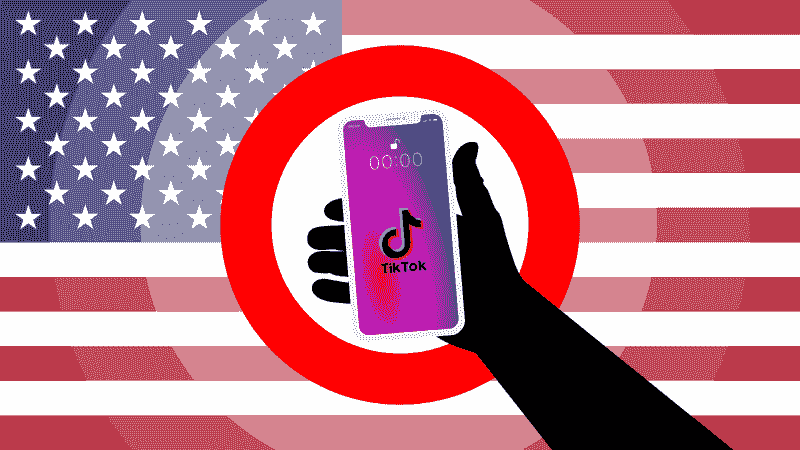
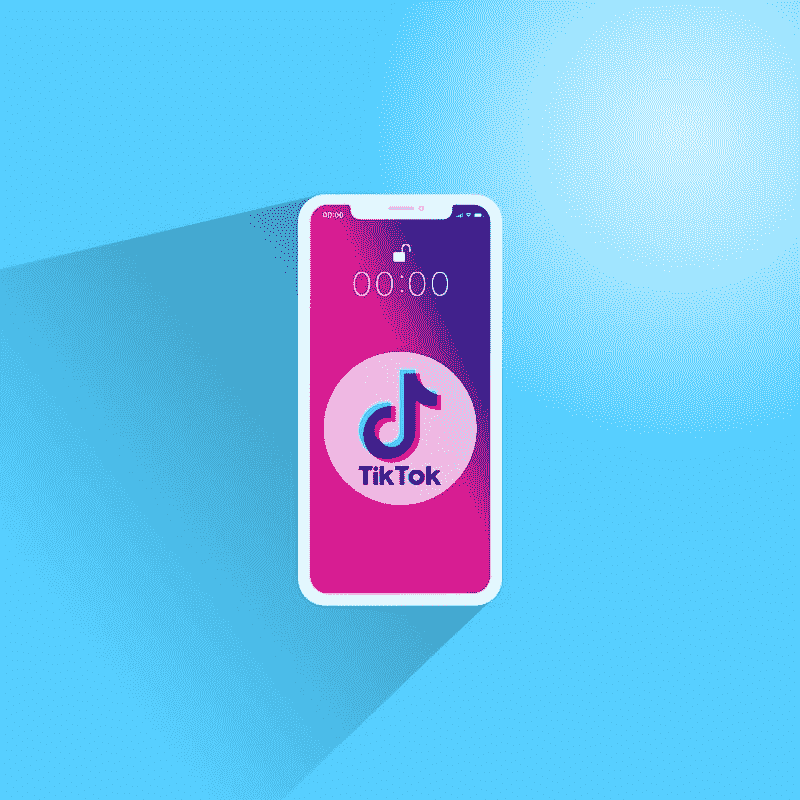
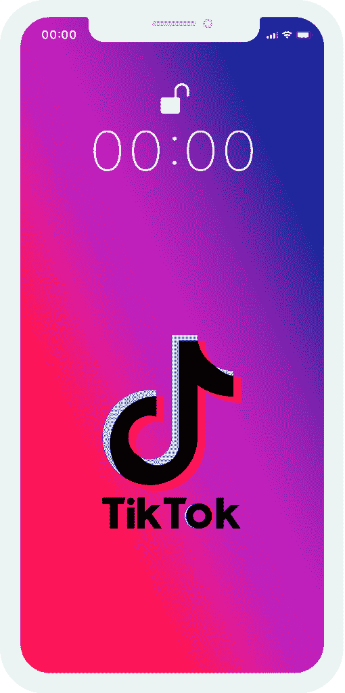

# 甲骨文公司(Oracle)会从抖音环球公司赚钱吗？—市场疯人院

> 原文：<https://medium.datadriveninvestor.com/will-oracle-orcl-make-money-with-tiktok-global-market-mad-house-8281e43cac35?source=collection_archive---------20----------------------->

拉里·埃里森和他的公司认为甲骨文公司可以通过抖音环球公司赚钱。

更详细地说，[甲骨文公司(Oracle)将拥有一家新公司 12.5%的股份](https://www.zdnet.com/article/what-tiktoks-big-deal-means-for-cloud-e-commerce-tiktok-global-created-with-oracle-walmart-owning-20/)， *ZDNET* 声称，该公司将被命名为抖音全球。沃尔玛(纽约证券交易所:WMT) 将拥有抖音环球公司 7.5%的股份，该公司可能会在一年内进行首次公开募股。

ZDNET 声称，作为对抖音全球 12.5%股份的交换，甲骨文将成为抖音的云提供商。**沃尔玛(WMT)** 将利用抖音开展电子商务。

该协议避免了唐纳德·川普总统(佛罗里达州共和党)关闭美国抖音的威胁。[总统于 2020 年 9 月 19 日批准了抖音全球交易](https://www.bloomberg.com/news/articles/2020-09-19/trump-says-he-s-approved-oracle-deal-for-u-s-tiktok-operations?sref=P635h0rP)，*彭博*报道。

此外，Trump 声称，抖音全球将向美国的一个新教育基金提供 50 亿美元。然而，中国的字节跳动有限公司可能拥有抖音全球 80%的股份。彭博声称，抖音全球公司可能是一家总部设在得克萨斯州的美国公司。

截止日期声称，抖音[正在考虑 Instagram 联合创始人凯文·斯特罗姆](https://deadline.com/2020/09/tiktok-global-go-public-in-u-s-under-current-plan-has-approached-instagram-co-founder-kevin-systrom-for-ceo-post-reports-1234579104/)担任抖音全球的首席执行官。字节跳动有限公司对抖音全球公司的估价为 600 亿美元，*彭博*声称。

# 抖音加入甲骨文云

甲骨文首席执行官萨弗拉·卡兹在一份新闻稿中表示:“甲骨文将在甲骨文云中快速部署、快速扩展和运行抖音系统。”。“我们 100%相信我们有能力为抖音提供一个高度安全的环境，并确保抖音的美国用户的数据隐私。”

彭博声称，甲骨文将获得抖音源代码和更新的全部使用权。彭博声称，这种访问可以阻止字节跳动和其他国家利用抖音收集美国客户的情报。注我认为这种说法是不可能的，但是*彭博的*记者相信。

一份新闻稿称，甲骨文、通用、大西洋、红杉、沃尔玛和 Coatue 将利用[抖音全球](https://deadline.com/2020/09/tiktok-global-go-public-in-u-s-under-current-plan-has-approached-instagram-co-founder-kevin-systrom-for-ceo-post-reports-1234579104/)建立一个由人工智能(AI)驱动的在线视频课程。该计划的细节尚不清楚，但我认为该课程可能会大赚一笔。

# 甲骨文和抖音环球能从在线教育中赚钱吗？

特别是，抖音环球可以向公立学校系统出售课程和其他教育材料。这个市场可能是巨大的，因为全国城市联盟(NLC)估计美国有 [13，726 个学区和 1，452 个城市或县学校系统](https://marketmadhouse.com/will-oracle-orcl-make-money-with-tiktok-global/#:~:text=The%20most%20recent%20data%20from,governments%20and%203.033%20county%20governments.)。

我认为视频课程可能是**甲骨文公司**让学校系统使用甲骨文云的好方法。抖音全球的视频课程的一个明显用途将是家庭教育。

抖音全球的视频课程的另一个用途是在公立学校提供大学课程和讲座。甲骨文云基础设施(OCI) IaaS 可以支持抖音全球视频课程。IaaS 代表基础设施即服务(IaaS)。

 [## 国会如何盲目地看待科技公司的未来

### 美国国会召集 4 家大型科技公司的首席执行官在全国电视上表演马戏…

www.datadriveninvestor.com](https://www.datadriveninvestor.com/2020/08/12/how-congress-blindly-sees-the-future-of-tech-companies/) 

甲骨文拥有提供视频内容的经验，因为 [**Zoom(纳斯达克股票代码:ZM)**](https://marketmadhouse.com/is-zoom-nasdaq-zm-making-money/) 将其核心内容建立在甲骨文云中。我不得不怀疑 Zoom、Oracle、抖音全球和沃尔玛是否计划进入 EaaS 市场。EaaS 代表教育即服务。

**Zoom (ZM)** 声称在 2020 年 4 月 22 日，每天有超过 3 亿人参加其视频会议。然而, *The Verge* 声称 Zoom 将该声明从“超过 3 亿的每日用户”改为超过 3 亿的会议参与者。

甲骨文的一个显而易见的收入来源是将抖音环球和 Zoom 的视频能力与甲骨文云相结合。组织可以为其员工、客户或顾客创建加密的专用缩放或抖音频道。

# 甲骨文赚钱了吗？

我认为甲骨文可以从抖音全球获利，因为它从现有业务中赚了很多钱。

例如，截至 2020 年 8 月 31 日，甲骨文报告季度营业收入为 32.11 亿美元，季度毛利为 74.87 亿美元。此外，截至 2020 年 8 月 31 日，甲骨文报告的季度收入为 93.67 亿美元。

然而，甲骨文的季度收入从 2020 年 5 月 31 日的 104.4 亿美元下降。此外，甲骨文的季度毛利从 84.71 亿美元下降，甲骨文的季度营业收入从 2020 年 5 月的 31.16 亿美元下降。

此外，甲骨文报告称，截至 2020 年 8 月 31 日，其季度共同净收入为 22.51 亿美元。这一数字低于三个月前的 31.16 亿美元。

# 甲骨文产生了大量的现金

甲骨文赚钱机器仍然产生大量的现金。例如，甲骨文报告 2020 年 8 月 31 日的季度运营现金流为 59.53 亿美元。甲骨文的季度运营现金流从 2020 年 5 月 31 日的 36.14 亿美元。

引人注目的是，甲骨文公司在 8 月 31 日公布的季度末现金流为 272.76 亿美元。甲骨文季度末现金流从 2020 年 5 月 31 日的 134.10 亿美元。

最后，截至 2020 年 8 月 31 日，甲骨文拥有 422.79 亿美元的现金和短期投资。甲骨文的现金和短期投资从 2020 年 5 月 31 日的 43.057 亿美元下降到 2020 年 2 月 29 日的 258.58 亿美元。

# 甲骨文是一项价值投资

我认为甲骨文(纽约证券交易所代码:ORCL) 是一个很好的价值投资，有巨大的增长潜力，因为它持有抖音全球 12.5%的股份。

我认为市场先生在 2020 年 9 月 21 日低估了甲骨文每股 60.82 美元。在 2020 年，甲骨文经历了适度的份额增长，甲骨文在 2020 年 1 月 2 日以 53.95 美元开始 2020 年。

我认为市场先生低估了甲骨文，因为甲骨文在 2020 年 8 月 31 日公布的总资产为 1135.46 亿美元。甲骨文的资产价值从 2020 年 2 月 29 日的 967.04 亿美元增长，但从 2020 年 5 月 31 日的 1154.38 亿美元下降。

我认为甲骨文是一只很好的股息股，因为它将在 2020 年 10 月 22 日支付 24₵季度股息。总体而言，Dividend.com 估计甲骨文在 2020 年 9 月 18 日支付了 96₵年度股息和 1.60%的股息收益率。

# 甲骨文为什么想要抖音全球

很容易理解为什么**甲骨文公司**想要抖音全球。甲骨文的收入停滞不前。

斯托克罗估计[甲骨文在截至 2020 年 8 月 31 日的季度收入增长 1.62%](https://stockrow.com/ORCL/financials/income/quarterly) 。然而，在截至 2020 年 5 月 31 日的季度中，甲骨文的收入增长下降了 6.26%。因此，冠状病毒侵蚀了甲骨文的收入增长。

我认为，甲骨文需要实现更强劲的收入增长，才能在当今市场上取得成功。然而，甲骨文管理层正在采取措施实现收入增长。抖音全球交易以及与 ZM Zoom、WMT 沃尔玛和 T9 日益增长的联盟将带来收入增长。

我认为不管有没有抖音环球，甲骨文都是一项价值投资。然而，我认为甲骨文可以成为抖音全球的增长投资。

*原载于 2020 年 9 月 21 日*[*【https://marketmadhouse.com】*](https://marketmadhouse.com/will-oracle-orcl-make-money-with-tiktok-global/)*。*

**访问专家视图—** [**订阅 DDI 英特尔**](https://datadriveninvestor.com/ddi-intel)