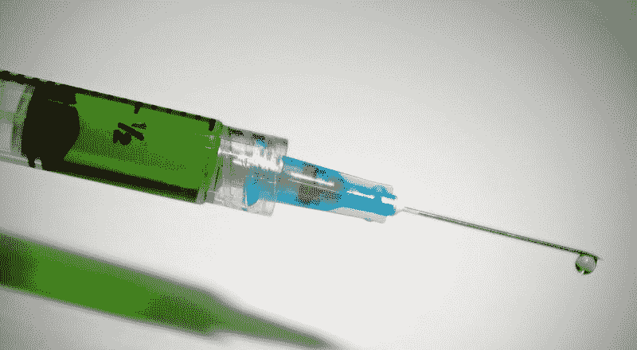
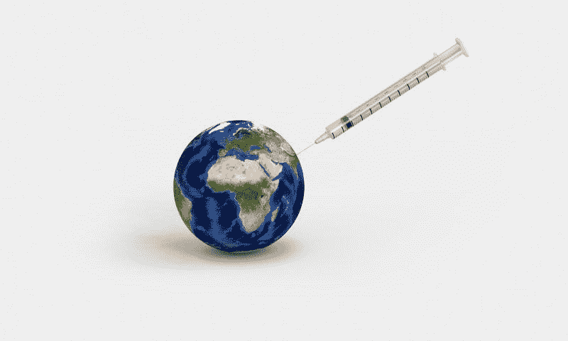
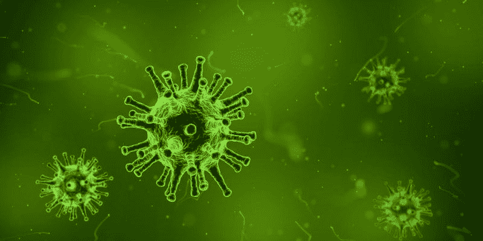
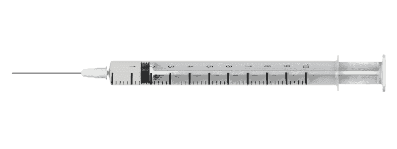

# 辉瑞会从冠状病毒疫苗中赚钱吗？—市场疯人院

> 原文：<https://medium.datadriveninvestor.com/will-pfizer-make-money-from-a-coronavirus-vaccine-market-mad-house-7a6048c71996?source=collection_archive---------15----------------------->

辉瑞公司(纽约证券交易所股票代码:PFE) 可以通过一种新的疫苗来利用冠状病毒。辉瑞和 **BioNTech SE (NASDAQ: BNTX)** 正在测试一种新冠肺炎疫苗。

*Stat News* [声称](https://www.statnews.com/2020/07/01/covid-19-vaccine-from-pfizer-and-biontech-shows-positive-results/)这种疫苗能产生抗新型冠状病毒或新冠肺炎病毒的抗体。此外，这些抗体阻止新冠肺炎病毒在接种疫苗的人体内发挥作用。

据 Stat News 报道，辉瑞公司和 BioNTech 公司的疫苗是基于信使 RNA 技术。信使 RNA 使用一种关键的遗传信使来产生蛋白质。这种蛋白质“教导”人类免疫系统抵抗新型冠状病毒病毒。

# 辉瑞宣布新冠肺炎 RNA 疫苗候选人

重要的是，辉瑞和 BioNTech 发布了一篇论文，其中包含了一些关于该疫苗的临床数据。消极的一面是，科学家没有对论文进行同行评议。*

详细地说，该论文描述了在 18 至 55 岁的成人中进行的“新冠肺炎 RNA 疫苗候选物(BNT162b1)”的免疫学阶段研究。* "然而，这篇论文只是关于疫苗初步研究的初步结果的中期报告。

因此，辉瑞没有新冠肺炎疫苗。相反，辉瑞有可能成为新型冠状病毒疫苗的第一块基石。

# 辉瑞和 BioNTech 会从冠状病毒疫苗中赚钱吗？

我认为新冠肺炎疫苗可以帮助辉瑞和 BioNTech 赚很多钱。为了解释这一点，政府将使用税收为其公民购买数亿剂疫苗。

例如，美国政府可以为其 3.31003 亿公民购买超过 3.31 亿剂疫苗。此外，中国政府可以为中国 143.9 万公民订购 15 亿剂疫苗。

此外，印度政府可以为印度 13.8 亿公民购买 14 亿剂 BNT162b1。此外，欧盟可以为其 4 . 46 亿居民购买 4 . 46 亿剂疫苗。

# 冠状病毒疫苗可能使辉瑞成为一项完美的价值投资

由于冠状病毒正在肆虐，政府将购买疫苗并强制人们接种。事实上，Worldometers [估计](https://www.worldometers.info/coronavirus/)截至 2020 年 7 月 2 日，全球已有 1085 万例冠状病毒病例和 519980 例新冠肺炎死亡。

我认为政府会给每个人接种疫苗，因为治疗所有冠状病毒受害者的费用很高。此外，由于冠状病毒，国家和经济正在损失令人难以置信的大量金钱。

国会预算办公室(CDO)估计，由于冠状病毒，美国经济在未来十年可能会萎缩超过 10 万亿美元。因此，对冠状病毒疫苗的耐药性可能是经济和政治上的自杀。

因此，辉瑞可以开发政府购买并强制公民使用的产品。因此，辉瑞的疫苗可能有无限的市场。我认为冠状病毒疫苗可以使辉瑞成为一项完美的价值投资。

# 辉瑞可能是一项价值投资

**辉瑞公司(纽约证券交易所:PFE)** 可能是一项价值投资，因为它价格便宜，并提供巨大的增长潜力。例如，2020 年 7 月 6 日，市场先生以 34.46 美元的价格购买了辉瑞的股票。

而且，辉瑞股价稳定。辉瑞在 2020 年 1 月 2 日以 39.14 美元开始，在 2020 年 3 月 23 日跌至 28.49 美元，在 2020 年 7 月 2 日升至 34.60 美元。因此，辉瑞是一只便宜且稳定的股票。

此外，辉瑞公司于 2020 年 6 月支付了 38₵季度股息。2020 年，2₵的股息有所增长。具体而言，辉瑞于 2019 年 3 月 7 日支付了 36₵股息，该股息于 2020 年 7 月 30 日升至 38₵。

Dividend.com 估计，到 2020 年 7 月 9 日，辉瑞提供的年化股息为 1.52 美元，未来股息收益率为 4.65%，派息率为 58.08%。因此，辉瑞是一个稳定的股息股，具有难以置信的增长潜力。

# 辉瑞赚钱了吗？

目前，辉瑞公司赚了很多钱。例如，在截至 2020 年 3 月 31 日的季度中，辉瑞从 120.28 亿美元的收入中获得了 96.40 亿美元的毛利。

然而，Stockrow [估计辉瑞的收入增长在上个季度下降了-8.31%。此外，在截至 2019 年 12 月 31 日的季度中，辉瑞的收入增长下降了-9.22%。因此，辉瑞的增长潜力正在下降。](https://stockrow.com/PFE/financials/income/quarterly)

另一方面，辉瑞的季度营业收入从 2019 年 12 月 31 日的 15.36 亿美元增长至 2020 年 3 月 31 日的 40.99 亿美元。有趣的是，辉瑞的收入在增长，而其赚钱潜力却在下降。

然而，辉瑞的管理层正在采取措施增加其赚钱的潜力。特别是，辉瑞公司正在研制一种针对世界上最具破坏性的病毒新冠肺炎的疫苗。

# 辉瑞公司能产生多少现金？

最后，辉瑞产生了大量的现金。例如，辉瑞报告 2020 年 3 月 31 日的季度末现金流为 21.96 亿美元。该现金流从 2019 年 12 月 31 日的-14.96 亿美元增长。

此外，辉瑞报告 2020 年 3 月 31 日的季度运营现金流为 31.33 亿美元。这一数字低于 2019 年 12 月 31 日的 37.69 亿美元，但高于 2019 年 3 月 31 日的 16.98 亿美元。

令人印象深刻的是，截至 2020 年 3 月 31 日，辉瑞拥有 103.50 亿美元的现金和短期投资。这一数字从 2019 年 12 月 31 日的 98.3 亿美元增加到 2019 年 3 月 31 日的 116.19 亿美元。

因此，**辉瑞公司(纽约证券交易所代码:PFE)** 是一家现金充裕的公司，具有很高的增长潜力，股价低廉，股息丰厚。因此，我认为那些寻求稳定的、有增长潜力和收入的股票的人需要调查辉瑞。

辉瑞公司赚钱，支付股息，产生现金，并提供稳定的股价。此外，辉瑞公司可以销售一种具有惊人增长潜力的产品:新冠肺炎疫苗。

*[https://www . medrxiv . org/content/10.1101/2020 . 06 . 30 . 20142570 v1 . full . pdf](https://www.medrxiv.org/content/10.1101/2020.06.30.20142570v1.full.pdf)

*原载于 2020 年 7 月 6 日 https://marketmadhouse.com***。**