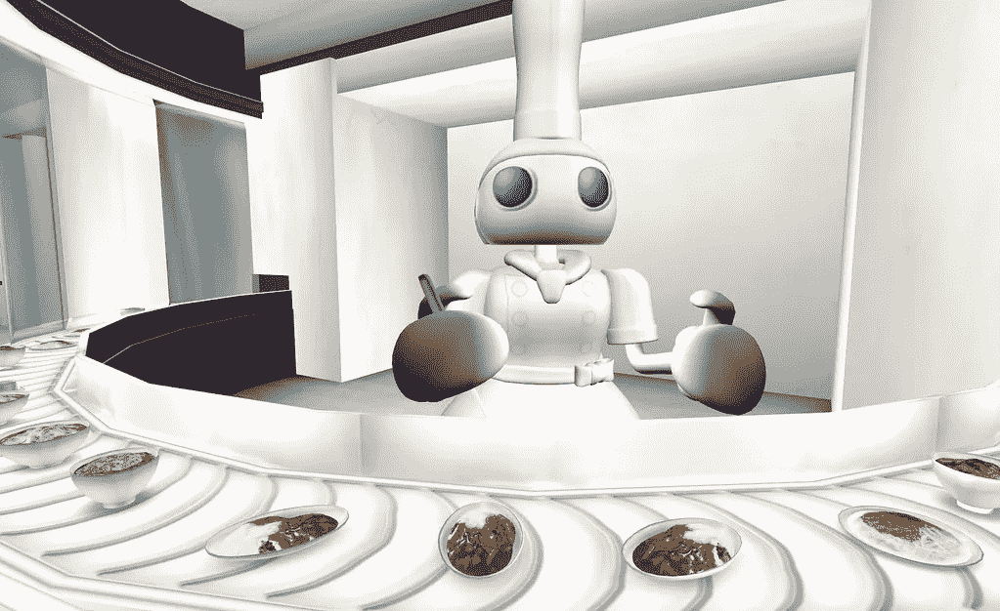
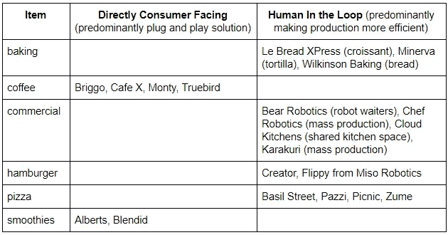

# 机器人会接管我们的餐馆吗？启动视图

> 原文：<https://medium.datadriveninvestor.com/will-robots-take-over-our-restaurants-a-startup-view-d1086e44372f?source=collection_archive---------9----------------------->

Tau Ventures 是硅谷的一家应用人工智能基金，食品自动化是我们的核心关注点之一，包括对 Blendid 的投资。[我们在 2019 年 11 月](https://www.linkedin.com/pulse/food-automation-tidal-wave-startups-amit-garg/)的观点是，资本充足，自动化不会取代而是增加人类，真正的节约来自规模经济。

从那以后，这个行业发生了巨大的变化。有一些主要的进入者，例如优步创始人[特拉维斯·卡兰尼克的云厨房变得更加公开(据说筹集了 4 亿美元)](https://www.businessinsider.com/uber-travis-kalanick-saudi-arabia-funding-cloud-kitchens-delivery-2019-11)。已经有一些重大的失败，例如，Zume pizza 从软银那里筹集了 3 . 75 亿美元，但实际上还是破产了。最重要的是，全球化的疫情摧毁了餐饮业。

那么机器人会不会接管食物呢？这篇文章提出了我们的三个核心信念。

**1)机器人=生产是，配送是，服务否**

今天的机器人擅长特定的任务——切菜、削土豆、煎汉堡——但不擅长在不受约束的环境中操作。你甚至可以给他们大量的训练数据来扩展他们的效用，但仍然在一个紧密的结构内。能够像人类一样完全照顾好一个顾客，还需要很长时间。来自 Chef Robotics 的 Rajat Bhageria 最近在 TechCrunch 上发表了一篇挑衅性的文章，为那些有兴趣进一步探索的人更深入地讨论了食品自动化中狭义和广义人工智能的主题。

在 Tau，我们相信自动化将越来越有助于食品生产，尤其是大规模生产。还有配送，不管是类似于自动售货机，还是通过点对点配送把食物完全送到你家。生产和分销加起来往往超过总成本的一半，疫情强调了对可追溯性和供应链可见性的需求。

自动化最不能帮助的是服务，因为坐下来吃饭的餐厅的吸引力很大一部分是整体体验，包括氛围。我们具体谈论的是中高端餐厅，而不是快餐休闲餐厅，在那里，我们看到幽灵厨房和办公室外卖变得越来越普遍。我们的观点是，坐下来的模式目前基本上处于停顿状态，并将不可避免地卷土重来，即使自动化无法对其有重大帮助。

 [## 论机器人权利:机器人可以被奴役吗？数据驱动的投资者

### 人们可以随心所欲地对待他们的机器人吗？一个人可以对他们的机器人“暴力”吗？机器人应该是…

www.datadriveninvestor.com](https://www.datadriveninvestor.com/2020/02/13/on-robot-rights-can-robots-be-enslaved/) 

**2)更多的创业公司，不仅仅是降低成本**

[根据 Pitchbook](https://pitchbook.com/news/articles/how-the-changing-restaurant-industry-has-shaped-investors-appetite-for-food-and-robotics-video) ，2019 年食品科技世界在全球 440 项交易中获得了 135 亿美元的风险投资。2020 年肯定会是显著低迷的一年，交易和资本都将减少，但在 Tau，我们相信食品自动化的相对比例将会增加，其中一些将会持续很长时间。总的来说，我们不认为疫情创造了压倒性的新环境，而是加速了长期趋势。降低成本始终是自动化背后的一个驱动力，并且一直如此，但除此之外还有对更多的需求

*   安全性——非接触式制备降低了污染风险，也有可能提高供应链的安全性[，那里的风险特别高](https://www.wired.com/story/why-meatpacking-plants-have-become-covid-19-hot-spots)
*   便利——幽灵厨房有助于送货
*   创新——例如，Minerva 使用不同的原材料和新颖的工艺制作玉米饼

对于一个空间的发展势头来说，一个好的信号是有多个创业公司瞄准相似的市场，即使按照下面的框架有相似的走向市场。需要注意的是，几乎从定义上来说，框架是帮助分析的指导方针，而不是非黑即白的事实。

**3)消费自动化还很遥远**

我们的观点是，食品自动化距离真正渗透到我们的家庭还需要几年的时间。在计算机领域，在个人电脑变得足够重要之前，我们已经有大型机和小型机几十年了。推动这种采用的部分原因是，个人电脑从根本上提高了人们的工作效率，事实上让我们能够完成以前甚至不可能完成的任务。食品自动化的情况就不一样了，事实上，想想烹饪中根深蒂固的传统，以及它与个人、家庭和社区的关系。是的，我们有一些自动化，从冰箱到烤箱，微波炉到搅拌机，但它们远远达不到企业的自动化水平。在家庭厨房中，成本和家务并不重要。

以前，工业机器人会接触工厂，现在他们开始接触餐馆，提供大多数白色标签和联合品牌的模型。少数公司可能会成功创建自己的品牌，但这将是非常资本密集型的。因此，当我们寻找食品自动化领域的投资时，我们会直接询问与 CAC 和 LTV 相关的问题，同时也会询问业务规模的基本情况，尤其是与单位经济相关的问题。

*感谢* [*杨欣怡*](https://www.linkedin.com/in/cynthiayeung/) *和* [*胡安·罗西洛*](https://www.linkedin.com/in/jrrosillo/) *的反馈。原载于“* [*”数据驱动投资人*](https://www.datadriveninvestor.com/2020/06/21/will-robots-take-over-our-restaurants-a-startup-view/) *，“我很乐意在其他平台辛迪加。我是*[*Tau Ventures*](https://www.linkedin.com/pulse/announcing-tau-ventures-amit-garg/)*的管理合伙人和联合创始人，在硅谷有 20 年的从业经验，涉足企业、个人创业和风险投资基金。这些都是专注于实践见解的有目的的短文(我称之为 GL；dr —良好的长度；确实读过)。我的许多文章都在 https://www . LinkedIn . com/in/am garg/detail/recent-activity/posts**上，如果它们能让人们对某个话题产生足够的兴趣，从而进行更深入的探讨，我会感到非常兴奋。如果这篇文章有对你有用的见解，请对文章和 Tau Ventures 的 LinkedIn 页面* *上的* [*发表评论和/或给予赞，感谢你对我们工作的支持。这里表达的所有观点都是我自己的。*](https://www.linkedin.com/company/tauventures)

**访问专家视图—** [**订阅 DDI 英特尔**](https://datadriveninvestor.com/ddi-intel)