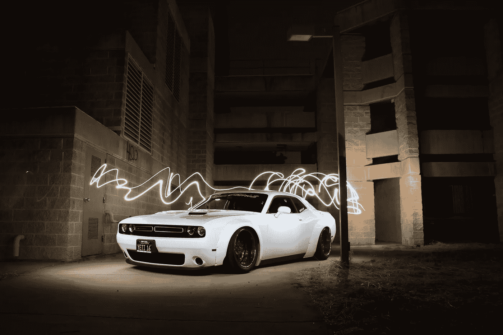
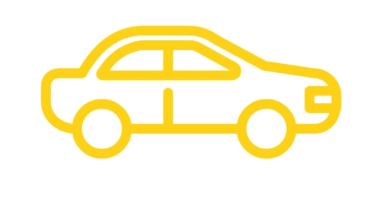
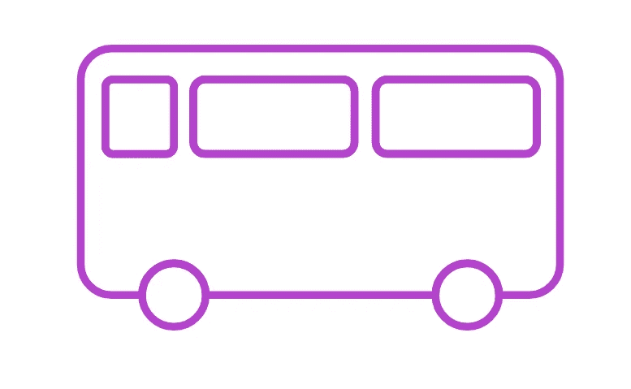
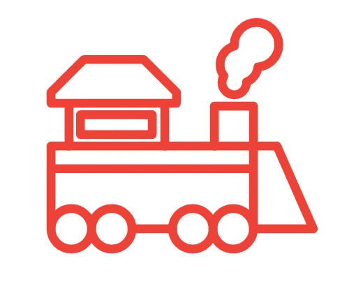
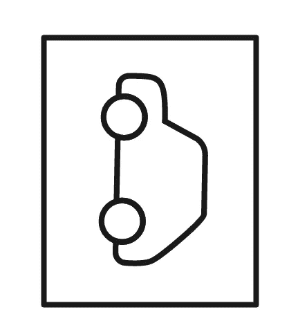
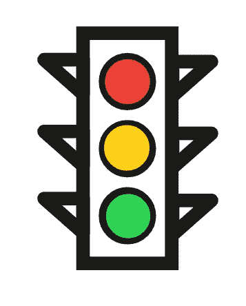
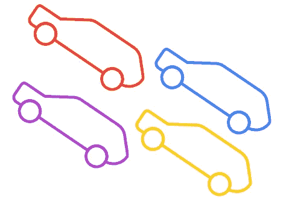

# 2023 年及以后自动驾驶汽车的未来

> 原文：<https://medium.datadriveninvestor.com/will-siri-ever-drive-me-to-work-9827f82df533?source=collection_archive---------18----------------------->

## Siri 会开车送我去上班吗？

Photo by [Cesar Perez](https://www.pexels.com/@cesarperez209?utm_content=attributionCopyText&utm_medium=referral&utm_source=pexels) from [Pexels](https://www.pexels.com/photo/white-sports-coupe-733745/?utm_content=attributionCopyText&utm_medium=referral&utm_source=pexels)

# 自动驾驶汽车何时才能真正为公众做好准备？

> “当我把我的两个孩子丢在那里的时候”——[Zoox](https://en.wikipedia.org/wiki/Zoox_(company))的首席执行官艾莎·埃文斯

在过去的几年里，自动驾驶汽车(也称为自动驾驶汽车的 [AV](https://en.wikipedia.org/wiki/Self-driving_car) )已经成为一个热门话题。

**为什么？**

因为如果他们能掌握正确的技术——看起来他们很快就会完成——AV 行业有潜力改变我们日常生活的许多方面。

我不会轻易说出最后一句话。

下面来看看自动驾驶车辆将会以许多有趣而奇怪的方式影响我们的未来。

Image adapted from Google autodraw.com under Creative Commons Attribution 4.0

# 分队

当人们听到自动驾驶汽车时，他们通常首先想到的一件事是它们取代出租车的潜力。

他们称之为“机器人出租车”——它们很快就会出现在你的附近。

即使出现了优步和类似的服务，出租车在世界范围内仍是一个巨大的行业。据估计，仅在 2020 年，美国就有 320 亿美元的产业，而且还在增长(除非 COVID 受挫)。

尽管人们对优步时代及其对交通的影响有很多复杂的感觉，但相比之下，向自动化车辆的大规模转移将是世界末日。

据估计，目前优步有超过 390 万名司机，这还不包括其他服务，如 Lyft、Grab 或传统的出租车和豪华轿车公司。

这意味着很多人可能会失业。

> 他们会怎么做呢？

我有一种感觉，随着更多这样的技术变得可用，未来几年普遍基本收入的论点可能会变得更强。

Image adapted from Google autodraw.com under Creative Commons Attribution 4.0

# 货车运输业

在卡车旁边的高速公路上开车，你感觉舒服吗？我从来没有——尤其是当他们超车或者超速行驶的时候。

我们都看过那些可怕的新闻故事，大卡车连环相撞。太可怕了。

但是，如果你看向你的右边，透过卡车的窗户看到地平线，却看不到通常卡车司机的侧面，你会有什么感觉？

卡车运输在我们的经济中是一项极其重要的服务。几乎我们所有的食品和产品都是由这些长途司机运输的。

350 万卡车司机**将会如何就业？**

****

**Image adapted from Google autodraw.com under Creative Commons Attribution 4.0**

# **公共汽车**

**公共交通是另一个成熟的自动化替代领域。**

**但是就像卡车一样，公共汽车是笨重的大型交通工具。和卡车一样，它们的目的是长距离运输货物——在这里是指人。**

**这对程序员来说需要额外的小心和潜在的问题。**

**城市公共汽车和长途汽车将面临不同的问题。城市公共汽车天生就有几十个站点的大型路线。他们还必须为路上的行人、骑自行车的人和车辆导航，以便在公共汽车站停车。**

**所有这些都给设计未来汽车的人带来了更多的问题，但看起来他们已经接近解决这些问题了。**

****

**Image adapted from Google autodraw.com under Creative Commons Attribution 4.0**

# **飞机**

**很难想象，但他们也在致力于自动化天空中的大型钢铁鸟。我们的大型客机在某些功能上已经[完全自动化了。](https://www.ansys.com/blog/self-flying-planes-vs-autonomous-aircraft)**

**我相信你也知道我们有无人驾驶的军用无人机，尽管背后有一个[人类控制器](https://en.wikipedia.org/wiki/General_Atomics_MQ-1_Predator)。**

**在没有飞行员的情况下，他们改造客机让我们也能飞来飞去只是时间问题。**

**虽然我有一种感觉，社会可能需要一点时间来接受这一点。很多人坐飞机已经够紧张的了。**

****

**Image adapted from Google autodraw.com under Creative Commons Attribution 4.0**

# **火车**

**我甚至坐过新加坡无人驾驶的机场火车。我没有任何恐惧，因为它在不同的航站楼之间缓慢移动。**

**尽管如此，我记得有一天我意识到没有司机座位。**

**我突然想到，我曾经坐过几次同一列火车，而且是在它的两端。除了窗户和墙什么都没有。一种奇怪的感觉，但我比任何事情都印象深刻。**

**当我发现这个系统从 1990 年就开始[运行的时候，我更加震惊了！什么…](https://en.wikipedia.org/wiki/Changi_Airport_Skytrain)**

**大多数火车都按非常明确的时刻表运行。**

** [## 创新农场和先锋精神:所有组织(和你)都需要在…

### “首席数字官”和“首席转型官”是组织目前的新管理角色…

www.datadriveninvestor.com](https://www.datadriveninvestor.com/2020/08/13/innovation-farm-and-a-pioneers-spirit-all-organization-and-you-need-to-still-have-a-say-in-the-future/) 

你有机会乘坐时速超过 220 英里的高铁吗？看着风景从你身边飞过，同时还能看到车站里绝对精确的停车点，这真他妈的酷。

这种类型的运输有助于实现自动化，因为它的时间表非常严格，而且导致事故的未知因素更少(与其他类型的运输相比)。** ****

**Image adapted from Google autodraw.com under Creative Commons Attribution 4.0**

# **死亡**

**受影响的不仅仅是技术，这些进步还会带来很多副作用。**

**一个很大的变化是许多不同地区的死亡人数会减少。**

**如果无人驾驶技术没有被证明是非常安全的，政府是不会允许它在我们的道路、天空和轨道上广泛使用的。**

**但话说回来，在这种情况下什么是安全的？**

**2015 年，每 1 亿英里驾驶的平均死亡人数约为 1.03 人(在那一年疯狂的 31.13 亿英里驾驶总数中)。**

**与造成任何伤害的事故相比(据报道)，这一数字高达每 1 亿英里驾驶 201 起事故。**

**如果无人驾驶汽车勉强超过这些分数，你的政府会允许它上路吗？还是他们需要更接近 100%的安全等级。**

**如果这些指标的可接受率必须达到接近 1–10%的水平才能被认为是可接受的，我不会感到惊讶。**

**无论哪种方式，如果它高于人类的水平——并且始终如一——人类社会将遭受更少的事故和交通伤害死亡。**

**这项技术的一个非常好的副作用。**

****

**Image adapted from Google autodraw.com under Creative Commons Attribution 4.0**

# **犯罪**

**Siri 会向警察告发你吗？**也许吧。****

**这可能取决于各个政府对汽车制造商的要求。**

*   **如果我在虚拟方向盘后面吸食非法物质，Siri 会打 911 吗？**
*   **如果我在做爱呢？**
*   **如果我被袭击了呢？**
*   **在某些情况下，Siri 怎么知道它们之间的区别呢？**

**你也可以和汽车大盗的指控说再见了——至少在这个术语的旧意义上。也许邪恶的黑客会开发出新的方法来偷车。**

**但即使这样，由于所有的跟踪、云软件和额外的自动化，很难认为这仍然是一个主要问题。**

**但这引出了最后一个可怕的问题。**黑客攻击。****

**如果一个载满乘客的航空公司被数字恐怖分子以某种方式入侵会发生什么？或者一个繁忙的城市的交通网络现在充满了自动化车辆？它们会导致每个人都全速开车撞向对方吗？他们能劫持重要人物的汽车并把他们扣为人质或暗杀他们吗？**

**见鬼，他们甚至可以把家庭越野车变成一辆装有炸弹的遥控汽车。**

**乐趣在 [GTA V](https://en.wikipedia.org/wiki/Grand_Theft_Auto) ，不在现实生活中。**

****

**Image adapted from Google autodraw.com under Creative Commons Attribution 4.0**

# **劳动市场**

**你可能猜到这将在列表中。我们谈论的是成千上万的人失去了他们现在的工作。**

**社会需要找到另一种方法让他们继续工作——或者至少不要让他们变得一贫如洗。**

**技术变革总是伴随着劳动力市场的挑战。**

**从工厂、农场到电话(那些可怜的信鸽)——人们需要适应。**

**在这方面，政府的解决方案往往千差万别，而且在过去确实没有一个完美的解决方案。**

**再培训、教育补助和工作重新分配只是解决方案的一部分，但它肯定不能帮助所有人。**

**我不认为你爷爷想学习如何用 Python 编写 IF 语句。**

****

**Image adapted from Google autodraw.com under Creative Commons Attribution 4.0**

# **交通规则**

**这项技术会走多远？**

**想象一个无人驾驶汽车采用率接近 100%的未来有那么难吗？**

**当然，人们会对不能开着他们的 4x4 吉普车到处跑感到愤怒——在这种情况下，你怎么能给[吉普车挥手](https://www.urbandictionary.com/define.php?term=Jeep%20Wave)？**

**但是你最后一次发现自己在高速公路上和一匹马并排行驶是什么时候？人们仍然使用马匹，但不是他们传统的方式。**

**我相信手动驾驶的汽车仍将存在，但我想更多的是出于娱乐目的，而不是主流。**

****注意:我确实曾经在高速公路上(在肩膀上)被很多马开过——我在加拿大的一个大型门诺派社区附近长大。***

****

**Image adapted from Google autodraw.com under Creative Commons Attribution 4.0**

# **停车**

**当妈妈只花“20”分钟购物时，Siri 真的需要在商场外面等她吗？也许吧。**

**但是，如果机器人出租车变得更加普遍，妈妈可能甚至不再需要拥有一辆汽车。**

**我们今天拥有的汽车只被认为在大约 5%的时间里被驾驶。其余时间，它们停在我们家或停车场。**

**大量的城市现在被用作停车位(尽管从来找不到停车位):**

*   **纽约市——185 万个停车位**
*   **费城——220 万人**
*   **西雅图——160 万**
*   **得梅因——160 万**

**如果我们有成千上万辆自动驾驶的出租车在周围行驶——效率更高，不需要休息——就不再需要停车了。**

**[这项研究](http://www.wsp-pb.com/Globaln/UK/WSPPB-Farrells-AV-whitepaper.pdf)估计，如果道路完全自动化，多达 50–70%的停车位可以被重新利用。这意味着公园、森林、住宅和建筑有了惊人的额外空间。**

**即使妈妈真的有自己的车，也许她会注册一个类似优步的服务，比如优步，当她很忙的时候，它会绕着别人打车。**

**这可以让她赚更多的钱，在她儿子在车里等了有史以来最长的“20”分钟的时候，她在周六花了 5 个小时买了这些衣服。**

****

**Image adapted from Google autodraw.com under Creative Commons Attribution 4.0**

# **医学**

**如今，所有的规则和条例都管理着处方药，必须定期服用救命药物的人在这一过程中常常感到不便。**

**许多药物，尤其是止痛药，根据地区不同，在法律上是不允许大剂量服用的。**

**这意味着人们必须每隔几天/几周反复回到药房去拿药。**

****如果你已经很痛苦了，你真的想这么做吗？****

**一个具有额外安全协议的自主交付系统可能是这一领域的救命稻草——毫不夸张地说。**

**想象一下，一个这样的小型车队整天开着车给需要的人送药。**

**亚马逊已经通过他们的 [Prime Air](https://www.amazon.com/Amazon-Prime-Air/b?ie=UTF8&node=8037720011) 服务深入这一领域——尽管用的是无人驾驶飞机。**

****

**Image adapted from Google autodraw.com under Creative Commons Attribution 4.0**

# **上了年纪的**

**老年司机(以及行动不便的人)往往是道路上的一个问题。**

**不同的地区有不同的驾照到期日，当你达到一定年龄后会重复测试，如果一些司机被认为不适合驾驶，就会被直接取消驾驶资格。**

**让一辆自动汽车载着他们到处跑，将让这些人在潜在的久坐生活方式中重获自由感。**

**在我的书里是一个巨大的加分。**

****

**Image adapted from Google autodraw.com under Creative Commons Attribution 4.0**

# **红绿灯**

**如果道路上的每辆车都是完全自动化的，并且彼此意识到对方，那么你为什么还需要红绿灯呢？**

**不管怎样，他们可能已经连接到电网上了——并且会完全意识到光(虚拟的或真实的)是什么。**

**当然，还有人类步行者(*我是这些喜欢一直走路的可鄙的人之一——我没有故意拥有一辆机动车*)。**

**也许交通灯将会变成目前行人灯的更集中的形式。**

**或者到那时我们的喷气背包会带着我们穿过任何人行横道。**

****

**Image adapted from Google autodraw.com under Creative Commons Attribution 4.0**

# **合法的**

**如果只是为了娱乐和在有限的区域开车，你还需要驾照吗？**

**我不记得有一次在古巴骑马需要上 6 个月的夜校。他的名字叫切斯特，是有史以来最好的马。)**

**甚至超越驾照——那么其他所有的交通规则呢？**

*   **车速限制会因为安全性的提高而大幅提高吗？**
*   **还需要转向灯吗？**
*   **如果汽车可以看到其他波长的光线，并使用额外的工具，那么远光灯和车灯会怎么样？**
*   **汽车将被允许手动超越，以便司机可以速度？**
*   **牛角还会存在吗？自动驾驶汽车按喇叭还能被认为是个混蛋吗？**
*   **另一辆车能自动把小鸟翻回来吗？**

****

**Image adapted from Google autodraw.com under Creative Commons Attribution 4.0**

# **保险**

**另一个有趣的影响将是保险。如果我们假设道路上 100%采用自动驾驶汽车，谁将为撞车事故承担责任？**

**一旦算法改进到政府允许上路的程度，事故还是会发生。**

**车轮砰地一声，黑色的冰面打滑，雪地打滑。**

**很多情况下仍然需要保险——但可能不会像今天这样。**

**2020 年，美国人每年在汽车保险上平均花费[1348 美元](https://www.businessinsider.com/personal-finance/average-cost-of-car-insurance)。**

****如果道路突然变得安全 5 倍，我们为什么需要支付那么多钱？****

**但是，即使在我们到达那里之前，这项技术的采用阶段可能要复杂得多。**

**想象一下，一条路上有一半是自动驾驶和手动驾驶的汽车。**

**我可以打赌在那种情况下哪一方会造成大多数事故。**

**不仅举证责任将彻底改变(想想数以千计的传感器记录了任何事故的所有细节)，而且谁将对此负责？**

*   **如果一个 AV 的行为与人类相比是不自然的(即使这是更安全的选择)会怎样？**
*   **汽车制造商会受到指责吗？**
*   **人类驾驶员会在几乎 100%的时间里犯错吗？**
*   **自动驾驶汽车中的人类呢，他们会有超越功能并因没有使用而受到指责吗？**

**这一领域仍然存在许多问题。**

****其中最可怕的可能就是这个:****

> **保险公司将从哪里弥补损失的收入？**

**如果路上的车少了，交通事故减少了 99%，你就可以和大部分保险费说再见了。**

**但是我确信他们会找到另一种方式来压榨公众——看看美国的医疗保险行业就知道了。**

****

**Image adapted from Google autodraw.com under Creative Commons Attribution 4.0**

# **交通**

**随着云联网汽车网络的效率大幅提高，高速公路将开始像蚂蚁一样朝着我上次尝试野餐的方向行进——非常高效。**

**在今天的美国，一条高速公路的最大允许容量大约是每小时每条车道 2200 辆客车。这相当于在任何给定时间都有大约 5%的道路被占用。**

**如果无人驾驶汽车 100%被采用，这个数字估计会翻 4-7 倍！**

**想象一下，你严重拥堵的早晨通勤时间突然只占现在的 20%——我一点也不介意。**

**见鬼，如果你曾经去过马尼拉、雅加达、洛杉矶或伦敦这样的城市，你可能会想象交通流量减少 80%以上会带来什么。**

****首先，大家都松了一口气。****

**随着道路限速和效率的提高，高速公路的行驶时间会大大缩短。**

**如果浪费的空间被最大化，同时仍然保持很高的安全水平——你将在几个小时而不是几天内驾车穿越这个国家。**

****

**Image adapted from Google autodraw.com under Creative Commons Attribution 4.0**

# **能源和燃料**

**这项技术的进步将会大大提高驾驶效率。**

**车辆将以更省油的速度刹车和加速——从长远来看节省了大量能源。**

**拥有和行驶在路上的汽车数量也将大幅减少。**

**如果这种情况成为现实，那么与生产汽车相关的所有环保制造成本都将大幅降低。**

**目前，一辆汽车仅生产 1 辆车需要大约相当于 260 加仑汽油的[。那不是一个小数目。](https://www.sierraclub.org/sierra/green-life/2013/10/Energy-Consumption%20and%20Carbon-Emission%20...%20-%20(GREET)%20Model)**

**我敢肯定，这方面的任何重大减少都会受到环境的极大赞赏。**

**另一方面，如果交通变得非常便宜，人们将会有更多的旅行。结果消耗了更多的能量。**

**如果长途通勤时间也大幅减少，我们可能会看到人们从城市搬到离市中心更远的大片土地上。**

**这将导致驾驶的净增加，这无助于燃料消耗。**

**最终，燃料消耗的总体净减少可能是一件好事。**

**最近我厌倦了每隔一周就看到飓风飞过。**

****

**Image adapted from Google autodraw.com under Creative Commons Attribution 4.0**

# **外卖食品**

**无人驾驶汽车、公共汽车、火车和飞机肯定在我们的未来——即使现在看起来有些不可想象。**

**不仅在发展方面，而且在文化、政府法规和对整个社会的影响方面，仍然存在许多障碍。**

**这种巨大的变化给我们留下了重要的问题:**

*   **你会相信 Siri 会开车送你的孩子去学校吗？**
*   **在高速公路上开车时，你会舒服地躺下睡觉吗？**
*   **如果一辆自动驾驶汽车在没有乘客的情况下坠毁在树林里，它会发出声音吗？**

**并不是每个人都会对此感到高兴——我确信那些受到负面影响的人会进行大规模抗议。**

**但在一天结束时，我们总是可以回顾交通领域最大的工业变革之一——汽车的发明。**

> **“如果我问人们想要什么，他们会说是更快的马。”—赫尼·福特**

**J.J .普莱尔**

*****如果你觉得这很有趣，来加入我的*** [***免费简讯***](https://jjpryor.substack.com/) ***获取更多深度潜水、指导和幽默的尝试。感谢阅读！*****

## **访问专家视图— [订阅 DDI 英特尔](https://datadriveninvestor.com/ddi-intel)**