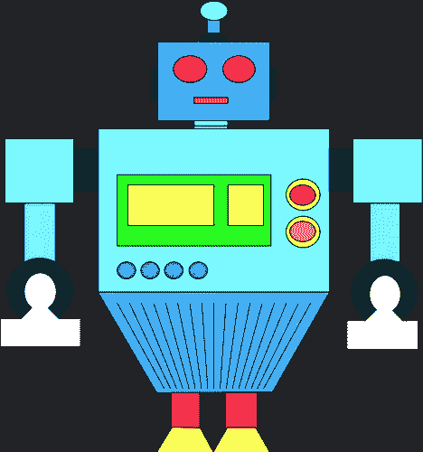
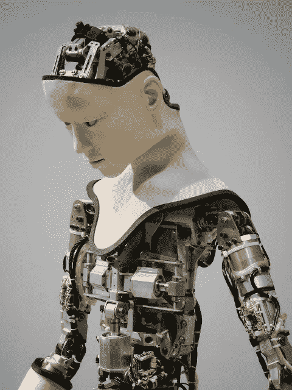

# 自由市场还是指令经济将引领未来？

> 原文：<https://medium.datadriveninvestor.com/will-the-free-market-or-command-economy-lead-the-future-fbfb9d7f2524?source=collection_archive---------10----------------------->

[**T**](https://andersenstudiokisckstarterdiaries.blogspot.com/2020/06/will-free-market-or-command-economy.html) **何不断变化的劳动格局可能掌握着关键**

business-world [publicdomainvectors.org](https://publicdomainvectors.org/)

几周前，我收到了一份要求评论一篇经济发展研究论文的请求。人们不应该谈论尚未发表的论文，所以我将只透露邀请来自一个国际组织，研究主题涉及另一个国家的微观经济部门。

我在评论这篇论文时的任务仅仅是说它是否符合研究的标准，而不是评论它的意识形态，我可以在这里这样做，只要我保持这篇论文的匿名性。

我拒绝发表这篇论文，因为它不符合研究论文审稿说明中列出的任何标准。我把这篇论文归类为伪装成研究论文的政策倡导论文。我想知道这是不是一个测试，看看我是否能在这个什么都是假的时代识别出真正的研究论文和假论文的区别。

 [## 现金为王，比我们想象的更强大|数据驱动的投资者

### 2020 年 3 月 12 日，在川普总统宣布新冠肺炎进入国家紧急状态的前夕，纽约时报报道…

www.datadriveninvestor.com](https://www.datadriveninvestor.com/2020/03/26/cash-is-king-more-potent-than-we-think/) 

我在截止日期前提交了我的评论，今天，在截止日期的前一天，我收到通知，根据我的评论，这篇论文被拒绝发表。感觉真好！

Ian Schneider-unsplash

这个请求是向安德森博士提出的。我不是什么博士，只是独立发表的个人。我在研究界的地位是一个做独立研究的自然人。这一点很重要，因为该文件将其重点小组"做生意的自然人"排除在外，并声称这些人不是主题国家的法律实体。

我以前没有审查过研究论文。我没有正式隶属于任何机构，除了安德森设计公司，我们的家族企业，一个机构在自己的权利和一个美国对应的人口统计的国家，这是研究论文的主题。

The home of Andersen Design from 1958–2017

该文件明确地将大约一半的微观经济排除在焦点小组之外。

然而，该文件列举了几个描述被排斥部门的例子。在回顾中，我指出，该国几乎一半的微观经济是一个太大的部分，不能排除在焦点小组之外，并且描述一个被排除在研究焦点小组之外的部门与声称研究是基于企业家的观点是不一致的。

Alex Nemo Hanse-unsplash

我非正式评论的研究论文发表在本帖[中，巡回工匠是青铜时代的自由代理人吗？为什么这很重要？](https://medium.com/datadriveninvestor/were-itinerant-craftsmen-free-agents-during-the-bronze-age-and-why-does-it-matter-b278b0655a52)在这篇文章中，我对日德兰考古学会的观点提出了异议，即在青铜时代的一代工匠中不可能有自由代理人。

> [植根于运动](https://www.researchgate.net/publication/300089971_Rooted_in_Movement_Aspects_of_Mobility_in_Bronze_Age_Europe)《青铜时代欧洲的流动性》,由日德兰考古学会出版的介绍，康斯坦兹·拉斯曼引用并质疑蔡尔德的假设，即流动的金属铁匠享有大量的个人自由…..拉斯曼驳斥了蔡尔德的解释，暗示除了青铜时代金属匠周游欧洲的证据之外，没有任何东西可以支持这一解释。如标题所示,《植根于运动》(导言)发展了一种证据理论，认为工匠不是自由代理人，而是附属于资助手工艺生产的精英或其他社会结构,“而不是像蔡尔德(Childe1940，163)所建议的那样在社会上是独立的。”。引用我在[中的话，巡回工匠在青铜时代是自由代理人吗？这有什么关系？](https://medium.com/datadriveninvestor/were-itinerant-craftsmen-free-agents-during-the-bronze-age-and-why-does-it-matter-b278b0655a52)

被称呼为医生会使我发表意见的权力制度化。我审阅这篇论文的权威是基于我作为一名美国微观经济企业家的背景。在我在上面的文章中随意评论的论文和正在评论的论文之间，共同的主线是否认在中央系统之外自由行动者的存在的机构权威。

虽然这篇论文是关于一个完全不同的国家，但论文所倡导的政策与缅因州中央集权的经济发展大师们所倡导的政策是一致的，就好像这两种政策都是从同一本主规则书中逐字逐句地复制过来的。

被排除在论文焦点小组之外的“失败者(我的话)”群体的特征之一是“他们不知道他们可以获得的好处”。我审查论文的资格包括多年独立研究分配利益的主要经济发展系统。我探索了这个系统，寻找支持我的业务的资源，但是这个系统就像一个网格。一个人必须适应网格，因为网格不能适应自身之外的任何事物。网格不知道如何在网格之外思考，

例如， [KickStarter](https://mailchi.mp/70ece52a08ba/hand-made-making-in-the-twenty-first-century?fbclid=IwAR2UOSeqBnk1s8F21MBlvxUsUKKUCIaO2CfZI68bt_Cuxvh25Hkb3bSUPWo) 不是集中管理的 gridworks 的一部分。我在 KickStarter 网站上查找了报告主题的国家，发现了微观经济活动。该研究论文将企业不知道好处(指令经济)列为一个创业失败，但它没有提到 KickStarter，这是小企业的一个主要资金来源。KickStarter 不在指令经济的范围内。根据我自己通过集中管理获得资源的经验，没有资源可以帮助一个人启动 KickStarter 项目。作为审查主题的文件是从这样一个角度撰写的，即要么不知道，要么不承认在中央管理的政府系统之外和在自由市场经济之内有资源。与极权制度的意识形态相一致，指令性经济不承认存在于其管理之外的任何事物。

Paul-Volkmer-unsplash

# 缓慢发展的指令性经济

用当代经济发展的话来说，中央管理的经济被归类为“指令性经济”。今天，世界上许多国家都存在着计划经济和自由企业经济的混合体。

> 当政府控制了经济和经济生产的所有主要方面时，就出现了计划经济。在计划经济中，是政府决定生产什么，如何生产商品，以及如何在经济中分配商品和服务。、、、、、计划经济与自由市场经济形成鲜明对比。在自由市场经济中，商品和服务是由私营企业生产的，分配是根据市场力量进行的。【经济学 Help.org】T4

人们认为计划经济受到了卡尔·马克思的影响。对于如何定义它，有各种不同的方法，有些要求政府实际拥有企业，但我的解释是，这些只是从自由代理人制度到中央控制制度的不同程度的进展。指令经济通过不断获取权力而发展，最终目标是控制社会的方方面面。在意识形态上，指令经济和自由企业经济是截然相反的。它们共存的事实证明了一种文化转化为另一种文化的渐进过程，这种过程是通过不断发展的品牌来推进的。墨索里尼的话适用于指令经济背后的意识形态。我正在评论的那篇论文使用了比墨索里尼更微妙的语言，但在美化被归入增长类别的企业家和诋毁被排除在焦点小组之外的企业家的倾向上，却不相上下。

> 如果在过去的八年中，我们已经取得了如此惊人的进步，你完全可以想象和预见，在未来的五十年或八十年中，意大利的前进趋势，这个我们感到如此强大，如此充满活力的意大利，将真的是宏伟的。如果公民之间的和谐持续下去，如果国家继续是政治和社会冲突的唯一仲裁者，如果一切都在国家之内，而没有任何东西在国家之外，那就更是如此，因为除非一个人是居住在荒凉的沙漠中的野蛮人，否则不可能想象有任何个人存在于国家之外。(墨索里尼在参议院前的讲话，1928 年 5 月 12 日，载于 Discorsi del 1928，Milano，Alpes，1929，第 109 页)。

不难看出言外之意，找出不一致的地方，欺骗性的做法，并把报纸放在它所忽略的背景中，这既包括主题国家的最大产业，也包括尚未集中化的整个微观经济部门。或者换句话说，自由代理经济，它存在于论文所提倡的政策之外。

# 自动化因素

这篇论文是为了支持一种信念体系而写的，这种信念体系认为，任何值得尊敬的企业的目标都是持续增长，与此同时，在支持可持续发展方面做出笼统而未经检验的声明。企业必须持续发展的观点并不总是与可持续发展的目标相一致，即使是从企业自身利益的狭隘角度来看。有时候，可持续性需要一种优雅地缩小规模的能力，这在电晕病毒时代不需要解释。

为了证明增长，一个企业必须证明在销售和雇员两方面的持续增长。对员工持续增长的要求表明，增长的衡量标准受企业福利的制约，因为在自动化时代，增加销售额不需要增加员工，只需要更新最先进的设备，而企业福利要求达到以指定比率支付工资的员工配额。

[publicdomainvectors.org](https://publicdomainvectors.org/)

尽管这篇论文坚持认为，任何企业都需要的增长因素之一是企业家巨星，但企业福利计划在整篇论文中都有所暗示，没有被直接指出。企业福利围绕着由国家规定的雇佣政策旋转，武断地命令企业家做出最重要的决定之一。如今，企业福利的强制要求损害了影响就业的两个主要因素，一个是远程员工，我在[为什么大公司支付给远程员工更少的工资对经济有益](https://medium.com/datadriveninvestor/why-large-corporations-paying-remote-workers-less-could-be-good-for-the-economy-77a9029acade)中提到过，另一个是自动化。

给企业家评级的一个准则是，公司设备是否得到更新和维护，以跟上技术发展水平。如今，这意味着自动化程度的提高。超级企业家必须掌握未来技术的脉搏。跟上设备的发展水平可能意味着减少而不是增加员工数量。

向发展中国家输出工作的理由是，它为发达国家提供了价格更低的消费品，同样的道理也适用于机器人。

马尔科·卢比奥的报告[中国制造，2025，美国商业的未来](https://www.rubio.senate.gov/public/_cache/files/d1c6db46-1a68-481a-b96e-356c8100f1b7/3EDECA923DB439A8E884C6229A4C6003.02.12.19-final-sbc-project-mic2025-report.pdf)广泛考察了中国在机器人领域的投资。

> 《中国制造 2025》为机器人和自动化机械保留了雄心勃勃的待遇。与其他行业的目标不同，MIC2025 没有为机器人设定出口市场目标，而是选择增加国内市场份额。在该计划的时间框架内，工业自动化的数量预计将增加 10 倍，达到 180 万台，并占据国内市场 70%的份额，高于目前的 30%。172 国际机器人联合会的一份报告发现，近年来的增长率表明这一目标并非遥不可及，2016 年机器人销售的年增长率为 27%，到 2020 年可能进一步增长 20%。173[中国制造，2025 年，以及 2025 年](https://www.rubio.senate.gov/public/_cache/files/d1c6db46-1a68-481a-b96e-356c8100f1b7/3EDECA923DB439A8E884C6229A4C6003.02.12.19-final-sbc-project-mic2025-report.pdf)

中国机器人生产瞄准中国本土市场。作为国家安全问题，发展自己的机器人制造对任何国家都有好处。每当我们有选择的时候，我们都应该仔细考虑自动化，因为机器人可能会把不速之客带到我们的家里和公共场所。

参议员卢比奥[的另一份报告《21 世纪的美国投资》讨论了自世纪之交以来，美国宏观经济如何减少生产投资，增加金融市场投资。与此同时，中国正在成为世界生产国。美国想让中国生产她的机器人吗，美国想再次成为一个生产国吗？生产的自动化改变了低成本全球劳动力的影响，这种劳动力将如此多的制造业转移到了发展中国家。](https://www.rubio.senate.gov/public/_cache/files/94fcb79e-eedd-4496-a262-7091647563e6/B68DE3EF858700E482305C9ED26AEC72.5.14.2019.-final-project-report-american-investment.pdf?fbclid=IwAR2GYNVZXqY2swNrNZcc4SFOzBX0DkVq7Mnx858macZ2FraLpv5378MlE-Y%20%20p)

在年轻一代中，许多人认为机器人将做所有的事情，人们将在服务、娱乐和医疗保健行业工作，也许机器人也可以做这些工作！

Franck-V-unsplash

不是每个人都同意自动化会取代工作。在他的报告《T4 2025 年中国制造》和《美国商业的未来》中，参议员卢比奥将机器人将从人们手中夺走工作的信念描述为主要是美国的想法，世界其他地方已经过去了。

Disruptivo-unsplash

我相信自动化将为人类创造新的不同种类的工作，但它不一定是同步的。旧的工作可能会在新的工作出现之前消失。但这将是一个对这些新工作有创造性的时间。

是否自动化应该是一个创业的决定。核心企业福利协议通过在福利谈判中使用雇佣工人的数量来妥协私营企业的决策。然而，私营企业将不得不与自动化竞争。问题是机器人的制造会由机器人来完成吗，谁拥有机器人，谁拥有知识产权？

# 双向街道

What will be the significance of [hand crafted production](https://mailchi.mp/70ece52a08ba/hand-made-making-in-the-twenty-first-century?fbclid=IwAR2UOSeqBnk1s8F21MBlvxUsUKKUCIaO2CfZI68bt_Cuxvh25Hkb3bSUPWo) in the age of robotics?

增量转换可以向任何方向移动。我们生活在这样一个时代，我们从未预料到会发生的事情已经司空见惯。在冠状病毒出现之前，我们似乎走上了一条不可逆转的道路，走向对一切事物的完全集中控制。今天，旧的电力塔显示出裂缝的迹象。公司首席执行官们正与总统较量，推进远程员工的计划。难道企业福利的明显受益者会是那些离开它的人吗？那看起来像是永远不会发生的事，因此它一定会发生！开个玩笑！还是我？

# 供研究的问题

1.  企业福利让公司盈利到什么程度？
2.  如果没有公司福利，公司会盈利吗？—如果不是，纳税人补贴的是股市回报吗？
3.  员工配额是否会干扰公司根据远程员工和自动化做出的决策？
4.  当工作性质正在转变时，企业福利是否会或能否阻止企业对新时代做出适应性改变？
5.  企业福利强加的员工配额对企业利润有负面影响吗？如果是这样的话，企业福利是否足以补偿，使其成为一项全面盈利的交易？如果是，纳税人补贴股市是否有回报？

## 访问专家视图— [订阅 DDI 英特尔](https://datadriveninvestor.com/ddi-intel)