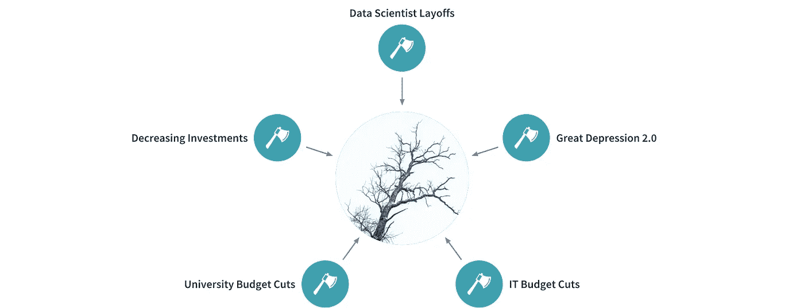

# 大萧条 2.0 会造成 AI 寒冬吗？

> 原文：<https://medium.datadriveninvestor.com/will-the-great-depression-2-0-cause-an-ai-winter-7c3c353d7b53?source=collection_archive---------8----------------------->

## 人工智能很贵，预算也在削减。

Photo by [NeONBRAND](https://unsplash.com/@neonbrand?utm_source=unsplash&utm_medium=referral&utm_content=creditCopyText) on [Unsplash](https://unsplash.com/s/photos/ai?utm_source=unsplash&utm_medium=referral&utm_content=creditCopyText). Edited by author.

90 年代的人工智能冬天粉碎了价值数十亿美元的人工智能硬件产业。拥有 1000 名员工和[大](https://www.bloomberg.com/press-releases/1992-09-29/symbolics-enters-second-phase-of-major)人工智能合同的“人工智能的 IBM”于[96](https://smbx.org/symbolics-bancruptcy-filed/)年破产。93 年，AI 硬件[厂商](https://www.nytimes.com/1988/03/04/business/setbacks-for-artificial-intelligence.html)施乐裁员一万人。

从那以后，像深蓝、沃森和 OpenAI 的 GPT-3 这样的创新复兴了人工智能。现在，人工智能团队出现在财富 500 强的大部分企业中。

然而，即使在新冠肺炎之前，人工智能的浪潮也是波涛汹涌。优步[关闭了它的人工智能实验室，公司解雇了数据科学家，这些举动与新冠肺炎](https://www.cnbc.com/2020/05/18/uber-reportedly-to-cut-3000-more-jobs.html)[无关](https://www.geekwire.com/2020/fred-hutch-lays-off-14-people-data-science-shakeup-calls-move-unrelated-covid-19-crisis/)

我们正在进入一个新的大萧条。这就是它对人工智能的影响。

 [## 人工智能、区块链和智能合约:为什么我们都需要拥抱创新|数据驱动的投资者

### 区块链是一个抓住了我的想象力的行业，有助于为更大的利益改造社会。我开始…

www.datadriveninvestor.com](https://www.datadriveninvestor.com/2020/08/03/ai-blockchain-and-smart-contracts-why-we-all-need-to-embrace-innovation/) 

# 大萧条 2.0

5600 万美国人失业(最近申请失业的 5100 万人加上另外 550 万人)，这与退休人员到 2020 年将为 T21 创造 5500 万个工作岗位的预测相反。

从 Gold's Gym 到 JCPenney 的图标都破产了——而且是在世界上最富裕的国家之一。

要了解这次萧条的真正损害，看看发展中国家，那里有超过 8 . 2 亿人长期处于食物不安全状态。T4 的情况只会越来越糟。

# 公司正在解雇数据科学家

像 Mixpanel、Domo、DataRobot 和[这样的数据公司被解雇的员工更多。Validity、Matterport、GrayMeta 和其他公司裁掉了超过三分之一的团队成员。](http://layoffs.fyi/tracker/)

裁员。仅参考消息一项，截至发稿时，官方数据公司裁员约 1，000 人，非官方报告中还有数千人，包括 c3.ai 等大型公司。

当然，对于人工智能是关键收入来源的公司来说，那些数据人员不会被解雇。正如我在下面的文章中所写的，人工智能是网飞和亚马逊这样的公司的金鹅。

 [## 走向无代码分析:让每个人都成为数据科学家

### Wix 让每个人都成为网站建设者，Canva 让每个人都成为设计师。现在，是时候让每个人都成为数据科学家了。

towardsdatascience.com](https://towardsdatascience.com/towards-no-code-analytics-making-everyone-a-data-scientist-f7693bd0abfd) 

然而，FAANGs 并不能代表整个行业。很多公司都是勉强度日，还处于 AI 的研究阶段，所以他们的 AI 员工更容易被砧板上的肉。

# 全球 IT 支出正在减少

大萧条重创了几乎所有行业，包括 IT 业。虽然有一些明显的例外，如 WFH 工具(如 Zoom 和 Slack)和娱乐(如网飞)，许多 IT 公司都受到了伤害。

大幅削减 IT 预算尤其会阻碍人工智能的发展。正如我在[的另一篇文章](https://medium.com/predict/why-no-code-is-the-future-of-ai-112d9bfde440)中所探讨的，优质数据科学人才的短缺以及使用人工智能的许多先决条件导致了高昂的前期成本。

# 大学正遭受预算削减之苦

大学是人工智能研究和开发的源泉，反过来又激发了行业创新。

Photo by [Shunya Koide](https://unsplash.com/@shunyakoide?utm_source=medium&utm_medium=referral) on [Unsplash](https://unsplash.com?utm_source=medium&utm_medium=referral)

然而，在新冠肺炎，大学正遭受预算削减，威胁着它们人工智能产出的数量和质量。

# 投资正在下降

在 Q1，全球交易流量下降了[两倍](https://www.cbinsights.com/research/startup-funding-covid-19-financial-crisis/) 与大衰退的第一季度相比，丁波对于资金紧张的人工智能初创公司来说表现不佳。

虽然不是一家人工智能公司，但像 WeWork 这样的投资的彻底失败严重损害了人工智能行业。

By author. [Data](https://www.businessinsider.com/wework-valuation-falls-47-billion-to-less-than-3-billion-2020-5#:~:text=WeWork's%20valuation%20has%20fallen%20from%20%2447%20billion%20last%20year%20to%20%242.9%20billion&text=WeWork's%20valuation%20has%20fallen%20to,at%20%2447%20billion%20last%20year.) [from](https://www.forbes.com/sites/stevenbertoni/2017/07/10/wework-hits-20-billion-valuation-in-new-funding-round/#7530ee041194) [these](https://www.wsj.com/articles/valuation-of-shared-office-provider-wework-soars-to-10-billion-1435181485#:~:text=WeWork%20on%20Wednesday%20said%20Fidelity,young%2C%20fast%2Dgrowing%20companies.) [five](https://www.wired.com/2014/12/wework-valuation) [sources](https://www.forbes.com/sites/alexkonrad/2014/11/05/the-rise-of-wework/#3be46afe6f8b).

软银准备向人工智能投资超过 1000 亿美元，但由于像 WeWork 这样的大规模失败，他们的持续投资计划不确定。

# 解决方法

## 对于数据科学家来说

即使我们进入一个全面的人工智能冬天——我们很可能不会，尽管降温是不可避免的——数据科学家将永远是需要的。

事实上，[现在有超过 100 家公司](https://www.apteo.co/post/100-companies-hiring-data-scientists-right-now)正在招聘数据科学家。

 [## 100 多家公司正在招聘数据科学家

### 在疫情引发的经济衰退中，许多数据科学家丢掉了工作。幸运的是，几个地区正在看到…

www.apteo.co](https://www.apteo.co/post/100-companies-hiring-data-scientists-right-now) 

也就是说，这是一个竞争激烈的领域，例如，考虑到数百万有抱负的数据科学家已经选修了吴恩达的课程。正如我在下面的文章中所建议的，做一些实际的项目，分析你感兴趣的数据，以获得申请人的优势。

证书，无论是 LinkedIn Learning 上的[还是 Google 的机器学习证书](https://medium.com/dataseries/top-10-linkedin-learning-data-science-certificates-f6e945f4e4cd?source=---------11------------------)上的也能有所帮助。此外，查看[远程数据科学实习](https://blog.usejournal.com/remote-data-science-internships-for-everyone-with-certificates-d4eebb993dac?source=---------17------------------)来学习和提升你的个人资料。

 [## 不常见的数据科学工作指南

### 数据科学竞争异常激烈。以下是如何用“蓝海”策略取胜。

towardsdatascience.com](https://towardsdatascience.com/the-uncommon-data-science-job-guide-3e215ba552bf) 

如果你需要一些投资组合灵感，请查看这些 [6 个人工智能项目以使你的投资组合脱颖而出](https://www.apteo.co/post/6-ai-projects-to-make-your-portfolio-stand-out)，这些 [20 个人工智能用例](https://medium.com/towards-artificial-intelligence/20-use-cases-for-predictive-analytics-687f963ef225?source=---------2------------------)，或者这些 [4 个令人兴奋的机器学习用例](https://medium.com/dataseries/exciting-machine-learning-use-cases-1927448e6e9e)。

## 对于公司

人工智能是苦苦挣扎的公司最不想做的事情。我不能责怪他们——这不便宜也不容易。然而，两个趋势正在使实现人工智能变得更便宜和更容易:无代码和 AutoML。

[无代码](https://towardsdatascience.com/towards-no-code-analytics-making-everyone-a-data-scientist-f7693bd0abfd)指的是使构建产品更容易的可视化工具，这延伸到了无代码分析。AutoML(自动机器学习)大大缩短了人工智能投入生产的时间。

像 [Apteo](http://apteo.co/) 这样的工具提供了无代码的 AutoML，所以任何人都可以部署没有代码的 AI。

# 结论

无论你怎么解释，人工智能产业都处于困境。

By author.

IT 预算削减，大学预算削减，数据科学家裁员，投资减少，这些都在威胁着人工智能的发展。

然而，对于可以直接为底线做出贡献的数据科学家来说，即使是人工智能的冬天也不会让他们慢下来。最后，公司可以使用无代码和 AutoML 工具来实现人工智能，即使没有很大的预算。

亲爱的读者，你怎么看，我们面临人工智能冬天的风险吗？

**访问专家视图—** [**订阅 DDI 英特尔**](https://datadriveninvestor.com/ddi-intel)