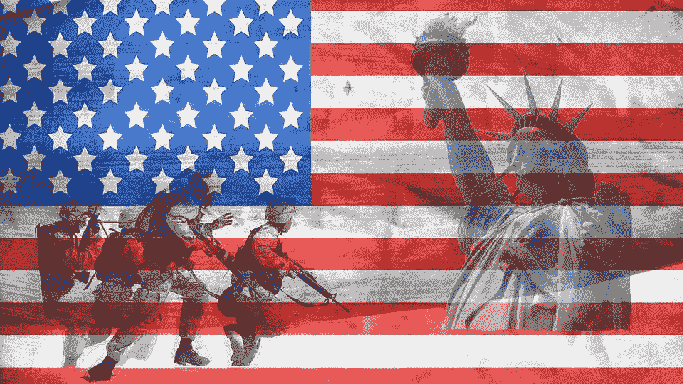

# 大选后军方会代表特朗普介入吗？

> 原文：<https://medium.datadriveninvestor.com/will-the-military-intervene-on-behalf-of-trump-after-the-election-359d07b07b25?source=collection_archive---------18----------------------->

## 政治

## 五角大楼领导人担心特朗普会援引 1807 年的叛乱法案

Photo by [tammyatWTI](https://pixabay.com/users/tammyatwti-2906805/) on [Pixabay](https://pixabay.com/illustrations/veteran-american-independence-pride-1807121/)

《纽约时报》报道称五角大楼的高级领导人越来越担心，如果选举结果引发骚乱，特朗普将援引《1807 年叛乱法》,派军队进入美国城市镇压骚乱。

[1807 年暴动法](https://en.wikipedia.org/wiki/Insurrection_Act_of_1807)(1861 年和 1871 年修订)允许总统召集军队和国民警卫队镇压反对各州和联邦政府的暴动。对特朗普来说，该法案的执行部分将是 1861 年的修正案，该修正案允许总统使用军队和国民警卫队来反对一个州的意愿，以镇压对联邦政府的叛乱。该修正案是在内战结束后通过的，以防止任何进一步的动荡。

 [## 忽略特朗普|数据驱动的投资者

### 通常，7 月 4 日是烧烤或逃离城市的日子。随着第一轮新冠肺炎…

www.datadriveninvestor.com](https://www.datadriveninvestor.com/2020/07/02/ignore-trump/) 

传统上，军方一直保持不关心政治。他们认为选举是国会和法院的事。这是我们国家能够每四年和平移交权力的原因之一。

今年的问题是，我们的总统像一个暴徒老板，要求对自己的忠诚超过对国家和宪法的忠诚。他经常称军队为“我的军队”和“我的将军”。

结合这一点，特朗普可能会在 11 月 3 日赢得大选，但随着邮寄选票的清点，他的领先优势会消失。他一直在为这种情况准备他的基础，声称邮寄选票是欺诈性的，应该被丢弃，外国将印刷伪造的选票，非法移民将非法投票。所有这些都导致了他一直鼓励的国内动乱。

如果对选举结果有任何疑问，特朗普会毫不犹豫地援引《叛乱法》并使用“我的军队”来镇压任何骚乱，特别是在蓝色州和城市。尽管他没有付诸行动，但在抗议乔治·弗洛伊德被杀时，他曾威胁要这么做。

他甚至在白宫对面的圣约翰教堂前进行了一次有争议的拍照演练。他用国民警卫队在抗议者中清理出一条路，用催泪瓦斯和直升机驱散人群，这样他和他的随行人员就可以安全地穿过拉斐特广场。

关于特朗普，我们必须永远记住的一点是，他习惯于谈论做一些事情，比如第三个任期或对平民使用军队，以在他实际做之前进行试水。就在我们眼前，他向我们表明，他毫不犹豫地对手无寸铁、爱好和平的平民使用武力，因此不难想象，为了保住权力，他将在选举后大规模使用武力。

问题是，如果军队被要求对手无寸铁、和平行使宪法保障的言论自由权的平民采取行动，他们会服从总司令的命令吗？他们支持哪一个？宪法还是总司令的命令？

到目前为止，答案是最高指挥官都将辞职，而不是遵循他们认为是非法的命令。如果你问我，我觉得这是懦夫的出路。对白宫的暴君坚决说“不”会更合适，你不觉得吗？

今天有人问我，如果将军们都辞职，我认为会发生什么？下一任指挥官会服从特朗普吗？

有趣的问题。

经过一番思考，我记得特朗普有军方的支持，直到有人透露，他认为他们都是傻瓜和失败者。他不仅逐渐失去了他们的支持，也失去了他们的尊重。

所以我的回答是，到目前为止，军方似乎将保持其非政治立场，拒绝代表特朗普干预抗议选举结果的平民。

## 访问专家视图— [订阅 DDI 英特尔](https://datadriveninvestor.com/ddi-intel)