# NLP 分析:推特上的总统们发生了什么？

> 原文：<https://medium.datadriveninvestor.com/will-the-president-go-home-due-to-the-corona-crisis-the-epidemic-and-the-changing-sentiments-on-14bd99943f1a?source=collection_archive---------10----------------------->

## 新冠肺炎之后，安格拉·默克尔发生了什么变化？为了找到答案，我们现在关注 Twitter 上 12 月的进展(12 月 2 日之后)


Foto von [Anna Shvets](https://www.pexels.com/de-de/@shvetsa?utm_content=attributionCopyText&utm_medium=referral&utm_source=pexels) von [Pexels](https://www.pexels.com/de-de/foto/strasse-schild-display-tur-3962259/?utm_content=attributionCopyText&utm_medium=referral&utm_source=pexels)

安格拉·默克尔最近比以往任何时候都更频繁地出现在世界媒体的议程上。在疫情进程中，她出现在议程上就像许多政治家受到严厉批评一样，这可能并不有趣。然而，还有其他原因使德国总理享有特权。例如，正如你在[链接上看到的](https://www.dw.com/en/coronavirus-and-germany-why-the-world-is-looking-to-angela-merkel/a-53236840)，在许多国家被描述为“世界上最强的领导者”

此外，还有一些积极的意见，如她很好地管理了 corona 过程，确保所有人都从社会状态机会中受益，并为疫苗开发活动做出了贡献。

此外， [Forbes](https://www.forbes.com/sites/forbespr/2020/12/08/angela-merkel-christine-lagarde-and-kamala-harris-top-forbes-100-most-powerful-women-list/) 近日公布的“年度全球 100 位最具影响力女性排行榜”中，安格拉·默克尔名列第一。

如果想看更久远的历史，可以看两年前德国人被问及默克尔的回答，来自[链接](https://www.youtube.com/watch?v=te3LncJNXAw&t=418s)上的视频。

> 这一切的结果，可以说，即使是政治上不支持默克尔的人，也在以某种方式表达对她的尊重。

然而，在这一点上，一个全世界都在努力应对的巨大危机显现了出来。光环如何继续影响关于总理的现有评论？

# 项目介绍

Twitter 上的情感分析为大多数公司和个人提供了重要线索。在这一点上，社交媒体上的反应值得更多的讨论。此外，covid 流行病通过不降低速度，继续使人们处于其经济和心理影响之下。因此，花在室内的时间比以往任何时候都多，今天我们处于社交媒体使用的顶端。这支持了数据必须被评估的信念。

## 这一切意味着什么？

国家统治者可能会因为最近几次世界大战的成败而饱受批评。我们可以看到他们所有的政治家在危机中受到批评。我们生活在一个政治家穿着“火做的衬衫”的历史时期。

# 项目和目的

我们将在这个项目中试图找到答案的问题是:“在撼动当今经济的同时，疫情是如何影响公众对总统的看法的？”为此，我们将重点讨论德国的封锁，这是最近被大量宣传。

12 月，我们将回顾 1500 条关于安格拉·默克尔的推文，其中大部分是德国用户最近发布的。

我们的目的是测量社交媒体用户对最近宣布的“锁定”决定的反应，因为疫情开始在欧洲和德国活跃起来。我们正在研究他们如何将此与默克尔联系起来。

正面和负面评论两类，会表达对默克尔的推文的情绪分析。接下来，我们将尝试使用 NLP 来预测测试数据中的未标记数据。

***所以我们准备潜水了！***

# 数据集操作

## 创建数据集

我们没有创建覆盖很长时间的数据集。事实上，关于疫情爆发的新公告每天都在发布。此时，人们对此更加好奇:**疫苗的传播和增加措施**。然而，我们关注的数据集将包括圣诞节前对封锁决定的反应。

出于这个原因，我们认为默克尔在与其他国家总统会晤后发表的声明是开始日期。然后，在接下来的几天里，我们创建了带有“安吉拉、安格拉·默克尔或默克尔”字样的推文数据集，以使数据集更加平衡。为训练数据集列出了 1500 条带标签的推文，为测试数据集列出了 650 条推文。

借助 Twitter API 支持，也可以做到这一点。然而，我们想做一些标记，以便从这个数据集进行快速分析。我们不想迷失在太多的数据中。我们想看看最新的分析和基本的自然语言处理过程是如何工作的。因此，我们更加关注:

**1-** 推文必须是最新的(我们想知道关于默克尔和封锁的看法。)

**2-** 为了创建一个客观的列表，推文的排序没有按照任何标准。

**3-** 无论 twittler 列出的是什么语言(英语-西班牙语-意大利语等。)

**4-** 列车文件中的所有推文都被标记为正面或负面

**5-** 所有负面信息都分为三大类。这些应该包括解释为什么信息是负面的短语:“阴谋论”、“侮辱”和“政治批评”

## 使数据集适合于操作

首先，我们将从导入所有的库开始，我们希望详细检查数据集，并且我们希望在图形表示中使用这些库。

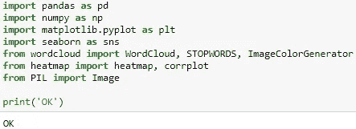

我们已经将数据集创建为 Excel 文件。由于熊猫图书馆，我们申请访问我们的数据的路径应该如下。

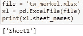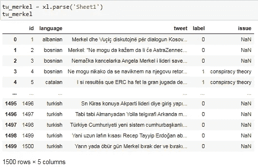

基本上，我们可以看到 5 列中的 id 对我们来说并不重要。让我们先摆脱它们:

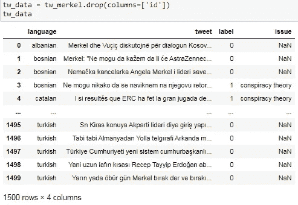

然后我们看到，我们看到的 NaN 线代表所有积极的推文。所以对于标有 0 的正面推文，让我们试着用一个字符串来填充它。我们只会对负面推文做主题搜索。我们没有任何数据来检验这种关于正面推文的情况。

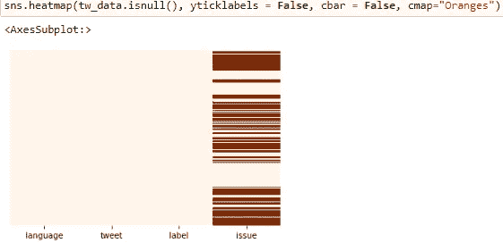

1\. Veri cercevesinde null degerlerin dagilim grafigi

我想在这里的所有空白处写下“没有理由”:

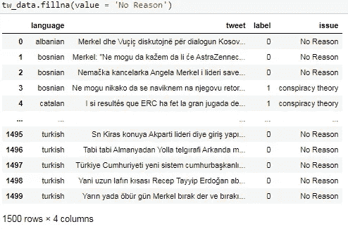

> 如果我们想使这个改变永久化，把“inplace = True”放在括号里，就像这样:(twdata.fillna (value = 'No Reason '，inplace = True)

然后，我们需要另一个关于推文长度的专栏。因为我们需要这个来做一些比较。在这种情况下:

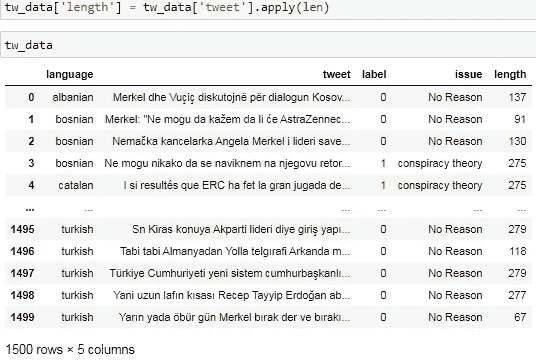

现在我们可以开始处理现成的数据框了。

# 数据探索(EDA 过程)

## 1-将数字数据(“长度”)可视化为频率:

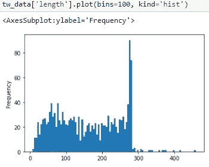

## 2-查看以何种语言发布的推文数量:

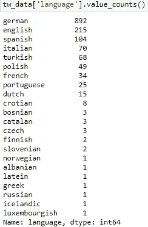

## 3 分钟/最多 3 条推文:

为了查看最长和最短的推文，我们希望使用 ***describe ()*** 来查看最大和最小长度值:

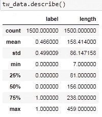

min:7 & max=459 character

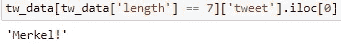

min = ‘Merkel!’

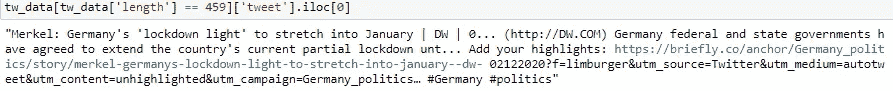

max = ‘Merkel: Germany’s …

## 4-将数据分为正反两类:

这一分割过程将为未来的研究优化数据。当我们想单独查看 WordCloud 或正面/负面评论时，我们希望有一个现成的数据集。所以我们先来分一下:

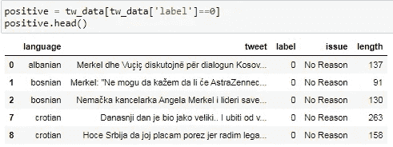

Positive dat set: top 5 tweets

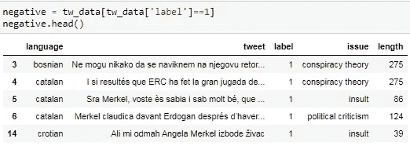

Negative dat set: top 5 tweets

## 5-正和负作为一个字符串:

接下来，我们将尝试把否定句和肯定句合并成一个句子。为此，我们将首先使用 **tolist ()** ，然后使用 **join ()** 。

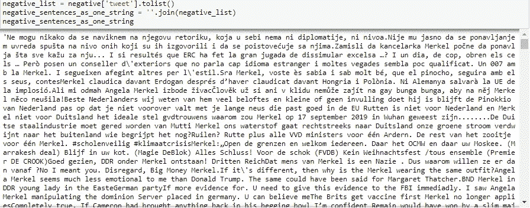

Negative sentences as one string

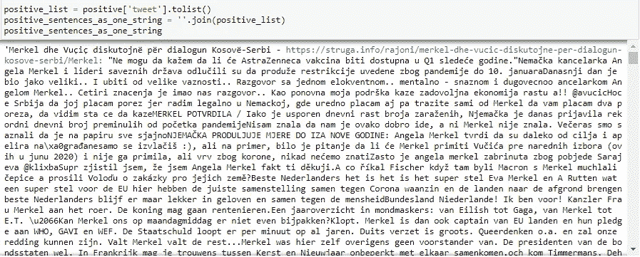

Positive sentences as one string

## 六字云

在 WordCloud 中投影多语言数据集可能看起来没有意义。我们将在停用字词中添加新的字词，以使它变得更好。例如，当我们称停用词为德语时:

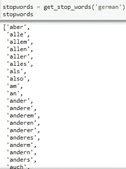

现在让我们做提到的补充。由于大多数英语推文是在德语推文之后发布的，所以让我们添加英语的停用词。可能有不同的方法可以做到这一点。我更喜欢先显示英语的停用字词，然后通过添加这些字词来更新停用字词列表。在这种情况下:


现在，我选择所有这些，并用 ***update ()*** 函数更新它们。但是，对于像**“why ' s”**这样的单词中再次出现单引号的停用词，我必须将所有引号都改为二进制。否则我们会得到一个错误。

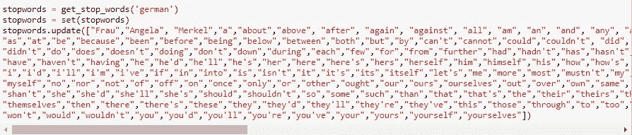

因此，停用词总数从 **232** 增加到 **404** 。

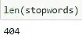

除了不必要的话，默克尔已经在每条推文中被提及。而且在 WordCloud 里实际看到这个也没多大意义。于是我们在上面这组单词后面加上了“**安吉拉、弗劳和默克尔**”。现在我们可以关注其他短语了。

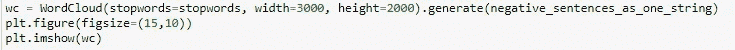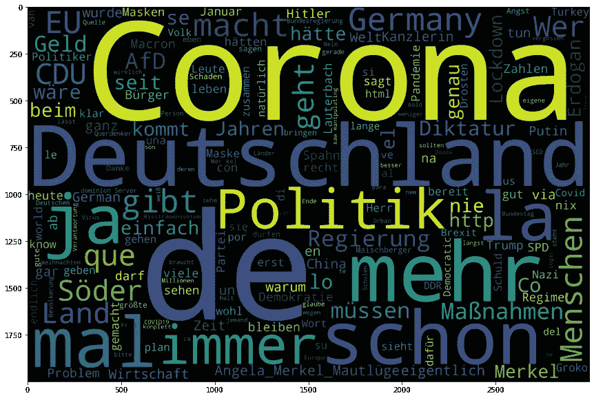

Negative WordCloud

如果我们想知道一些单词在这个单词云中出现了多少次，我们可以使用如下代码。例如，我想了解根据我们的数据集，关于默克尔的推文中使用了多少次“阿道夫”、“希特勒”和“纳粹”这三个词:

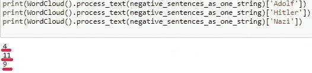

接下来，我们将考虑在 WordCloud 中显示积极的推文。但在这里，不像上面，我们会做一个默克尔的面具出现在里面。为此，首先检查图像的 ***np.array()*** 值。我们会查看这些值是否需要优化。

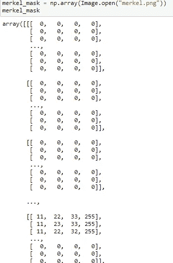

在这种情况下，必须确保 0 值为 250 英尺。我们将为此使用 transform。我们将用来转换我们的面具的函数应该是:

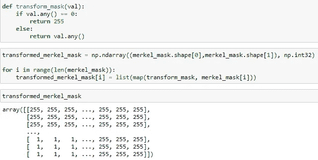

**祝贺你！**现在我们可以在图片中显示 WordCloud 了。

```
wc = WordCloud(stopwords=stopwords, width=3000, height=2000, background_color="black", max_words=1000, mask=transformed_merkel_mask,
               contour_width=3, contour_color='firebrick').generate(positive_sentences_as_one_string)plt.figure(figsize=(15,10))
plt.imshow(wc)
```

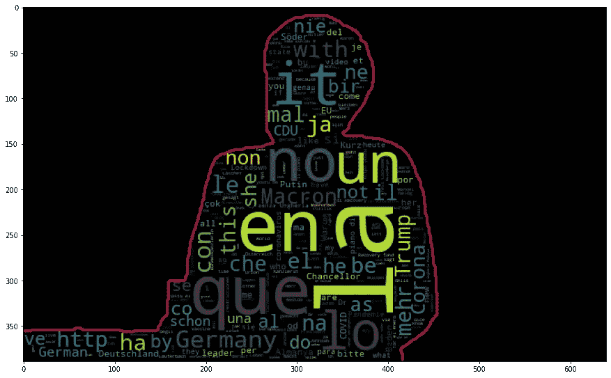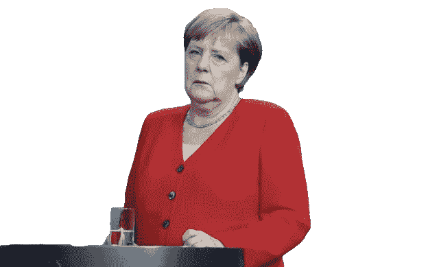

free-source: [https://pngarchive.com/photo/354/angela-merkel-png](https://pngarchive.com/photo/354/angela-merkel-png)

## 7 种语言小组

在 pandas 中，我们可以通过分组方法一起评估我们在列之间选择的一个或多个数据。现在让我们把这个应用到语言中。

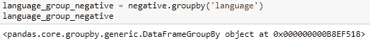

我们现在想要可视化的是更好地理解用哪种语言发布的负面推文的平均长度。那么我们来看看有 ***mean ()*** 的组的均值:

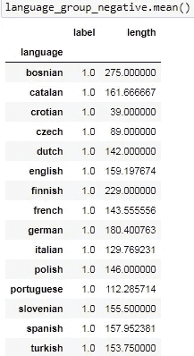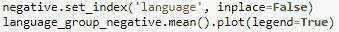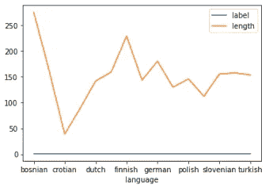

我们在这里没有应用任何例外。例如，在某些语言中，只有 1 条发布的推文包含在该数据集中。因此，“波斯尼亚语、加泰罗尼亚语、克罗地亚语、捷克语、斯洛文尼亚语、芬兰语”的图形值并不具有决定性，因为单个 tweet 决定了平均值。

要根据语言直观显示最积极/最消极的推文:

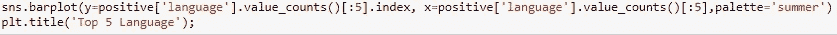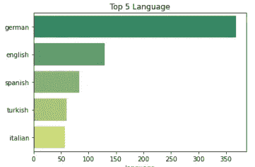

plot the top 5 languages for “positive”

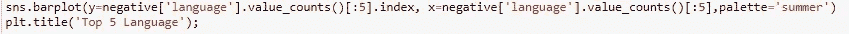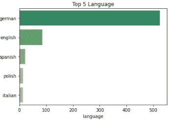

plot the top 5 languages for “negative”

## 8 期一般分配

我们现在将观察主题负面推文中的标注结果。首先，如果我们明确地考虑负面推文:

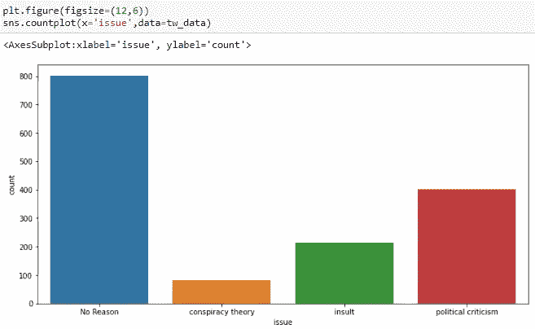

现在让我们看看按语言分类，贴上“阴谋论——侮辱——政治批评”标签的推文的百分比。在这里获取所有代码会有点混乱。所以你可以通过我将在文章结尾分享的代码链接来达到这个目的。如果我们看一下负面问题的百分比图:

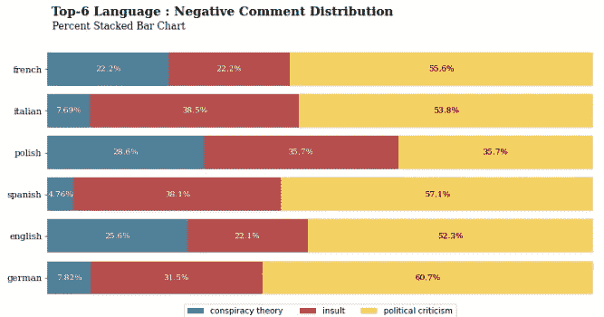

这里我们选取了 6 种数据更多的语言。因为这样我们可以有一个更平衡的平均值。

让我们来看看在哪些语言中，积极内容的推文与“不要策划”的关系更密切:

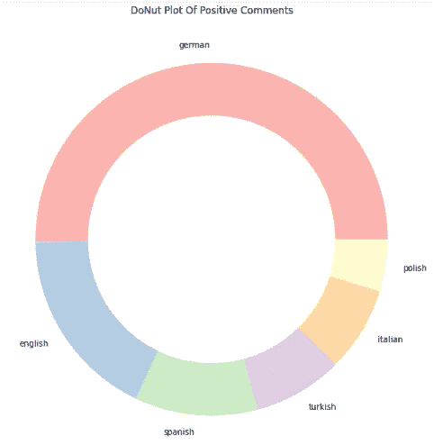

因此，我们根据受试者完成了图形化评估流程。

现在 NLP 来了…

# 自然语言处理

我们 NLP 的目标是开发一个模型，在我们 650 条未标记的推文中准确预测负面或正面的推文。正如我们在火车数据集中注意到的，有更多的德语和英语推文。因此，我们将用这些语言来教授模型更多的内容。为了相应地获得更好的结果，测试数据集仅从用这两种语言发布且未被标记的推文中创建。

我们将用优先文本清理来启动 NLP 应用程序。我们将遵循的顺序如下:

*   安装/导入所需的库*(您可以在 jupyter 笔记本中查看详细信息)*
*   删除“url”和“@”语句
*   分成句子
*   拆分成单词
*   删除标点符号
*   删除停用词
*   词汇化

## 1-导入测试数据:

我们再次这样做，就像我们之前导入了训练数据集一样:

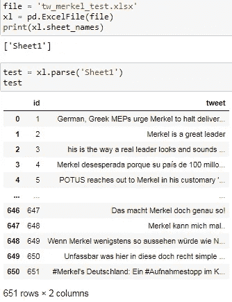

## Tweet 列的预期清理:

在我们去掉“id”列后，我们可以将我们的训练和测试数据中的所有 tweets 转换为我们想要的格式，这要感谢我们如上所述创建的“def”。

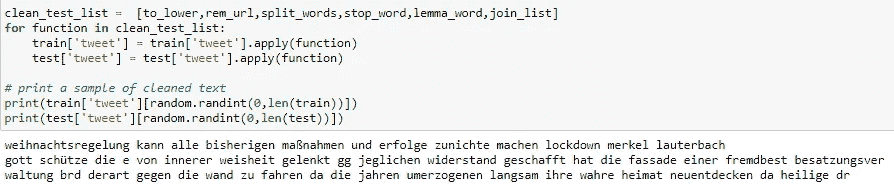

> 您可以从 jupyter 笔记本的“clean_test_list”中访问“to_lower”、“rem_url”、“split_words”、“stop_word”、“lemma_word”、“join_list”函数。

## 3-对训练和验证数据集的划分

这里，我们将分配 20%的训练数据集作为测试数据。

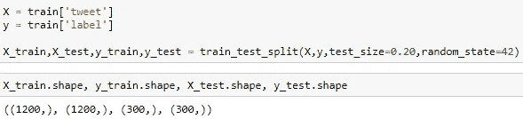

## 4- **文本矢量化**

众所周知，NLP 试图在矢量表达单词后创建一个有意义的结构。如果我们将此应用于我们上面划分的数据集:

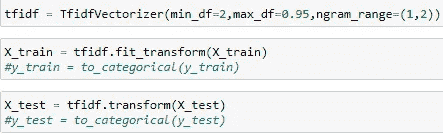

## 5- **交叉验证**

在对我们拥有的数据集做了相关的安排之后，是时候问我们将如何创建我们的模型了。在这里，我们将使用一个适当的函数来寻找性能最佳的模型。该功能将使用交叉验证测试各种模型。然后我们将能够看到平均值和标准差。我们将尝试用性能最好的模型来预测我们的测试数据。

根据我们用作交叉验证的函数的结果，在朴素贝叶斯训练模型中获得了更成功的分数。均值最高标准差最低的模型 f1 分更好。使用 F1 分数值的主要原因是不会在不均匀的数据集中做出不正确的模型选择。

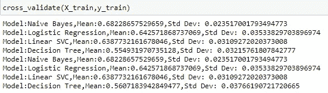

## 6- **对验证集的预测**

首先，我们希望看到屏幕上的朴素贝叶斯得分。看看我们选的车型，在整个评价中会怎么出现？

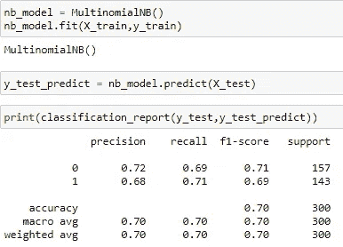

## 7- **为矢量器和模型创建管道**

您需要根据我们选择的模型创建一个管道。在这种情况下:

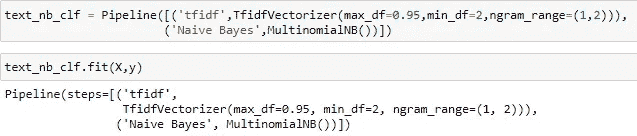

## 8- **对测试数据集的预测**

现在让我们用我们用真实的测试数据集创建的管道来处理它，并创建另一个预测的新文件的副本作为 csv。

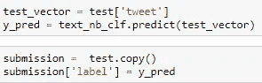

现在让我们打开这个数据集，试着看看最后一个表:

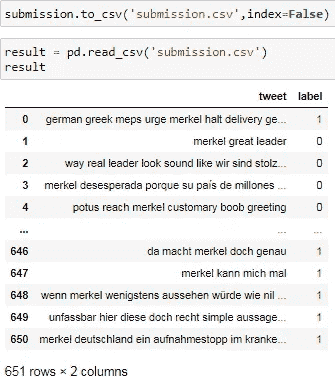

那么我们的测试数据集的预测的短期分布是怎样的呢？

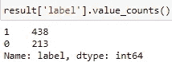

我们已经充分看到了我们训练的模型的结果。

接下来是论点和结论…

# 结论

我们终于走到了尽头。我们注意到许多我们应该考虑的创新。首先，从我在介绍中分享的链接可以看到，德国的默克尔有着不错的政治历史。

众所周知，她是联邦制度下国家所有国务部长或部长中的第一位领导人，人民对她表示满意。要更详细地查看调查结果，您可以点击下面的[链接](http://bit.ly/ZustimmungswerteDeutschland)。

然而，在 Twitter 上，我们看到一位总理在一月份之前一直因反对一级防范禁闭和疫情而受到严厉批评。社交媒体上出现了许多关于默克尔的文件，如阴谋论和远离历史事实的场景，尽管是少数。根据这个数据集中的推文，我们注意到:

**1-** 我们已经看到，超过一半的发布推文带有正面标签。

**2-** 我们也看到了涉及“希特勒之后最大的破坏”的严厉指责，甚至更强烈的仇恨表达。我们可以在侮辱类别中看到所有性别歧视和种族主义的信息。

引人注目的是，我们可以看到积极词汇云中德语单词的减少。当然，这可能是因为我们没有在这些语言中单独实现停用词。然而，这是与负群集最明显的区别。

我们能够在 WordCloud 负面词汇列表中找到 24 个与希特勒相关的词汇。在宣布封锁后，负面评论员将他(A .希特勒)与默克尔联系在一起，这一定是一种历史错觉。

**5-** 我们发现负面推文中最长的政治批评也是德语。

**6-** 我们观察到，用土耳其语发布的推文也包含在前 6 条正面推文的列表中。

**7-** 我们观察到，用意大利语和西班牙语发布的负面推文比例最低。

**8-** 根据主题，我们观察到负面推文的百分比，最多的是阴谋论(28.6%)波兰文、侮辱(38.5%)意大利文和政治批评(60.7%)德国文。

## 如果我们评估 NLP 流程:

**1-** 我们没有在训练数据集中使用多种语言发送推文，而是更倾向于使用德语和英语的测试数据，以确保数据集之间的平衡。

通过交叉验证，我们用朴素贝叶斯得到了最好的结果。如果我们的训练数据集中有所有德语和英语推文，也许我们可以在不同的模型中获得更高的结果和成功的预测。但是我们不能像上面那样进行广泛的分析。

**2-** 在测试数据集中，我们的模型在真实列车数据集中的预测的正负密度很高，有利于负面推文。我觉得这可能是因为数据集中没有足够的数据。我们知道数据在所有机器学习训练中有多重要。

然而，这里我们选择使用一个小数据集来快速评估当前情况，并从头到尾观察 NLP 项目中真实世界的故事。

**3-** 在所做的估计中，很难猜测在一些推文中标记为负面的实际上是正面的。举个例子，推特号码 649 是德语的:

> "在这种简单的法律解释中，不利因素是它常常被误解和误解。默克尔总理的身体力行绝对是不明智的

表达式中“unfassbar =不合理，gegen =反对，mangeln =缺乏，vorwerfen =指责，unsinnig =无意义”等否定词组引人关注。可能当我们的模型检查这些短语时，它给句子贴上了否定的标签。

但是，那句话其实是“那样指责默克尔是不合逻辑的。”结尾为。因此，该声明没有对默克尔提出任何批评。NLP 技术很难在这些领域开发出一个好的模型。因此，模型改进工作对于 NLP 来说是必须的。

**感谢阅读到目前为止！**

在本文中，我们试图一起讨论许多主题和技术。正如我之前提到的，您可以从 github 页面访问所有代码和描述。

[](https://github.com/fk-pixel/Medium/tree/master/tw_merkel_project) [## fk-像素/中等

### 此时您不能执行该操作。您已使用另一个标签页或窗口登录。您已在另一个选项卡中注销，或者…

github.com](https://github.com/fk-pixel/Medium/tree/master/tw_merkel_project)