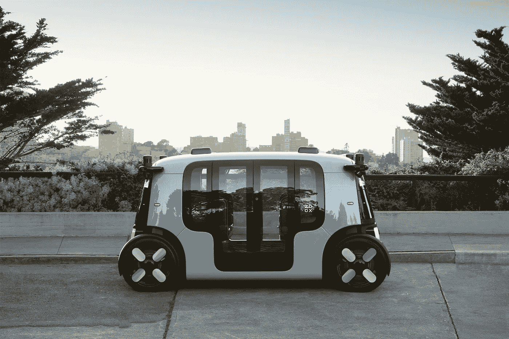

# 自动驾驶会反映智能手机生态系统吗？

> 原文：<https://medium.datadriveninvestor.com/will-the-self-driving-market-mirror-the-smartphone-ecosystem-28e43e8d5182?source=collection_archive---------5----------------------->

## Waymo 希望司机可以在任何类型的车辆上使用，Zoox 表示其车辆是“真正的革命性的”…就像 iPhone 一样。

随着冠状病毒疫情的影响停止了大多数公共无人驾驶测试，围绕自动驾驶汽车的宣传在 2020 年趋于平稳。阴郁的情绪让位于几乎所有人，除了特斯拉放弃了雄心勃勃的 2015 年计划，几个项目推迟，T2 放弃了 T3。

过去几年，谷歌的自动驾驶汽车部门 Waymo 也对其目标进行了一些调整。最初看起来是谷歌对全栈的追求——硬件、软件和服务——现在已经缩小到简单的软件，或 Waymo 所说的驱动程序。

Waymo 已经与几家汽车制造商签署了协议，当司机准备好上路时，他们将把这项技术集成到他们的车辆中。作为回报，我假设 Waymo 将从原始设备制造商那里获得某种补偿，同时在车上预装谷歌的互联网服务套件。

> “Waymo 正在复制一种让谷歌在移动领域获得巨大成功的模式”

“我们渴望驾驶任何在公共道路上行驶的东西——公共汽车、卡车、汽车，无论什么，”[对《金融时报》说](https://www.ft.com/content/6b1b11ea-b50b-4dd5-802d-475c9731e89a) Waymo 首席执行官约翰·克拉夫茨克。“我们不想局限于单一的外形规格。”

虽然不如 Waymo 推出自己的汽车或潜在的类似优步的自动驾驶应用程序那么诱人，但它正在复制一种模式，这种模式已经为谷歌在移动领域带来了巨大的成功，其全球市场份额超过 70%。

在过去几年里，谷歌也通过 Android 从一个不可知的平台变成了一个硬件竞争对手，所以尽管汽车计划可能处于休眠状态，但我们不应该完全排除谷歌汽车，如果司机收到的信号与 Android 在 2010 年代初一样。

## 开源与专有:汽车版

Cruise Automation’s Origin shared vehicle

另一方面，Zoox 和 Cruise Automation 都推出了没有人工控制的全自动驾驶汽车。这两款车都是为未来的打车应用做好准备的，这表明双方都不认为汽车所有权是汽车行业的未来。

然而，拼车是否是汽车行业的下一步仍有待观察；不是为了这一代人。城市居民可能会看到节省停车成本的价值，但运营商会发现很难在郊区和农村地区大规模运营一个高效的平台。

苹果和特斯拉属于运营商的小阵营，他们最有可能出售自动驾驶汽车，因为他们似乎对打车或租车都不感兴趣。

据传闻，苹果将于 2024 年推出一款[无人驾驶汽车，很可能由一家汽车合作伙伴制造。羞愧蒂姆·库克](https://www.theguardian.com/technology/2020/dec/22/apple-plans-self-driving-car-in-2024-with-next-level-battery-technology)[拒绝了埃隆·马斯克对特斯拉的出价](https://www.theverge.com/2020/12/22/22195959/elon-musk-tesla-tim-cook-apple-sale-meeting-acquisition-refused)。苹果[在 2019 年收购了 Drive.ai](https://www.theverge.com/2019/6/25/18758820/drive-ai-self-driving-startup-shutting-down-apple) 以帮助软件方面，据报道，这一方面远远落后于 Waymo。

> "汽车制造商可能会像电话运营商一样得出结论，软件太难了."

特斯拉已经通过自动驾驶仪行驶了数百万英里，埃隆似乎很有信心他的公司拥有最好的软件，但如果没有监管机构的批准，全面推广可能还需要一段时间。

如果 Waymo 能够以低得多的价格甚至开源提供产品，并且只要求几个标准项目(类似于早期的 Android 规格)，它可能会引起汽车制造商的注意，这些制造商不想将控制权交给技术公司，成为无名制造商。

汽车制造商可能会像许多电话运营商一样得出结论，软件方面太难了。即使奥迪、福特、丰田、宝马和其他公司都有自动驾驶部门，但一旦 Waymo 推出其司机平台，这些可能只不过是不必要的成本。

另一方面，苹果更有可能收购一家汽车制造商或与合作伙伴合作，从而在制造和设计方面拥有更大的发言权。当你看到汽车上刻着“由加州苹果公司设计”时，不要感到惊讶。

**访问专家视图—** [**订阅 DDI 英特尔**](https://datadriveninvestor.com/ddi-intel)