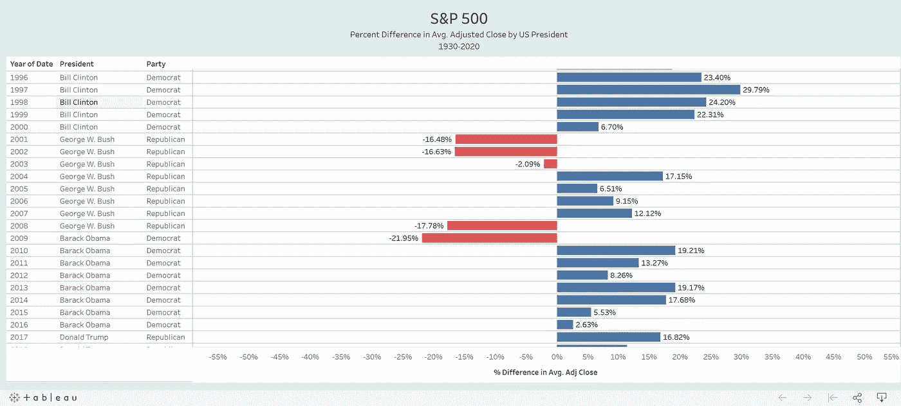
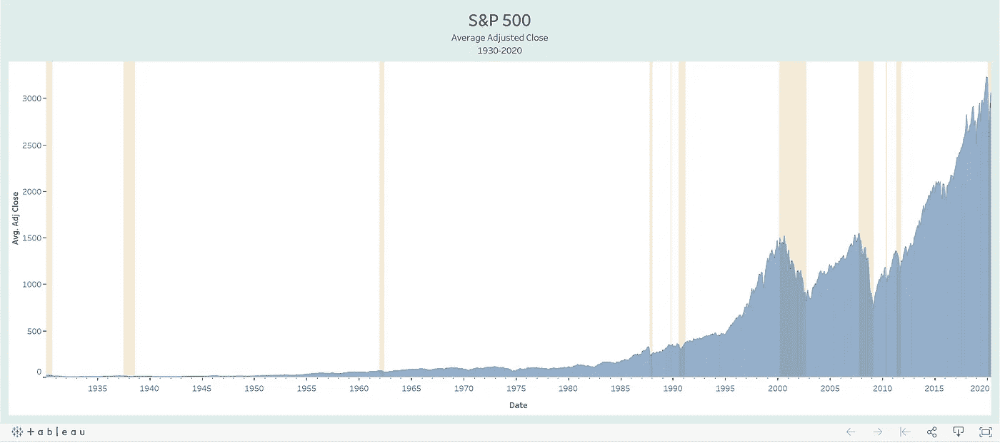
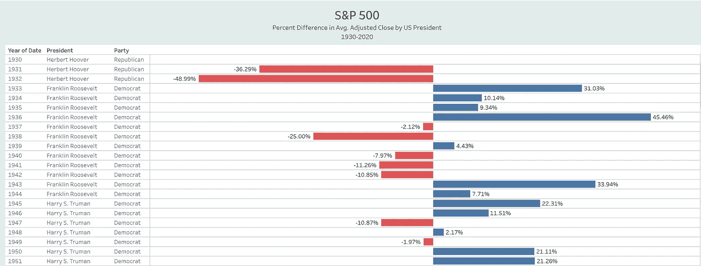
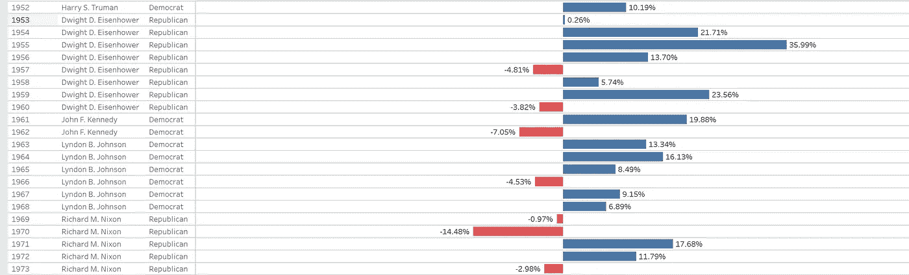
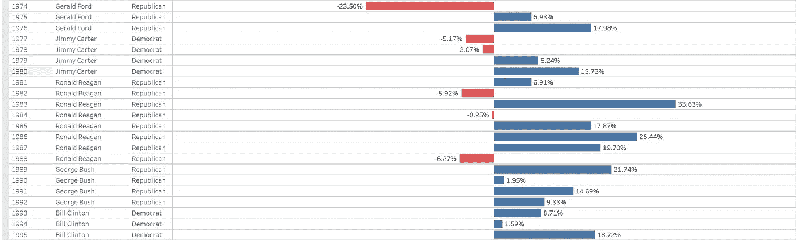
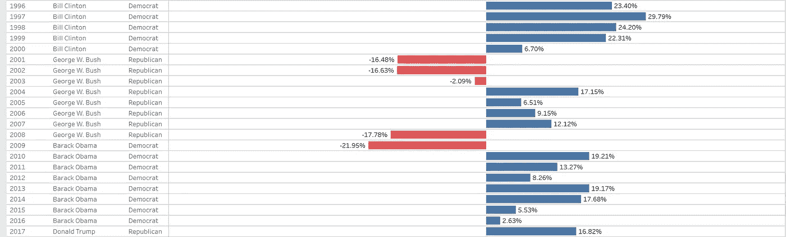
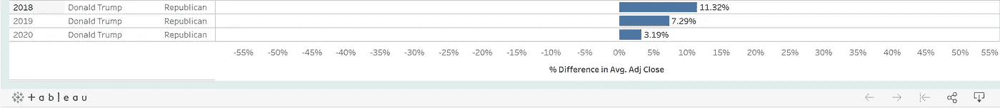

# 如果特朗普输了，股市会崩盘吗？

> 原文：<https://medium.datadriveninvestor.com/will-the-stock-market-crash-if-trump-loses-7ca1e6cb0e1a?source=collection_archive---------6----------------------->

Chart I created using Tableau with Data from Yahoo Finance

大卫·拉姆齐，金融专家和电台节目主持人，最近收到一个听众打电话到他的节目中提出的问题。打电话的人是来自长岛的埃塞尔(Ethel)，她问自己是否应该清算自己的退休账户，并将自己的钱投资于 CDs(存款证)等避险投资。她担心特朗普总统竞选连任失败会导致股市崩盘。

埃塞尔的场景:

*   70 岁了
*   身体健康，有活到 90 多岁的家族史
*   她的退休账户里有 70 万美元
*   在过去十年的大部分时间里，她将自己的退休基金投资于定期存款——利息不到 2%
*   错过了标准普尔 500 自 2009 年以来近 400%的涨幅——这本来可以让她的投资组合增加到 250 万美元以上
*   2020 年 2 月重返股市，当时市场因新冠肺炎而崩溃

埃塞尔的挫折和担忧引起了许多人的共鸣。在不确定时期，你如何投资？你应该积极地使用你的储蓄吗？你能打电话给谁？你信任谁？

# 戴夫·拉姆齐的建议

戴夫·拉姆齐给了她同样的建议，多年来他一直在给自己的追随者这样的建议:玩长线游戏。避免情绪化决策。市场不会跟随一个政党:

> “它在比尔·克林顿的领导下蓬勃发展。它在罗纳德·里根的领导下蓬勃发展。它在吉米·卡特的领导下变得更加稳健……这个经济比谁入主白宫都更加稳健！”

他的建议并不新鲜。这类似于许多金融专家的教导，如苏西·奥曼、沃伦·巴菲特和许多其他人。

# 然而，数据怎么说呢？是否支持理财专家的建议？

Chart I created using Tableau with Data from Yahoo Finance

如上图所示，在过去的 90 年里，股票市场一直呈上升趋势。它成功克服了重大经济事件，如熊市、崩溃、衰退和萧条(都用黄色参考线突出显示)。

这些事件包括 1929 年的股市崩盘、大萧条、肯尼迪滑坡、黑色星期一、20 世纪 90 年代的衰退、网络泡沫破裂、大衰退和 2010 年的闪电崩盘。

> **总体而言，买入并持有的长期股市策略已经奏效。标准普尔 500 指数成功战胜了所有经济事件。**

然而，这张图表并没有回答埃塞尔的问题。她想知道股票市场和美国总统选举之间是否有关联。

# 股市会跟随总统大选吗？

Chart I created using Tableau with Data from Yahoo Finance

用戴夫·拉姆齐的话说，由于总统选举，股票市场出现了“波动”。无论哪个政党获胜，这些信号都会出现。

例如，从比尔·克林顿总统(民主党)到乔治·w·布什总统(共和党)，股市的低迷持续了三年。此外，从乔治·w·布什总统(共和党)到巴拉克·奥巴马总统(民主党)，类似的衰退持续了两年。

在标准普尔 500 过去的 90 年里，这些现象时有发生，而且似乎与政治有某种关联。

然而，在此期间，也存在其他潜在的经济条件。例如，在克林顿总统和布什总统之间，出现了网络泡沫。从布什总统到奥巴马，有次贷危机。

股票市场更有可能反映特定时期的经济状况，而不是当时的政治状况。

# 市场会不会崩盘？

Photo by [Jamie Street](https://unsplash.com/@jamie452?utm_source=medium&utm_medium=referral) on [Unsplash](https://unsplash.com?utm_source=medium&utm_medium=referral)

很难预测总统选举的结果。试图预测市场的波动更具挑战性。S&P 股市暴跌 30%很简单，但看似无关紧要的消息也会让它迅速崩溃。这些动量波动是许多市场经济学家将股市称为非理性的原因。

> 那些认为存在泡沫、价格过高的人发现自己开始质疑自己之前的判断，并开始怀疑基本面是否真的在推动价格上涨
> ――罗伯特·J·希勒，非理性繁荣

本文中的图表显示，市场对总统选举的反应并不是一个可靠的指标。尽管市场可能会对政治消息做出反应，但这些反应往往是不一致的。试图根据政治来把握市场时机可能会导致失望。

> **“如果你不愿意拥有一只股票 10 年，那就别想拥有它 10 分钟。”——沃伦·巴菲特**

正如专家建议的那样，最好长期投资股市。美元成本平均和长期持有策略将帮助你的投资组合克服市场先生的意外、非理性、站不住脚和不可预测的波动。