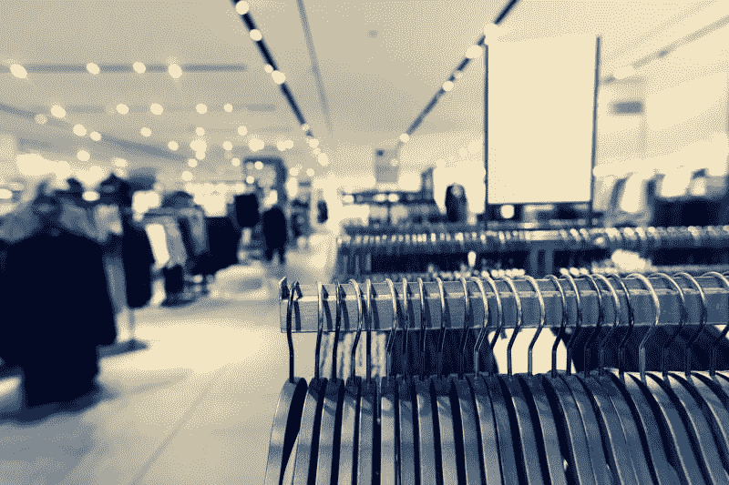
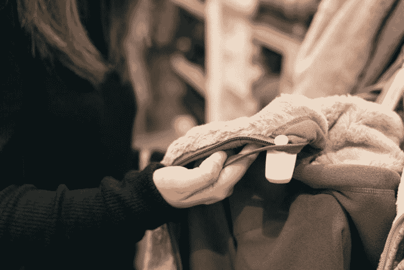
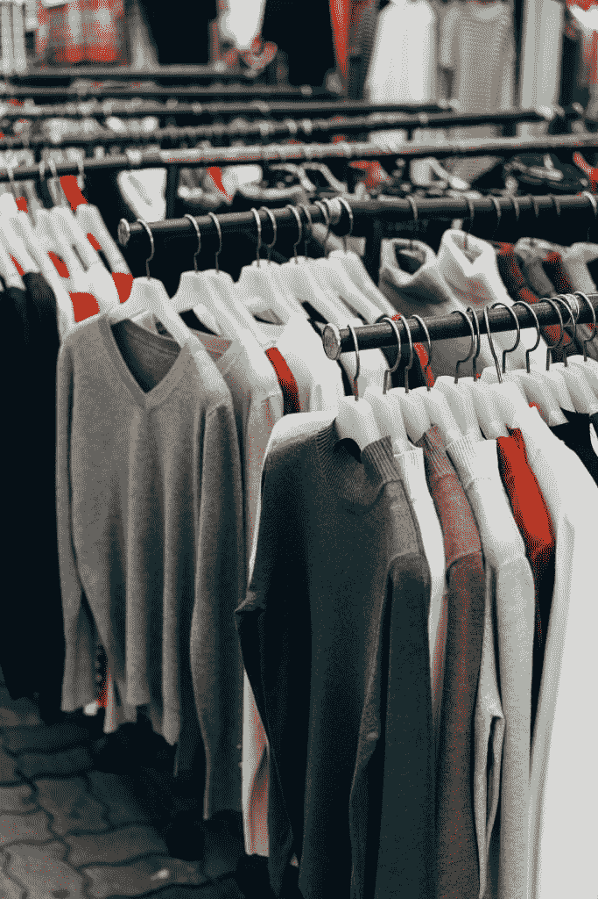
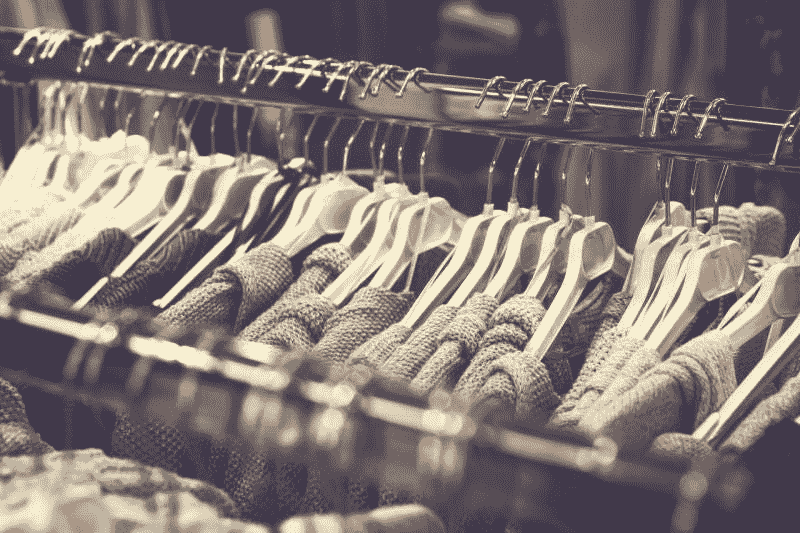
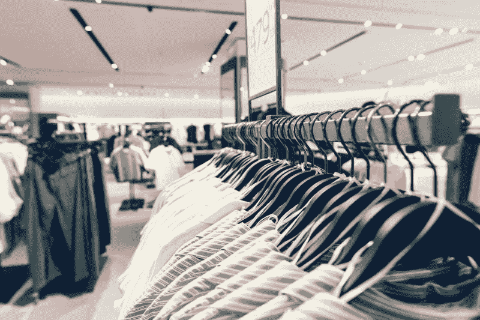
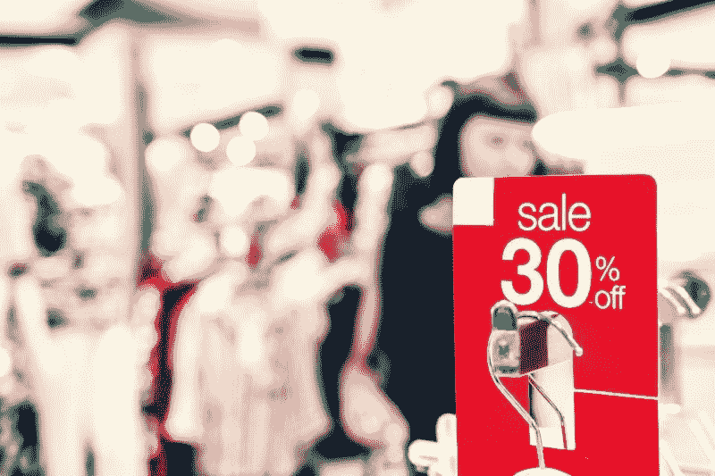

# TJX 公司能幸免于冠状病毒吗？—市场疯人院

> 原文：<https://medium.datadriveninvestor.com/will-the-tjx-companies-survive-coronavirus-market-mad-house-adc166d82895?source=collection_archive---------7----------------------->

早在冠状病毒之前，百货公司就深陷困境。事实上，我认为在疫情之前，只有两个美国百货商店品牌做得很好。

那些品牌分别是底层的 [**TJX 公司**](https://marketmadhouse.com/tjx-shrinks-and-makes-more-money-at-the-same-time/) **(纽交所代码:TJX)** 和高端的 [**诺德斯特龙**](https://marketmadhouse.com/why-is-nordstrom-making-money/) **(纽交所代码:JWN)** 。TJX 通过在杂乱的商店里向工人阶级出售各种各样的商品，成为美国百货商店的成功之作。诺德斯特龙走了一条相反的路，通过华丽的商店向上层人士营销。

 [## 投资区块链前要问的三个简单问题(也是一个困难的问题)|数据…

### 现在是了解区块链的最佳时机。不同货币之间的增长率，比如…

www.datadriveninvestor.com](https://www.datadriveninvestor.com/2020/03/12/three-simple-questions-and-one-difficult-one-to-ask-before-investing-in-a-blockchain/) 

现在，这两个百货品牌都面临着冠状病毒的生存危机。详细来说，TJX 和 Nordstrom 的商店都关门了，大多数人都在亚马逊(纳斯达克股票代码:AMZN)上购物。

# 冠状病毒如何威胁 TJX

冠状病毒威胁着 TJX，因为该公司将其商业模式集中在城市地区的实体店。

TJX 经营 TJ Maxx、Marshalls、Homegoods、Sierra、Winner 和 Homesense。这些商店在廉价的气氛中出售办公室价格的服装和家具。

TJX 的营销在很大程度上依赖于鼓励人群的廉价地下室氛围。因此，TJX 商店可能是完美的冠状病毒传播者和社会距离的违反者。

我预测 TJX 将很难吸引更多的顾客回到它的商店。此外，许多地方和地区政府将面临关闭大型百货商店的压力，以防止流行病蔓延。

# 冠状病毒能杀死 TJX 吗？

我认为由于资源有限，TJX 将很难生存。

例如，截至 2020 年 1 月 31 日，TJX 拥有 31.7 亿美元的现金和短期投资。此外，TJX 当天的流动资产为 88.9 亿美元，存货为 48.73 亿美元，总资产为 241.45 亿美元。

然而，截至 2020 年 1 月 31 日，TJX 的总负债为 181.97 亿美元，长期债务为 105.31 亿美元。因此，TJX 可能会发现自己无法偿还债务。

冠状病毒可能会迫使 TJX 重组债务，或借入更多资金。这可能会损害 TJX，因为该公司用于扩张和分红的资金可能会减少。此外，TJX 在适应不断变化的世界和折扣方面将缺乏灵活性。

# 冠状病毒如何帮助 TJX

相反，我认为冠状病毒可以在两个方面帮助 TJX。首先，TJX 的竞争可能会减少，因为新冠肺炎可能会杀死 TJX 的许多竞争对手。

例如，服装零售商 J. Crew 于 2020 年 5 月 4 日破产。另外，媒体猜测内曼·马库斯和 JC·彭尼 **(纽约证券交易所代码:JCP)** 可能会加入 J. Crew 的破产行列。

因此，TJX 可能会发现自己是许多市场中的最后一个部门。因此，TJX 可以有更多的客户，赚更多的钱。重要的是，TJX 子公司 Marshalls 和 Home Goods 出现在 2020 年 4 月仍在支付租金的零售商的名单上。

第二，TJX 品牌可以搬进 JC Penney 和 Sears 等公司倒闭时空着的商店。因此，TJX 可以廉价扩张，因为绝望的房东会把房子租给任何有现金的零售商。

不幸的是，TJX 可能很难借到钱来为扩张融资。为了解释，我认为许多投资者和贷款人将避免冠状病毒后的所有零售。因此，TJX 将支付更多的钱来借更少的钱，这可能会损害其赚钱的能力。

# TJX 在冠状病毒之前赚钱吗？

**TJX Companies Inc .(纽交所代码:TJX)** 在冠状病毒之前就赚钱了。例如，TJX 报告 2020 年 1 月 31 日的季度收入为 122.06 亿美元。

相比之下，TJX 在 2019 年 1 月 31 日报告的季度收入为 111.27 亿美元。因此，TJX 的收入在去年有所增长。

此外，TJX 于 2020 年 1 月 31 日报告了 34.64 亿美元的季度毛利。此外，截至 2020 年 1 月 31 日，TJX 报告了 13.29 亿美元的季度运营收入和 9.85 亿美元的季度共同净收入。

此外，TJX 报告截至 2020 年 1 月 31 日的季度运营现金流为 21.93 亿美元，期末现金流为 11.57 亿美元。因此，TJX 的业务在运营时产生了大量现金。

不幸的是，TJX 的商店已经关闭了一个多月，没有产生任何现金。然而，在运营过程中，TJX 是一家现金充裕的公司。

# TJX 是好股票吗？

我觉得 TJX 在冠状病毒之前是个好股票。特别是，TJX 在疫情之前是一家成长中的公司。

值得注意的是，TJX 公司报告截至 2020 年 1 月 31 日的季度收入增长率为 9.7%。我认为这使得 TJX 更安全，因为它是在技术颠覆零售业到面目全非的时候成长的。

此外，TJX 会产生一些现金，并保留其中一部分。还记得 31.7 亿美元的现金和短期投资以及 21.93 亿美元的运营现金流吗？因此，我认为 TJX 对零售商来说是安全的。

# TJX 是安全的股票吗？

我认为 TJX(纽约证券交易所代码:TJX) 对投资者来说是一只安全的股票，因为它保值。例如，2020 年 5 月 8 日，市场先生以每股 48.35 美元的价格收购了 TJX。相比之下，市场先生在同一天为 JC Penney 向 15₵付款。

此外，TJX 于 2020 年 2 月 12 日支付了 23₵季度股息。总的来说，截至 2020 年 5 月 8 日，TJX 的股息收益率为 1.90%，92₵年化派息率为 34.46%。

相反，我不认为 TJX 会在冠状病毒之后支付股息。因此，TJX 不像以前那样安全了。

另一方面，我认为 TJX 是为数不多的能够从冠状病毒中存活下来的百货公司之一。不幸的是，我怀疑 TJX 在很长一段时间内都不会再赚钱了，可能会超过一年。

归根结底，**TJX 公司(NYSE: TJX)** 是一种风险价值投资。如果你认为冠状病毒之后会恢复正常，TJX 可能是一个很好的投资。如果你认为常态不会恢复，你需要避免 TJX。

*原载于 2020 年 5 月 11 日 https://marketmadhouse.com***。**