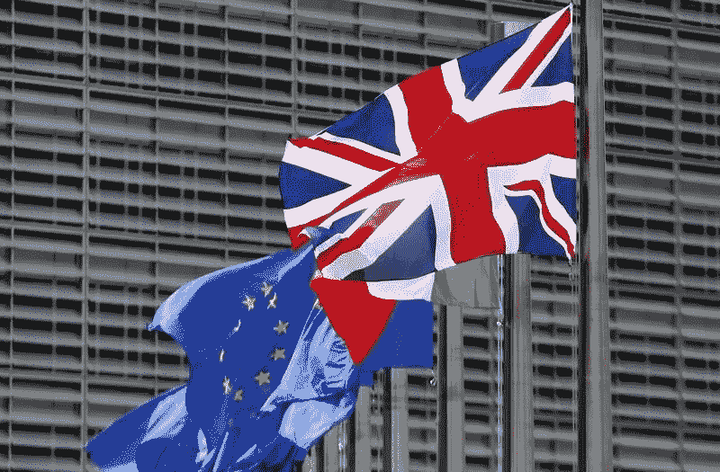
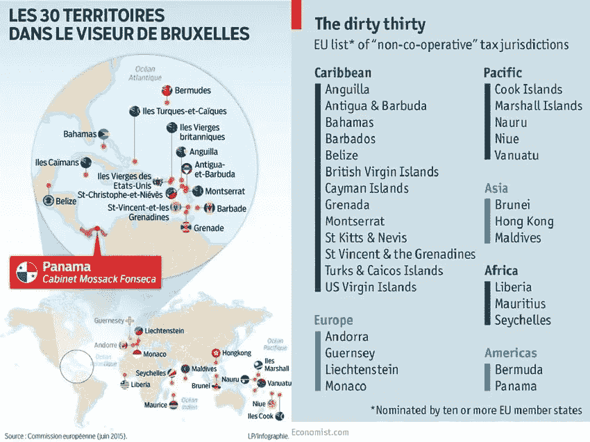
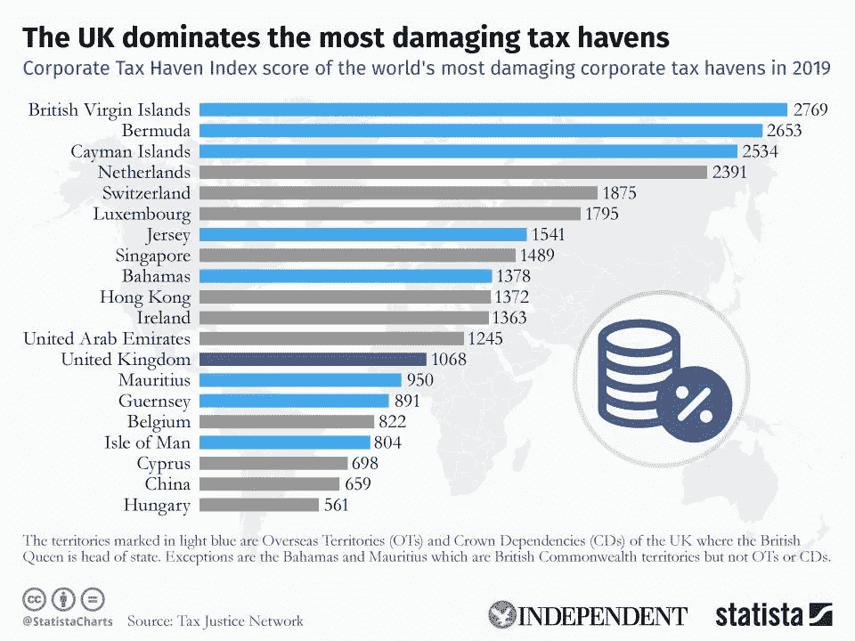

# 继英国退出欧盟之后，英国会成为避税天堂吗？

> 原文：<https://medium.datadriveninvestor.com/will-the-uk-become-a-tax-haven-after-brexit-8f1444211101?source=collection_archive---------7----------------------->

有些人声称，后英国退出欧盟时代的一个好策略是让英国成为避税天堂。一个强硬的英国退出欧盟会有很多后果，然而，离开欧盟的后果之一是，英国可以自由设定它想要的任何税收和关税。这将使英国成为避税天堂。只是澄清一下，英国不需要离开欧盟就能成为避税天堂。爱尔兰被广泛认为是一个避税天堂，是的，爱尔兰仍然是欧盟的一员，但是英国在英国退出欧盟危机后可以获得的自由将很容易让英国成为一个避税天堂。

因此，在我们讨论英国是否能够甚至应该成为避税天堂之前，让我们简单回顾一下什么是避税天堂。简而言之，避税天堂是指向你的企业和公民提供比你在本国支付的税率更低的税率的任何国家。这吸引人们和组织搬到其他国家，以避免你的高税率。公司和个人利用各种各样的技术来避税。

首先，英国会成为继英国退出欧盟之后的避税天堂吗？当然可以。如果英国降低企业和个人的税率，它很可能会成为避税天堂，试图吸引财富到英国。然而，有测试到位，以防止避税天堂。一般来说，国家不喜欢他们的企业和公民在另一个国家纳税来避税。很明显，政府依靠税收来支付与国家运转相关的大量成本，因此对避税天堂进行了限制，试图阻止它们。

欧盟有一个名为公平税收测试的测试，这是一个对所有非欧盟国家进行的测试，包括英国退出欧盟之后的英国。欧盟利用这些测试的结果创建一份避税天堂的黑名单。欧盟在其公平税收规则的定义中表示，各国不应提供允许公司转移利润以避税的优惠税收措施或安排。甚至有人认为，英国目前的税收政策可能会使其面临被列入黑名单的风险，甚至在进一步降低税率以成为避税天堂的任何潜在尝试之前。英国已经是避税天堂的说法远非事实。

英国已经有许多皇家属地和海外领地被许多人视为避税天堂。英国离岸司法管辖区包括开曼群岛和泽西岛，这两个地方的公司税率都是 0%。欧盟官员已经表示，他们计划取缔这些先前被排除在黑名单之外的英国属地。据报道，一名欧盟官员表示，英国过去一直保护他们，这种情况不会发生在未来，我们将追查他们。那么，英国应该认真对待这些威胁吗？或者，继英国退出欧盟之后，成为一个成熟的避税天堂是一个更好的策略吗？

在谈判过程中，成为避税天堂肯定是一件多次受到威胁的事情。有人指出，像列支敦士登这样的国家是英国继英国退出欧盟之后成功避税的典范。那些支持这些计划的人强调了地衣斯坦的人均 GDP 有多高。事实上，人均 181，403 美元是世界上人均 GDP 最高的国家之一。远远超过人均 44288 美元的英国。当你把它与 12.5%的公司税率和 3%的所得税放在一起看，很容易看出列支敦士登是一个低税收国家，带来了大量的收入，是这个国家成功的主要原因。

这种观点的问题是，许多避税天堂和像列支敦士登这样的小国的人口不到 3.8 万，而英国的人口超过 6500 万。Lichtenstein 的政府根本不需要那么多钱来支付教育、医疗和公民的其他费用。

如果英国成为一个避税天堂，它将不得不为整个地球服务多次，以筹集足够的资金来支付英国的预算，就像列支敦士登所做的那样。《卫报》报道，列支敦士登超过 70%的经济活跃人口是外国人，这意味着这些外国人可以支付列支敦士登的费用。对于这么高的比率，英国将需要天文数字的外国人将他们的资金转移到英国，以满足英国人口的需求，因为英国的人口比列支敦士登多 1700 人和 25 倍，这意味着成本高出数千倍，这种模式可能适用于税收相对较少的小国。

但英国像列支敦士登这样的国家一样成为避税天堂是不可行的。这个问题也不仅仅是经济问题，而是成为避税天堂将如何影响我们的社会结构。

现存于世界各地的英国避税天堂已经使英国陷入困境。在《卫报》的另一篇报道中，意大利反黑手党记者罗伯托·萨维诺说，英国现有的离岸金融模式使其成为世界上最腐败的地方。避税天堂吸引了大量腐败和犯罪活动。避税天堂的目的是接受潜在的脏钱。

英国已经面临这一挑战。最近试图阻止英国不正当金融交易的努力受到了限制，因为有人声称，如果英国真的取缔了货币，那么工作就会转移到其他国家。

如果英国继续沿着这条路走下去，问题会变得更加严重。路透社报道称，早在 2014 年，四大金融公司就在香港报纸上刊登广告，抱怨民主抗议正在发生。当时他们声称，这些抗议活动让香港看起来像是一个不太可靠的投资地。

像这样维持投资和让人们与避税天堂进行交易的尝试会严重影响这个国家，限制其民主。提供一个成熟的避税天堂的服务真的会让英国变得更加腐败和不民主，这不是英国最需要的投资。它实际上需要那种能创造就业机会的投资，投资于当地经济，并授权社区获得正确的投资。

企业需要受过教育的工人、设备和基础设施。所有这些都需要纳税人的钱。削减税收以获得今天在这里，明天就消失的投资，并没有给英国带来应有的经济。