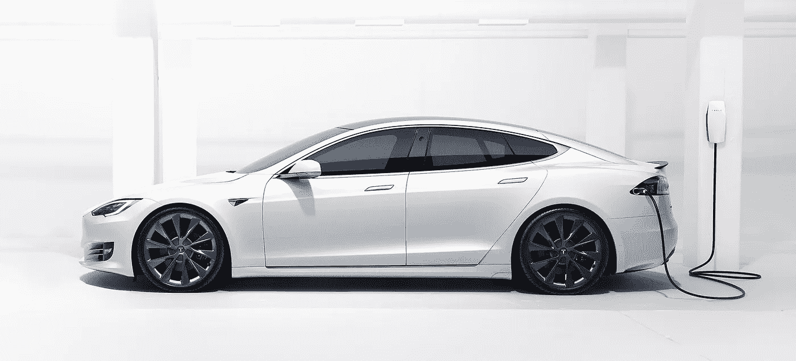
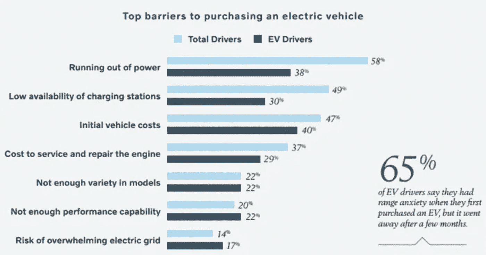
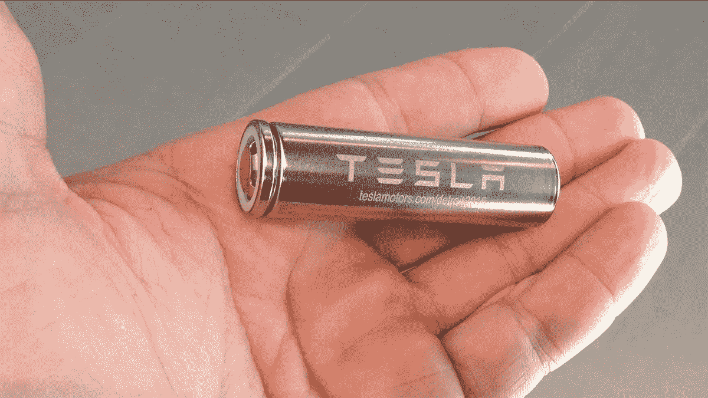
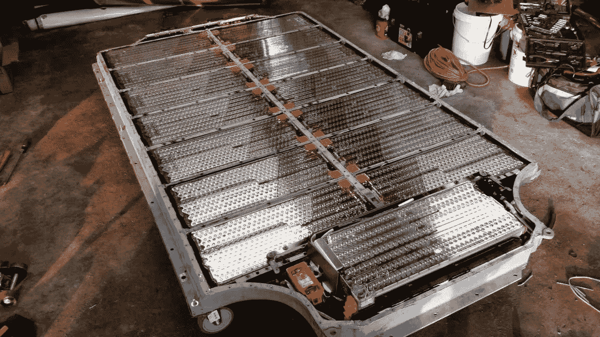
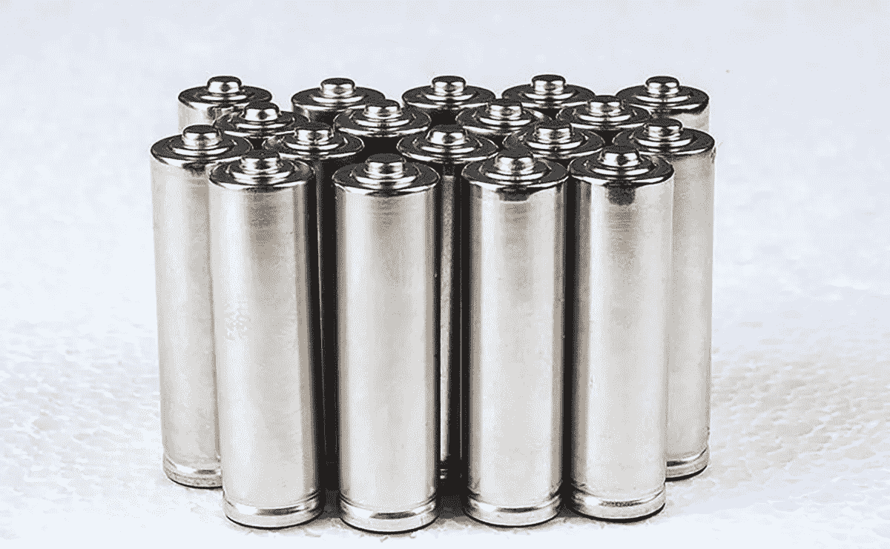
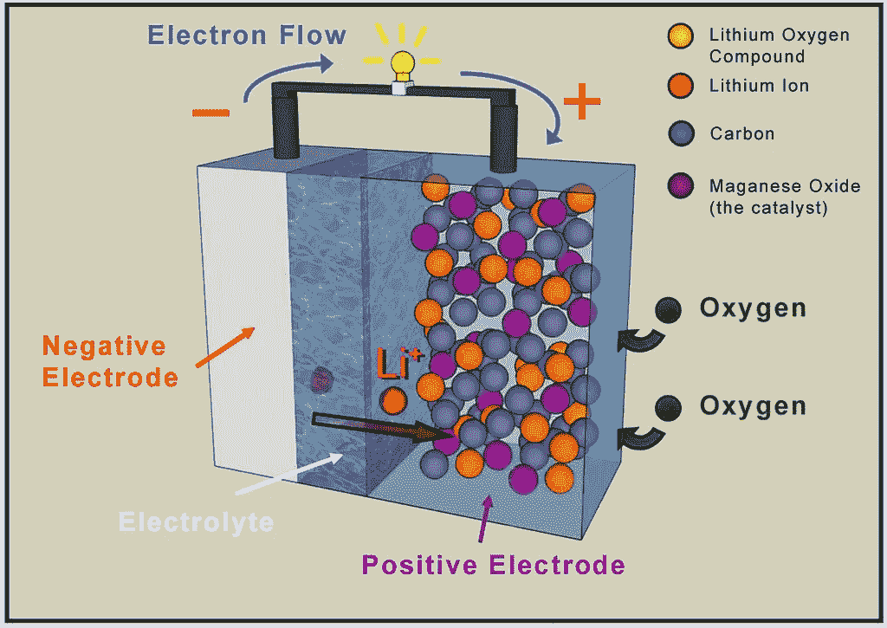

# “终极电池”最终会克服特斯拉续航里程焦虑吗？

> 原文：<https://medium.datadriveninvestor.com/will-the-ultimate-battery-finally-overcome-tesla-range-anxiety-f85c66a3c2f2?source=collection_archive---------6----------------------->

The 2020 Tesla Model-S home-charging with a wall connector ([Tesla](https://www.tesla.com/support/home-charging-installation/wall-connector))

特斯拉的营销令人印象深刻；他们的车辆更是如此。在不到十年的时间里，他们凭借性能、创新和功能的完美结合，以及比传统汽油车更低的燃料和维护成本，重塑了汽车行业。

然而，有些东西不见了:尽管公众对特斯拉汽车的兴趣高涨，但他们仍在努力在主流市场找到一席之地。部分原因是初始车辆成本较高，这为消费者进入市场设置了实质性障碍，但这还不是全部原因。还有一些其他的因素也阻碍着他们:[距离焦虑](https://en.wikipedia.org/wiki/Range_anxiety)。

虽然普通美国人每天只驾驶大约 [31.5 英里](https://aaafoundation.org/wp-content/uploads/2018/02/18-0019_AAAFTS-ADS-Research-Brief.pdf)，但对长途旅行中因电动汽车电池耗尽而搁浅的担忧正在抑制电动汽车的销售——并且仍然是消费者对电动汽车最大的担忧。

美国汽车协会最近的一项调查表明，“57%的美国人认为他们会在开车的时候超出行驶里程，58%的人认为没有足够的地方给电动汽车充电。”尽管 95%的电动汽车车主表示他们开车时从未超出行驶里程，但这些担忧依然存在。

特斯拉和其他电动汽车制造商已经采取了许多措施来消除这些担忧，但最终解决里程焦虑的办法只能来自电池技术的改进。今天的电动汽车使用的锂离子电池已经实现了 250 英里[的 EPA 行驶里程](https://en.wikipedia.org/wiki/Tesla_Model_3)和真正卓越的车辆性能，但仍有许多工作要做。

Volvo found that 58% of respondents cited range anxiety as a barrier for purchasing an EV. ([The Drive](https://www.thedrive.com/news/26637/americans-cite-range-anxiety-cost-as-largest-barriers-for-new-ev-purchases-study))

# 锂离子电池

特斯拉汽车由各种电池组中的数千个锂离子电池提供动力，功率从 60 到 100 千瓦时不等。每个单独的电池都类似于[松下 NCR18650B](https://blog.evandmore.com/lets-talk-about-the-panasonic-ncr18650b/) ，使用镍-钴-铝阴极，每千克提供约 265 瓦时(Wh/kg)。

由于特斯拉可以轻松地制造更多电池单元的更大电池组，以适应更高需求的应用，最重要的是单个电池的限制，因为它们累积起来决定了电池组的输出。另一个因素是电池可以处理的充电/放电循环次数，目前特斯拉 Model S 的充电/放电循环次数约为 [1，000 到 2，000](https://www.forbes.com/sites/arielcohen/2020/12/30/teslas-new-lithium-ion-patent-brings-company-closer-to-promised-1-million-mile-battery/#6b165b0433e3) 。

Thousands of individual Li-Ion cells are used in each EV ([Tesla](https://www.tesla.com/blog/bit-about-batteries))

锂离子电池的技术可以追溯到 20 世纪 80 年代，在正极使用锂化合物，在负极使用石墨，比能范围为 100-265 Wh/kg，或 0.36-0.875 兆焦耳/千克(MJ/kg)。

与 20 世纪占主导地位的碱性、铅酸和镍镉电池相比，锂离子电池是非凡的，但今天的高耗电应用正将其推向极限，因此化学家们正转向创新以获得更好的性能。

例如，特斯拉正在研究一种在 2000 次充电重复后仍能保持 95%充电容量的新技术，他们称之为[百万英里电池](https://www.businessinsider.com/million-mile-battery-tesla-miles-lifetime-2019-11)，而其他科学家正在开发[硅阳极](https://www.wired.com/story/welcome-to-the-era-of-supercharged-lithium-silicon-batteries/)、[锂硫化学](https://en.wikipedia.org/wiki/Lithium%E2%80%93sulfur_battery)、[固态设计](https://www.nature.com/articles/nenergy201630.epdf?referrer_access_token=5i3y1mZrGy_kKipSO7yPxNRgN0jAjWel9jnR3ZoTv0N-TMm1Fh77xQXCRrgGhxQTDa8w5dp-TsrElRJSOOGLhVjf88J5Y8Nh-z9roht2cflpbjKeuy398l-Z2N7qJYTxnLhqZ4YYm8FsjaVlORiDhCl1_12uebVdh1B12auUcX-BIQsLTIS2HMXZceQu2czJ2cLd1HWdJcJa6YBKHRMC1PhcCvp9wOxt_2f9hGeqoelAo4kKjo4lUDRL21b6kMO9&tracking_referrer=arstechnica.com)和[高级电池管理](https://industrial.panasonic.com/sa/applications/automotive/bms)技术。

所有这些技术都将为锂离子电池技术提供有意义的改进，但它们只是渐进的进步，而不是游戏规则的改变者。然而，一项真正的突破已经在开发中，那就是所谓的“终极”电池。

The 85 kW/hr battery pack from a Tesla Model-S ([Qnovo](https://qnovo.com/peek-inside-the-battery-of-a-tesla-model-s/))

# 锂空气电池

据说早在 1995 年，化学家 K M .亚伯拉罕在测试锂离子电池时，其中一个电池出现了小漏洞——这导致了重大的结果。这种细胞释放的能量远远超过了它应该释放的能量，这让他开始寻找原因。

结果是[锂空气](https://en.wikipedia.org/wiki/Lithium%E2%80%93air_battery):一种新的电池化学物质，利用阴极的锂反应和阳极的氧反应产生比锂离子电池高得多的比能。

New lithium-air battery survives hundreds of cycles ([Ars Technica](https://arstechnica.com/science/2018/03/new-lithium-air-battery-survives-hundreds-of-cycles/))

高多少？理论上，它们可以储存约 40.1 MJ/kg，或约 85%的汽油比能，其重量为约 46.8 MJ/kg。这比现有电池高出约 45 倍——尽管实际原型迄今为止仅实现了约 6.12 MJ/kg 的比能量——仍比锂离子电池高出 5 倍。

锂空气电池的真实性能和非凡潜力最终将转化为更少的电池，更低的生产成本，以及车辆里程和性能的大幅增加，这使得[特斯拉正在申请锂空气电池专利](https://insideevs.com/news/332423/new-tesla-patent-lists-method-for-charging-lithium-air-battery/)也就不足为奇了。

锂空气电池为电动汽车提供了在里程和功率方面大大超过当今最好的汽油和柴油发动机的潜力，因为摩擦和热量损失了能量——目前只有大约 13%的实际能量在损失后传递给车轮。

尽管锂空气电池的未来前景令人难以置信，但这项技术的当前状态仍处于开发阶段，并且正在努力克服储能限制、[电解质](https://iopscience.iop.org/article/10.1149/2.086202jes)和[空气阴极堵塞](https://www.sciencedirect.com/science/article/pii/S2590049819301055)等问题，这些问题都需要在这些电池准备好投入商业使用之前得到解决。

Lithium-Air battery schematic from the Tesla patent filing ([Inside EEVs](https://insideevs.com/news/332423/new-tesla-patent-lists-method-for-charging-lithium-air-battery/))

# 结论

二十多年来，锂离子电池一直是电子产品中移动电源存储的主力，也是使特斯拉这样的现代电动汽车成为可能的变革性因素。

然而，随着我们接近锂离子化学的极限，消费者对产品系列的担忧和成本考虑正在推动各种新技术的创新，以增强和取代这种老化的技术，包括用具有更高储能能力的锂空气技术取代。

锂空气即将到来，但要成为主流还需要一段时间。与此同时，特斯拉继续就这项技术以及“百万英里电池”等临时解决方案申请专利，作为为未来道路提供消费者友好型电动汽车的更大努力的一部分。