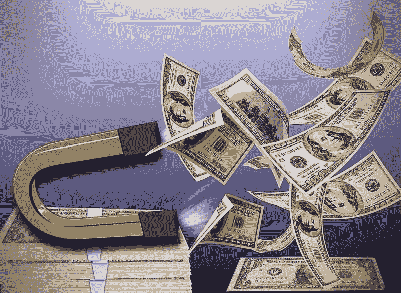
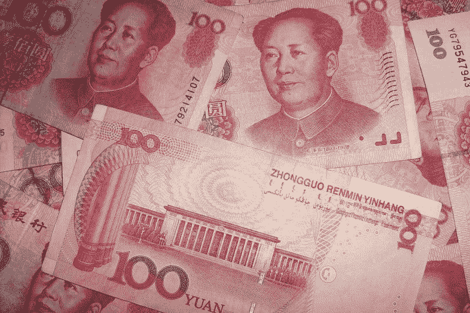

# 2021 年美元会崩盘吗？—市场疯人院

> 原文：<https://medium.datadriveninvestor.com/will-the-us-dollar-collapse-in-2021-market-mad-house-b31246dd1e14?source=collection_archive---------21----------------------->

2021 年，美元作为世界储备货币的统治地位可能会终结。

储备货币是中央银行和公司用于国际交易的法定货币。当美国在第二次世界大战期间成为世界主导力量时，美元成为储备货币。

美元可能会崩溃，因为储备货币需要美国可能缺乏的三个属性。这些属性是:

1.由军事上占优势的大国发布。

2.由最大和最有影响力的经济体发行。

3.由一个有稳定政府的稳定国家发行。

美国是一个军事上占主导地位的大国，但军事实力在当今世界并不那么重要。请记住，自 1945 年以来没有发生过大国战争，核武器的存在使得大国冲突不太可能发生。

这意味着美国庞大的军事力量与国际关系无关。记住，你不能花费航空母舰和核弹。

在 20 世纪，苏联认识到单靠军事力量并不能成为超级大国。我认为美国将很快吸取教训。

# 中国比美国富裕吗？

美国作为世界最大经济体的角色已经受到质疑。 *Investopedia* 估计中国在一项用于经济分类的标准上已经超过了美国。

为了解释这一点，2020 年 12 月，中华人民共和国的[购买力平价(PPP)调整后的 GDP 为 23.52 万亿美元](https://www.investopedia.com/insights/worlds-top-economies/)。相比之下，美国经购买力平价调整后的 GDP 为 21.43 万亿美元。另一方面，2020 年，美国的名义国内生产总值(GDP)为 21.43 万亿美元，而中国为 14.34 万亿美元。相反，华盛顿邮报声称中国的 GDP 将在 2020 年首次超过 15 万亿美元。

此外，中国的 GDP 可能很快就会超过美国。[中国国家统计局估计，中国第四季度国内生产总值增长 6.5%。然而，因为冠状病毒，中国 2020 年的年度 GDP 仅增长了 2.3%。](https://www.washingtonpost.com/world/asia_pacific/china-economy-growth-coronavirus/2021/01/17/2138ef2c-5935-11eb-a849-6f9423a75ffd_story.html)

相比之下，据《环球时报》估计，由于新冠肺炎的影响，美国的年 GDP 在 2020 年下降了 3.6%。因此，中国经济在增长，而美国经济在萎缩。

此外，*华盛顿邮报*报道，中国官员声称中华人民共和国的出口额在 2020 年创下 2.6 万亿美元的历史新高。同样，中国对美国的贸易顺差在 2020 年达到创纪录的 3169 亿美元。

因此，许多人想知道，在中国如此快速增长的情况下，美国的主导地位还能保持多久。可以预见的是，许多国家的领导人都有这样的疑虑，并采取了相应的行动。

值得注意的是，欧盟(EU)通过欧盟委员会(EU 的执行机构)与中华人民共和国之间的[全面投资协定(CAI)](https://ec.europa.eu/commission/presscorner/detail/en/IP_20_2541) 承认了中国的主导地位。CAI 将使欧洲人更容易在中国投资。然而，欧洲议会将需要批准蔡。

蔡惹恼了许多美国人；包括当选总统乔·拜登，因为欧洲人没有把美国人包括在会谈中。但是，这是美国的失败，因为美国没有办法阻止它。事实上，欧洲人忽视了美国人对 CAI 输入的要求。

# 2028 年，中国可能成为世界上最大的经济体

欧盟采取行动的一个原因是经济和商业研究中心(CEBR)预测中国将在 2028 年成为世界上最大的经济体。据英国广播公司报道，CEBR 是英国智库，CEBR 经济学家计算，到 2030 年，美国将成为仅次于中国和印度的世界第三大经济体。

具体而言，经济学家预测中国的 GDP 将在 2025 年前每年增长 5.75%，在 2026 年至 2030 年间每年增长 4.5%。然而，CEBR 的专家认为，同期美国经济每年只会增长 1.6%-1.9%。

因此，仅仅七年后，美国将不再是世界上最大的经济体。如果美国成为第二或第三大经济体，我看不出美元将如何保持世界储备货币的地位。

# 美国的不稳定会扼杀美元吗？

2021 年 1 月 6 日，一群狂热的特朗普支持者占领了美国国会大厦，这是美国政治不稳定的唯一最新例子。

由于政府效率低下，美国政治不稳定。占领国会大厦只是美国政府的最新失败。一个更大的失败是美国无力应对冠状病毒及其经济影响。

不稳定和无效的政府表明，美国不再是一个可信的超级大国，也可能不是一个伟大的力量。欧洲正转向中国，因为其领导人认为他们不能再依赖美国了。

# 美元是如何消亡的

我认为美元下跌的最佳指标是**比特币(BTC)** 加密货币价格的突然爆发。

例如，在冠状病毒之前，市场先生在 2020 年 1 月 15 日为一个比特币支付了 8808.81 美元，在新冠肺炎一年之后，在 2021 年 1 月 18 日为一个比特币支付了 35816.48-36763.14 美元。比特币的美元价格在一年内翻了两番。

我认为比特币的价格爆炸是因为全世界数百万人正在寻求美元替代品。大量的人怀疑美元即将崩溃，因此他们正在寻找一种替代货币。请注意，美国的情况越糟糕，比特币的价格就越高。

显然，比特币是一种可怕的美元替代品，它笨重、不可伸缩、难以获取，而且在某些地方是非法的。然而，比特币是数百万人唯一实用的美元替代品。

不仅仅是比特币，美元兑欧元汇率从 2020 年 1 月 15 日的 0.90€跌至 2021 年 1 月 18 日的 0.83€。因此，我计算出美元在一年内损失了大约 7%的购买力。如果这种趋势持续下去，美元对€的汇率可能在 2022 年跌至 0.76，对€的汇率可能在 2023 年跌至 0.69。

# 美元崩溃不可避免吗？

如果美元继续下跌，我看不出美国将如何避免通货膨胀和资本外逃。不幸的是，我看不出美国如何能够在不进行重大结构性变革和政治改革的情况下扭转这种衰落，而这可能需要几十年的时间。

此外，在目前的美国政治环境下，这样的改革是不可能的。我认为 2021 年 1 月 6 日的[事件](https://marketmadhouse.com/the-authoritarian-impulse-and-mob-rule/)表明美国可能处于长期社会动荡或某种革命的边缘。

值得注意的是，1 月 6 日有一种革命的味道，袭击国会大厦的人群表现得像一群暴民。新闻报道称，一些暴徒正在寻找政治领导人，意图杀害他们。

例如，一些暴徒成员高呼“[绞死迈克·彭斯，](https://www.washingtonpost.com/politics/pence-rioters-capitol-attack/2021/01/15/ab62e434-567c-11eb-a08b-f1381ef3d207_story.html)”*《华盛顿邮报》报道*。彭斯是当时在国会大厦的美国副总统迈克·彭斯(印第安纳州共和党人)。新闻照片显示，暴徒成员在国会大厦外搭建了一个绞索脚手架。

我想只需要再来一次爆炸。如国会大厦暴动，使美元贬值。因此，所有投资者和投机者都需要问一问，如果美元崩溃会发生什么。

# 如果美元崩溃会发生什么？

美元崩溃的一些可能影响可能是:

美国的通货膨胀。

C 来自美国的 apitol 航班。

L 美国缺乏外国投资。

美国股票市场暴跌。注意:我认为美国股票价格将在一年或更长时间内保持高位，因为美国人没有其他地方可以投资。

中国股市的增长。值得注意的是，上证综指从 2016 年 1 月 22 日的 2916.56 点上涨至 2021 年 1 月 15 日的 3566.38 点。

M 将资金投入美元替代品，如中国或欧洲股市、标准普尔 500 指数、欧元、**比特币(BTC** )、黄金、英镑、瑞士法郎等。

美国政府为支撑美元和保持美国经济主导地位所做的努力。

美国政府破坏或遏制中国经济增长的努力。

# 储备货币如何消亡

在这些事态发展中，我认为我们最需要担心的是美国政府支撑美元的努力。从历史上看，支撑最后一种储备货币英镑的主要努力加速了这种货币的灭亡。

1925 年 4 月 28 日，财政大臣温斯顿·丘吉尔宣布英国回归金本位。丘吉尔希望金本位制能让英镑回到第一次世界大战前的价格。相反，经济学家估计丘吉尔的决定使英镑贬值了 10%。

基于黄金价格的英镑增加了它的价值。高估的英镑对英国经济造成了严重破坏，削弱了联合王国和大英帝国。

被高估的英镑提高了英国出口商品的价格，这扼杀了英国工业的就业机会，并驱使消费者转向美国的替代品。联合王国的失业人数增加了 70 万，导致社会和政治动荡以及全国大罢工。

不到 20 年后的二战期间，美元正式取代英镑成为世界储备货币。市场先生；然而，在 1925 年就已经选择了新的储备货币。

# 为什么你需要关注美元

聪明的投资者和投机者需要关注美元，因为它作为世界储备货币的日子屈指可数了。

不幸的是，我不知道什么将取代美元成为储备货币。尽管我认为欧元可以作为短期的替代品。

然而，我预测，那些做空美元的人可能会在未来几年赚得盆满钵满。

*原载于 2021 年 1 月 18 日*[*【https://marketmadhouse.com】*](https://marketmadhouse.com/will-the-us-dollar-collapse-in-2021/)*。*