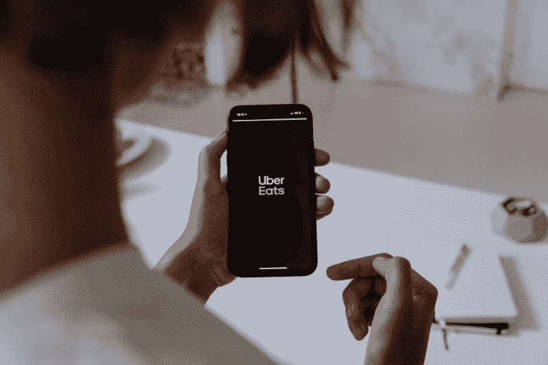

# 优步(Uber)会用 Postmates 赚钱吗？—市场疯人院

> 原文：<https://medium.datadriveninvestor.com/will-uber-uber-make-money-with-postmates-market-mad-house-9b96247ec5a9?source=collection_archive---------29----------------------->

优步(UBER) 首席执行官达拉·科斯罗萨西(Dara Khosrowshahi)在 2020 年纠正了他的公司最大的错误之一。【2020 年 12 月，优步科技公司 [以 26.5 亿美元](https://techcrunch.com/2020/12/01/uber-officially-completes-postmates-acquisition/?guccounter=1)收购了 Postmates。

收购 Postmates 让优步重新获得了一些在 2018 年结束杂货交付合作伙伴关系时失去的交付能力。为了解释，优步在 2016 年至 2018 年期间与**沃尔玛(WMT)** 和其他公司建立了杂货交付合作关系。

据路透社报道，不幸的是，[优步对送货不认真](https://www.reuters.com/article/us-walmart-grocery-delivery-exclusive/exclusive-walmarts-grocery-delivery-partnerships-with-uber-lyft-fail-to-take-off-idUSKBN1I91S4)，这导致沃尔玛在 2018 年终止了合作关系。冠状病毒疫情；然而，改变了 Khosrowshahi 对交货的想法。

# 冠状病毒重创优步

截至 2020 年 6 月 30 日的季度收入增长率为-29.22% 等数字促使 Khosrowshahi 加倍交付。解释一下，Uber Eats 成为这家拼车巨头唯一增长的业务。

例如，Statista 估计，2020 年第一季度，Uber Eats 的业务增长了 53%。Uber Eats 的增长是因为冠状病毒把人们困在家里，但他们仍然不想做饭。

同样，人们乘坐优步的次数减少了，因为新冠肺炎关闭了他们通常去的地方。这些地方包括:办公室、夜总会、餐馆、体育赛事、电影院和剧院。因此，优步报告亏损 29 亿美元，并在 2020 年第一季度解雇了 14%的司机。

# 收购 Postmates 对优步来说是明智之举吗？

在这种情况下，我认为收购 Postmates 是优步的明智之举。

例如，我估计购买 Postmates 可以给优步 30%的美国食品配送市场。为了解释这一点，Statista 估计，2020 年 5 月，Uber Eats 占据了美国食品配送市场 22%的份额。与此同时，Statista 估计 Postmates 拥有美国食品配送市场 8%的份额。

反过来，Postmates 也没有 Uber 吃的突出。具体来说，Statista 估计，2020 年 4 月，335 万美国人搜索了 Uber Eats。然而，150 万美国人在同一月份搜索邮戳。

然而，Uber Eats 和 Postmates 的可见性仍然远远低于两个最大的送餐应用。例如，Statista 估计 2020 年 4 月有 914 万美国人搜索 Instacart。同样，同月有 748 万美国人搜索 Doordash。

# Instacart 比 Uber Eats 更受欢迎吗？

Instacart 比 Uber Eats 和 Postmates 更受欢迎，因为它是在杂货业务中。因此，如果优步想要真正的增长，它需要重新进入食品杂货业。

显然，对优步来说，一个聪明但不太可能的举措是收购。然而，我怀疑 Instacart 对优步来说太贵了。因此，我认为像这样的大型杂货商可以对 Instacart 开出巨额报价，让它脱离优步的掌控。值得注意的是，克罗格是 Instacart 的主要合作伙伴之一。

我认为优步购买 Postmates 是提供杂货递送服务的第一步。解释一下，Postmates 已经有了在 2020 年每月交付[500 万次的经验](https://www.businessofapps.com/data/postmates-statistics/)，*应用程序业务*估计。

2020 年，Postmates 为 4200 个城市的 60 万商家提供服务，*商务应用*声称。Postmates 像杂草一样增长，*商务应用*估计 Postmates 每月的交付量从 2016 年的 150 万增加到 2018 年的 400 万，2020 年的 500 万。

相比之下，Postmates 商家的数量从 2018 年的 25 万增长到 2019 年的 40 万，再到 2020 年的 60 万。因此，我认为优步收购了一家发展最快的快递公司。然而，我认为优步将需要进入食品杂货递送业务，以生存和赚钱。

# 优步损失了多少钱？

2020 年，优步(Uber)损失了巨额资金。例如，优步报告称，截至 2020 年 3 月 31 日，其季度运营亏损为-12.63 亿美元。

截至 2020 年 6 月 30 日，季度运营亏损增长至-16.07 亿美元。最后，2020 年 6 月 30 日，季度运营亏损缩减至-11.16 亿美元。

同样，优步的季度毛利从 2020 年 3 月 31 日的 17.57 亿美元降至 2020 年 6 月 30 日的 9.89 亿美元，再降至 2020 年 9 月 30 日的 15.15 亿美元。总体而言，优步的季度收入从 2020 年 3 月 31 日的 35.43 亿美元降至 2020 年 6 月 30 日的 22.41 亿美元和 2020 年 9 月 30 日的 31.29 亿美元。

相比之下，优步的季度运营现金流从 2020 年 3 月 31 日的-4.63 亿美元降至 2020 年 6 月 30 日的 10.71 亿美元，再降至 2020 年 9 月 30 日的-4.06 亿美元。此外，优步的季度期末现金流从 2020 年 3 月 31 日的 95.29 亿美元降至 2020 年 6 月 30 日的-14.28 亿美元和 2020 年 9 月 30 日的-3.35 亿美元。

此外，优步借了更多的钱。优步的季度融资现金流从 2020 年 3 月 31 日的-6300 万美元增长到 2020 年 6 月 30 日的 1.18 亿美元，再到 2020 年 9 月 30 日的 4.28 亿美元。此外，优步的长期债务从 2020 年 3 月 31 日的 57.03 亿美元增长到 2020 年 6 月 30 日的 66.9 亿美元，并在 2020 年 9 月 30 日降至 66.67 亿美元。

最后，优步的负债总额从 2020 年 3 月 31 日的 180.62 亿美元降至 2020 年 6 月 30 日的 180.01 亿美元。然而，2020 年 9 月 30 日，负债总额增至 192.61 亿美元。

# 优步有什么价值？

鉴于这些数字，我认为优步需要快速发展其快递业务才能生存。优步仍然保留着一些价值，然而，优步正在失去价值。

例如，优步在 2020 年 9 月 30 日有 75.04 亿美元的现金和短期投资。现金和短期投资从 2020 年 3 月 31 日的 111.14 亿美元降至 2020 年 6 月 30 日的 96.62 亿美元。

相比之下，优步的总资产从 2020 年 3 月 31 日的 300.9 亿美元降至 2020 年 6 月 30 日的 282.4 亿美元和 2020 年 9 月 30 日的 288.94 亿美元。因此，优步在 2020 年已经失去了价值。

# 优步是好股票吗？

奇怪的是，优步的股票价格随着其价值和收入的下降而上升。例如，市场先生在 2020 年 1 月 10 日为优步支付了 34.01 美元，在 2020 年 6 月 11 日跌至 31.10 美元。

相反，优步的股价在 2020 年 1 月 12 日上涨至 58.54 美元。因此,“市场先生”为一家毫无价值的公司支付了更多的钱。因此，市场先生是疯狂的。

显然，我认为投资者需要避开**优步(纽约证券交易所代码:优步)**，因为市场先生定价过高。尽管价格高，我认为优步可以生存下来，并在未来赚钱。投资者需要关注优步，用 Uber Eats 点餐，同时远离优步股票。

*原载于 2021 年 1 月 12 日 https://marketmadhouse.com***。**