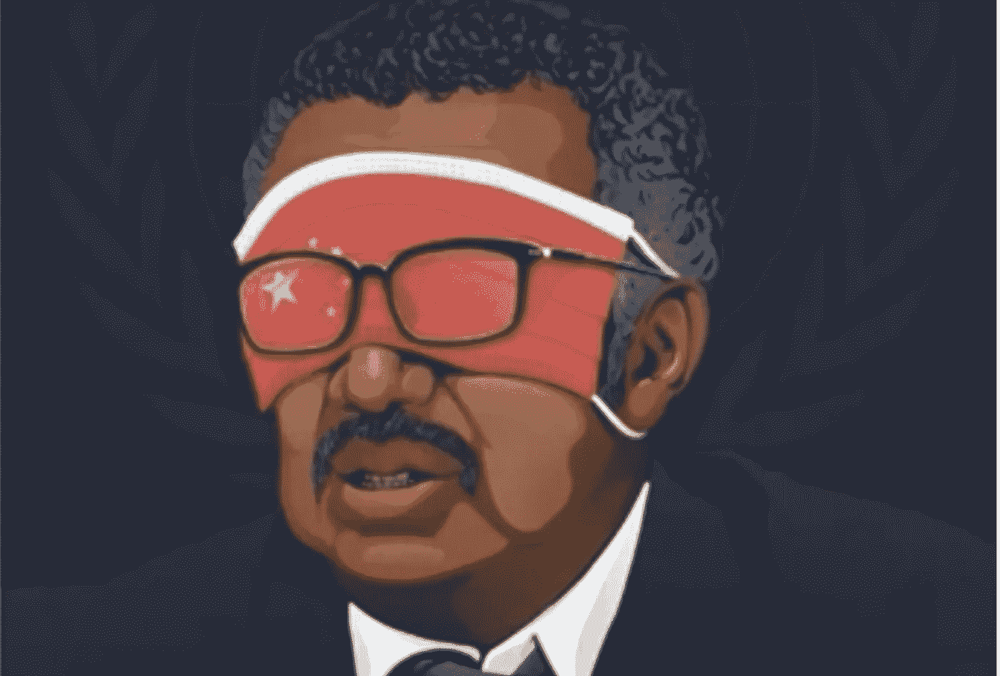

# 世界能够原谅中国吗？

> 原文：<https://medium.datadriveninvestor.com/will-world-be-able-to-forgive-china-b0f8da1f4f7?source=collection_archive---------10----------------------->

## 这个疫情，中国和世界到底哪里出了问题，谁该为全世界人民的死亡负责？

> 只想花一点时间欣赏每个人阻止、控制新冠肺炎病毒传播的努力。请待在室内并保持安全，帮助系统赢得更多时间来保护你的亲人和你的国家的公民。

特朗普表示，如果我们能够将美国的死亡人数保持在 10 万人以下(这是一个可怕的数字)，这将是美利坚合众国的一项伟大成就。

一些研究人员预测美国约有 200 万人死亡。

截至今天，如果你看看冠状病毒的数量，它已经在全球范围内达到 85 万，其中 4.2 万人死亡。预计这一数字还会导致病例数量激增。

 [## 实时更新:美国人被告知为 20 万冠状病毒死亡做准备，因为世界领导人推动危机…

### 遭受病毒袭击的西班牙周二报告了 849 例新的死亡病例，这是疫情爆发以来最糟糕的 24 小时，已造成 8189 人死亡…

www.washingtonpost.com](https://www.washingtonpost.com/world/2020/03/31/coronavirus-latest-news/) 

许多国家如印度和俄罗斯处于完全封锁状态，并尽最大努力控制病毒传播。

有些事件载入了历史，改变了世界，比如不幸的 9/11，它影响了整个世界，一个不同的世界从隧道的另一边出现了。

> 同样，在这个疫情之后，一个新世界将会出现，正如我们所知，它将会非常不同。

# 谁对这个疫情负责？

川普说，世界正在为中国对新冠肺炎在武汉市和湖北省其他地区爆发的最初和长达数周的掩盖付出巨大代价。

许多人称之为“中国病毒”，这不是因为他们对中国人民有一些仇恨，而是中国政府。他们隐藏信息，他们试图掩盖，他们建议其他国家不要因为害怕病毒而停止旅行。

 [## 保护主义、政治和经济动荡|数据驱动的投资者

### 美国股市昨日出现 400 多点的大幅反转，为未来的事情发出了警告信号。市场…

www.datadriveninvestor.com](https://www.datadriveninvestor.com/2018/06/28/protectionism-politics-economic-turmoil/) 

它始于 2019 年 11 月，每天有 1-5 例病例，政府在 1 月 21 日通知了自己的公民。与此同时，武汉人可以在全国各地和世界各地旅行。这使得病毒在世界范围内传播，导致数百万人死亡。

# 中国犯过的错误…并且还在犯。

## 1.人们的聚会

如果中国共产党更关心自己的声誉，而不是中国人民的苦难，他们实际上已经通过减少至少 66%的生命损失拯救了世界。

## 2.菜市场

另一个至今仍未解决的大错误是湿货市场，这将导致另一个像这样的疫情。

那正是 2003 年非典和新冠肺炎疫情从野生动物传染给人类开始的地方，从那以后就没有停止过。

有 97%的未知病毒是我们不知道的，如果不加以阻止，它们可能会传染给人类，引发另一场疫情病毒。

自从迎合中产阶级上层人士的“异国情调”需求以来，这个市场一直在蓬勃发展。即使在 03 年非典爆发后，中国政府也没有对这个市场采取任何行动。

 [## 新冠肺炎效应下降:中国重新开放市场出售蝙蝠，猫和狗-中国致命的湿…

### 中国臭名昭著的“菜市场”已经重新开放，出售蝙蝠、穿山甲和狗供人食用。中国的…

economictimes.indiatimes.com](https://economictimes.indiatimes.com/news/international/world-news/covid-19-effect-dips-china-reopens-markets-selling-bats-cats-and-dogs/chinas-deadly-wet-markets-are-back/slideshow/74925019.cms) 

## 3.共产主义政权

信息不透明，所有揭发新冠肺炎的人都被封了口。我们知道有一名医生因为对这种“未知的”肺炎病毒提出警告而被监禁。

 [## 中国赦免因警告病毒而被斥责的医生

### 中国宣布一名医生无罪，这名医生因对冠状病毒爆发发出警告而受到正式谴责，后来死亡…

www.cnbc.com](https://www.cnbc.com/2020/03/20/china-exonerates-doctor-reprimanded-for-warning-of-virus.html) 

## 仍然不承认他们的错误

中国甚至出版了一本书，在书中他们指责美国传播冠状病毒。

# 世界所犯的错误。

## 1.沦为中国宣传的牺牲品

当疫情开始时，有很多媒体人和作家在传播这种病毒，中国政府尽最大努力压制对新冠肺炎的恐惧。

甚至在意大利也有中国人站在不同的公共场所要求人们拥抱他们的活动。

**当人们的注意力应该放在为这个崛起的疫情做准备的时候**，每天大约有 80 万中国人飞往欧洲。但是意大利人和世界低估了这个疫情，并同情中国人民。

## 2.不反对中国

没有对中国在之前的大流行中的粗心大意采取行动。2013 年左右，又报告了两种类似 H5N1 和 H7N9 病毒的病毒，但没有对中国松散处理这种情况的行为采取行动。

## 3.中国对世卫组织的影响

Source: Study IQ

中国向世卫组织提供了良好的财政援助，因此世卫组织在新冠肺炎疫情问题上支持了中国一段时间。世卫组织总干事，[谭德塞说](https://edition.cnn.com/asia/live-news/coronavirus-outbreak-02-04-20/h_267d4c445f4bf4730abca05eccc62c67):

> “大范围的旅行禁令和限制并不需要阻止疫情的爆发，但可能会“增加恐惧和耻辱，对公共卫生没有什么好处”。“他警告说，干扰运输和贸易可能会损害解决危机的努力，并建议其他国家不要效仿美国。”

他甚至称赞中国政府领导层展现了“**罕见的领导力**”，并对“**透明**”大加赞赏。

除非我们能看到事情的本来面目。数百万人的生命和数万亿美元本可以被挽救。

# 结论

意大利已经在向中国寻求战争赔偿，因为如果这不是战争，那是什么？中国已经通过向西班牙等受影响的国家运送物资赚了很多钱。有些甚至不合标准！

 [## 中国从冠状病毒中获利，向西班牙出售价值 4 . 67 亿美元的物资，其中一些是不合格的

### 随着新型冠状病毒继续其在世界各地的恶魔般的跋涉，一些国家发现自己处于…

www.foxnews.com](https://www.foxnews.com/world/china-money-coronavirus-spain-467-million-faulty-supplies) 

如果疫情得不到控制，美国和欧洲的许多银行可能会申请破产。

中国将几乎不受此次疫情的影响，因为他们拥有价值 3 万亿美元的外汇储备，这将有助于中国在世界经历衰退时几乎不受影响。

> 在这一切结束后，世界会睁开眼睛看清现实，并试图阻止即将到来的不可避免的威胁吗？
> 
> 或者这也将像我们人类必须经历的另一个疫情一样，等待下一个？