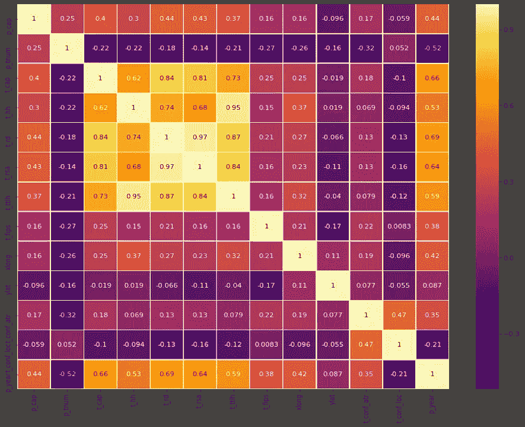
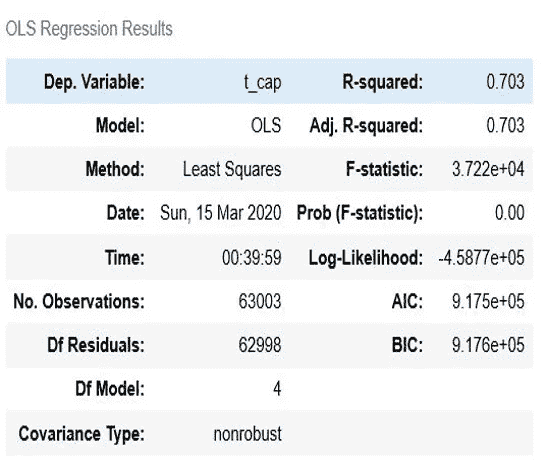
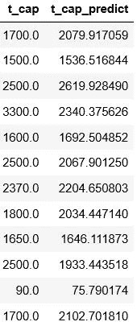

# 风力涡轮机:容量预测

> 原文：<https://medium.datadriveninvestor.com/wind-turbines-predicton-of-the-capacity-97afbd2f1898?source=collection_archive---------9----------------------->

> *将线性回归应用于风力涡轮机数据*

作为伊斯坦布尔数据科学学院的学生，我们的任务是建立一个线性回归模型来完成我们的第二个个人项目。

作为一名工程系学生，我想用这种算法来解决能源领域的一个问题，所以我从美国地质调查局获得了一个数据集来预测风力涡轮机的容量。嗯，据我们所知，我们的世界资源有限，因此在这十年里，重大的转变正在发生。我们都知道特斯拉、太阳能电池板和风力涡轮机，但这些可再生能源系统的效率仍然不高。然而，它们有巨大的潜力；科学家和工程师努力优化这些系统和更多的系统。因此，在这种情况下，我的线性回归模型的目标是测量涡轮机特性对涡轮机容量的影响程度。

> 我试图回答的问题是“风力涡轮机的最佳优化设计是什么，以达到我需要的容量(千瓦)

# 数据分析

为了回答我上面提出的问题，我检查了一个数据集，其中包括来自 45 个州和 542 个县的 63003 个实体。我将我的数据分为两组:涡轮机特性和位置信息。

 [## 认知计算——一套被广泛认为是……

### 作为它的用户，我们已经习惯了科技。这些天几乎没有什么是司空见惯的…

www.datadriveninvestor.com](https://www.datadriveninvestor.com/2020/02/19/cognitive-computing-a-skill-set-widely-considered-to-be-the-most-vital-manifestation-of-artificial-intelligence/) 

第一组包括涡轮轮毂高度、涡轮转子直径、涡轮转子扫掠面积和涡轮总高度。我将州、县、fips、lat 和 long 要素作为位置信息。我很幸运拥有一个不混乱的数据集。由于这一点，我可以在基本分析后直接跳到建模。

Correlation Heatmap

这是关联热图，包含了我们两组的特征。由此得出的结论是，涡轮机特性确实与涡轮机容量相关。然而，我们不能对物流信息功能说同样的话。此外，在关联报告之后，我的模型中还增加了一个特性:生产年份。

# 初始模型

我开始建立我的线性回归模型，并计划我的步骤。在我的初始模型中，我仅从涡轮机特性组中获得特征，以提供基本的预测模型。以下是我的其他步骤:

*   OLS 统计建模
*   简单验证-线性回归和正则化
*   交叉验证-线性回归和正则化
*   模型比较

OLS regr model from statsmodel

如你所见，我得到了 0.703 的 r2 分数，不算差，但也不够。另一方面，我得到了一个非常糟糕的对数可能性分数。我必须最大化似然值，以获得最适合我的模型。

# 结论

这些是应用我上面提到的步骤的结果。

1.  在简单验证和交叉验证中，我在线性、脊形和套索模型中获得的分数大致相同。R2 得分平均为 0.718，均方差为 118028.7。
2.  我得到最高分的模型是交叉验证的线性回归模型，得分为 0.72。
3.  我的最终结论是，涡轮机特征和位置信息不足以做出正确的估计和建立稳健的回归模型，至少对于我所拥有的特征来说是如此。因此，我需要扩展我的数据和特性。

real capacities & predicted capacities

好了，帖子到此结束。我希望你在阅读的时候喜欢它。另外，如果你想看我的项目代码，也可以看看我的 github 简介。下一篇文章再见！