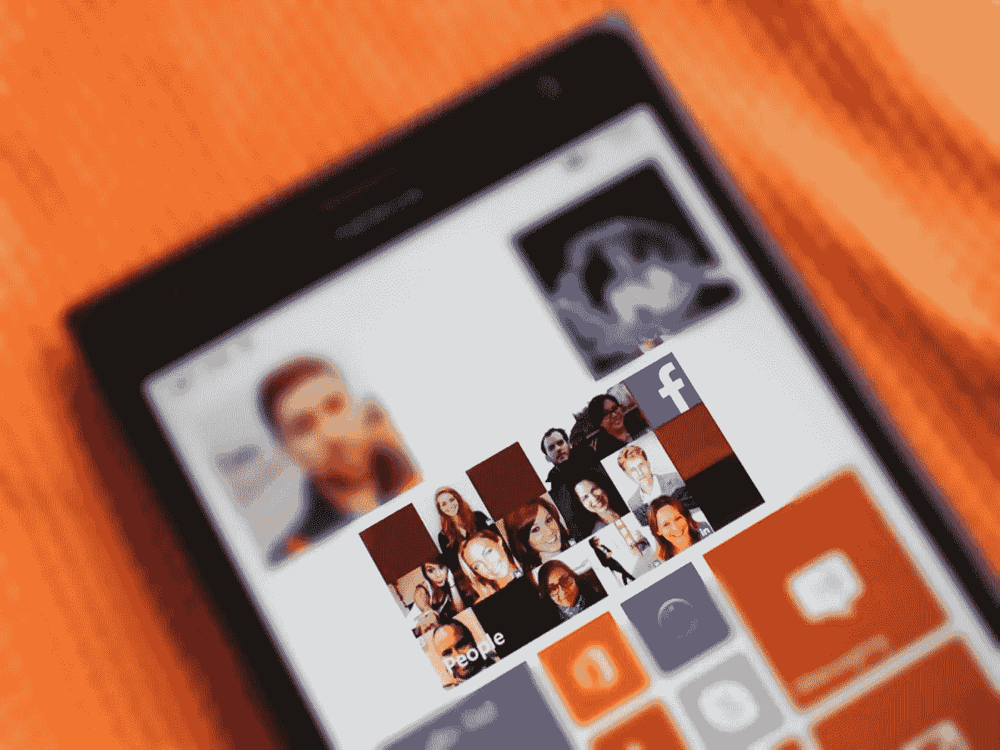
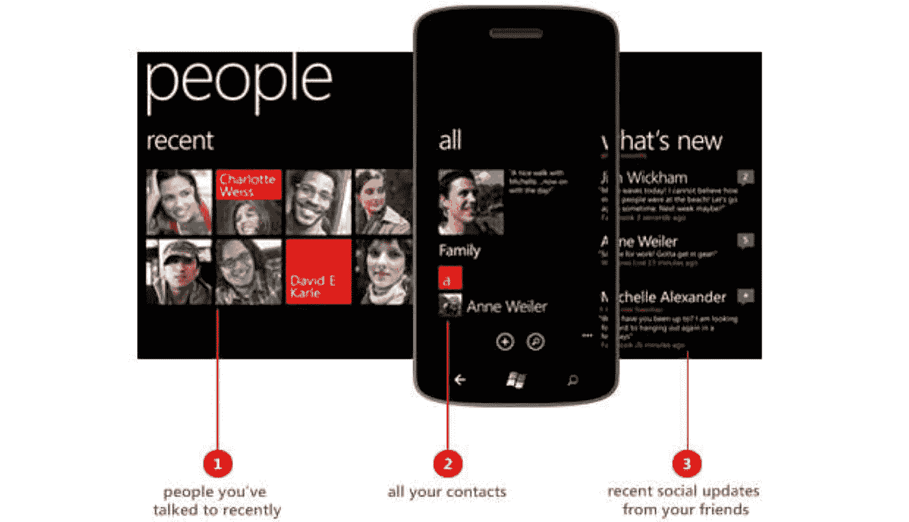

# Windows Phone 的人员中心非常适合故事和车队

> 原文：<https://medium.datadriveninvestor.com/windows-phones-people-hub-is-perfect-for-stories-and-fleets-c2f286849aa3?source=collection_archive---------9----------------------->

## 重新设想一个十年前未被充分利用的应用程序，它今天仍然适用

The People Hub. Source: Windows Central.

众所周知，Windows Phone 不再与 iPhone 12 或一加 8T 竞争。狂妄自大加上缺乏应用支持扼杀了微软对智能手机行业的雄心。但 Windows Phone 也有其新奇之处，在灰色手机的海洋中令人耳目一新。从引人注目的动态磁贴到跨应用程序的统一黑暗模式，其效果在今天的手机中仍然可以看到。对于那些想要一个为社交媒体平台设计的内容聚合器的人来说，People Hub 是一个天赐良机。起初并不是每个人都对这个想法感兴趣。

谷歌设计副总裁马蒂亚斯·杜阿尔特(Matías Duarte)将 Windows Phone 的设计美学比作“机场厕所标志”。尽管用功能换形式，苹果的 skeuomorphism 游戏还是很强劲。几年前，如果你告诉我[的 Android 4.0](https://en.wikipedia.org/wiki/Android_Ice_Cream_Sandwich) 和[的 iOS 7](https://www.bignerdranch.com/blog/apple-design-goes-flat-with-ios-7/) 将采用平面 UI 元素，我会觉得这种说法很荒谬。然而，我们在这里。

> Windows Phone 是一个显著的失败，但它的一些骨头仍然是成熟的。

曾经领先于时代的想法在 2020 年仍然有着惊人的相关性。随着 [LinkedIn](https://www.thedrum.com/news/2020/10/20/linkedin-rolls-out-stories-feature-worldwide) 甚至 [Spotify](https://gizmodo.com/there-are-now-stories-everywhere-even-on-spotify-1845770184) 采用 Snapchat 的故事，圈子到处跟着我们。称它们为伪装成朋友更新的末日滚动药丸，但在社交媒体平台上无法逃脱。对于那些有意志力浏览猫图片的人来说，追踪正确的来源甚至可以让它们成为合法的信息来源。无论哪种方式，都有大量荒谬的平台在争夺我们垂死的注意力。所有这些都迎合了不同形式的内容，无论是 Twitter 的短格式推文，LinkedIn 的“我正在做一些有用的事情”美学，还是抖音关于任何事情的短视频。但是，如果一个应用程序真的可以统治所有人呢？

The People Hub in action. Source: Microsoft.

# 重新发现人力资源中心

一个结合了几个社交媒体平台的应用程序听起来像是噩梦燃料，但请听我说完。Windows Phone 的 People Hub 做了更多的事情。它的个人资料可以存储一个人的所有社交媒体账户。是的，这是除了他们的联系信息。点击他们的名字会显示出一个整洁的提要，包括他们在各个平台上做过的所有事情。“最近”标签可以让你鸟瞰你倾向于与之互动的人，而不考虑平台。虽然这对于属于影响者或那些在多个账户上分享同一事物的人来说似乎是重复的，但我非常确定一种算法可以减少冗余的帖子。

 [## 移动网络 O2 发布英国首个无人驾驶汽车实验室测试使用 5G 和…

### 随着时间的推移，技术越来越强大。我们不仅成功地登上了月球，我们现在…

www.datadriveninvestor.com](https://www.datadriveninvestor.com/2020/11/24/mobile-network-o2-launch-uks-first-driverless-car-lab-testing-driverless-cars-using-5g-and-satellite-technology/) 

说到多余的帖子，like/react 按钮现在将服务于一个完全不同的环境。如果一个人点击了两个应用程序上的一个帖子，该行为会转到哪个平台？当然，你可以默认设置为“喜欢所有”，但是我更喜欢更精细的选项。故事也可以用这种方式处理，允许对朋友和名人发布的 24 小时更新做出各种反应。出于同样的原因，统一消息平台也没有坏处。团体和企业现在将有一个共同的平台来建立。

这一举措将大幅减少在多个平台上花费的时间，同时有效地为你提供同类内容。想想社交媒体影响者或增长黑客如何利用这一点一次在几个地方发帖。保持对你的观众的标签或回应标签将大大简化。

> 作为一个用户，你不必再在四个应用程序中滚动浏览相同的迷你图片。

诚然，广告行业可能不会对一款清理社交媒体的应用感到太高兴。减少花在网上的时间会直接损害广告的效果。跨平台的定向广告对最终用户来说听起来并没有更好。事实上，随着支付选项出现在 WhatsApp 上，People Hub 甚至可能有利于企业。电子邮件同步以及与 Discord、Slack 和微软团队等服务的集成也可以使这个中心服务于业务运营。工作和娱乐之间的平衡肯定是可以改善的。

Source: Twitter.

# People Hub 今天还能工作吗？

虽然这听起来像是我在鼓吹一个应用程序可以做所有的事情，但我不认为任何服务可以真正取代所有的社交媒体体验。毕竟，它们是根据不同的用例以及特定的受众而设计的。我想说的是，像微软的 People Hub 这样的应用程序可以作为内容聚合器与常规的社交媒体平台共存。这种方法与 Feedly 等 RSS 阅读器从网上获取信息或谷歌优秀的新闻标签不同，但它可以达到类似的目的。关注正确的主题和网站可以让你把握住特定趋势或整个行业的脉搏。这对社交媒体平台的有效使用有着巨大的影响。

如果你想减少花在迷因或猫视频上的时间，像 People Hub 这样的聚合器将帮助你与你认为重要的东西保持联系，而不是将你的灵魂出卖给了解你一切的平台。记住，你仍然在泄露你的信息，但是你现在可以控制你的时间花在哪里。将人们和他们的社交角色分成不同的类别，可以让你以一种前所未有的方式组织你的社交生活。微软也不是圣人，但它不像其他社交媒体平台那样涉足游戏。虽然它确实拥有 LinkedIn，但该平台并不以广告或引导你疯狂购物而闻名。与 Instagram 的新卷轴和购物标签相比，你可以看到这种趋势。

安卓的[人物](https://betanews.com/2012/02/02/androids-people-app-is-no-windows-phone-people-hub/)应用和黑莓的[联系人](https://www.phonearena.com/news/RIM-to-take-a-little-from-Android-and-Windows-Phone-for-the-contacts-list-in-BlackBerry-10_id33431#comments)应用(还记得 BBM 是个东西的时候吗？)试图复制微软的初衷，并取得了不同程度的成功。受同步问题和放大图像的困扰，这些图像不能很好地放在联系人图标上，谷歌迅速从其愿景转向统一社交体验。而黑莓现在和 Windows Phone 共享同一个坟墓。尽管如此，它们仍然是由一个更大胆的雄心推动的大胆实验:一个统一的社交媒体中心。微软的实现虽然还不完整，但它证明了一系列尚未失去光彩的可能性。

我仍然怀疑社交媒体平台是否会接受这一新愿景，而不是切断第三方应用程序的支持。虽然 HootSuite 和 Tweetdeck 等商业服务正朝着正确的方向发展，但我不认为它们像 People Hub 那样在社交层面上赋予个人权力。这是一个值得在 2020 年再次尝试的实验。

## 访问专家视图— [订阅 DDI 英特尔](https://datadriveninvestor.com/ddi-intel)