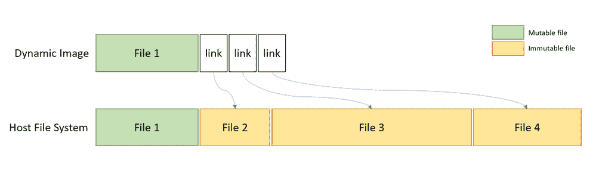
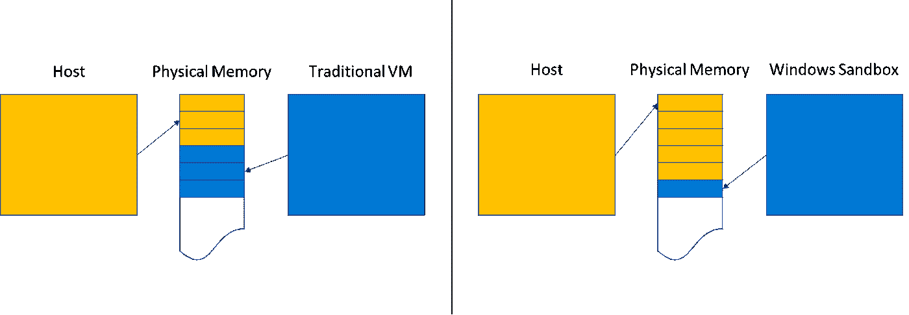
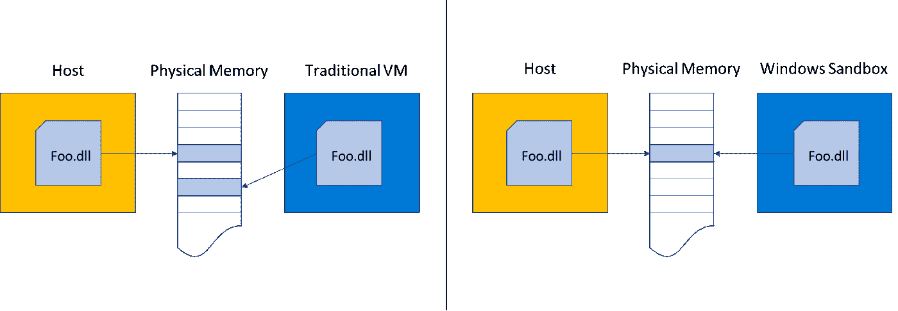
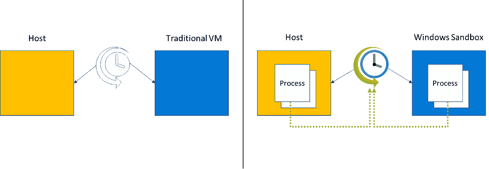
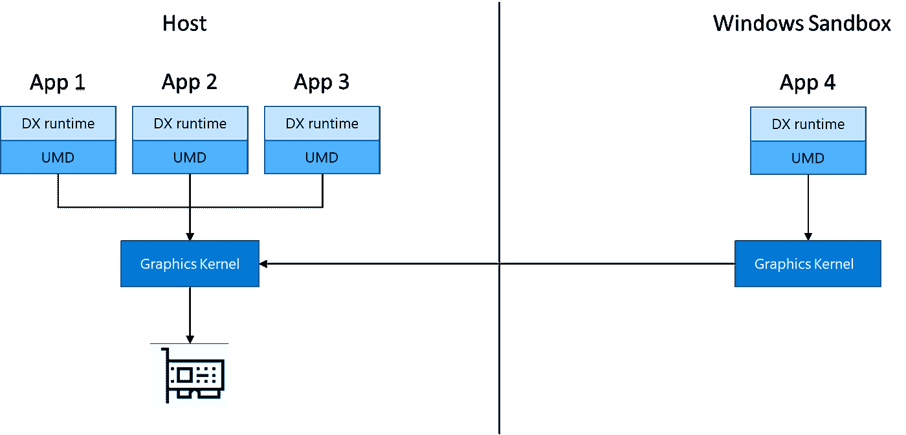
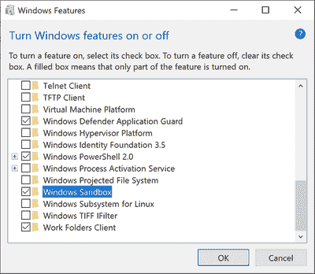
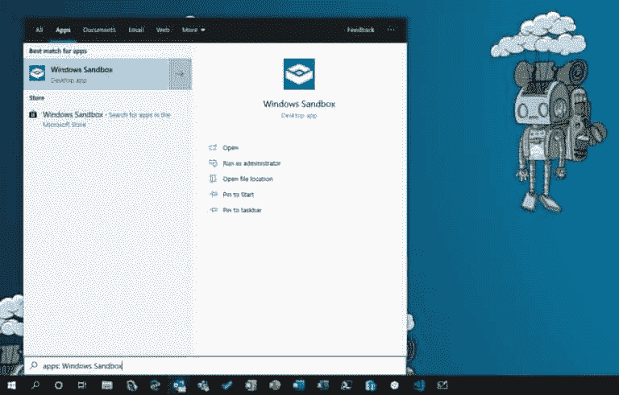
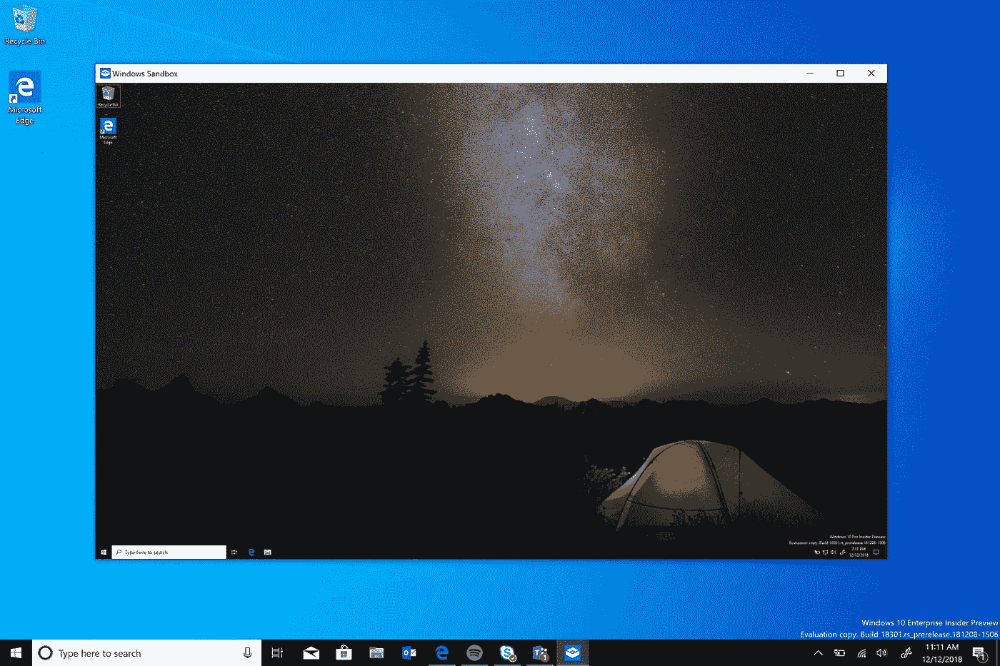
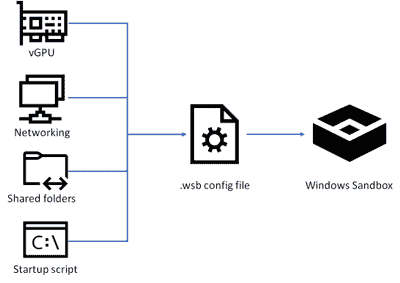

# Windows 沙盒

> 原文：<https://medium.datadriveninvestor.com/windows-sandbox-163d873e78ce?source=collection_archive---------3----------------------->

Windows 沙盒是基于 Windows 容器技术构建的，该技术允许您构建一个隔离的临时桌面环境，您可以在该环境中运行不受信任的软件。您在 Windows 沙箱中运行和安装的软件不会影响主机。如果关闭 Windows 沙盒，所有更改和安装在沙盒中的所有软件都将被删除。这类似于 Windows Defender 应用程序保护，已经用于为 Microsoft Edge 构建沙盒环境。

Windows 沙盒具有以下属性:

*   **Windows**的一部分 Windows 10 Pro 和 Enterprise 附带了此功能所需的一切。不需要下载 VHD！
*   **纯净**——每次 Windows 沙盒运行时，它就像全新安装的 Windows 一样干净
*   **一次性** —设备上无任何东西存留；关闭应用程序后，所有内容都会被丢弃
*   **安全** —使用基于硬件的虚拟化进行内核隔离，这依赖于微软的虚拟机管理程序来运行独立的内核，将 Windows 沙盒与主机隔离开来
*   **高效** —使用集成内核调度程序、智能内存管理和虚拟 GPU

# Windows 沙盒体系结构

Windows 沙盒构建在 Windows 容器上。

**动态生成的图像**

*   Windows Sandbox 利用安装在您计算机上的 Windows 10。
*   通过使用“动态基础映像”，Windows 沙盒始终呈现一个干净的环境:大多数操作系统文件是不可变的，可以与 Windows 沙盒自由共享。一小部分操作系统文件是可变的，不能共享，所以沙盒基础映像包含它们的原始副本。完整的 Windows 映像可以由主机上可共享的不可变文件和可变文件的原始副本的组合来构建。
*   Windows 沙盒具有完整的 Windows 安装，无需下载或存储额外的 Windows 副本即可启动。
*   当没有安装 Windows 沙盒时，动态基础映像是一个只有 30MB 的压缩包。安装动态基础包时，它会占用大约 500MB 的磁盘空间。



**智能内存管理和共享**

*   如果主机面临内存压力，它可以像处理进程一样从容器中回收内存。



*   Windows 沙盒通过一种称为“直接映射”的技术，将与主机相同的物理内存页面用于操作系统二进制文件。



**集成内核调度器** —通过更好地对主机和沙箱中的进程进行优先级排序，提高响应能力。

*   Windows 沙盒使用一种叫做“集成调度程序”的新技术，它允许主机决定沙盒何时运行。
*   Windows 沙盒采用一种独特的调度策略，允许沙盒的虚拟处理器以与为进程调度线程相同的方式进行调度。主机上的高优先级任务可以抢占沙箱中不太重要的工作。使用集成调度程序的好处是，主机将 Windows 沙盒作为一个进程而不是虚拟机来管理，这导致主机的响应速度更快，类似于 [Linux KVM](https://en.wikipedia.org/wiki/Kernel-based_Virtual_Machine) 。
*   这里的整个目标是将沙箱视为一个应用程序，但具有虚拟机的安全保证。



**快照和克隆**改进沙盒的启动时间

**图形虚拟化**受益于硬件加速渲染。需要具有兼容 GPU 和图形驱动程序(WDDM 2.5 或更新版本)的系统。不兼容的系统将使用微软基于 CPU 的渲染技术 Windows 高级光栅化平台(WARP)在 Windows 沙盒中渲染应用。



**电池直通**感知主机的电池状态，从而优化功耗。类似于 Windows 10 Hyper-V 电池直通。

# Windows 沙盒的先决条件

*   Windows 10 专业版或企业版 18305 或更高版本
*   AMD64 架构
*   BIOS 中启用的虚拟化功能
*   至少 4GB 内存(建议 8GB)
*   至少 1 GB 的可用磁盘空间(建议使用 SSD)
*   至少 2 个 CPU 内核(建议使用 4 个超线程内核)

# 快速启动

1.  确保您的计算机使用的是 Windows 10 Pro 或 Enterprise，内部版本 18305 或更高版本。
2.  支持虚拟化:

*   如果您使用的是物理机，请确保在 BIOS 中启用了虚拟化功能。
*   如果您使用虚拟机，请使用以下 PowerShell cmdlet 启用嵌套虚拟化:

```
Set-VMProcessor -VMName <VMName> -ExposeVirtualizationExtensions $true
```

3.打开 Windows 功能，然后选择 Windows 沙盒。选择“确定”安装 Windows 沙盒。可能会要求您重新启动计算机。



您也可以运行以下 PowerShell 命令:

```
Enable-WindowsOptionalFeature -FeatureName "Containers-DisposableClientVM" -Online
```

4.使用开始菜单，找到 Windows 沙盒，运行它，并允许提升



或者只运行 WindowsSandbox.exe cmd C:\ Users \ % username % \ windowssandbox . exe

5.从主机复制可执行文件

6.将可执行文件粘贴到 Windows 沙盒的窗口中(在 Windows 桌面上)

7.在 Windows 沙盒中运行可执行文件；如果它是一个安装程序，继续安装它

8.运行应用程序并像平常一样使用它

9.当你完成实验后，你可以简单地关闭 Windows 沙盒应用程序。所有沙盒内容将被丢弃并永久删除

10.确认主机没有您在 Windows 沙盒中所做的任何修改。



Windows 沙盒尊重主机诊断数据设置。所有其他隐私设置都设置为默认值。

[https://www.microsoft.com/en-us/videoplayer/embed/RE4rFAo](https://www.microsoft.com/en-us/videoplayer/embed/RE4rFAo)

# Windows 沙盒—配置

# 概观

沙盒配置文件被格式化为 XML，并通过。wsb 文件扩展名。配置文件允许用户控制 Windows 沙盒的以下方面:

1.  vGPU(虚拟化 GPU):启用或禁用虚拟化 GPU。如果禁用 vGPU，沙盒将使用 Windows 高级光栅化平台(WARP)。
2.  网络:在沙箱中启用或禁用网络访问。
3.  映射的文件夹:共享主机上具有读或写权限的文件夹。请注意，暴露主机目录可能会允许恶意软件影响系统或窃取数据。
4.  登录命令:当 Windows 沙盒启动时执行的命令。
5.  音频输入:在沙箱中共享主机的麦克风输入。
6.  视频输入:将主机的网络摄像头输入共享到沙盒中。
7.  受保护的客户端:将 RDP 会话的增强安全设置置于沙箱中。
8.  打印机重定向:将打印机从主机共享到沙箱中。
9.  剪贴板重定向:与沙箱共享主机剪贴板，以便文本和文件可以来回粘贴。
10.  Memory in MB:分配给沙箱的内存量，以兆字节为单位。



配置文件可用于精确控制 Windows 沙盒，以增强隔离。

双击配置文件以在 Windows 沙盒中打开它，或者通过命令行调用它，如下所示:

```
C:\Temp> MyConfigFile.wsb
```

下面是您可以在配置文件中使用的不同设置的快速概述。

# Windows 沙盒配置文件、值和限制

**vGPU** :启用或禁用 GPU 共享。

*支持值*:

Enable:在沙箱中启用 vGPU 支持。Disable:在沙箱中禁用 vGPU 支持。如果设置了该值，沙盒将使用软件渲染，这可能比虚拟化 GPU 慢。默认 vGPU 支持已禁用。

启用虚拟化 GPU 可能会增加沙箱的攻击面。

**联网**:在沙箱中启用或禁用联网。您可以禁用网络访问以减少沙箱暴露的攻击面。

*支持的值*:

Disable:禁用沙箱中的网络。默认值:这是网络支持的默认值。该值通过在主机上创建虚拟交换机来启用网络，并通过虚拟 NIC 将沙箱连接到主机。

启用网络会将不受信任的应用程序暴露给内部网络。

**Mapped folders** :一个文件夹数组，每个文件夹代表主机上的一个位置，该位置将被共享到指定路径的沙箱中。目前，不支持相对路径。如果没有指定路径，文件夹将被映射到容器用户的桌面。

可扩展标记语言

```
<MappedFolders>
  <MappedFolder> 
    <HostFolder>absolute path to the host folder</HostFolder> 
    <SandboxFolder>absolute path to the sandbox folder</SandboxFolder> 
    <ReadOnly>value</ReadOnly> 
  </MappedFolder>
  <MappedFolder>  
    ...
  </MappedFolder>
</MappedFolders>
```

***HostFolder*** :指定主机上要共享到沙箱中的文件夹。请注意，该文件夹必须已经存在于主机上，否则容器将无法启动。

***沙盒文件夹*** :指定沙盒中文件夹映射到的目的地。如果该文件夹不存在，将会创建它。如果没有指定沙盒文件夹，该文件夹将被映射到容器桌面。

*ReadOnly:如果为 true，则强制从容器内对共享文件夹进行只读访问。支持的值:真/假。默认为 false。*

*从主机映射的文件和文件夹可能会被沙盒中的应用程序破坏，或者可能会影响主机。*

***登录命令**:指定沙箱登录后自动调用的单个命令。沙盒中的应用程序在容器用户帐户下运行。*

*可扩展标记语言*

```
*<LogonCommand>
  <Command>command to be invoked</Command>
</LogonCommand>*
```

****命令*** :登录后要执行的容器内可执行文件或脚本的路径。*

*尽管非常简单的命令也可以工作(例如启动可执行文件或脚本)，但是涉及多个步骤的更复杂的场景应该放在脚本文件中。这个脚本文件可以通过共享文件夹映射到容器中，然后通过 LogonCommand 指令执行。*

***音频输入**:启用或禁用沙箱的音频输入。*

*启用:在沙箱中启用音频输入。如果设置了这个值，沙箱将能够接收用户的音频输入。使用麦克风的应用可能需要这种能力。禁用:禁用沙箱中的音频输入。如果设置了该值，沙盒将无法接收用户的音频输入。在这种设置下，使用麦克风的应用程序可能无法正常工作。默认值:这是音频输入支持的默认值。目前，这意味着音频输入已启用。*

*将主机音频输入暴露给容器可能存在安全隐患。*

***视频输入**:启用或禁用沙盒的视频输入。*

*启用:在沙箱中启用视频输入。禁用:禁用沙箱中的视频输入。使用视频输入的应用程序可能无法在沙箱中正常运行。默认值:这是视频输入支持的默认值。目前，这意味着视频输入被禁用。使用视频输入的应用程序可能无法在沙箱中正常运行。*

*将主机视频输入暴露给容器可能存在安全隐患。*

***受保护客户端**:对沙盒远程桌面客户端应用额外的安全设置，减少其攻击面。*

*Enable:在受保护的客户端模式下运行 Windows 沙盒。如果设置了该值，沙箱运行时会启用额外的安全缓解措施。Disable:在标准模式下运行沙箱，没有额外的安全缓解措施。默认值:这是受保护客户端模式的默认值。目前，这意味着沙箱不能在受保护的客户端模式下运行。*

*此设置可能会限制用户在沙箱内外复制/粘贴文件的能力。*

***打印机重定向**:启用或禁用从主机到沙箱的打印机共享。*

*支持的值:*

*启用:启用沙箱中主机打印机的共享。Disable:在沙箱中禁用打印机重定向。如果设置了该值，沙盒将无法从主机查看打印机。默认值:这是打印机重定向支持的默认值。目前，这意味着打印机重定向被禁用。*

***剪贴板重定向**:启用或禁用主机剪贴板与沙箱的共享。*

*Disable:在沙箱中禁用剪贴板重定向。如果设置了该值，沙盒内外的复制/粘贴将受到限制。默认值:这是剪贴板重定向的默认值。默认情况下，当前允许在主机和沙盒之间复制/粘贴。*

***以 MB 为单位的内存** *:以兆字节(MB)为单位指定沙箱可以使用的内存量。*

*如果指定的内存值不足以启动沙箱，它将自动增加到所需的最小数量。*

# *例子*

# *示例 1:*

*以下配置文件可用于在沙箱内轻松测试下载的文件。为了实现这一点，该脚本禁用了网络和 vGPU，并将共享下载文件夹限制为容器中的只读访问。为了方便起见，logon 命令在启动时会打开容器内部的 downloads 文件夹。*

***Downloads.wsb***

```
*<Configuration>
  <VGpu>Disable</VGpu>
  <Networking>Disable</Networking>
  <MappedFolders>
    <MappedFolder>
      <HostFolder>C:\Users\Public\Downloads</HostFolder>
      <SandboxFolder>C:\Users\WDAGUtilityAccount\Downloads</SandboxFolder>
      <ReadOnly>true</ReadOnly>
    </MappedFolder>
  </MappedFolders>
  <LogonCommand>
    <Command>explorer.exe C:\users\WDAGUtilityAccount\Downloads</Command>
  </LogonCommand>
</Configuration>*
```

# *示例 2*

*下面的配置文件在容器中安装 Visual Studio 代码，这需要稍微复杂一些的 LogonCommand 设置。*

*两个文件夹被映射到容器中；第一个(沙盒脚本)包含 VSCodeInstall.cmd，它将安装并运行 VSCode。假设第二个文件夹(CodingProjects)包含开发人员希望使用 VSCode 修改的项目文件。*

*VSCode 安装程序脚本已经映射到容器中，LogonCommand 可以引用它。*

***VSCodeInstall.cmd***

```
*REM Download VSCode curl -L "https://update.code.visualstudio.com/latest/win32-x64-user/stable" --output C:\users\WDAGUtilityAccount\Desktop\vscode.exe REM Install and run VSCode C:\users\WDAGUtilityAccount\Desktop\vscode.exe /verysilent /suppressmsgboxes*
```

***VSCode.wsb***

```
*<Configuration>
<MappedFolders>
   <MappedFolder>
     <HostFolder>C:\SandboxScripts</HostFolder>
     <ReadOnly>true</ReadOnly>
   </MappedFolder>
   <MappedFolder>
     <HostFolder>C:\CodingProjects</HostFolder>
     <ReadOnly>false</ReadOnly>
   </MappedFolder>
</MappedFolders>
<LogonCommand>
   <Command>C:\users\wdagutilityaccount\desktop\SandboxScripts\VSCodeInstall.cmd</Command>
</LogonCommand>
</Configuration>*
```

# *示例 3*

```
*<Configuration>
<VGpu>Default</VGpu>
<Networking>Default</Networking>
<MappedFolders>
   <MappedFolder>
     <HostFolder>C:\Users\admin\Downloads</HostFolder>
     <ReadOnly>true</ReadOnly>
   </MappedFolder>
</MappedFolders>
<LogonCommand>
   <Command>explorer.exe C:\users\WDAGUtilityAccount\Desktop\Downloads</Command>
</LogonCommand>
</Configuration>*
```

*这是一个将本地只读下载文件夹从主机装载到沙箱中的程序。*

*这意味着下载文件夹(C:\Users\admin\Downloads)将安装在沙盒的桌面文件夹(C:\ Users \ WDAGUtilityAccount \ Desktop \ Downloads)中。使用命令“explorer . exe C:\ users \ WDAGUtilityAccount \ Desktop \ Downloads”将直接在资源管理器窗口中打开下载文件夹。*

# *实例 4*

```
*<Configuration>
<MappedFolders>
<MappedFolder>
<HostFolder>C:\Users\admin\Downloads</HostFolder>
<ReadOnly>true</ReadOnly>
</MappedFolder>
</MappedFolders>
<LogonCommand>
<Command>C:\Users\WDAGUtilityAccount\Desktop\Downloads\MicrosoftEdgeChromiumSetup.exe</Command>
</LogonCommand>
</Configuration>*
```

*此示例在 Windows 沙箱中安装 Microsoft Edge Chromium 版本。我把 MicrosoftEdgeChromiumSetup.exe 储存在我的下载文件夹里。在配置文件中，我挂载下载文件夹并运行 MicrosoftEdgeChromiumSetup.exe。*

# *实例 5*

```
*<Configuration>
<LogonCommand>
<Command>net use S: \\live.sysinternals.com\tools</Command>
</LogonCommand>
</Configuration>*
```

*如果您想使用 Sysinternals，也可以使用下面的配置文件轻松地挂载 Sysinternals SMB 共享。*

**最初发布于*[*【https://github.com】*](https://github.com/ealtili/Blog/blob/master/WindowsSandbox.md)*/ealtili/*Blog/blob/master/windowssandbox . MD*。**

*如果你喜欢阅读这样的故事，并想支持我成为一名作家，可以考虑报名成为一名媒体成员。每月 5 美元，你可以无限制地阅读媒体上的故事。如果你注册使用我的链接，我会赚一小笔佣金。*

*[](https://ealtili.medium.com/membership) [## 通过我的推荐链接加入 Medium-Eray ALTILI

### 作为一个媒体会员，你的会员费的一部分会给你阅读的作家，你可以完全接触到每一个故事…

ealtili.medium.com](https://ealtili.medium.com/membership)*