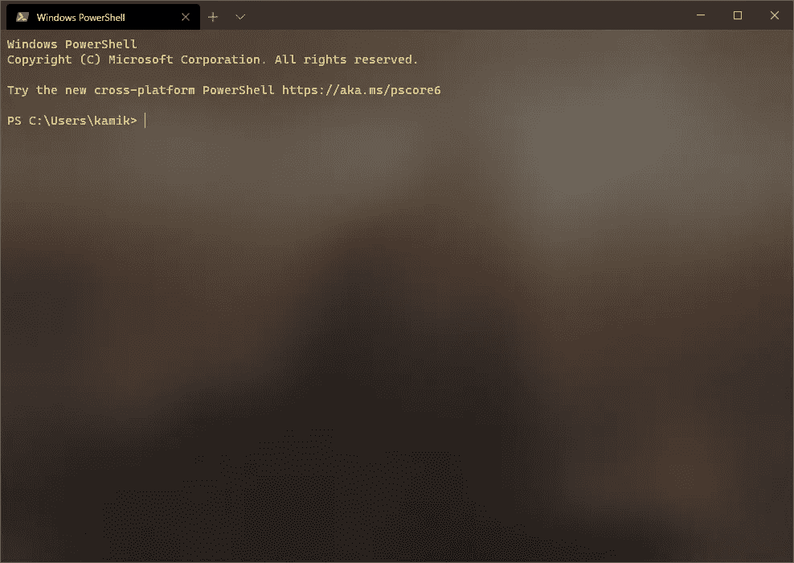
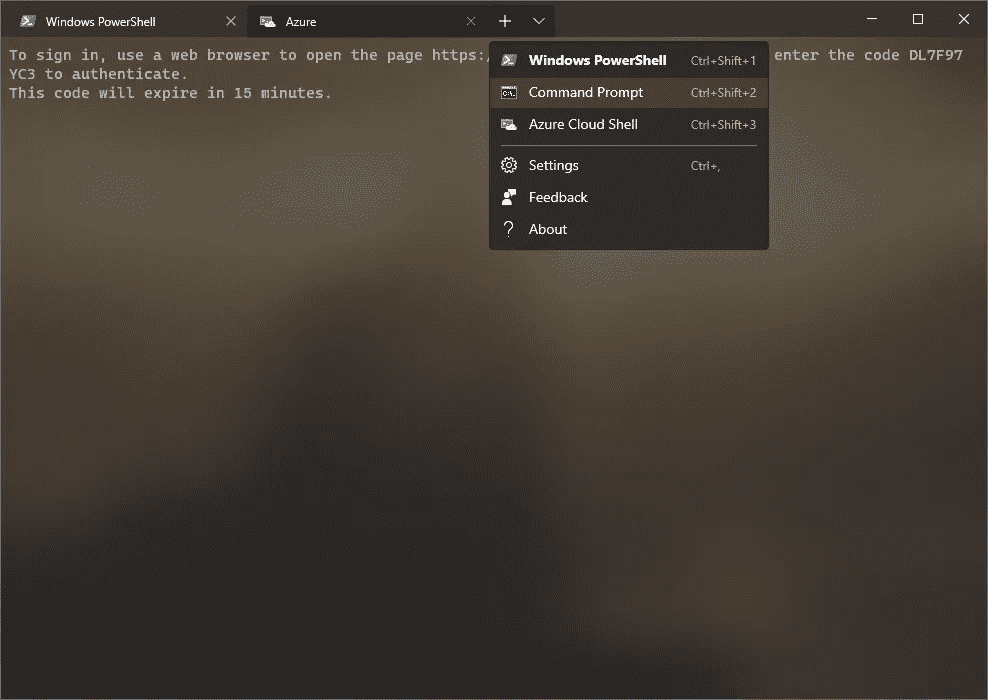
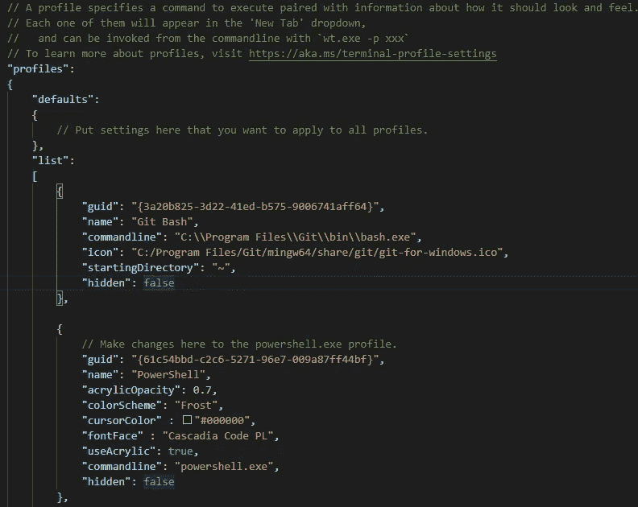
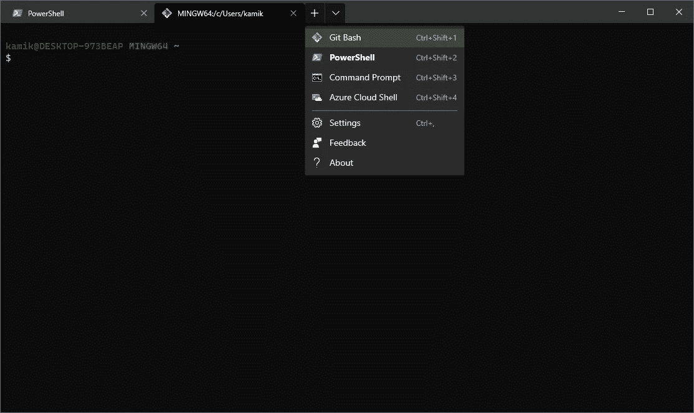

# Windows 终端——一个多功能、开源的终端模拟器

> 原文：<https://medium.datadriveninvestor.com/windows-terminal-a-flexible-open-source-terminal-emulator-5ff672b4b5e1?source=collection_archive---------4----------------------->


Photo by [Luca Bravo](https://unsplash.com/@lucabravo?utm_source=medium&utm_medium=referral) on [Unsplash](https://unsplash.com?utm_source=medium&utm_medium=referral)

像许多其他人一样，我开始用一本 Mac 书籍练习数据科学。我最近建立了一个 Windows 操作系统环境，用于使用 Nvidia CUDA 框架的神经网络。在我的早期，我快乐地学习 Git，在命令行中导航，幸福地无视其他选择。直到最近，我才质疑我的旧命令行界面是否最合适。

> 命令行是程序员用来直接向操作系统发出文本指令的界面，而不需要通过图形用户界面(GUI)

在本文中，我将向您展示相对较新的 Windows 终端作为一个通用的命令行界面是多么的通用和方便。

## 一点历史

你看，MacOS 自带 [Bash](https://www.gnu.org/software/bash/) (卡特琳娜更新以来的' [Zsh](https://en.wikipedia.org/wiki/Z_shell) )，一个 [Unix](https://en.wikipedia.org/wiki/Unix) 外壳。Bash 代表“谍影重重”, 31 年前由布莱恩·福克斯于 1989 年首次发行。Bash 也是大多数 Linux 发行版的默认登录 shell。


Photo by [Catarina Carvalho](https://unsplash.com/@catvcarvalho?utm_source=medium&utm_medium=referral) on [Unsplash](https://unsplash.com?utm_source=medium&utm_medium=referral)

然而，在 Windows 操作系统上，默认的命令行界面是 Windows Command Prompt ('CMD ')以及最近 Windows 10 上的 [PowerShell](https://docs.microsoft.com/en-us/windows-server/administration/windows-commands/powershell) 。CMD 不能提供定制的 Git 体验，但是 PowerShell 可以。 [posh-git 包](https://git-scm.com/book/en/v2/Appendix-A%3A-Git-in-Other-Environments-Git-in-PowerShell)——尽管有一个幽默的包名——将允许您在 PowerShell 中使用 git。您还可以使用用于 Linux 的 [Windows 子系统](https://docs.microsoft.com/en-us/windows/wsl/about)(‘WSL’)，它允许您使用 GNU(一个操作系统)/ Linux 环境，而不必双重引导或安装虚拟环境。

到目前为止，我一直选择使用 Git Bash ,它也提供了一个 git GUI，允许您通过右键单击从任何文件夹或 windows explore 访问 BASH shell。有关 Git Bash 与 WSL 有何不同的更多信息，请参见这里的。

> Git BASH——一个针对 windows 的 BASH 仿真，其行为就像 linux 和 unix 环境中的“git”命令一样

# 进来了:Windows 终端

前几天偶然看到 2019 年微软商店上发布的 Windows 终端。它包括对命令提示符、PowerShell、Linux 的 Windows 子系统、Bash 等的支持。



Windows Terminal command-line interface

它还提供了多标签、屏幕副本、分割屏幕的能力，并且可以同时托管我上面提到的不同命令行界面。你可以从微软商店免费下载并安装它。

> 多个选项卡，每个选项卡支持不同的 CLI


Nani? — Translated — What? [Image Source](https://www.google.com/imgres?imgurl=https%3A%2F%2Fi.ytimg.com%2Fvi%2FHAlWSiKuhGE%2Fmaxresdefault.jpg&imgrefurl=https%3A%2F%2Fwww.youtube.com%2Fwatch%3Fv%3DHAlWSiKuhGE&tbnid=W7u6kbyFgVjd9M&vet=12ahUKEwjp3Jz_7fzqAhUVgHMKHZpfCXoQMygAegUIARCoAQ..i&docid=ONgYGJLihGk3SM&w=1280&h=720&q=Nani%3F!&ved=2ahUKEwjp3Jz_7fzqAhUVgHMKHZpfCXoQMygAegUIARCoAQ)

> 您将需要创建一个 Bash 概要文件，因为它没有现成的。



Multiple tab support and a different CLI in each tab

是的，Windows 终端是不可思议的。多标签支持不同的 CLI 在每个标签…如果这还不够，它是高度可定制的。您将需要创建一个 Bash 概要文件，因为它没有现成的。

可通过以下方式访问可变设置:

```
Ctrl + ,
```

您将需要一个代码编辑器来查看想要打开的 settings.json 文件。我用上面的 [visual studio 代码](https://code.visualstudio.com/)。在这里，您可以自定义您的按键绑定，添加配置文件和[配色方案](https://atomcorp.github.io/themes/)到您的配置文件，并设置您想要使用的命令行界面。

> 开始定制 Windows 终端[这里](https://docs.microsoft.com/en-us/windows/terminal/)

您可能还想访问不可变的默认设置，在这里您将找到默认的键绑定:

```
Alt + Ctrl + ,
```

# 将 Bash CLI 添加到 Windows 终端

如果您已经安装了默认安装的 Git Bash，那么您可以将下面的代码粘贴到 settings.json 文件的 profiles 部分

如果你在其他地方安装了 Git Bash，只需更改“command line”
并相应地修复“icon”即可。

```
{"guid": "{3a20b825-3d22-41ed-b575-9006741aff64}","name": "Git Bash","commandline": "C:\\Program Files\\Git\\bin\\bash.exe","icon": "C:/Program Files/Git/mingw64/share/git/git-for-windows.ico","startingDirectory": "~","hidden": false},
```

settings.json 的 profile 部分在下图中，我已经在这里添加了新代码:



Profile section of the mutable settings for Windows Terminal

现在，当您选择一个新的选项卡时，Git Bash 应该出现在列表中:



感谢您的阅读，并享受新工具！

# 来源

1.  [Git](https://git-scm.com/doc) —文档中心
2.  Bash — GNU 项目
3.  [Z Shell](https://en.wikipedia.org/wiki/Z_shell) —维基百科#在外部链接中查找用户指南和最佳提示
4.  [Unix](https://en.wikipedia.org/wiki/Unix) —维基百科页面
5.  [PowerShell](https://docs.microsoft.com/en-us/windows-server/administration/windows-commands/powershell) —微软 PowerShell 文档
6.  [Posh-Git 包](https://git-scm.com/book/en/v2/Appendix-A%3A-Git-in-Other-Environments-Git-in-PowerShell) —在你的 Windows 操作系统 PowerShell 中使用 Git
7.  【Linux 的 Windows 子系统 —文档
8.  [Git Bash vs WSL](https://stackoverflow.com/questions/52905844/git-bash-on-windows-vs-wsl)——堆栈溢出答案解释了主要差异
9.  [Visual Studio 代码](https://code.visualstudio.com/) —主页
10.  [Windows 终端配色方案](https://atomcorp.github.io/themes/) — Atomcorp