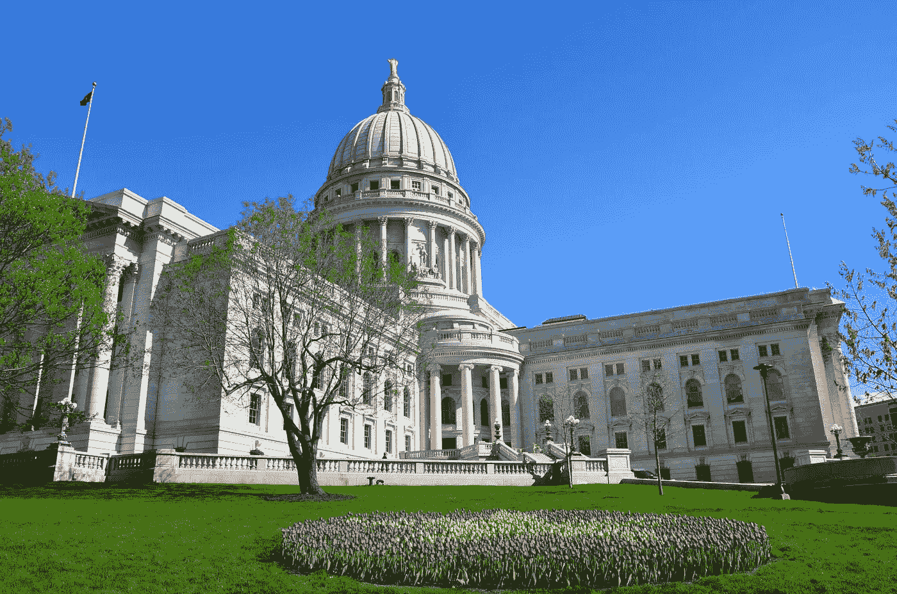

# 威斯康星迈向欧洲隐私模式

> 原文：<https://medium.datadriveninvestor.com/wisconsin-towards-a-european-privacy-model-48760e230e84?source=collection_archive---------28----------------------->

my.lwv.org

欧洲一般隐私条例，即 GDPR，为许多后续的*条例*指明了道路，这些条例是为了保护每个人的隐私而制定的。

在美国，愿景比我们更具*商业*色彩，新的隐私法规更倾向于商业方式而非个人方式，新的加州 CCPA 就是明证。另一方面，最近，在威斯康辛州议会上，准确地说是在 2 月 10 日，提出了三个新的法案，希望恢复和遵循欧洲模式，关于如何使用个人信息。

 [## 为什么包容性财富指数比 GDP 更能衡量社会进步？|数据驱动…

### 你不需要成为一个经济奇才或金融大师就能知道 GDP 的定义。即使你从未拿过 ECON 奖…

www.datadriveninvestor.com](https://www.datadriveninvestor.com/2019/03/08/why-inclusive-wealth-index-is-a-better-measure-of-societal-progress-than-gdp/) 

这些提案由他们自己的发起人提名为“ ***威斯康星州数据隐私法案*** ”，旨在规范公司可以处理哪些个人数据，处理多长时间，如何处理，以及向谁传输。这三个提案被称为*装配法案(AB)* 编号 *870、871 和 872* ，它们占用了我们 *GDPR* 的许多定义。

***关键定义:***
-“*消费者*”指威斯康星州的任何居民；
-“*数据控制者*”定义为“*单独或与其他人共同决定个人数据处理目的和方式的人，但不包括警察机关或联邦、州或地方政府的单位或机构*”；
-*-*"个人资料"是拟议立法保护的核心，被定义为"*能够直接或间接识别消费者的与消费者有关的信息，包括通过参考标识符，如姓名、身份证号、位置数据、在线标识符或与消费者的身体、生理、遗传、精神、经济、文化或社会身份有关的一个或多个因素，但不包括联邦州或地方政府文件合法提供的任何信息*"；
-*处理*个人数据是指*对个人数据执行一项或一组操作，包括收集、记录、组织、存储、储存、修改、检索、使用、披露、传播、提供、组合、擦除或销毁个人数据*。

但让我们来分别看看这三项法案:

**AB 870** 在收集个人的个人数据时向数据控制者提出明确请求，以明确传达以下数据:
-数据控制者的身份和联系信息；
-数据控制人打算处理消费者个人数据的目的以及执行该处理的法律授权；
-将向其披露消费者个人数据的收件人或收件人类别；
-数据控制方存储消费者个人数据的预计期限(如已知)，或用于确定数据存储期限的标准；
-消费者获取个人资料的信息；
-消费者的个人数据是否将用于执行自动化的消费者决策流程，如果是，此类流程的目的是什么；
-当“数据泄露可能对消费者权利和自由构成风险”时，在发生个人数据泄露的情况下，有义务通知威斯康辛州司法部，如果可能的话，自泄露被确认之日起一个月内通知，否则将处以最高 10，000，000 美元或上一财年总年收入 2%的罚款。

**AB 871** 试图赋予消费者向数据控制者请求删除其保存的个人数据的权利。

**AB 872** 提供了数据控制者在收集消费者个人数据时必须履行的特定义务清单，这些义务是:
-为消费者同意的目的进行处理‘通过声明或明确的肯定行动’；
-获得“自由、具体、知情和明确”的同意；
——使消费者能够撤回其同意，并且能够像其做出同意一样容易地撤回；
-将同意处理个人数据与书面声明中提及的任何其他事项区分开来；
-能够证明消费者已经同意；以及
-不需要消费者同意即可使用数据控制器的服务。

如果按照提议制定，威斯康星州数据隐私法将于 2022 年 7 月 31 日生效。

版权所有
***Raffaella Aghemo，律师***