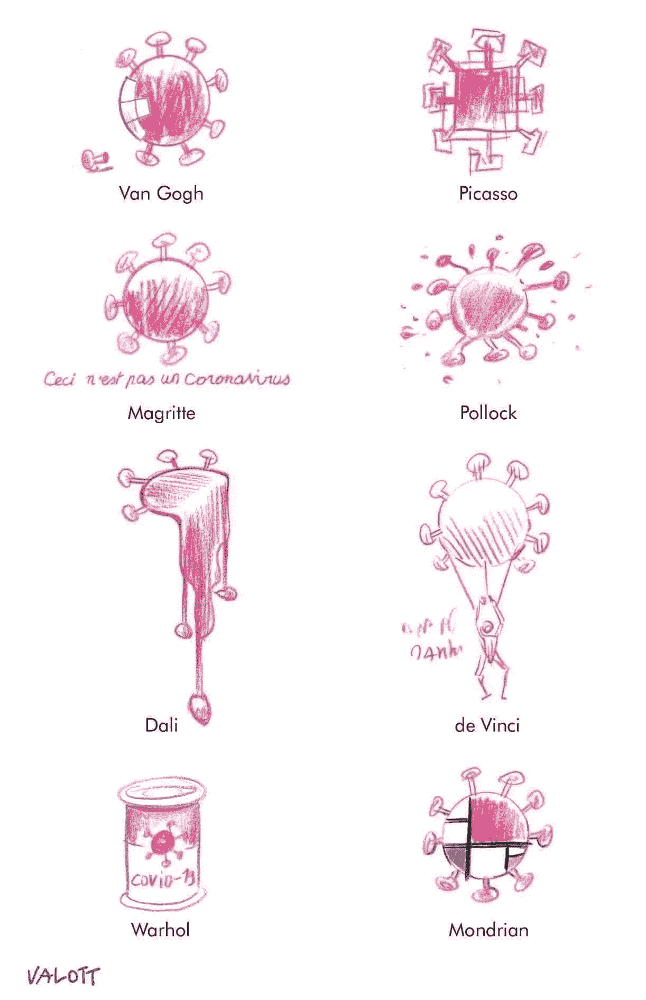
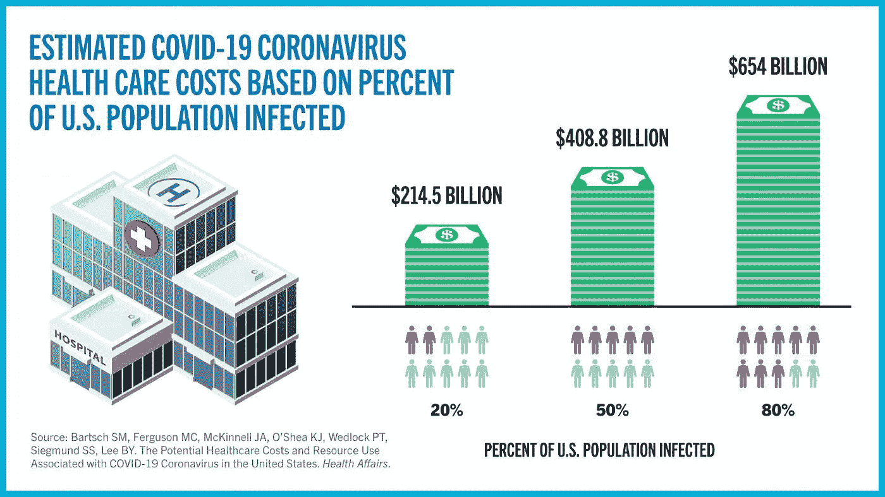
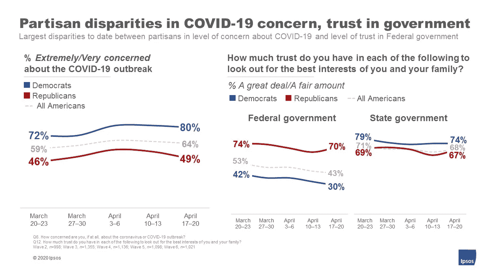

# 有了新冠肺炎，我们需要重建世界，而不是掩盖世界:透明、信任和象征

> 原文：<https://medium.datadriveninvestor.com/with-covid-19-we-need-to-re-make-the-world-not-re-cover-from-it-transparency-trust-and-tokens-33653a09a347?source=collection_archive---------16----------------------->

We must repaint a post-COVID world with a style we never used before ([Jacques Vallotton](http://www.jaquesvallotton.com/?fbclid=IwAR02YPg_yjWE5YXAMeJSzsOpvEZNnRKeH43mJ88Fq-CjgGyv3xEUbp_6QGo), [image](https://www.instagram.com/explore/tags/valott/top/))

*使用区块链将创造富有弹性的健康、经济和社会未来*

历史在危机中延续。

*   威尼斯，一个 15 世纪的主要商业中心，知道*隔离*(来自意大利语: *Quaranta giorni 或* 40 天)，Lazzaretto Vecchio*岛上遭受瘟疫的人*是让经济熬过[黑死病](https://www.discovermagazine.com/planet-earth/venices-black-death-and-the-dawn-of-quarantine?utm_campaign=Feed%3A+AllDiscovermagazinecomContent+%28All+DISCOVERmagazine.com+stories%29&utm_medium=feed&utm_source=feedburner)的唯一方法。
*   塔特尔博士(1918 年的福奇博士)在西班牙流感期间经历了同样的抵制，他呼吁保持社会距离，尽管威尔逊总统对此感到恶心，并放弃了他在第一次世界大战后的谈判。
*   9 月 11 日是暴露国土安全薄弱的一天，但是我们的日常习惯并没有改变，除了在机场。
*   2008 年的金融危机暴露了银行业的局限性，可能是由比特币的兴起引起的，但是资本主义没有改变。

但这次危机不同。

新冠肺炎是一个全球性的生物威胁，暴露了我们的医疗保健、经济和社会体系的重大弱点。为了应对危机，每个人都必须做出改变。

区块链可以通过促进(1)透明度，(2)令牌，(3)信任来帮助这种变化。

# #1:区块链可以追踪我们的纳税人救助(透明度)

美国新冠肺炎*急性感染*的*直接医疗费用估计在 2145 亿美元(如果 20%人口感染)到 6540 亿美元(如果 80%人口感染)之间。这些费用(每位患者约 3500-14000 美元)不包括专业费用、后续护理和长期残疾。*

**

*Costs exclude professional fees, long term care and disability ([image](https://www.eurekalert.org/pub_releases/2020-04/cgso-ccc042120.php))*

*然而，尽管超过 1750 亿美元的纳税人救助资金已经被送到医院，顺便说一下，这些医院不必偿还这些资金，(HCA 医疗保健 7 亿美元，社区卫生系统 2 . 45 亿美元，Banner Health 2 亿美元，Mayo Clinic 1 . 5 亿美元)，小型医生集团(T10)，农村医疗服务提供者和治疗更多弱势患者的安全网设施(T12)没有得到足够的资金(T13)。*

*[医生报告说](https://www.axios.com/coronavirus-doctors-practices-sell-close-d59aa9f0-1e01-4a90-82f7-d4ebab26e355.html)收入下降了 50%至 90%,[初级保健协作](https://www.pcpcc.org/)调查显示，近一半的医生不确定他们是否有足够的现金来维持他们的业务，42%的医生经历了裁员和员工休假，并预计在 4 周内关闭。近五分之一的医生正在申请小型企业管理局的贷款，从长远来看，新冠肺炎疫情可能会鼓励医生退休，关闭他们的诊所，或者完全退出病人护理。*

> *主要的问题是没有一个透明的、可审计的、公平的机制来追踪我们的救助资金流向了哪里。区块链可以解决这个问题。*

# *#2 区块链可以在评估经济风险时引入激励机制(令牌)*

*我们中已经有四分之一的人认识“COVID 阳性”的人，八分之一的 T2 人认识死于这种病毒的 T3。连同[检疫疲劳](https://www.washingtonpost.com/local/trafficandcommuting/quarantine-fatigue-researchers-find-more-americans-venturing-out-against-coronavirus-stay-at-home-orders/2020/04/25/fa1f01b2-84a3-11ea-a3eb-e9fc93160703_story.html)和[悲痛海啸](https://www-businessinsider-sg.cdn.ampproject.org/c/s/www.businessinsider.sg/grief-tsunami-coming-to-the-us-huge-mental-health-impact-2020-4/amp)，来自[金融崩溃](https://www.axios.com/axios-ipsos-coronavirus-index-poll-week-7-a4c299b6-307c-4103-8d72-b5cc2b5a37e5.html?utm_source=newsletter&utm_medium=email&utm_campaign=newsletter_axiosmarkets&stream=business)的恐惧仍然处于历史最高水平。*

*如果没有*激励措施*来鼓励负责任的公共卫生行为(比如社会距离或戴口罩)，评估疫情威胁、信任政府政策并遵循这些政策仍然是高度党派化的(见下图)。*

**

*Republicans are increasingly likely to minimize the risk of the pandemic while the Democratic trust of the federal government continues to erode. Both sides hold state governments and health professionals in high regard. ([source](https://www.ipsos.com/en-us/news-polls/axios-ipsos-coronavirus-index))*

*因此，最近[陆军研究办公室](https://www.army.mil/article/235151/) (ARO)启动了一项多大学研究计划，在新冠肺炎疫情的背景下，利用博弈论来检验激励措施对个人、地方政府、州政府和国家之间行为协作的影响。*

> *区块链不仅仅是一种分布式数据结构，而是通过令牌来激励我们坚持公共政策的一种经济方式。*

# *#3:使用区块链的计算信任可以服务于全球社区(真相)*

*对公共机构和科学的信任是全球公共卫生的关键。这说明了人类深层的基本需求，即在不确定性中寻找理性和真理，特别是因为未来会有 T2 疫情波 T3，而 T4 可能永远不会达到顶峰 T5。*

* [## 数字货币、区块链和货币的未来|数据驱动的投资者

### “区块链”、“加密货币”、“令牌化”，以及现在的“央行数字货币”已经成为…

www.datadriveninvestor.com](https://www.datadriveninvestor.com/2020/02/18/digital-currencies-blockchain-and-the-future-of-money/) 

因此，一方面，我们正接近大萧条时代的失业率，动摇我们对 T2 零工经济、T4 硅谷和就业体系的信念，另一方面，我们目睹了精选公司和债务对冲基金的巨额利润，继美联储的 6 万亿美元量化宽松之后。这些激进的政策不仅有使美元贬值的风险，还会产生道德风险，投资者有动机去承担风险，而其他人(你)会为这些风险买单(听起来很熟悉吧？).

新冠肺炎不仅摧毁了“即时”全球供应链和“共享”经济，还暴露了我们社会结构中的巨大漏洞。这些**经济和社会效率低下**可能会导致 4 种不同的情况(如下，详情见[此处](https://www2.deloitte.com/global/en/pages/about-deloitte/articles/covid-19/covid-19-scenarios-and-impacts-for-business-and-society-world-remade.html))，即:

(1) **即将过去的风暴:**随着卫生系统和政治应对措施日益有效，通过协调一致的最佳做法，病毒得以根除。财政和货币刺激有所帮助，但无法逆转小企业、中低收入个人和国家经历的*损失。*

(2) **好公司:**政府日益增长的负担催生了公私合作的激增。社交媒体、平台和科技公司获益，经济*进一步转向“利益相关者资本主义”。收入不平等加深。*

(3) **东方的日出:** *中国和其他东亚国家更有效地控制了疾病，*而西方国家则在与深刻而持久的人类、社会和经济影响作斗争。中国、台湾和韩国通过强有力的中央集权政府控制疫情的能力成为“黄金标准”

(4) **孤狼:**持续的疫情导致死亡人数上升，社会动荡，经济直线下降。各国以地方安全的名义，对外国人实施严格控制，并迫使供应链回到国内。*国家以国内安全和*政府监控的名义发展孤立主义* 是司空见惯的，*高科技监控人们和他们的行动。

The overall severity of the pandemicwill depend on the **level of collaboration** within and between countries, the **health care system** response, the **economic consequences** and the level of **social cohesion** in response to the crisis ([source](https://www2.deloitte.com/global/en/pages/about-deloitte/articles/covid-19/covid-19-scenarios-and-impacts-for-business-and-society-world-remade.html))

> 区块链的分布式和去中心化特性可以通过提高系统响应(计算信任)，抑制经济成本(痕迹)和增加社会信任(透明度)来加速多边协作。

# 最终想法:弹性=容量+能力

本周，Calcalist 引用了我的话:

> “……首先，我们不会恢复正常，因为正常首先是导致我们陷入这种困境的原因……人们明白他们需要改变，所以当人们问我‘哦，卡哈纳博士，自新冠肺炎会议以来发生了什么变化？’他们希望我说‘我在远程工作，我不在外面吃饭’，但这并不是真正的改变。让我改变的是，现在那些对我过去五六年所做的事情一直不感兴趣的人突然打电话来，说也许你正在做的事情有什么问题。也许这种看待生活的方式可以帮助我们设计一种新的经济模式，一种我们之间互动的新方式，以及一种做生意的新方式……”

这个疫情推动了区块链的发展，不仅仅是因为它加强了供应链，帮助将资源部署到最需要的地方，或者解决了共享数据的问题。区块链很重要，因为它允许我们**通过重新设计我们的经济来增加我们的人力和系统能力(生存时间)和能力(恢复时间)**。

或者用[1998 年诺贝尔经济学奖得主、](https://www.econlib.org/library/Enc/bios/Sen.html)[能力方法之父](https://en.wikipedia.org/wiki/Capability_approach)阿玛蒂亚·森的话说:

> 贫穷不仅仅是缺钱……而是没有能力实现一个人作为人的全部潜力。* 

**如果你喜欢你所读的内容，* ***继续在下面“鼓掌”，这样其他人也会看到(最多允许 50 次鼓掌！)****