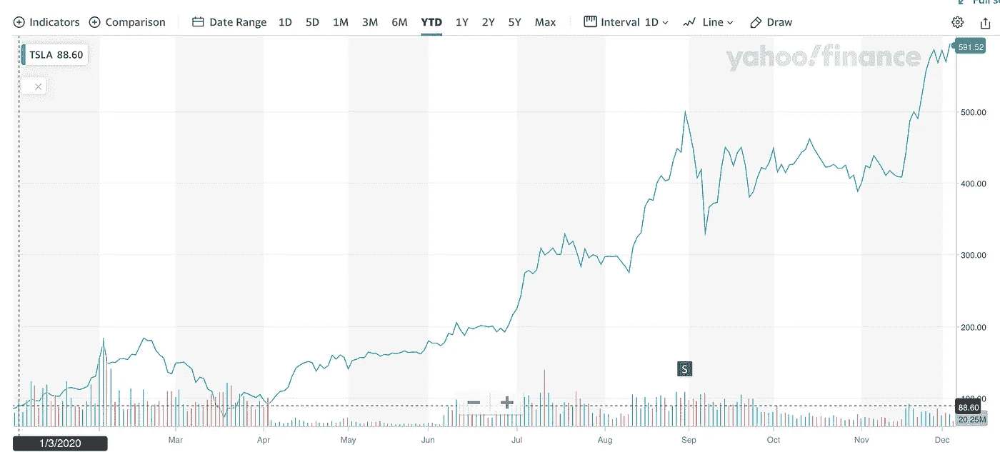
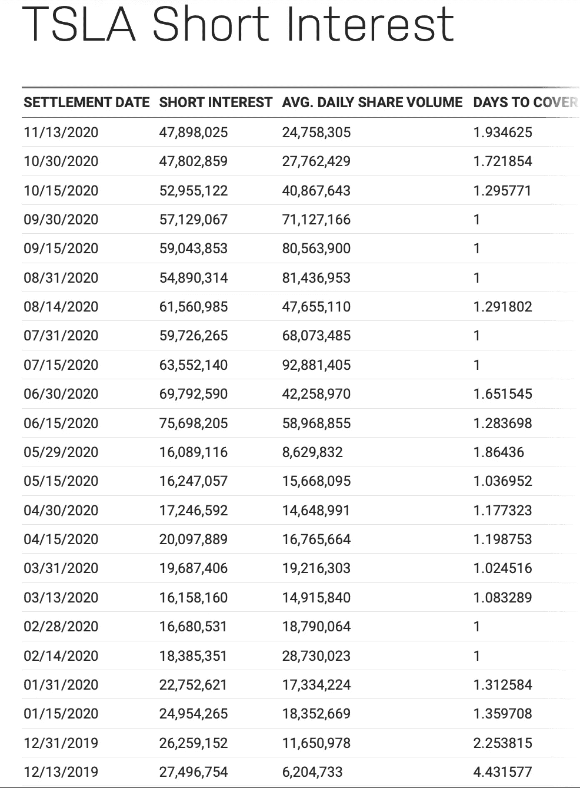

# 可悲的特斯拉卖空者损失惨重

> 原文：<https://medium.datadriveninvestor.com/woeful-tesla-short-sellers-lose-bigly-6aec4268241?source=collection_archive---------3----------------------->

## 特斯拉年初至今 600%的股价加速正在摧毁卖空者…

Photo by [Martin Katler](https://unsplash.com/@martinkatler?utm_source=unsplash&utm_medium=referral&utm_content=creditCopyText) on [Unsplash](https://unsplash.com/s/photos/tesla-model-3?utm_source=unsplash&utm_medium=referral&utm_content=creditCopyText)

# **1。** **特斯拉的牛逼年……**

特斯拉有望实现今年年初 T4 设定的超级雄心勃勃的目标:特斯拉在全球销售 50 万辆汽车。这是我整理的特斯拉过去 12 个月全球交付量的图表:

Illustration by ScienceDuuude

重要的是要指出，特斯拉的出色销售业绩是在全球疫情的背景下发生的，而且特斯拉总部所在的国家美国也是由一个被化学晒黑的橙色白痴管理的国家，那里住着戴着鲜红色帽子的哑巴战士，这样他们就不会在沃尔玛迷路，因为他们紧张地拉着他们的儿童皮带和其他对他们的哑巴的限制。比如面具。和社交距离。

我们还应该提到，埃隆·马斯克(Elon Musk)本人就是一名非常特殊的自由斗士，因为他不太出色的表现抨击了新冠肺炎的限制，这些限制使他的工厂在疫情春季最糟糕的涨潮期间关闭。

但特斯拉已经卖掉了今年制造的每一辆汽车，以满足无法满足的需求(许多特斯拉看空者，尤其是卖空者拒绝承认特斯拉产品需求高的事实，就像特朗普无法承认他在选举中失败的事实一样)。

市场最终奖励了特斯拉，因为他们有能力设计一款非常令人满意的汽车，大量生产，并在世界各地销售。这是特斯拉今年迄今的股价图中的回报:

Tesla’s YTD share price (chart by Yahoo/Finance)

这个市场由各种各样的买家和卖家组成，从大规模的机构买家(如指数基金，当特斯拉正式进入 S&P500 时，这些基金很快将有义务购买特斯拉的股票)，到华尔街所说的傻钱……你和我，每天的常客。但是，如果你在过去十年的任何时候购买了特斯拉的股票，然后改变，并简单地持有这些股票，无视所有媒体的狂热和黑暗的网络谎言，你已经做得非常好了。

对特斯拉来说，这的确是非常棒的一年。

# **2。** **卖空者……**

在特斯拉飙升的管弦乐优势的 B 端，是那些为了做空股票而卖掉孩子、借给妻子、把自己的狗授权给广告公司的人。

首先，做空一只股票意味着什么？

做空是卖出你不拥有的东西。华尔街鲨鱼的典型手法，对吧？但不仅仅如此。

卖空者卖出他们不拥有的股票，但要卖出，他们必须从拥有股票的人那里借入这些股票。这种借入有一个合同规定的结束日期，卖空者必须在该日期归还借入的股票。

啊？为什么会有人这么做？

想象一下，要靠荒谬地借别人的股票赚钱，会发生什么？

没错，这些借入股票的价格必须下跌，这样，在卖空者必须归还股票的那一天，他将以低于买入时的价格买入股票。

让我们用一个假想的例子来说明。

星期一，肖特先生借入 1 股 Losela 股票，并以 100 美元的价格卖出。他暂时把那笔钱藏在口袋里。肖特先生(在一份合同中)承诺星期五归还股票。周五，Losela 的股价跌至 90 美元。肖特先生有义务以 90 美元回购股票，并根据合同返还股票，他保留差额，即 10 美元。他因股票价格下跌而获利。

很酷吧。你实际上可以从下跌的股票中获利，而不仅仅是升值(上涨)的股票。

肖特先生在这里能获得的最大利润是多少？

想象一下 Losela 的价格一路下跌到 0.00 美元。肖特先生将全部 100 美元作为他的利润收入囊中(实际上有交易成本在侵蚀这些利润)。卖空者能做的绝对最好的事情是 100%的收益(减去交易成本)。

# 3.做空特斯拉的先生…

现在想象一下，肖特先生决定做空特斯拉，因为他认为黑暗网络对特斯拉的描述是一家经营不善、注定要破产的公司。

肖特借了价值 1000 美元的特斯拉股票，希望到今年年底，全世界都能像他一样看到特斯拉一文不值。肖特先生希望在一年内获得 100%的收益，这是一个非常好的回报。回想一下，像 S&P500 这样的股票指数平均每年上涨 8%左右。

果然，在肖特借入并卖出这些特斯拉股票后不久，特斯拉股价就下跌了。但这是在他的合同到期之前很久，所以他没有在小幅下跌时卖出，而是希望出现大崩盘并坚持下去。

但接下来发生了一些事情…特斯拉股价上涨。他们上涨了 10%，20%，30%。但肖特先生并不担心。他知道真相，特斯拉是一个骗局，一个骗局，一个骗局，停车场里停满了未售出的特斯拉汽车，因为他在充满可靠的，嗯，无人机操作员的黑暗网站上看到了无人机照片。

特斯拉的股票会上涨 50%，100%。尽管如此，肖特先生还是坚持住了，因为他知道市场是变化无常的，如果别人看到他的所作所为，市场就会下跌。如果肖特现在想平仓，他必须以 2000 美元的价格买入特斯拉，才能收回这些股份。记住，他借了那些股票，然后以 1000 美元的价格卖出。他会失去差额，或者 1000 美元。所以他坚持下去，去那些黑暗的网站上散布关于特斯拉的谎言，希望市场相信他，恐慌并卖掉特斯拉。但是没有人相信他的谎言。

但是，肖特坚持做空特斯拉，并没有看到最糟糕的情况。特斯拉继续上涨。200%.300%.400%.500%.正如我们今天所看到的，自今年年初以来增长了 600%。

现在，如果肖特先生今天想平仓，他必须为这些借来的股票支付 7000 美元，这样他才能归还这些股票。他不得不接受 6000 美元的差额。也许卖掉他的孩子，借给他的妻子，或者给他的狗发执照。赌 1000 美元。

缺点是，卖空的风险是 500%，1000%，10000%或更多的损失，理论上是无限的损失。卖空者的损失是没有限制的。我们看到上升空间仅限于 100%。100%的可能收益现在看起来不那么吸引人了，不是吗？

 [## 利用区块链构建可持续循环经济|数据驱动投资者

### 自从工业革命开始以来，全世界都关注产品的生产和消费。很少或…

www.datadriveninvestor.com](https://www.datadriveninvestor.com/2020/11/17/building-sustainable-circular-economy-with-blockchain/) 

# **4。** **真正的特斯拉卖空者……**

我们已经讨论了一般卖空者。但我们对特斯拉卖空者有一个特例。正如纳斯达克网站报告所显示的，这种情况有很多:

Nasdaq report on Tesla short interest (chart by Nasdaq)

许多大公司都有卖空者。没什么特别的。有人遇到他们认为预测公司股票将下跌的数据。所以，他们做空股票。这与购买或做多一只股票正好相反。

但那些做空特斯拉的人似乎更情绪化。他们不关注数据，而是编造一个符合他们先入为主的想法的叙事——特斯拉是个骗局或者马斯克是个骗子。他们不相信现实，就像特朗普不相信他输掉了选举一样。另一种选择同样糟糕:特朗普和特斯拉卖空者都疯狂地试图通过大声否认来改变现实，尽管他们可能知道自己站在了交易的错误一边。

维持这样一部小说的成本是多少？

卖空者今年因做空特斯拉损失了 350 亿美元。

[美国有线电视新闻网(CNN)称，2020 年，整个美国航空业报告了有史以来最严重的亏损，达到 240 亿美元。](https://www.cnn.com/2020/12/04/investing/tesla-short-sellers-elon-musk/index.html)

在现代史上最糟糕的疫情期间，特斯拉卖空者的损失是整个航空业的 1.5 倍。

卖空者没有可以指责的疫情。那次失败是自己给自己脸上开了一枪。

这就是否认现实的代价。

这不仅仅是在全国或全世界面前装傻，坚持说你已经赢得了选举，而实际上你并没有。

碰巧的是，卖空使得否认现实的实际成本变得非常有形，非常可观。

对我们来说，最重要的是，无论是投资者、政治家，还是像你我这样的普通傻瓜，即使我们不喜欢现实，即使现实告诉我们错了，也要承认现实。我们必须承认错误并改变方向(在这种情况下，平仓特斯拉空头头寸)。

我们必须遵循数据。

## 访问专家视图— [订阅 DDI 英特尔](https://datadriveninvestor.com/ddi-intel)