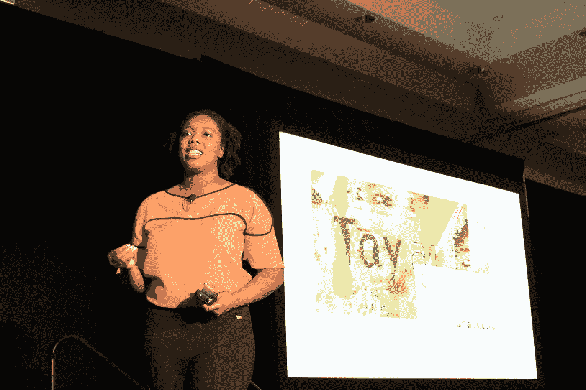
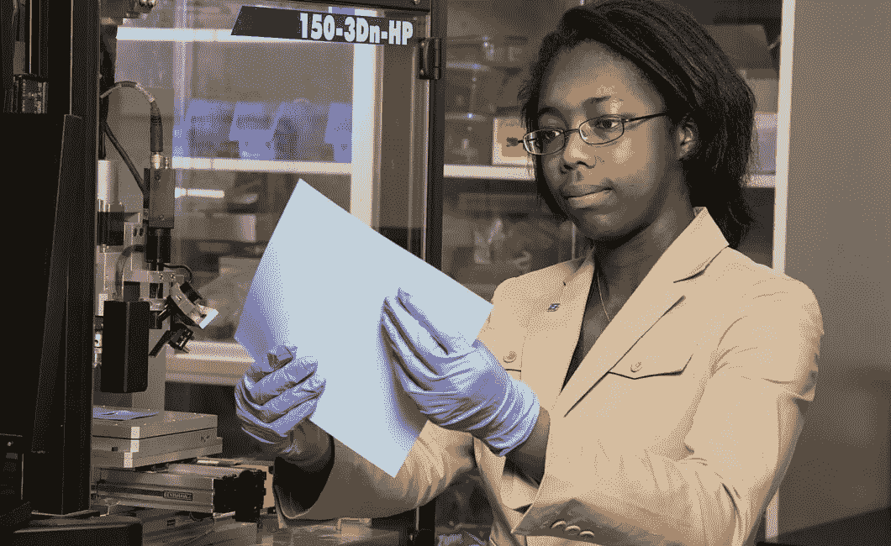
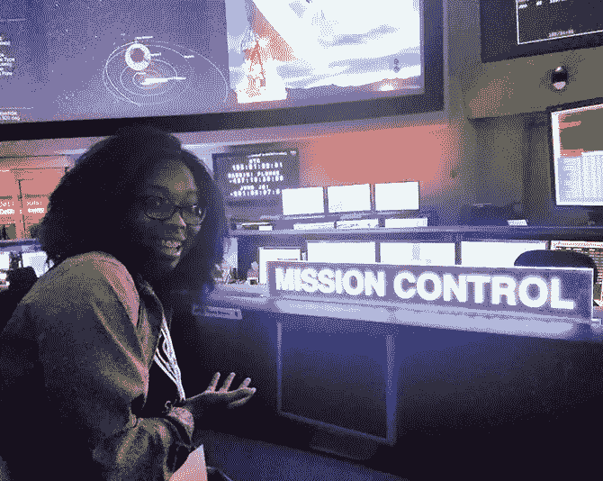
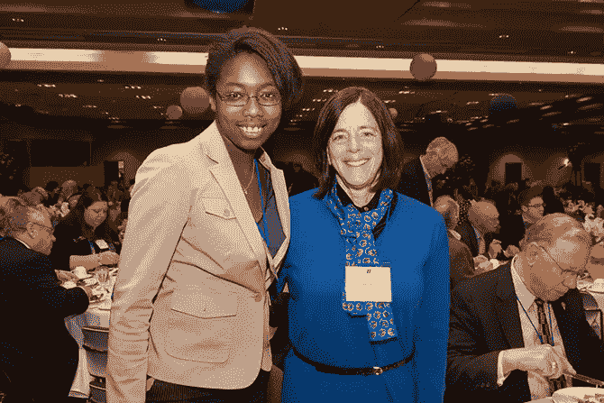
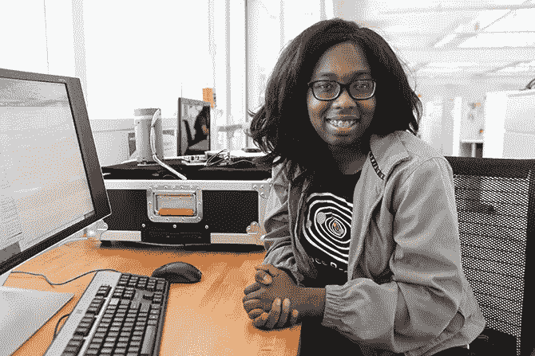
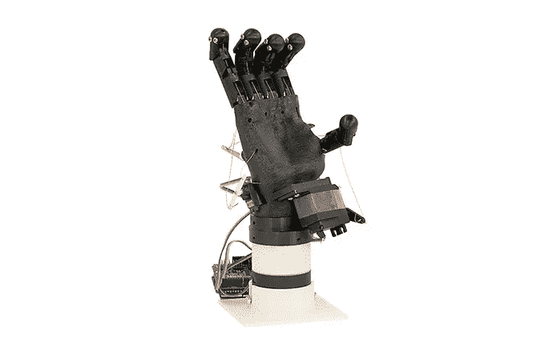

# 工程领域的女性:卡米尔·艾迪

> 原文：<https://medium.datadriveninvestor.com/women-in-engineering-camille-eddy-2043da536bd7?source=collection_archive---------28----------------------->

她回忆说，在第一个黑人历史月期间，作为一个小女孩，机器人和软件工程卡米尔·艾迪向美国宇航局(兼工程师和医生)的梅·杰米森学习。杰米森是第一位黑人女宇航员，在 1992 年美国国家航空航天局 STS-47 任务中在太空工作，受到这个故事的启发，埃迪决定她也想成为一名宇航员。因此，埃迪的母亲给她布置了一个小的研究任务，以确定需要什么“我发现宇航员的候选人必须首先是科学家、医生或工程师，我想进入工程领域。就在那时，我和母亲开始考虑课程和作业，为我走上这条道路做准备。

Developing Research at NASA

埃迪继续说道:“在我上中学的第一年，我们搬到了爱达荷州的博伊西。不到两个月，我就把我们联系到了博伊西州立大学工程学院。在学校的一次特别活动中，我和妹妹遇到了前宇航员芭芭拉·摩根，她刚作为一名杰出的常驻教育家来到博伊西州立大学。在那次活动中，工程学院的主持人向我们高中生解释了工程的各个领域。

埃迪、她的母亲和妹妹在活动结束时留下来，从芭芭拉-摩根那里得到签名。“但是我妈妈迟迟没有问芭芭拉许多尖锐的问题，比如‘我的女儿能成为宇航员吗？ 之类的东西。最后，在活动结束后，芭芭拉·摩根和我们一起呆了大约三个小时，我发誓那是很长的时间。活动结束后，我们去了他的办公室，她给我们看了一些去过太空的植物种子，它们太不可思议了。

 [## 模式和机器人:复杂的现实|数据驱动的投资者

### 哈耶克的名著《复杂现象理论》(哈耶克，1964)深入探讨了复杂性的话题，并断言…

www.datadriveninvestor.com](https://www.datadriveninvestor.com/2019/03/04/patterns-and-robotics-a-complex-reality/) 

在接下来的六年里，芭芭拉·摩根继续做卡米尔·艾迪的导师，使她的职业选择越来越适合这个年轻女人和她的家庭。埃迪从这种有益的关系中受益匪浅。她经常在镇上的活动中看到摩根，她在博伊西州的不同白天和住宿营地继续接触摩根。

毕业后，艾迪开始在博伊西州立大学学习机械工程。在那里，摩根邀请埃迪在小组中服务，以帮助促进太空宇航员和博伊西州学生之间的教育交流。最终，该计划包括一个与国际空间站协调的 BSU 空间研讨会。可以说，这就是师徒关系真正起飞的地方。摩根是学生和美国宇航局之间的联络人。

我们必须会见美国国家航空航天局的教育团队，我们必须学会如何写提案。摩根还和我一起起草了一份教育和公共关系计划。这些是宇航员以太空视频的形式展示的教育脚本，为学生和公众提供引人入胜的技术课程。所有的学生都在 BSU 航天研讨会那天接受了指导，但艾迪对公开演讲是全新的。摩根教艾迪如何在舞台上清晰地表达。

第二年，埃迪成为一个名为微重力研究项目的组长。本科研究经验，与美国宇航局协调，教本科生如何根据美国宇航局的标准撰写商业计划书，然后在签约的情况下执行研究项目。艾迪的六个学生团队专注于太空工具。在芭芭拉的帮助下，我们写了 40 页的提案。在这个项目上，我们每天晚上工作到晚上 10 点。芭芭拉昨晚和我们一直呆到凌晨 2 点，只是一行一行地检查项目提案，指导我们如何使我们的提案符合 NASA 的指导方针。

Camilla Eddy with Barbara-Morgan

一旦这个提议被批准，Eddy 的团队就必须开发这个工具。我们必须编写仪器安全文档，然后在 NASA 约翰逊航天中心测试该工具。然后，我们必须在一大群宇航员、测试和教育专家面前发表论文。因为我们从 Barbara 那里得到了所有的指导，我们采取了所有的步骤来设计和记录工具的功能和对设计参数的坚持，他们没有对我们提出任何问题，他们也不担心我们所做的任何事情。例如，我们的工具允许单手操作，并且没有任何锋利的边缘——只有 NASA 要求的两个设计特征。"

Eddy 深情地回忆起 Morgan 在认可团队领导力方面给她的指导。

Eddy 熟悉工程中的标准化通信模式，这有助于她在一个远程团队中担任机器人工程师。这些天来，她的大部分努力都集中在机器人操作系统(ROS)开源软件上，这是一种中间件，可以进行原型开发，并允许工程师在构建定制的规范应用程序后即插即用机器人。

“我现在的日常工作是从零开始构建机器人……目前是一个取放机器人。所以我以阅读开始我的一天，研究 Python、C++和 XML 编码。处理不断变化的设计需求和预测设计结果尤其令人满意。通过在线聊天，我们的远程团队交流了很多:“这就是我所做的——这对你有用吗？”“我把我的代码放入存储库；你能查一下吗？诸如此类的东西。这也需要大量的沟通，因为我们也必须划分我们的任务。

“举个例子:我们目前的机器人设计需要某种抓取模式。最后，我们选择使用抽吸末端效应器来拾取和移动物体。但是我们如何建造机器人部分呢？在模拟中使用哪种代码作为概念证明？子组件采购呢？这些系统需要仔细考虑。

对于整体设计概念化，Eddy 借鉴了她在惠普设计项目中的经验——构建一个多功能末端执行器来测试打印机功能。最初的原型很笨重，尤其是运动学被证明是困难的；最终的迭代是流线型的，模块化的，3D 打印的…一个简单的基于电缆的推拉系统，在基于相机反馈的数字控制下。

https://www.instagram.com/p/B7eBWk7Htel/点击上面的链接观看这个机器人的演示。

当被问及如何增加年轻女性和有色人种在工程和 STEM 领域的参与时，埃迪说包容性的工作场所是关键。“我们说服女生从事工程并不重要。这是为了营造环境，确保一旦他们进入职业生涯，他们仍愿意留下来。”

**我对任何开始实习的人的建议是**
愿意学习很多东西，抓住机会。不能因为你一开始就不知道某样东西，就认为你学不会。如果你愿意花时间和精力在你正在做的事情上，你就能在一些全新的事情上取得成功，所以努力吧！

***“我们说服女生去搞工程，并没有那么重要。这是关于培养环境，以确保一旦他们进入职业生涯，他们仍然愿意留下来"***

在 Instagram 上关注我:

 [## 登录* Instagram

### 欢迎回到 Instagram。登录查看您的朋友、家人和兴趣爱好捕捉和分享了什么…

www.instagram.com](https://www.instagram.com/iamcamilleeddy/?igshid=1ohxhtgw7ta9z)