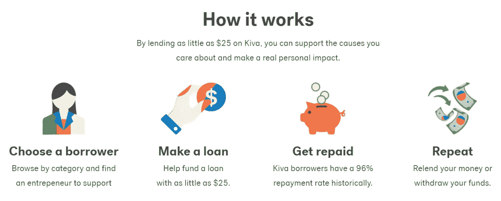

# 一月更新:通过 Kiva 帮助妇女

> 原文：<https://medium.datadriveninvestor.com/women-in-the-workforce-in-2021-87c5ca79b185?source=collection_archive---------27----------------------->

# **对《2021 年职场女性》一文的跟进:** [**需要我们所有人相互扶持**](https://stratefi.medium.com/women-in-the-workforce-in-2021-it-will-take-all-of-us-lifting-each-other-up-647d93300d47)

Diagram sourced from Kiva.org

我 2021 年的目标之一是每个月尽我所能帮助一位我不认识的女性。我知道这不算多，但是现在，发生了这么多事，这是我能承担的。

几年前，我听过一个关于小额贷款的播客节目。在这一集里，乔希和查克解释了小额贷款，这是孟加拉国经济学家穆罕默德·尤努斯的绝妙想法，他因此获得了 2006 年诺贝尔和平奖。

 [## 小额贷款能发展世界吗？-你应该知道的事情

### 小额贷款是一种为发展中国家的企业家提供资金的做法，这些企业家通常无法获得贷款

www.iheart.com](https://www.iheart.com/podcast/105-stuff-you-should-know-26940277/episode/could-microlending-develop-the-world-29468081/) 

一月不是最容易的一个月，因为在我这里，我们回到了 Covid 锁定，所以我搜索了那集，重新听了 Josh 和 Chuck。

在小额贷款这一集中，Josh 和 Chuck 谈到了 Kiva，这是一家国际非营利组织，于 2005 年在旧金山成立，其使命是扩大金融服务，帮助服务不足的社区蓬勃发展。Kiva 有优点也有一些缺点，Josh 在下面的文章中探讨了其中的一些，但是通过 Kiva 支持女性感觉我可以做一些事情，整个一月都锁在房子里！

 [## “物品如何工作”:用小额贷款产生影响

### 我的东西你应该知道播客的共同主持人查克·布莱恩特，我们的制作人杰里·罗兰和我并不是完全不知道…

www.huffpost.com](https://www.huffpost.com/entry/stuff-you-should-know-microlending_b_1383112?fbclid=IwAR3F4ma_LLRvKK5lCxYhnX9EPd1WwR-RCOECTScEeGxixT0sO3F-jD0W-7g&guccounter=1&guce_referrer=aHR0cHM6Ly9sLmZhY2Vib29rLmNvbS8&guce_referrer_sig=AQAAAKw-waMqlaG-9fcZ5twpeiO2AJdIYIQOVsj5oHouFh0vVXdkacAhCdbarovr_pfAB41m_oVHlTQGkQpNDMOiYHx2Z21SA5qyk3Lk8fHXHYLdhVdoSqzjUksxlVB1UYLYS1gIJ3Mjcn_fX3Gkmwj5a7B9Z45VqBpi2Xku3_86k2Yv)  [## Kiva -改变生活的贷款

### 有了 Kiva，你每月只需借出 5 美元，就能对他人的生活产生巨大影响。当你签名的时候得到 50 美元借出…

www.kiva.org](https://www.kiva.org/)  [## Kiva 贷款团队:你应该从 HowStuffWorks.com 了解的东西

### 向世界各地的企业家发放贷款，最低只需 25 美元。Kiva 是世界上第一个在线借贷平台…

www.kiva.org](https://www.kiva.org/team/stuffyoushouldknow) 

在评论中添加任何定期帮助女性的建议或组织！

你可以在这里找到原帖

 [## 2021 年的职场女性:需要我们所有人相互扶持

### 将 2021 年的话题转移到 2020 年女性劳动力大规模外流的解决方案上

stratefi.medium.com](https://stratefi.medium.com/women-in-the-workforce-in-2021-it-will-take-all-of-us-lifting-each-other-up-647d93300d47)