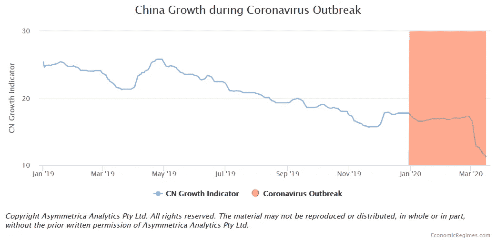
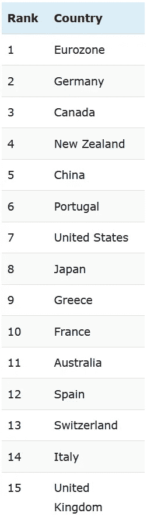
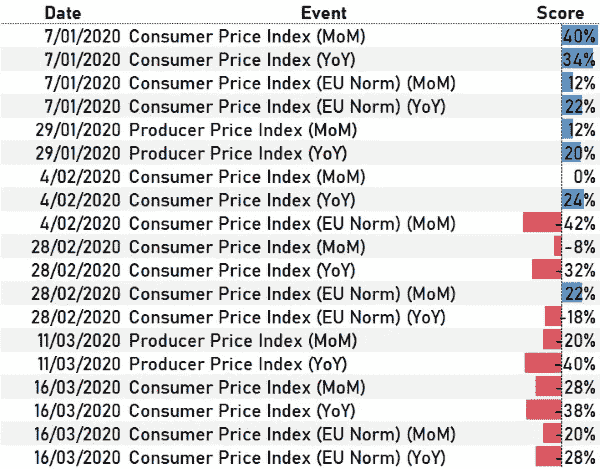

# 想知道冠状病毒对经济的影响吗？已经开始了

> 原文：<https://medium.datadriveninvestor.com/wondering-about-the-economic-fallout-from-coronavirus-its-already-started-2ebb3c2ae67e?source=collection_archive---------28----------------------->

2019 年 12 月 31 日，中国武汉发现不明原因肺炎，并向世界卫生组织(世卫组织)国家办事处报告。不到 3 个月后，20，000 多人死亡，病毒继续传播(截至 3 月 26 日)。

不谈政治，控制疫情的唯一可行办法似乎是自我孤立，这是世界各国以不同形式采取的政策。据估计，目前世界上有三分之一的人口处于某种形式的禁闭状态。

我不需要告诉你，经济将因此受到影响。

作为一名投资专家，我对三个问题非常感兴趣:

1.  我们什么时候才能看到冠状病毒的经济影响？
2.  影响会有多大？
3.  我们什么时候能看到复苏？

我与数十亿美元的基金经理合作，帮助他们把握宏观经济趋势。我并不假装知道所有的答案，但是我觉得我很适合就上面的问题提供一些见解。

## 我们什么时候才能看到冠状病毒的经济影响？

已经开始了。

以下数据来自专有的[计量经济学模型](https://economicregimes.com/defining-economic-regimes/)，该模型显示了跨越多个国家和资产类别的卓越预测能力。

让我们看一些例子。首先，这是我追踪的 15 个国家的表格，从最好到最差排列了当前的经济增长:

Economic Growth Country Ranking

迄今为止，新西兰似乎做得相当不错。不过，排名垫底的国家——中国并不令人意外。让我们仔细看看中国的增长指数:

红乐队表示该病毒于 2019 年 12 月 31 日首次报告给世卫组织的时期。从那以后，我们已经看到中国经济增长明显放缓。导致冠状病毒爆发的趋势也不乐观，使得复苏更加困难。

 [## 如果资本主义失败了，那么还有什么选择呢？数据驱动的投资者

### 在当前政治领域的修辞之旅中，我们都可以面对面地接触到流行词汇，如…

www.datadriveninvestor.com](https://www.datadriveninvestor.com/2020/03/16/if-capitalism-is-a-failure-then-what-is-the-alternative/) 

停工是一个很好的驱动负需求冲击的方式，所以我预计也会看到对通胀的一些重大影响。以下是通货膨胀的国家排名(从最好到最差):

Economic Inflation Country Rank

有趣的是，中国排在第五位。不过请记住，中国并不是自由放任经济的光辉典范。鉴于病毒在意大利的传播，让我们仔细看看自 2019 年 12 月 31 日以来发布的官方通胀指数:

Italian Inflation Indicators post Coronavirus Outbreak

上表中的分数范围为-100%至+100%。自 2 月初以来，通货膨胀数据一直在下降。

## 影响会有多大？

现在打电话太早了。在这一点上，感染率继续增加，而世界各国政府推出的刺激方案可能会也可能不会减轻一些损害。我将尽最大努力量化全部影响，并衡量任何刺激措施在遏制经济损失方面的有效性。

## 我们什么时候能看到复苏？

我会经常更新这个问题，因为它可能是三个问题中最相关的。请记住，市场可能是目前我们拥有的最好的领先指标。