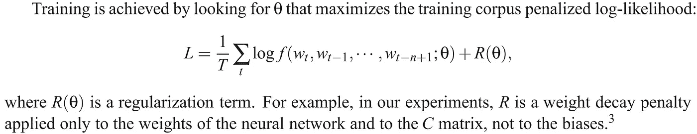

# 单词嵌入:CBOW 和 Skip-gram

> 原文：<https://medium.datadriveninvestor.com/word-embedding-cbow-skip-gram-8262e22fa7c?source=collection_archive---------7----------------------->

嗨伙计们！在这篇博客中，我想分享我对这篇研究论文'[Vector Space](https://arxiv.org/pdf/1301.3781v3.pdf)中单词表示的有效估计'的评论，这篇论文提出了使用深度学习的 CBOW 和 Skip-gram 新架构。

# 1.介绍

单词嵌入意味着将单词表示成连续的(或数字的)矢量表示。

一个简单的模型，**统计语言建模**表示(如词袋(BoW)、TF-IDF(词频-逆文档频率)、N-gram 模型)，具有合理的良好选择——简单性、鲁棒性和观察性。然而，它有一定的局限性——

*   缺乏语义意义。例如，*好吃*和*好吃*会考虑不同，但是，意思是一样的。
*   用于自动语音识别的相关域内数据量是有限的。
*   按比例增加单词(像包含几十亿单词的语料库)不会导致任何有意义的进步。

因此，我们需要先进的技术，以及深度学习如何进入这个阶段，它也赋予语义意义。比如 Glove，lda2vec 等等。此外，我们知道，如今，深度学习在大多数研究领域(如对象检测、语言建模、文本到语音转换等)占据主导地位，其结果优于 ML。

# 2.目标

*   介绍可用于从拥有数十亿单词和数百万词汇的高数据集中学习*高质量单词向量*的技术。
*   用于测量所得向量表示的质量，期望不仅相似的单词倾向于彼此更接近，而且具有*倍* *相似度*【1】。例如，男性/女性关系是自动学习的，通过诱导的向量表示，“国王-男人+女人”产生非常接近“女王”的向量。

**目:**通过开发保持单词间线性规律的新结构，最大化这些向量运算的准确性。

# 3.模型架构

*   专注于通过神经网络学习的单词的分布式表示(显示它们在保持单词之间的线性规则方面比[潜在语义分析(LSA)](https://medium.com/acing-ai/what-is-latent-semantic-analysis-lsa-4d3e2d18417a) 表现得好得多)
*   [在大型数据集上，潜在的狄利克雷分配](https://towardsdatascience.com/latent-dirichlet-allocation-lda-9d1cd064ffa2) (LDA)在计算上变得非常昂贵。

以下是以前做过的相关工作…

## 3.1 前馈神经网络语言模型(NNLM) [2]

(如果你有时间，可以从第 1141 页开始阅读参考文献，因为其中涉及许多公式和数学。我将在这里总结它实际上是什么。)

From research paper [2]

*   它由输入、投影、隐藏和输出层组成。
*   在输入层，使用 1-of- *V* 编码对 *N* 个先前单词进行编码，其中 *V* 是词汇的大小。
*   然后使用共享投影矩阵将输入层投影到维度为 *N X D* 的投影层 *C* 。

> 根据研究论文[2]，
> 
> 映射 **C** 的参数就是特征向量本身，用一个 **|V| × m** 矩阵表示；C 的**行‘I’**是针对**单词‘I’**的特征向量 **C(i)** 和**‘m’**是维度。
> 
> 这里我用 D 来代替 m，以便于理解，因为 D 对应于每个单词向量的 D 维。

*   对于投影和隐藏层之间的计算来说，NNLM 架构变得复杂，因为投影层中的值是密集的。
*   隐藏层用于 ***计算词汇表*** 中所有单词的概率分布，产生一个维数为 *V* 的输出层。
*   函数 ***g*** 可以通过前馈或递归神经网络或其他参数化函数实现，参数 ***ω*** 。整体参数设置为 **θ = (C，ω)** 。为上图编写的符号如下，其中 *g* 为神经网络， *C(i)* 为第 I 个单词特征向量。

Notation of above figure

**培训—**

From research paper [2], page no. 1142

这种架构的常见选择:

*   *N* =10
*   投影层， *C* ，—可能在 500 到 2000 之间
*   隐藏层， *H* ，—通常为 500 到 1000 个单位

关于这个架构的问题—

1.  每个训练样本的每个训练的计算复杂度是:

> *Q = N X D + N X D X H + H X V*

> 请记住，每个单词 w(I)对应于“V”维，因为它是 1/V 编码。因此，对于 N 个单词，输入层的尺寸是 N X V。但是，如果我们也看到，词汇的大小将有一个有限的和固定的整个网络，而训练，对不对？我们剩下的是可以输入到输入层的单词数，即“N”，它是变量和超参数(以找到正确的值)。这就是为什么它在训练复杂性时忽略了“V”项。我正根据研究论文跟进这篇评论。

第一项是从输入图层到投影图层-N X D

第三项是从隐藏层到输出层— H X V

第二项是从投影到隐藏层，这是 D X H，而且因为我们有 N 个前面的单词，所以需要执行“N”次以上-N X D X H(这一项是最复杂的)。

2.由于输出单元具有与词汇 *V.* 相同的大小，通常，V 不是小而是大量的词汇，这导致性能降低。

(第二)点的解决方案—

*   通过词汇表的二叉树表示，需要评估的输出单元的数量可以下降到 log_base2(V)左右，即使用*分层 softmax* ，其中词汇表表示为**霍夫曼二叉树**。
*   基于 Huffman 树的层次化 softmax 需要大约 log _ base 2(*Unigram _ perfusion*(*V*))。例如，当 V = 100 万字时，结果是评估中的 2 倍加速。

(1)点的解决方案—

*   计算瓶颈 *N X D X H* ，他们后来提出的架构*没有隐藏层*，因此严重依赖于 softmax 规范化的效率(即输出层)。

## 3.2 递归神经网络语言模型(RNNLM)

*   基于递归神经网络的语言模型用于克服以前模型的局限性，例如需要指定上下文长度( *N* )。此外，该模型没有投影层；只有输入、隐藏和输出层。
*   我们已经知道 RNN 的特点是使用延时连接将隐藏层连接到其自身，这允许形成短期记忆(因为来自过去的信息可以由隐藏层状态来表示，该隐藏层状态基于当前输入的*和前一时间步中隐藏层*的*状态得到更新*

RNN 模型的每个训练样本的复杂度是:

> Q = H X H + H X V

词表征(维度)——*D，*隐层( *H* )。

与之前型号相同的问题——

1.  通过使用分层 softmax，输出层 *V* 可以减少到 log( *V* )。于是，第二项变成 *H X log(V)* 。
2.  计算量最大的是第一项，即*H X H*——这是 RNN 隐层的递归。

# 4.建议—新的对数线性模型

*   从以前的工作中主要观察到，大部分复杂性是由模型中的非线性隐藏层引起的。

## 4.1 连续词袋模型

*   第一个提出的架构类似于前馈 NNLM(3.1 节)，其中**非线性隐藏层被移除**并且**投影层被所有单词**共享；所有单词被投影到相同的位置(它们的向量被平均)。

From research paper [3], page no. 5

*   称这个架构为*单词袋*模型，因为历史中的**单词顺序不会影响投影。**
*   你需要知道的两件事:*语境*和*焦点*词。

Figure 1\. Word notation

*焦点*单词是该模型需要从给定的*上下文*单词中预测的那些单词(输出)。因此，从上面的例子中，当时间步长 *t* =3 时，w_3 为；同样，对于给定的时间步长 t，我们可以写成:

上下文词= w _(*t*-2)w _(*t*-1)w _(*t*+1)w _(*t*+2)→两个历史和两个未来词 from(焦点词 w_(t))当前时间 *t.*

焦点词=w( *t*

*   它发现，通过用 f **我们的未来和输入的四个历史单词**构建对数线性分类器，在任务上获得了最佳性能。

## 更深入的

根据图 1 中给出的相同符号。，建筑的插图看起来像什么

w_1、w_2、w_4、w_5 是上下文单词，被馈送到输入层；w3 是需要在输出层预测的焦点字。

Figure 2\. Notation in CBOW architecture

更深入地看这个建筑，它看起来像这样

Deep Learning Illustration of Figure 2.

> 在上图中，我写下了权重 w4*x*D，因为输入了 4 个输入。如果 N 个输入被馈入，那么权重变成 W_N *x* D.
> 同样，这里我也说 N；一般是 W_N *x* V *x* D，由于 V 在训练网络中是定长的，所以我们将有 W_N *x* D.
> **所以，你想怎么理解就看你自己了。N 或 N *x* V **

理想情况下，箭头表示为“完全连接”。然而，根据研究论文，它表示为分层 softmax。

让放大更多，在' D '层和输出层之间，看看如何分层 softmax 看起来像。

Figure 3\. Magnified between ‘D’ layer and output layer.

现在，说重点，在训练阶段，

对于 5 个词，在网络训练时，每一个不同的焦点词作为一个输出，需要重复训练 5 次。所以，如果我们有几百万个单词，我们需要训练几百万次。

**训练复杂度—**

> Q = N X D + D X log_base2(V)

第一项来自输入层(N)和投影层(N)— N X D

第二项来自投影层(D)到输出层(V)—D X log _ base 2(V)；[不是“V ”,因为它没有完全连接；它是层次结构，即霍夫曼编码，如果你知道霍夫曼编码的时间复杂度是多少？是 O(n*log(n))。这和第二项非常相似，对吗？

**注意，输入层和投影层之间的权重矩阵以与 NNLM 中相同的方式为所有单词位置共享。**

 [## 医生管理工作量增加时的深度学习|数据驱动的投资者

### 行政工作量是我们这个时代大多数医生所经历的众多负担之一。医生，尤其是…

www.datadriveninvestor.com](https://www.datadriveninvestor.com/2020/11/27/deep-learning-amid-increased-physician-administrative-workload/) 

## 4.2 连续跳格模型

第二种架构类似于 CBOW，但它不是基于上下文来预测当前单词，而是将焦点单词作为具有连续投影层的对数线性分类器的输入，并预测上下文单词之前(历史)和之后(未来)一定范围内的单词。

From research paper [3], page no. 5

因此，这一次，我们将焦点词(w(t))输入到体系结构中，得到一定范围内的预测历史(即 w(t-2)，w(t-1))和未来上下文(即 w(t+1)，w(t+2))词

## 更深入的

Figure 4.

**训练复杂度—**

大多数人会认为这种体系结构的训练复杂性是

> Q = D + D x log_base2(V)

然而，那不对！让我告诉你为什么。参见图 4 中的相同例子。；

跟平常一样；网络最初将进入前向阶段，即每个焦点单词 w3 被馈送到输入层，并过渡到投影层，最终得到所有 4 个上下文单词(w1)，w2，M4，w5)的输出。

现在，在反向阶段，我们需要反向传播来更新权重。会不会发生从所有输出层来更新投影权重的情况？(请参见下图进行说明)

不行，不能更新。所以，我们需要重复执行 4 次来更新投影层。

首先从 w _→w _；在后向阶段，投影层流从 w1→D→w3 更新

其次从 w _(3)→w _(2)；在后向阶段，投影层流动从 w(2)→D→w(3)更新

第三从 w(3)→w(4)；在后向阶段，投影层流动从 w4→D→w3 更新

第四个从 w(3)→w(5)；在后向阶段，投影层流动从 w5→D→w3 更新

所以，你需要重复 C 次，其中 C 是上下文单词的数量(包括历史单词和未来单词)。在上面的例子中，我们取了 4 个单词，所以 C=4，重复' C '次。

在训练复杂度中加上‘C’次，我们会得到: **Q = C × (D + D × log_base2(V ))** ，其中 C 是单词的最大距离。

> 摘自研究论文[3]第 4 页第 4.2 节最后一段
> 
> 因此，如果我们选择 C = 5，对于每个训练单词，我们将在<1 and C>之间的范围内随机选择一个数字 R，然后使用来自当前单词的历史的 R 个单词和来自当前单词的未来的 R 个单词作为正确的标签(即，这将要求我们进行 R × 2 单词分类，将当前单词作为输入，将 R + R 个单词中的每一个作为输出。)

*   在这个实验中，它使用 C = 10。

# 5.结果

1.  具有不同大小词汇‘V’，

训练数据由几个 LDC 语料库组成，在(320 万字，82K 词汇量)中有详细描述。

2.选择 D=640，与所有其他模型相比，

CBOW 架构在语法任务上比 NNLM 更好，在语义任务上也差不多。最后，Skip-gram 架构在句法任务上比 CBOW 模型稍差(但仍比 NNLM 好)，在测试的语义部分比所有其他模型好得多。

3.评估仅使用一个 CPU 训练的模型，并将结果与公开可用的词向量(如谷歌新闻)进行比较，

4.使用小批量异步梯度下降和称为 Adagrad 的自适应学习速率程序，在 Google News 6B 数据集上训练的几个模型的结果。他们在训练中使用了 50 到 100 个模型复制品。

# 参考

[1] [连续空间词表征的语言规律](https://www.aclweb.org/anthology/N13-1090.pdf)

[2] [一种神经概率语言模型](https://www.jmlr.org/papers/volume3/bengio03a/bengio03a.pdf)

[3] [向量空间中单词表示的有效估计](https://arxiv.org/pdf/1301.3781v3.pdf)

就是这样。希望您已经了解了 CBOW 和 Skip-gram 架构是如何工作的。

我的 LinkedIn 个人资料[在这里](https://www.linkedin.com/in/sahil-40a621168/)。

谢谢你，祝你愉快，:D

**访问专家视图—** [**订阅 DDI 英特尔**](https://datadriveninvestor.com/ddi-intel)