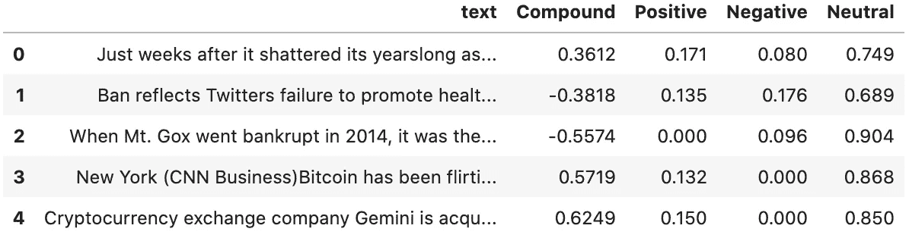
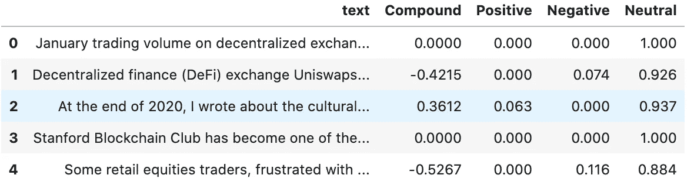
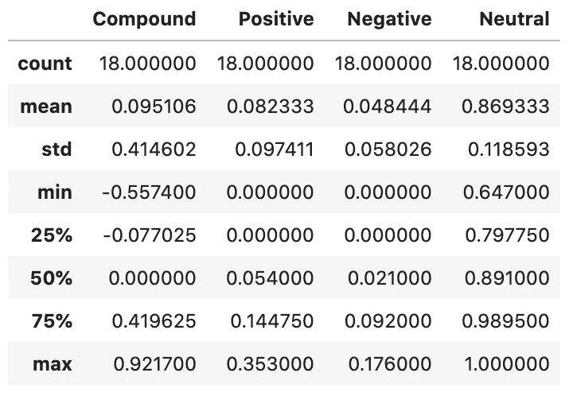
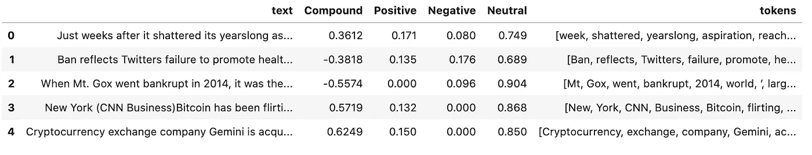
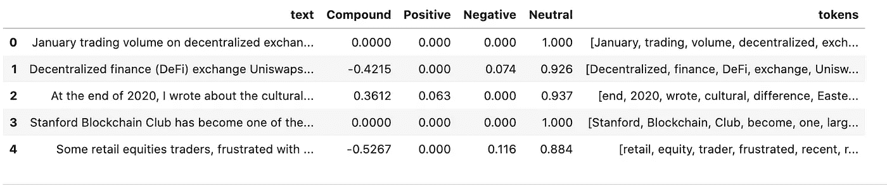
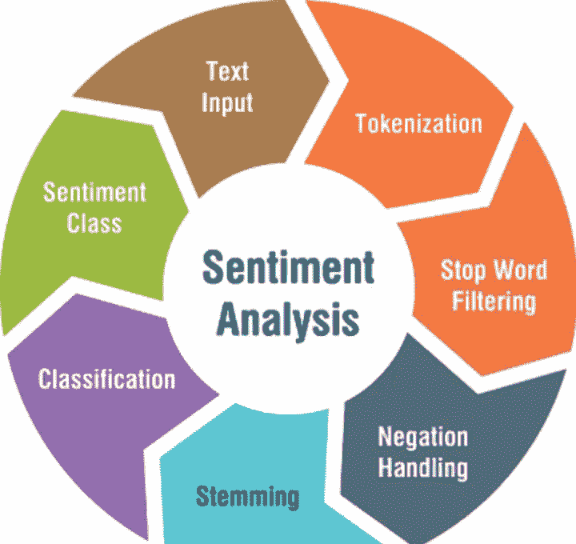
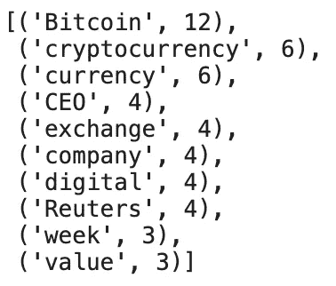
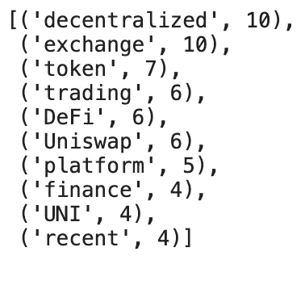
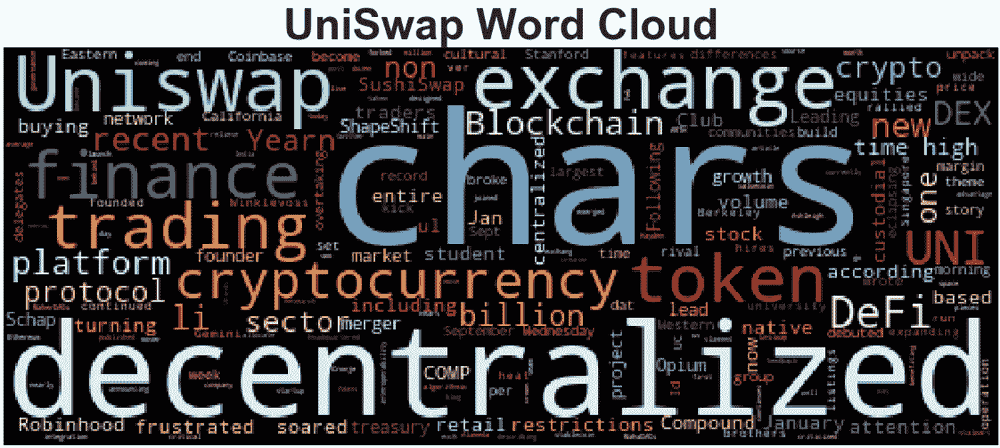

# 街上的传言是…DeFi

> 原文：<https://medium.datadriveninvestor.com/word-on-the-street-is-defi-90fd9e847e63?source=collection_archive---------16----------------------->

跟踪世界各地对加密、区块链和 DeFi 的看法


简介:

在这篇文章中，我们将找到比特币、加密货币和分散金融领域最受关注的话题。

正如你们许多人所知，金融世界正在发生变化，众所周知，疫情加速了这种变化。作为一名千禧一代，我生活的大部分时间都在手机上度过，像我们许多人一样，我们的个人生活也在网上进行。但这是一个独特的时期，因为我们不必等待世界其他地区赶上来。现在，包括企业在内的每个人都在网上，被迫使用技术来运作。想想看…整个世界，在同一页上…疯狂！

对于那些关注上周 GME、AMC、BB 和许多其他公司资金短缺的人来说。您知道，这只是迈向更透明、更值得信赖的市场的冰山一角…进入 DeFI！

目录:

*   获取新文章
*   创建情感分数
*   标记/删除停用词
*   N-grams，热门词汇
*   单词云

```
import os
import pandas as pd
%matplotlib inline
import nltk
nltk.download('vader_lexicon')from nltk.sentiment.vader import SentimentIntensityAnalyzer
analyzer = SentimentIntensityAnalyzer()
```

如果不按照列出的顺序导入库，python 将会产生一个错误。此外，如果您没有设置环境变量，您将需要对 NEWS_API_KEY 进行硬编码

*   [https://newsapi.org/](https://newsapi.org/)

```
# Read your api key environment variable
api_key = os.getenv("news_api")
OR
api_key = 'YOUR_API_KEY' # Create a newsapi client
from newsapi import NewsApiClientnewsapi = NewsApiClient(api_key=api_key)
```

获取新闻感悟:**比特币& UniSwap**

```
# Fetch the Bitcoin news articles
btc_headlines = newsapi.get_everything(
    q="bitcoin",
    language="en",
    sort_by="relevancy"
)# Fetch the Ethereum news articles
swap_headlines = newsapi.get_everything(
    q="uniswap",
    language="en",
    sort_by="relevancy"
)
```

创建情感分数:

```
# Create the Bitcoin sentiment scores DataFrame
sentiments = []for articles in btc_headlines["articles"]:
    try:
        text = articles["content"]
        results = analyzer.polarity_scores(text)
        compound = results["compound"]
        pos = results["pos"]
        neu = results["neu"]
        neg = results["neg"]sentiments.append({
            "text": text,
            "Compound": compound,
            "Positive": pos,
            "Negative": neg,
            "Neutral": neu,
        })
    except AttributeError:
        pass

btc  = pd.DataFrame(sentiments)
btc.head()
```



```
# Create the UniSwap sentiment scores DataFrame
sentiments = []for articles in swap_headlines["articles"]:
    try:
        text = articles["content"]
        results = analyzer.polarity_scores(text)
        compound = results["compound"]
        pos = results["pos"]
        neu = results["neu"]
        neg = results["neg"]sentiments.append({
            "text": text,
            "Compound": compound,
            "Positive": pos,
            "Negative": neg,
            "Neutral": neu,
        })
    except AttributeError:
        pass

swap  = pd.DataFrame(sentiments)
swap.head()
```



```
# Describe the Bitcoin Sentiment
btc.describe()swap.describe()
```



标记器:

在本节中，您将使用 NLTK 和 Python 来标记每个硬币的文本。

```
from nltk.tokenize import word_tokenize, sent_tokenize
from nltk.corpus import stopwords
from nltk.stem import WordNetLemmatizer, PorterStemmer
from string import punctuation
import re
```

要删除的单词(停用单词)

*   这一步需要一些技巧，你可能无法删除一些单词，但可以尝试一下，看看你能做什么。

```
wnl = WordNetLemmatizer() 
stop = stopwords.words('english')
stop.append("chars")
stop.append(" chars")
stop.append("chars ")
stop.append("u")
stop.append("it'")
stop.append("'s")
stop.append("n't")
stop.append('…')
stop.append("\`")
stop.append('``')
stop.append(" Chars")
stop.append("Chars")
stop.append("Chars ")
stop.append(" Chars ")
stop.append("''")
stop = set(stop)
```

接下来，我们将创建一个函数来标记和删除上面列出的单词。标记化将输入文本转换成标记流，其中每个标记是单独的单词、标点符号、数字/数量、日期、电子邮件、URL 等。

```
def tokenizer(text):
    """Tokenizes text."""

    # Create a list of the words
    words = word_tokenize(text)# Convert the words to lowercase
    words = list(filter(lambda w: w.lower(), words))

    # Remove the punctuation
    words = list(filter(lambda t: t not in punctuation, words))

    # Remove the stopwords
    words = list(filter(lambda t: t.lower() not in stop, words))

    # Lemmatize Words into root words
    tokens = [wnl.lemmatize(word) for word in words]

    return tokens
```

打印令牌列和数据帧:

```
btc["tokens"] = btc.text.apply(tokenizer)
btc.head()swap["tokens"] = swap.text.apply(tokenizer)
swap.head()
```



```
from collections import Counter
from nltk import ngrams
```

N-grams 和频率分析:

```
N = 2
grams = ngrams(tokenizer(btc.text.str.cat()), N)
Counter(grams).most_common(20)N = 2
grams = ngrams(tokenizer(swap.text.str.cat()), N)
Counter(grams).most_common(20)
```

**十大热门词汇:**

```
def token_count(tokens, N=3):
    """Returns the top N tokens from the frequency count"""
    return Counter(tokens).most_common(N)# Get the top 10 words - Bitcoin
all_tokens = tokenizer(btc.text.str.cat())
token_count(all_tokens, 10)
```



```
# Get the top 10 words - UniSwap
all_tokens = tokenizer(swap.text.str.cat())
token_count(all_tokens, 10)
```



**字云:**

```
from wordcloud import WordCloud
import matplotlib.pyplot as plt
plt.style.use('seaborn-whitegrid')
import matplotlib as mpl
mpl.rcParams['figure.figsize'] = [20.0, 10.0]def wordcloud(text, title=""):
    df_cloud = WordCloud(width=500, colormap='RdYlBu').generate(text)
    plt.imshow(df_cloud)
    plt.axis("off")
    fontdict = {"fontsize": 48, "fontweight" : "bold"}
    plt.title(title, fontdict=fontdict)
    plt.show()wordcloud(btc.text.str.cat(), title="Bitcoin Word Cloud")
```


```
wordcloud(swap.text.str.cat(), title="UniSwap Word Cloud")
```



**感谢阅读！**

*如果你觉得这篇文章有用，欢迎在*[*GitHub*](https://github.com/scottandersen23/Medium_Blog/tree/main/Articles)*上下载我的个人代码。你也可以直接在 scottandersen23@gmail.com 给我发邮件，在*[*LinkedIn*](https://www.linkedin.com/in/scott-andersen-3208897b/)*上找到我。有兴趣了解更多关于数据分析、数据科学和机器学习应用的信息吗？跟我上* [*中*](https://medium.com/@scottandersen23) *。*