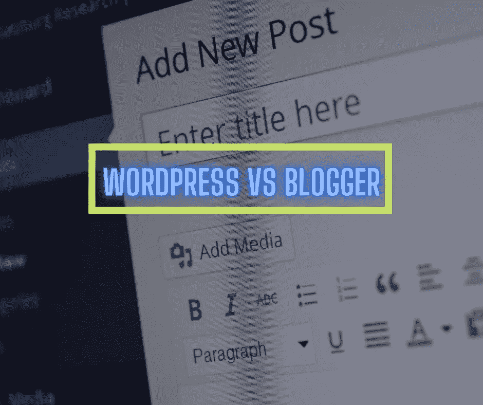

# WordPress 和 Blogger——哪个最适合写博客？

> 原文：<https://medium.datadriveninvestor.com/wordpress-vs-blogger-which-one-is-best-for-blogging-60d341e24942?source=collection_archive---------22----------------------->

## 开始你的博客生涯，在 WordPress 和 Blogger 之间困惑？

WordPress Vs Blogger — Which is Best for Blogging? Photo by Author

对于那些对写作有着永恒热情的人来说，写日志可能是一个很好的爱好。因此，对于那些希望通过他们生产的高质量内容为**创造收入的人来说，这是一个好机会。然而，人们不应该认为这是赚大钱的捷径，因为作为一种职业，它本身需要在金钱滚滚而来之前有**的精彩内容**。尽管如此，如果你对它充满热情，这是一个令人满意的职业。**

 [## 一个非英语母语的人如何从 Upwork 上的内容写作中赚到 1 万美元

### 如果你的母语不是英语，并且你是 Upwork 或 Fiverr 的内容作者，你一定会觉得…

medium.com](https://medium.com/illumination/how-a-non-native-english-speaker-made-10-000-from-content-writing-on-upwork-2fdec8b503d0) 

# **如何开始写博客**

为了开一个博客，你必须选择一个适合你需求的博客平台。博客平台是一个软件，使你能够在互联网上发布你的内容，并让你的观众方便地享受你提出的东西。

让我们来决定哪种软件更适合作为博主的你。

# [**博主**](https://www.blogger.com/about/)

Blogger 是一个**免费发布平台**，它提供了几个博客布局和外观的主题供用户选择，并在几分钟内完成设置和运行。对于那些选择博客作为业余爱好的用户来说，它尤其方便和有益，因为他们不必担心订阅网站托管服务。从所需的技术术语最少的意义上来说，它比 WordPress 更方便。然而，这种访问的便利也伴随着一些相当令人担忧的缺点。

Photo by [Dan Counsell](https://unsplash.com/@dancounsell?utm_source=medium&utm_medium=referral) on [Unsplash](https://unsplash.com?utm_source=medium&utm_medium=referral)

你可以在没有任何初始投资的情况下开始**，但这也意味着没有简单的方法将你在 Blogger 上的工作货币化。Blogger 作为市场先锋的日子已经可悲地结束了，现在改进你的 Adsense 帐户是一件麻烦事，这是你通过博客赚钱的主要方式。你可能还会惊讶地发现，尽管它是谷歌的产品， **Blogger 缺乏适当的 SEO 整合**。**

对于那些不知道的人来说，S **EO 的意思是搜索引擎优化**，它是决定你的网站是否会登上搜索引擎首页的方面，因此它可以决定你早期博客生涯的成败。对博客的有限控制意味着，尽管你仍然可以享受写博客的乐趣，但你通过 Blogger 成名的可能性很小。

 [## 我喜欢写作，但英语是我的第二语言

### 笔确实比剑更强大，但它能克服长期存在的偏见吗？

medium.com](https://medium.com/illumination/i-love-writing-but-english-is-my-second-language-f4579d555aa2) 

# [**按**键](https://wordpress.org/)

你可以认为 **WordPress 就像 Blogger** 的表亲，它设法与时俱进，使自己成为博客市场的重要组成部分。自然，它比 Blogger 要复杂一点，但是如果不增加一点复杂性的话，你真的不能要求更多的特性。

然而，与 Blogger 不同，你需要投资一些钱来使用它的全部功能，这意味着你将不得不**支付虚拟主机和域名**。然而，从功能上看，WordPress 超越了简单的主题和颜色选项。有成千上万种颜色可供选择，让你的网站看起来完全符合你的要求

Photo by [Stephen Phillips - Hostreviews.co.uk](https://unsplash.com/@hostreviews?utm_source=medium&utm_medium=referral) on [Unsplash](https://unsplash.com?utm_source=medium&utm_medium=referral)

[**插件系统**](https://wordpress.org/plugins/) 的种类更加丰富，性质更加复杂。有专门的插件允许你将视频嵌入到你的博客中，用于 SEO 的插件意味着卓越的优化和对你希望你的博客如何运行的更大的控制。学习将这些插件集成到你的博客中可能一开始会觉得是一个挑战，但是 WordPress 社区在这方面非常友好，并且有很多容易学习的教程让这个任务变得可以忍受。

此外，你自己管理你的网站使得它很容易获得 Adsense 的批准。随着形象建设和品牌推广变得更加容易，所有这些额外的品质使得 WordPress 从一个非正式领域进入一个更加专业的领域。人们会自然而然地认为一个愿意为自己的博客付费的人对自己追求的东西会更加认真，这意味着 WordPress 有更好的声誉，因为你必须为它付费的事实会阻止网络流氓利用它来搞笑。

有了正确的信息，你现在可以开始写你自己的博客了！我祝你好运，并希望你成功。

 [## 用我的推荐链接加入媒体-萨尔的想法

### 阅读萨尔的每一个故事(以及媒体上成千上万的其他作家)。你的会员费直接支持萨尔和…

sal.medium.com](https://sal.medium.com/membership)