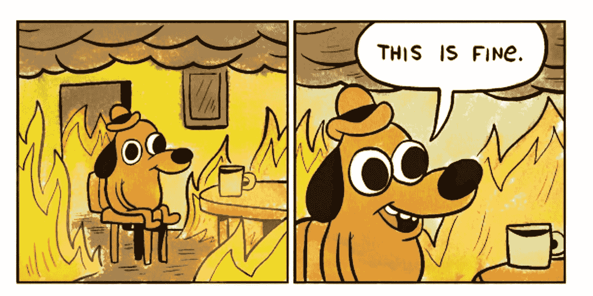

# 工作日志:2021 年 1 月 6 日

> 原文：<https://medium.datadriveninvestor.com/work-log-january-6-2021-1cdcbed58632?source=collection_archive---------37----------------------->

**9:15**–与老板 1:1。

> “你看新闻了吗？”
> 
> “是啊！”
> 
> “这将是伟大的一天！”

**10:00** -与导师会面，讨论变革管理最佳实践。打开谷歌搜索一个不熟悉的术语，就会看到标题:“特朗普——“我们永远不会让步，”

伟大的

**11:30**——短暂休息，绕着街区走一圈，每隔一步都有新鲜的新闻:“国会大厦被包围”，“暴动风暴圆形大厅”，“国会疏散”

这很好。

1:00 -给住在市中心的同事发信息，确保她安全。早点去便利店买瓶汽水，以防宵禁。

完全正常

**1:30** -一边更新项目跟踪工具，一边吃比萨饼。“华盛顿 DC 处于宵禁状态”“国民警卫队启动”“位于民主党全国委员会和 RNC 总部的爆炸物”

这里没什么可看的

**2:00-** 会见副总裁，了解他对 2021 年组织发展目标的看法。特朗普发布了预先录制的视频，告诉他的支持者:他们很特别。他们是被爱的。他礼貌地请求他们回家。

耶！一切都好…

**3:00-** 评审奖励申请的会议

> “我不敢相信我们今天工作的时候一切都很正常”
> 
> “是啊，相当不可思议。我们还能做什么？”
> 
> “你听说新的病毒株了吗？预计传染率会增加 50%！”
> 
> “不知道会不会被命名为 Covid-20？”

非常敏锐

**4:00** -在本周晚些时候安排会议，讨论金融扫盲活动。得到通知:“军士宣布国会大厦清除了一群狂暴的暴徒”。

检查 2021-宾果卡上的“暴民”。

赢了！

**4:30-** 查看邮件，我的公司发来了一本支持员工参与度的精美活动手册。政治领导人再次讨论弹劾。

可怕的

**5:30** -关闭“工作标签”并打开“个人标签”以查看一名抗议者在被枪击后死亡，twitter 锁定胜过 Twitter 帐户，国会将重新召开以完成他们的工作。

回到“办公室”的第二天，这是一个颇有成效的工作日。

2021 年是一个伟大的开始！