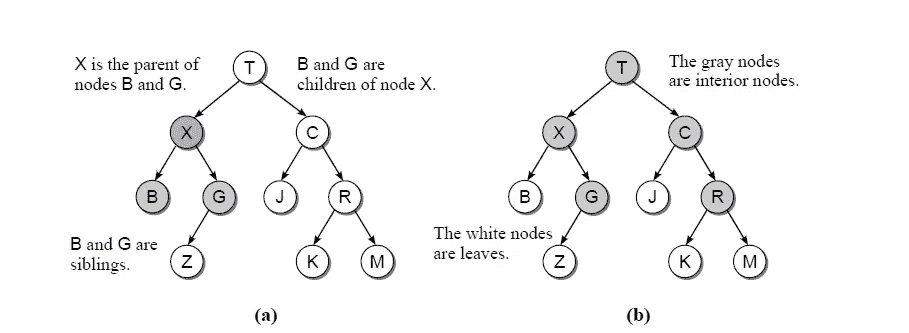
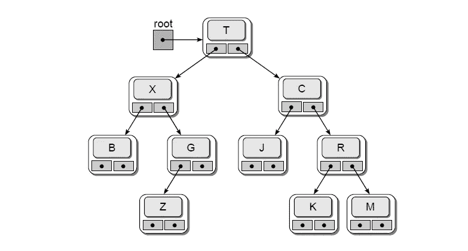

# 与二叉查找树合作

> 原文：<https://medium.datadriveninvestor.com/working-with-binary-search-tree-feb61eb2ef44?source=collection_archive---------6----------------------->

## 数据科学基础 Python 中的算法和编程


Photo by [Christopher Gower](https://unsplash.com/@cgower?utm_source=medium&utm_medium=referral) on [Unsplash](https://unsplash.com?utm_source=medium&utm_medium=referral)

# 介绍

树结构由分层组织数据的节点和边组成。编程语言世界中的任何树都可以比作家谱，其中祖先、父母和孩子的组合被广泛使用。数据元素使用通常称为节点的存储桶来存储，而每个节点使用边来连接到其他节点。在我们进入二叉树如何操作之前，让我们先理解一些关键的概念。

[](https://www.datadriveninvestor.com/2019/04/08/algorithms/) [## 算法本身并没有偏见，它是预期的结果，会带来意想不到的后果

### 对于科技公司如何在软件中使用算法，有很多批评倾向于…

www.datadriveninvestor.com](https://www.datadriveninvestor.com/2019/04/08/algorithms/) 

1.  **根节点** —树的开始/最顶端节点
2.  **路径** —为了访问树中的其他节点，在目的节点到达之前需要沿着某些边。这种从一个节点到另一个节点的遍历形成了一条路径
3.  **父节点**——任何细分为更多节点的节点都称为路径
4.  **子节点** —根节点被细分或分支成更多的节点称为子节点。*注意，一棵二叉树最多可以有 2 个子节点*
5.  **内部节点** —至少有一个子节点的节点
6.  **叶节点** —没有子节点的节点



Figure 1\. The sample tree with (a) the parent, child, and the sibling relationship; (b) representation of interior nodes and leaves (Reference — *Data Structures and Algorithms using Python, Rance D. Necaise, Chapter 13, Page 371)*

# 性能

二叉树是一种非线性数据结构，它允许使用节点来组织数据。一棵二叉树最多可以有两个子树，一个标识为左，另一个标识为右。节点不仅用于存储数据元素，还用于存储左右子/子树的地址。可以使用下面提到的规则来构建二叉树:

1.  节点的左子树包含小于根的值
2.  节点右边的子树包含大于根的值
3.  左侧和右侧的子树也必须是没有任何重复值的二叉查找树



Figure 2\. Signifies how BST (Binary Search Tree) is implemented using Python. Node that T, X, C, B and so on represents the data element where as the dots stores address of left and right child nodes (Reference — *Data Structures and Algorithms using Python, Rance D. Necaise, Chapter 13, Page 377)*

# 履行

```
class Node:

    *"""
    A constructor is used to initialize the data, left_add, and right_add variables. The variable, data,
    stores the data item, whereas the left_add and the right_add variable stores the address of the left and right child.
    """* def __init__(self,data,left_add=None,right_add=None):
        self.data=data
        self.left_add=left_add
        self.right_add=right_add

    """
    insert() is used to add value to a binary tree. Remember the rules discussed above:
    1\. The left subtree of a node contains values smaller than the root
    2\. The right subtree of a node contains values larger than the root
    3\. The left and right subtree each must also be a binary search tree without any duplicate values
    """
    def insert_data(self,item):
        #--Decision trees can't have duplicates, hence the condition is checked before an item is inserted
        if self.data==item:
            return False

        elif item<self.data: #--if data to be inserted is smaller than the data at root node
            if self.left_add: #--Check if the left child exists
                self.left_add.insert_data(item)
            else:
                self.left_add=Node(item) #--Else add a node and store the object address in left_add
                return True
        #--Similar methodology discussed above is followed when item is greater than the item in the root node
        else:
            if self.right_add:
                self.right_add.insert_data(item)
            else:
                self.right_add = Node(item)
                return True
    """
    find() is used to search for a particular value in the tree. It follows the similar structure used for inserting an element.
    Remember binary tree uses a node based approach that has three components to it.
    1\. Data item
    2\. left address to store object address of the left child
    3\. right address to store the object address of the right child
    """
    def find_data(self,item):

        if self.data==item:
            return True
        elif item<self.data:
            if self.left_add:
                self.left_add.find_data(item)
            else:
                return False
        else:
            if self.right_add:
                self.right_add.find_data(item)
            else:
                return False

    def preorderTraversal(self, list_item):
        #--Traverses the binary tree
        #--first element is the element from the root
        list_item.append(self.data)

        #--If left_add is present then it adds element from the left child to the list
        #--Once all items from the left of the tree are added, it moves to the right child

        if self.left_add:
            self.left_add.preorderTraversal(list_item)
        if self.right_add:
            self.right_add.preorderTraversal(list_item)
        return list_item

    def inorderTraversal(self,list_item):

        if self.left_add:
            self.left_add.inorderTraversal(list_item)

        list_item.append(self.data)

        if self.right_add:
            self.right_add.inorderTraversal(list_item)

        return list_item

    def postorderTraversal(self,list_item):

        if self.left_add:
            self.left_add.inorderTraversal(list_item)
        if self.right_add:
            self.right_add.inorderTraversal(list_item)

        list_item.append(self.data)

        return list_item
```

下一部分涉及到创建二叉查找树类。

```
class BinarySearchTree(object):

    def __init__(self):
        self.root=None

    def insert(self, d):

        if self.root:
            return self.root.insert_data(d)
        else:
            self.root = Node(d)
            return True

    def find(self, d):

        if self.root:
            return self.root.find_data(d)
        else:
            return False

    def __str__(self):
        # return list of data elements resulting from preorder tree traversal
        if self.root:
            return ",".join(map(str, self.root.postorderTraversal([])))
        else:
            return "the tree is empty"

if __name__ == "__main__":
    test_tree = BinarySearchTree()  # initialize the binary search tree
    # add elements to the tree
    items = [3, 5, 4, 7, 6, 1]
    for item in items:
        test_tree.insert(item)

    print(test_tree)  # tree traversal
    print(test_tree.find(10))  # tree search
```

## 参考

Necaise 研发中心(2011 年)。*使用 Python 的数据结构和算法*。新泽西州霍博肯:约翰·威利父子公司。

*关于作者:高级分析专家和管理顾问，帮助公司通过对组织数据的商业、技术和数学的组合找到各种问题的解决方案。一个数据科学爱好者，在这里分享、学习、贡献；可以和我在* [*上联系*](https://www.linkedin.com/in/angel-das-9532bb12a/)*[*上推特*](https://twitter.com/dasangel07_andy)*；**

***进入专家视图—** [**订阅 DDI 英特尔**](https://datadriveninvestor.com/ddi-intel)*