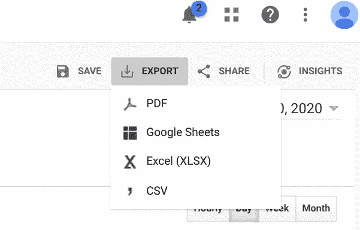
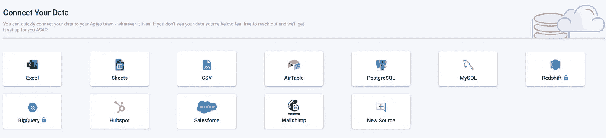
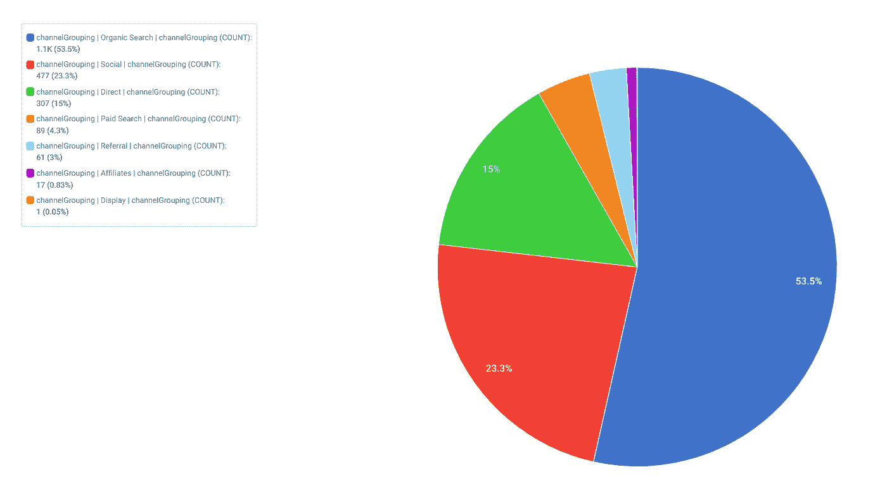
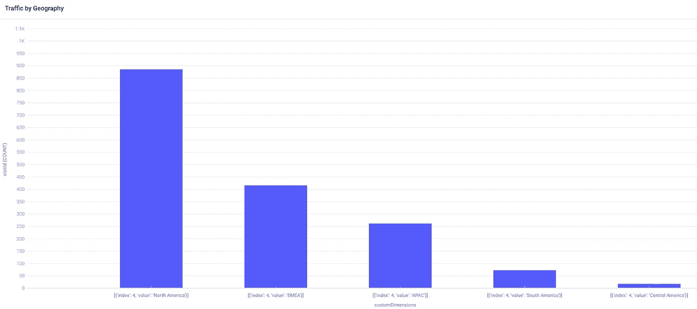

# 使用 Google Analytics BigQuery 数据

> 原文：<https://medium.datadriveninvestor.com/working-with-google-analytics-bigquery-data-10be145149ee?source=collection_archive---------5----------------------->

## 简单指南。


Photo by [Myriam Jessier](https://unsplash.com/@mjessier?utm_source=medium&utm_medium=referral) on [Unsplash](https://unsplash.com?utm_source=medium&utm_medium=referral)

igQuery 是一种存储和访问大量数据的强大方法。当您拥有大量千兆字节甚至兆兆字节的数据时，这是非常有用的。

在这种规模下，需要像谷歌的 BigQuery 这样的定制服务，因为 Excel 等工具会在 [2 GB](https://support.microsoft.com/en-us/office/data-model-specification-and-limits-19aa79f8-e6e8-45a8-9be2-b58778fd68ef) 时中断，Tableau 的建议限制为 10 GB，Python 的 Pandas 会很快遇到内存问题。

大量表格数据的一个来源是 Google Analytics 360。例如，谷歌公布了来自谷歌商品商店的谷歌分析 360 数据的[大查询数据集](https://www.kaggle.com/bigquery/google-analytics-sample)，其中[的月访问量超过 10 万次](https://www.similarweb.com/website/googlemerchandisestore.com/)。

# 读取数据

如果您有少量的 Google Analytics 数据，单击报告右上角的“导出”可以很容易地导出为 Google Sheet、Excel sheet 或 CSV。



另一方面，较大的谷歌分析账户(谷歌分析 360)有一个[大查询导出功能](https://support.google.com/analytics/answer/3416092?hl=en)。

分析 BigQuery 数据不同于我们习惯的格式——比如 CSV。我们不是“打开”或“读取”数据，而是查询它，就像这样:

```
import bq_helper
from bq_helper import BigQueryHelper
google_analytics = bq_helper.BigQueryHelper(active_project="bigquery-public-data",dataset_name="data:google_analytics_sample")bq_assistant = BigQueryHelper("bigquery-public-data", "google_analytics_sample")
**query = """SELECT *
            FROM `bigquery-public-data.google_analytics_sample.ga_sessions_*`
            WHERE
_TABLE_SUFFIX BETWEEN '20170701' AND '20170701'
            """**
export = bq_assistant.query_to_pandas_safe(query)
export.to_csv("export.csv")
```

`query =`后面的代码是一个 SQL 语句，它选择了 2017 年 7 月 1 日以来的所有 BigQuery Google Analytics 360 会话数据。然后，我使用一个名为`query_to_pandas_safe`的函数将其转换成熊猫数据帧，我可以使用`to_csv`将其导出为 CSV。

[](https://www.datadriveninvestor.com/2020/08/11/being-good-at-google-is-a-skill/) [## 擅长谷歌是一种技能|数据驱动的投资者

### 擅长‘谷歌’是一种技能。是的，你听到了。知道什么和如何谷歌或搜索的东西是一个…

www.datadriveninvestor.com](https://www.datadriveninvestor.com/2020/08/11/being-good-at-google-is-a-skill/) 

# 分析数据

使用像 [Apteo](http://apteo.co) 这样的分析工具，我们可以轻松地连接 BigQuery 数据，无论是直接从数据源，还是作为我们导出的 CSV。



对于简单的统计，比如特定类型的访问次数，我们可以在 BigQuery 上使用 SQL 查询，而 Apteo 让我们无需任何代码就可以轻松地可视化数据。



例如，我们可以从上面看到，大部分流量来自有机搜索(搜索引擎)，其次是社交媒体，直接访问 googlemerchandisestore.com(例如点击书签)，少量流量来自付费搜索和推荐链接。

让我们通过绘制`customDimensions`(包含区域)和`visitID`来想象流量来自哪个区域。



我们可以看到，北美是流量最大的地区，其次是 EMEA(欧洲、中东和非洲)、APAC(亚太地区)，少量流量来自南美和中美。

最终，可以用类似于典型数据源的方式来分析 BigQuery 数据。使用像 [Apteo](http://apteo.co) 这样的工具，您可以直接连接 BigQuery 源，或者甚至使用我们讨论过的导出函数来创建您最感兴趣的数据子集的 CSV。

**访问专家视图—** [**订阅 DDI 英特尔**](https://datadriveninvestor.com/ddi-intel)