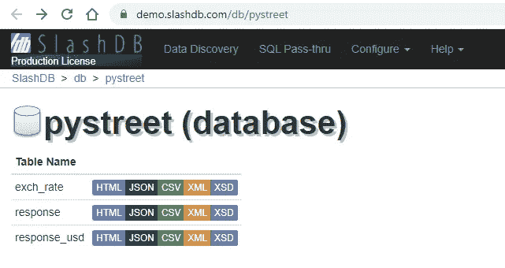

# 将云数据导入 MATLAB 进行数据分析

> 原文：<https://medium.datadriveninvestor.com/working-with-multiple-databases-in-matlab-24e5a5bf5ab1?source=collection_archive---------21----------------------->


作为一名数据科学家，您知道您的数据可能来自各个地方。您可以跨多个服务器使用任意数量的数据库，或者您可能需要使用特定的数据格式，比如 JSON 或 CSV。当您必须编写查询来检索数据时，您可能需要切换连接字符串、连接到 VPN 或者使用不同的数据库系统。

随着数据源的增加，这变得越来越难管理，但是有一些工具可以帮助简化这一过程。其中一个特别的例子是 SlashDB。SlashDB 允许您为所有数据库创建一个单一的入口点，这样您就不需要跟踪凭证。这样，您就不必担心数据不同步，也不必处理大量的隔夜提要。

[](https://www.datadriveninvestor.com/2020/02/19/five-data-science-and-machine-learning-trends-that-will-define-job-prospects-in-2020/) [## 将定义 2020 年就业前景的五大数据科学和机器学习趋势|数据驱动…

### 数据科学和 ML 是 2019 年最受关注的趋势之一，毫无疑问，它们将继续发展…

www.datadriveninvestor.com](https://www.datadriveninvestor.com/2020/02/19/five-data-science-and-machine-learning-trends-that-will-define-job-prospects-in-2020/) 

其中一个最酷的特性是，你可以用一个 URL 访问数据库记录，并将任何查询结果保存到最常见的文件类型中。这就是你将在这个快速教程中看到的效果。您将在 MATLAB 中使用 SlashDB 进行一些简单的数据分析。

# 获取数据

我为客户做的一些数据分析项目通常会产生某种报告，提交给团队，告诉他们可以做出哪些改进。这可能类似于将用户在一个系统上的登录次数与他们在另一个系统上的交易次数进行比较。当公司处理大量数据时，这种情况经常发生，但出于安全原因，需要将它们分开保存，例如在银行业。

为了演示这种系统的运行，我们将使用这里提供的演示数据:[https://demo.slashdb.com/db](https://demo.slashdb.com/db)

我们将特别使用 *PyStreet* 数据库。我们将查看一组来自世界各地的开发人员工资样本，并比较几种货币的员工和自雇人员的工资。在这个页面上需要注意的一点是，您看到的数据库实际上来自一个查询！这个网页是一个数据库查询，您可以在右上角以任何方式设置它的格式。


现在我们要把我们需要的数据导入到一个新的 MATLAB 文件中。这是让 SlashDB 如此酷的部分。您可以直接在浏览器中运行数据库查询，并以任何提供的格式下载数据。您不需要担心连接到数据库和获取最新的数据。对数据库的任何更新都会自动反映在查询的 URL 上。

我们将查看 *Pystreet* 数据库中的*响应*和 *exch_rate* 表。



您可以在 URL 中编写一个查询，从标识为雇员或自雇人员的开发人员那里获得响应。只要您知道正在处理的表的列名以及要作为搜索依据的值，就可以在浏览器中快速编写查询。


Employee data query in the browser


Self-employed data query in the browser

在查询结果的浏览器视图中，您还可以看到将所有结果导出为不同文件格式的选项。对于这个例子，我们将直接从 URL 导入数据。这是 SlashDB 最好的特性之一。只要您拥有数据所在的 URL，就不必导出任何内容。

```
employeeData = webread('[https://demo.slashdb.com/db/pystreet/response/empl_type/Employee.j](https://demo.slashdb.com/db/pystreet/response/empl_type/Employee.html)son');selfEmployedData = webread('[https://demo.slashdb.com/db/pystreet/response/empl_type/Self-employed.j](https://demo.slashdb.com/db/pystreet/response/empl_type/Self-employed.html)son');
```

接下来，我们将为我们将用于转换的汇率编写一个查询 URL，并将它们导入到我们的文件中。


```
exchangeRates = webread('[https://demo.slashdb.com/db/pystreet/exch_rate.j](https://demo.slashdb.com/db/pystreet/exch_rate.html)son');
```

我们已经有了开始制作这份报告所需的所有数据，但首先我们需要转换数据，以美元、欧元和印度卢比来反映这些工资。

# 转换数据

我们首先将雇员和自雇者都转换为美元，以获得基础货币。这些数据集包含来自世界各地的货币，因为这些数据是从对所有国家的开发人员的调查中收集的，所以工资包含多种货币。

首先，我们将为转换后的薪水设置一个具有正确维度的零数组。您可以从初始结构的形状中获得正确的尺寸。

```
employeeUsdSal = zeros(1,123);
selfEmployedUsdSal = zeros(1,33);
```

为了使数据更容易处理，您可以将初始结构转换为简单的单元格数组。我们将为员工和自雇者数据的 *ccy、country、*和 *salary* 字段执行此操作。我们还将对我们导入的汇率数据的*汇率*和 *ccy* 字段进行转换。(这些比率不是最新的)

```
employeeSalary = [employeeData.salary];
employeeCcy = {employeeData.ccy};
employeeCountry = {employeeData.country};selfEmployedSalary = [selfEmployedData.salary];
selfEmployedCcy = {selfEmployedData.ccy};
selfEmployedCountry = {selfEmployedData.country};exchRateCcy = {exchangeRates.ccy};
exchRate = [exchangeRates.rate];
```

我们接下来要做的是检查所有员工和自营职业者的工资，并使用 *ccy* 字段计算出我们将从哪种货币兑换成美元。然后，我们将使用汇率数据，使用适当的汇率来转换所有这些 *ccy* 字段值。

```
for i=1:length(employeeSalary)
  j = find(ismember(exchRateCcy, employeeCcy(i)));
  employeeUsdSal(i) = employeeSalary(i) / exchRate(j);
endfor i=1:length(selfEmployedSalary)
  j = find(ismember(exchRateCcy, selfEmployedCcy(i)));
  selfEmployedUsdSal(i) = selfEmployedSalary(i) / exchRate(j);
end
```

既然我们已经将两个组的工资转换为美元，那么让我们继续将工资转换为欧元和印度卢比。所以我们要初始化一些数组。

```
employeeEurSal = zeros(1,123);
selfEmployedEurSal = zeros(1,33);employeeInrSal = zeros(1,123);
selfEmployedInrSal = zeros(1,33);
```

现在，我们将完成从美元到欧元和从美元到印度卢比的转换。

```
for i=1:length(employeeSalary)
  j = find(ismember(exchRateCcy, 'EUR'));
  k = find(ismember(exchRateCcy, 'INR'));
  employeeEurSal(i) = employeeUsdSal(i) * exchRate(j);
  employeeInrSal(i) = employeeUsdSal(i) * exchRate(k);
endfor i=1:length(selfEmployedSalary)
  j = find(ismember(exchRateCcy, 'EUR'));
  k = find(ismember(exchRateCcy, 'INR'));
  selfEmployedEurSal(i) = selfEmployedUsdSal(i) * exchRate(j);
  selfEmployedInrSal(i) = selfEmployedUsdSal(i) * exchRate(k);
end
```

因为我们已经将所有数据转换成了我们想要考虑的货币，所以在报告中包含一个可视化将会很有帮助。我们将制作一些图表来显示数据集中每个国家不同货币的工资范围。

最后，我们将按国家对工资进行分组，然后找出最高工资作为图表上工资范围的上限。这些数据集中代表了不同数量的国家，因此它们将为员工和自雇开发人员提供每种货币的初始最高工资数组的维度。

```
employeeCountries = unique(employeeCountry);
selfEmployedCountries = unique(selfEmployedCountry);highestEmployeeSalUsd = zeros(1,33);
highestEmployeeSalEur = zeros(1,33);
highestEmployeeSalInr = zeros(1,33);highestSelfEmployedSalUsd = zeros(1,15);
highestSelfEmployedSalEur = zeros(1,15);
highestSelfEmployedSalInr = zeros(1,15);for i=1:length(employeeCountries)
  currEmpCounInds = find(ismember(employeeCountry,     employeeCountries(i))); currEmpUsd = sort(employeeUsdSal(currEmpCounInds),'descend');
  currEmpEur = sort(employeeEurSal(currEmpCounInds),'descend');
  currEmpInr = sort(employeeInrSal(currEmpCounInds),'descend'); highestEmployeeSalUsd(i) = currEmpUsd(1);
  highestEmployeeSalEur(i) = currEmpEur(1);
  highestEmployeeSalInr(i) = currEmpInr(1);
endfor i=1:length(selfEmployedCountries)
  currSelfEmpCounInds = find(ismember(selfEmployedCountry, selfEmployedCountries(i))); currSelfEmpUsd = sort(selfEmployedUsdSal(currSelfEmpCounInds),'descend');
  currSelfEmpEur = sort(selfEmployedEurSal(currSelfEmpCounInds),'descend');
  currSelfEmpInr = sort(selfEmployedInrSal(currSelfEmpCounInds),'descend'); highestSelfEmployedSalUsd(i) = currSelfEmpUsd(1);
  highestSelfEmployedSalEur(i) = currSelfEmpEur(1);
  highestSelfEmployedSalInr(i) = currSelfEmpInr(1);
end
```

现在，我们可以为不同国家的多种货币的员工和自雇开发人员工资报告制作条形图。

```
empX = categorical(employeeCountries);
selfEmpX = categorical(selfEmployedCountries);bar(empX, highestEmployeeSalUsd)
bar(empX, highestEmployeeSalEur)
bar(empX, highestEmployeeSalInr)bar(selfEmpX, highestSelfEmployedSalUsd)
bar(selfEmpX, highestSelfEmployedSalEur)
bar(selfEmpX, highestSelfEmployedSalInr)
```


Employee salaries in USD


Employee salaries in EUR


Employee salaries in INR


Self-employed salaries in USD


Self-employed salaries in EUR


Self-employed salaries in INR

希望这是一个有趣的例子，让你学习并获得更多使用 MATLAB 的经验，使用数据库、SlashDB，并从数据中获得有意义的结果。

你可以在这里下载工作的 MATLAB 代码:[https://github.com/SlashDB/matlab-demo](https://github.com/SlashDB/matlab-demo)

你也可以在这里了解更多关于 SlashDB 的信息:【https://www.slashdb.com/how-it-works/ T2

我经常在[推特](https://twitter.com/FlippedCoding)上谈论像这样的酷工具，所以你应该关注我！