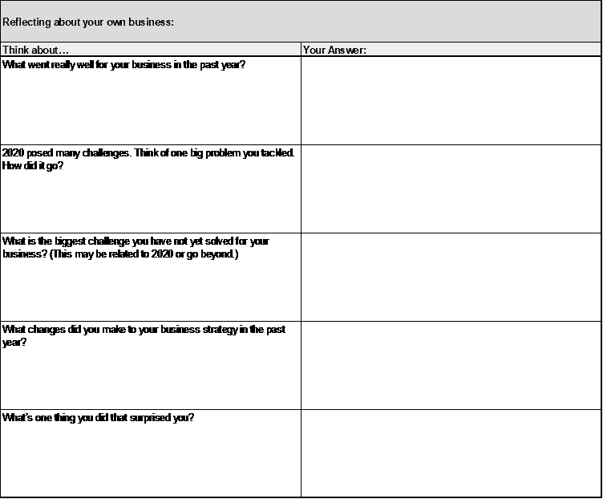
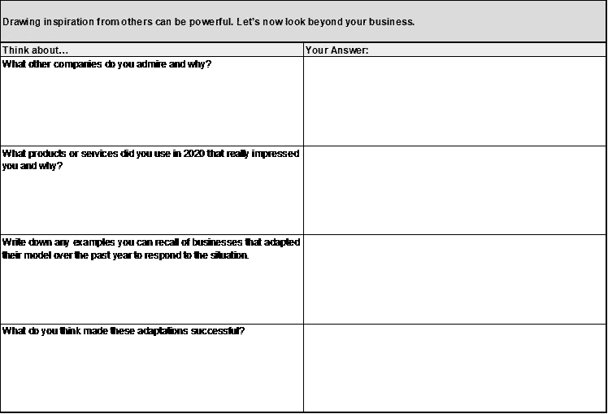
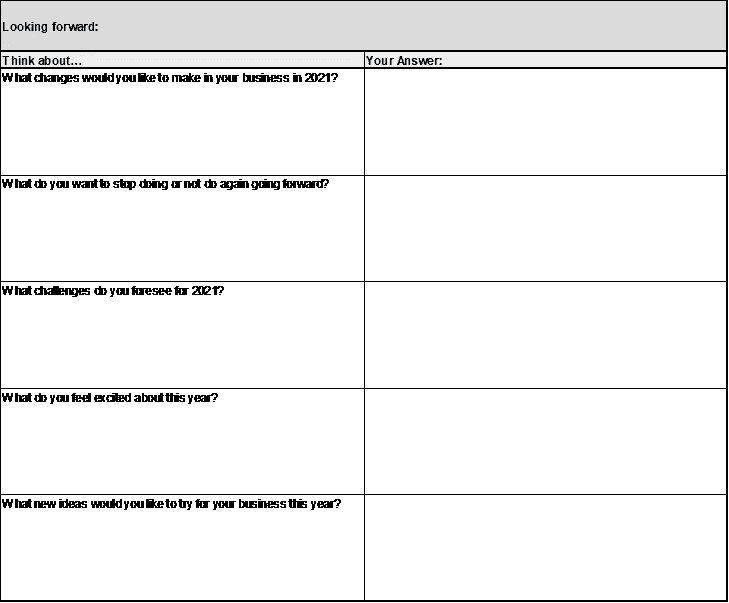

# 工作表:思考并设定新一年的目标

> 原文：<https://medium.datadriveninvestor.com/worksheet-reflecting-on-2020-to-set-intentional-goals-for-2021-5b6f56d04822?source=collection_archive---------35----------------------->

欢迎来到新的一年！可以肯定地说，我们中的许多人很高兴将 2020 年抛在身后，随着新的开始，是时候开始为未来制定计划了。让我们开始吧！

每年年初，我都喜欢为自己和我的事业设定具体的目标。在过去的五年里，我一直使用同一个[目标设定框架](https://www.the-emms.com/blog/2018/12/24/forget-new-years-resolutions-heres-how-to-set-goals-and-keep-them)来创建目标并坚持下去，但是在我今年这样做之前，我花了一些时间来反思和收集我的想法。

我会经常[使用思维导图](https://www.the-emms.com/blog/2018/12/24how-to-use-mind-mapping-to-achieve-your-goals)来探索我的想法和创意，这是一种从你自己的头脑中获取洞察力的非常好的方式。今年，我将围绕这个过程建立更多的结构，让自己有意识地去创造有意义的目标。

根据我过去一年的经历，有一点对我来说很突出，那就是，虽然我们都面临挑战，但你如何应对它们才是最重要的。成功不是躲避障碍或等待事情平息。这是关于接受事情可能很难——甚至看起来不可能——并采取行动改变它们。

考虑到这一点，我创建了一个工作表来帮助确定什么是有效的，什么是无效的，这样你就可以正面应对你的挑战。如果你想为 2021 年设定意向目标，我鼓励你和我一起使用下面的工作表来思考你从哪里来，你想去哪里。

不要认为这是一个设定目标的练习，而应该认为这是一次有指导的头脑风暴，在深入细节之前定下基调。

一旦你完成了这张工作表，我希望你会受到鼓舞，带着新的视角和动力投入到新的一年，去做伟大的事情。下一步是[写下一些你可以开始积极努力的目标](https://www.the-emms.com/blog/2018/12/24/forget-new-years-resolutions-heres-how-to-set-goals-and-keep-them)。

祝你好运，并希望你有一个成功的开始！

***感觉受到了启发？想要在 2021 年为你的企业创造有效的目标？*** [***取得联系***](https://www.the-emms.com/contact-us) ***进行一对一咨询。***

**进入专家视角—** [**订阅 DDI 英特尔**](https://datadriveninvestor.com/ddi-intel)

*文章原载于*[*www.the-emms.com*](http://www.the-emms.com)*，2021 年 1 月 6 日*