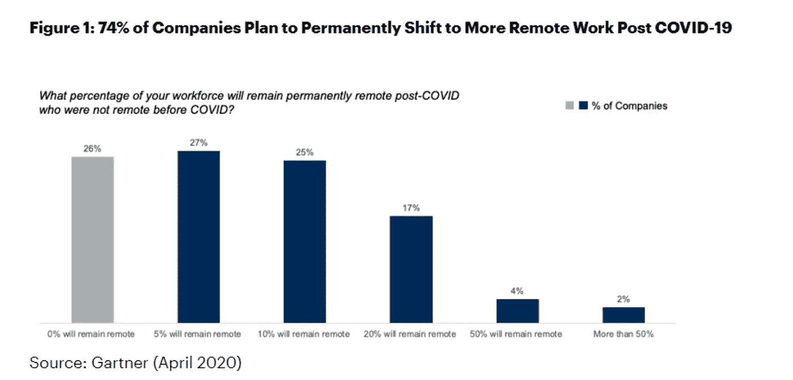
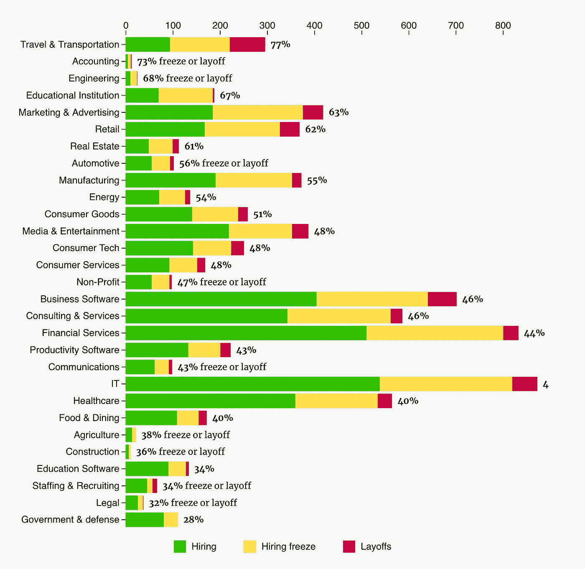

# 新冠肺炎之后的世界:很多将会改变

> 原文：<https://medium.datadriveninvestor.com/world-after-covid-19-a-lot-will-change-54df41f1b526?source=collection_archive---------18----------------------->

## 充满新机遇和新方式的世界

Photo by [Bluehouse Skis](https://unsplash.com/@bluehouseskis?utm_source=medium&utm_medium=referral) on [Unsplash](https://unsplash.com?utm_source=medium&utm_medium=referral)

我认为我们已经改变了，工作文化已经改变了，而且将会改变。新冠肺炎改变了我们的世界，而且改变的程度将超出我们的想象。

虽然对一些人来说很难预测，对另一些人来说很难想象，但是对许多人来说，它已经浮现，因为他们正在经历它，并且正在经历它。

> “新冠肺炎的下午数学对不同的人和企业有不同的意义。对一些人来说，这将创造更多的机会和前景，对另一些人来说，这将意味着风险和威胁，放松，改变他们的业务，创造新的东西”

数字化和数字颠覆将比我们想象的要容易得多。新冠肺炎实际上已经让我们所有人习惯了新的规范，比如在家工作，限制我们的行动，与世隔绝的生活，这些都可以产生创造力(虽然不总是这样)。它尤其推动了后来者公共部门、政府和医疗机构等尽可能多地使用数字工具，以限制新冠肺炎病毒的进一步传播，并控制当前的病例。

焦点已经从“做还是不做”转移到“何时、多快以及多大程度上”我们应该选择数字化。

 [## 冠状病毒；惊慌失措；字里行间的 z |数据驱动的投资者

### 围绕冠状病毒的话题；更准确地说，新冠肺炎几乎占据了整个新闻预报的头条…

www.datadriveninvestor.com](https://www.datadriveninvestor.com/2020/03/23/coronavirus-a-to-panic-z-between-the-lines/) 

据 Gartner 称，首席财务官们正在寻找使远程工作永久化的方法。根据 Gartner 的一项调查，74%的首席财务官表示，他们希望在新冠肺炎会议结束后将以前在现场的员工转移到远程。我同意远程工作将比以前更常见，通过实施，公司将能够削减商业房地产的成本。虽然，这对房地产企业来说本身就是一个坏消息。他们可能需要重新思考他们的商业模式，这最终是会发生的。

Gartner April 2020

主要变化包括:

*   81%的首席财务官超出他们对小时工的合同义务，并为他们使用远程工作提供资金，以提供灵活的时间表和维持运营。
*   90%的首席财务官表示，他们的会计结算操作将能够有效运行，不会出现异地中断。
*   20%的首席财务官预计将削减内部技术支出，12%的首席财务官计划采取同样的举措。
*   13%的首席财务官已经削减了房地产支出，另有 9%的首席财务官计划在未来几个月削减支出。
*   招聘冻结和裁员，如下图所示

[https://candor.co/hiring-freezes/](https://candor.co/hiring-freezes/)

组织削减成本的其他方式包括:

*   取消活动
*   冻结会议开支、差旅费等
*   延迟资本支出

我认为现在预测我们的世界将会发生怎样的变化还为时过早，但可以肯定的是，它已经并将会给我们的生活、工作和做生意的方式带来巨大的转变和变化。这些将在很大程度上受到技术进步的推动，以及我们可以使用这些技术以不同方式工作的证明和经验。我预计虚拟和增强现实方面的投资将很快增加，这样远程会议就可以提升到数字体验的新水平。

> 我认为现在预测我们的世界已经并将会发生怎样的变化还为时过早，但是可以肯定的是，它已经并将会给我们的生活、工作和做生意的方式带来巨大的转变和变化

我希望并祈祷你们保持安全，呆在家里(直到疫情结束),好好照顾你们所爱的人，通过这样做，我们帮助了我们的第一道防线——医疗专业人员和其他所有人。

# 感谢阅读！

如果你喜欢我的工作，并希望保持联系…

1.  最好的方法就是跟着我上**。**
2.  **如果你想**在媒体**上写作，并提交给一家出版社。在这里查看 [**数据和 AI**](https://medium.com/data-and-ai) 以及更多一般和多样化的主题，您可以将您的文章提交到**
3.  ****在**推特**关注我[这里](http://www.twitter.com/ChanNaseeb)。我会在那里发布很多更新和有趣的东西！****
4.  ****还有，订阅我的 **YouTube 频道** [这里](https://www.youtube.com/channel/UCAbnQ5KV9pnz1sLoRvx9v_w?view_as=subscriber)！****
5.  ****在 **LinkedIn** 上关注我[这里](https://www.linkedin.com/in/channaseeb/)。****
6.  ****查看我的[网站](https://sites.google.com/site/channaseeb/home?authuser=0)。****