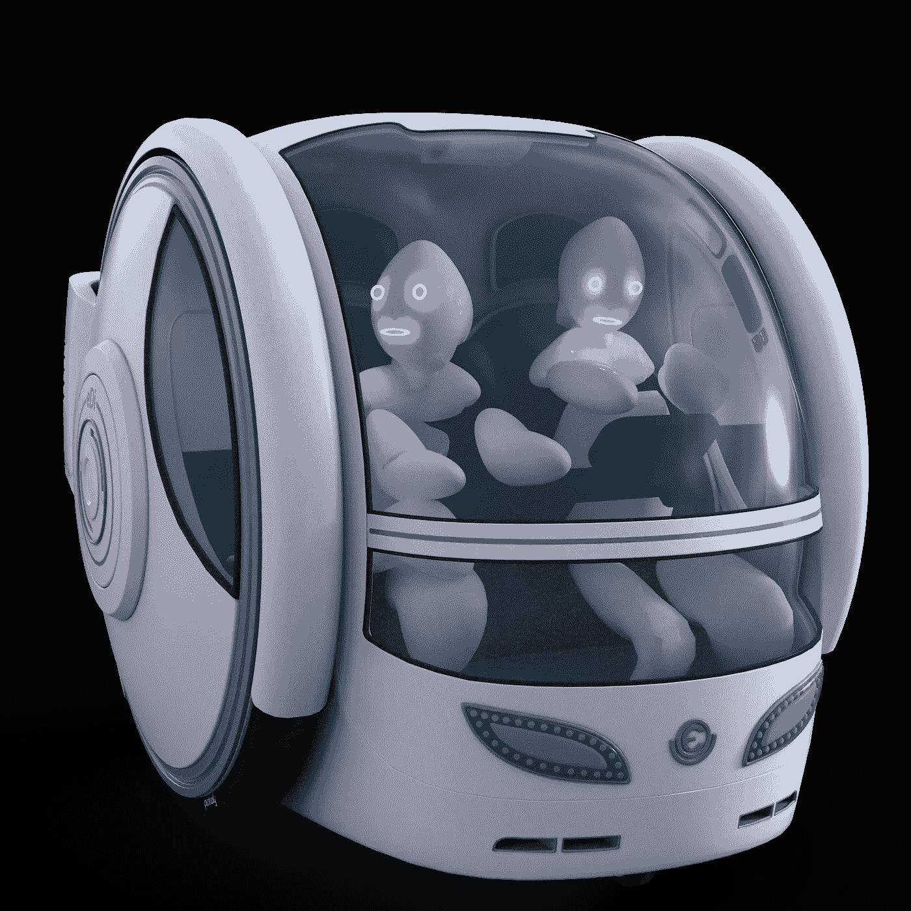

# 全球首款采用华为 5G 技术的汽车即将发布

> 原文：<https://medium.datadriveninvestor.com/worlds-first-car-with-huawei-5g-technology-soon-to-be-released-ec20c8e5b683?source=collection_archive---------5----------------------->

## 全球首款量产 5G 汽车终于不再处于实验室或概念车的阶段。搭载华为最新一代巴龙 5000 芯片的汽车即将交付用户。

Image by [Mystic Art Design](https://pixabay.com/users/mysticsartdesign-322497/?utm_source=link-attribution&utm_medium=referral&utm_campaign=image&utm_content=2676510) from [Pixabay](https://pixabay.com/?utm_source=link-attribution&utm_medium=referral&utm_campaign=image&utm_content=2676510)

广汽离子品牌总经理顾惠南表示，5G 技术对智能电动汽车的好处主要体现在三个方面:

**首先**，5G 技术赋能城市道路等应用场景，通过 V2X 车路协同技术推动自动驾驶。加速发展。

**第二个**是推动智能驾驶舱的发展。

**第三个**是帮助 OTA 软件升级软件。

广汽研究院副院长李刚认为，5G+V2X 技术将解决辅助自动驾驶的痛点。传感器和摄像头受环境影响严重，在风沙雨雪中识别率大大降低，感知范围有限。

传感器和摄像头是汽车的眼睛和鼻子，但它们不能代替嘴巴和耳朵。只有会交流的汽车才能实现完全的自动驾驶。

**目前**，广汽集团正在加速智能电动汽车的研发。今年 1-11 月，广汽集团销售汽车 183.5 万辆，同比下降 2.2%。

> 同期，广汽集团旗下的广汽阿亚恩新能源汽车累计销量为 5.3 万辆，同比增长 62%

在日前接受媒体采访时，广汽董事长曾庆红公开表示，智能网联新能源汽车将是一个巨大的“增量”市场。

计划 2025 年广汽阿亚恩销量占广汽自主品牌销量的 36%，成为国内市场。

> **自主品牌行业排名前三的高端智能纯电动品牌**

不仅是广汽集团，SAIC、东风汽车、长安汽车、比亚迪也在加快智能电动车的步伐。汽车厂商和互联网科技公司纷纷抢占智能汽车市场。

 [## 机器学习和人工智能如何改变电子商务的面貌？|数据驱动…

### 电子商务开发公司，现在，整合先进的客户体验到一个新的水平…

www.datadriveninvestor.com](https://www.datadriveninvestor.com/2020/11/19/how-machine-learning-and-artificial-intelligence-changing-the-face-of-ecommerce/) 

**目前**，华为已与 SAIC、广汽集团、长城汽车、北汽集团、比亚迪、奇瑞等多家自主车企达成智能汽车解决方案合作协议，并与沃达丰在软件和“5G 汽车联盟”领域展开合作

诺基亚、英特尔、戴姆勒等达成合作。华为不自己造车，主要为汽车公司提供智能汽车解决方案，在 5G、大数据、自动驾驶等方面提供技术支持。

无线通信技术和半导体制造商高通。新的高通骁龙汽车 5G 平台也已在 2019 年世界移动通信大会(MWC)上发布。

> 该平台是高通 5G 技术在汽车行业的新应用，可以提供完全集成的 C-V2X 解决方案

[https://gph.is/g/aKew8ke](https://gph.is/g/aKew8ke)

Counterpoint 的最新研究报告显示，到 2025 年，中国 5G 联网汽车销量将跃升至 710 万辆，占全国联网汽车总销量的 40%。目前，4G 产品主导着中国的联网汽车市场。

**到 2020 年**，4G 联网汽车销量有望达到 780 万辆，占中国联网汽车总销量的 95%。然而，随着 5G 在中国的快速推广以及 2021 年起汽车行业的快速发展，5G 联网汽车销售份额将快速增长。

**广汽阿亚恩副总经理肖勇**在接受《第一财经日报》等媒体采访时表示，智能汽车为自主车企创造了弯道超车的机会。

华为正在与许多车企合作，研究和探索创新的 5G 应用场景。由于政策的支持和中国电动汽车、5G 和自动驾驶技术的快速发展。

**在硬件和软件方面双管齐下的华为**，将成为全球智能电动汽车领域最强有力的竞争对手之一，智能手机应用。

> **情况类似于 Android 和 iOS 作为主要操作系统的情况。未来智能汽车的基础操作系统不会太多，华为有望占有一席之地**

但是，自主车企在智能汽车发展的道路上存在一些瓶颈和问题，包括芯片。目前，华为芯片供不应求。

手头仅有的 200 个最新一代 5G 车载模块(巴龙 5000 芯片)已经全部给了广汽 Aion。

**肖勇**认为，这意味着全球首款量产 5G 汽车 AION V 只有 200 辆，其他自主车企的 5G 量产车计划也将受到影响，芯片问题亟待解决。

**12 月 3 日在广州举行的世界智能汽车大会**上，国家发改委国际合作中心主任黄勇公开表示，要在智能汽车高质量发展中释放创新驱动效率，发展智能汽车必须着力发展基础技术。

还要注重创新和实际应用，着力打造自主技术和基础品牌，在底层技术上下功夫，加快形成中国自主。

可控的标准化汽车技术体系和架构体系，并解决芯片、硬件、软件和系统组件。以及其他类型的瓶颈问题。

## 获得专家视图— [订阅 DDI 英特尔](https://datadriveninvestor.com/ddi-intel)